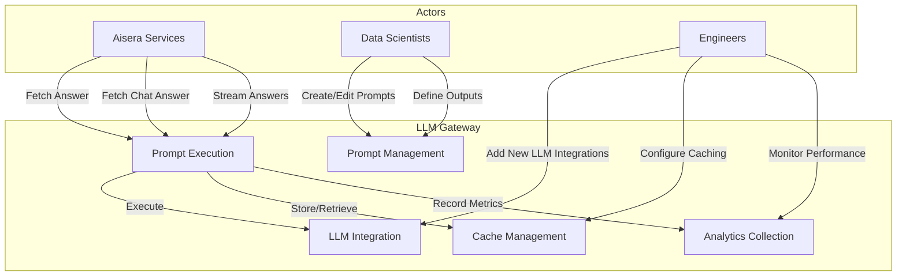
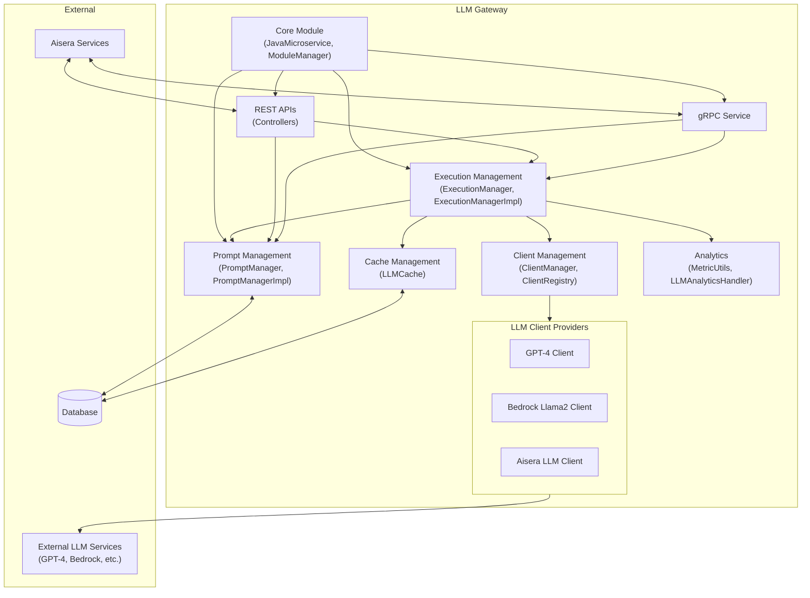
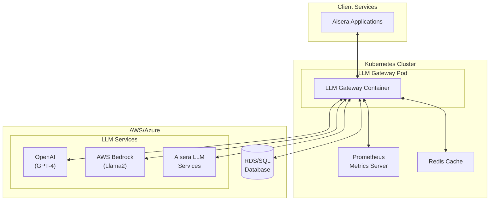
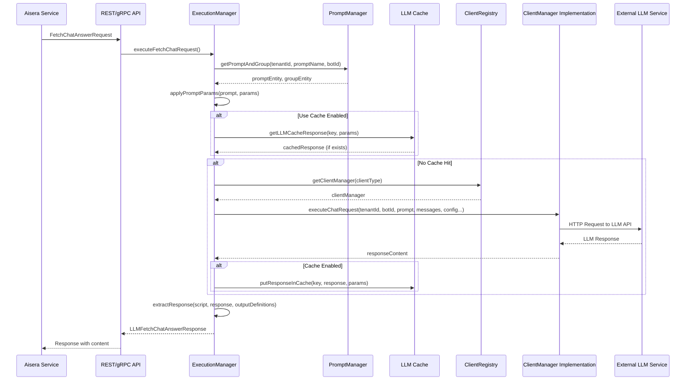
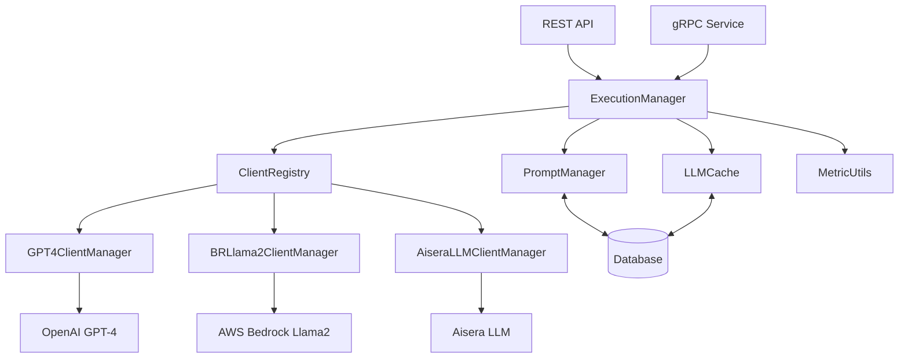
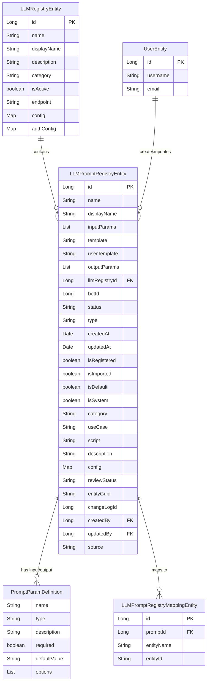

# LLM Gateway Architecture & Design Document

## Table of Contents
- [1. Introduction](#1-introduction)
  - [1.1 Purpose](#11-purpose)
  - [1.2 Scope](#12-scope)
  - [1.3 Definitions, Acronyms, and Abbreviations](#13-definitions-acronyms-and-abbreviations)
  - [1.4 References](#14-references)
- [2. High-Level System Overview](#2-high-level-system-overview)
  - [2.1 Use Case View (Scenarios)](#21-use-case-view-scenarios)
  - [2.2 Logical View (Class Diagram)](#22-logical-view-class-diagram)
  - [2.3 Development View (Component Diagram)](#23-development-view-component-diagram)
  - [2.4 Physical View (Deployment Diagram)](#24-physical-view-deployment-diagram)
  - [2.5 Process View (Sequence Diagrams)](#25-process-view-sequence-diagrams)
- [3. Module & Component Breakdown](#3-module--component-breakdown)
  - [3.1 Core Modules](#31-core-modules)
  - [3.2 Module Responsibilities](#32-module-responsibilities)
  - [3.3 Inter-Module Communication](#33-inter-module-communication)
- [4. Data Models & Schema Designs](#4-data-models--schema-designs)
  - [4.1 Entity Relationship Diagram](#41-entity-relationship-diagram)
  - [4.2 Key Data Structures](#42-key-data-structures)
- [5. API Reference](#5-api-reference)
  - [5.1 REST API Endpoints](#51-rest-api-endpoints)
  - [5.2 gRPC Services](#52-grpc-services)
- [6. Security Considerations](#6-security-considerations)
- [7. Performance Considerations](#7-performance-considerations)
- [8. Dependencies](#8-dependencies)
- [9. Appendix](#9-appendix)

## 1. Introduction

### 1.1 Purpose

This document provides a comprehensive technical architecture description of the LLM Gateway system. It includes views from multiple architectural perspectives to provide a holistic understanding of the system structure, behavior, and implementation.

### 1.2 Scope

The LLM Gateway serves as the conduit between various Aisera services hosted inside AWS/Azure clusters and Large Language Models (LLMs). This document covers the architectural design, component breakdown, and data models of the LLM Gateway system.

### 1.3 Definitions, Acronyms, and Abbreviations

- **LLM**: Large Language Model - Neural network trained on vast amounts of text data
- **API**: Application Programming Interface
- **REST**: Representational State Transfer - Architectural style for distributed systems
- **gRPC**: High-performance RPC (Remote Procedure Call) framework
- **DTO**: Data Transfer Object
- **GPT**: Generative Pre-trained Transformer - Type of LLM developed by OpenAI

### 1.4 References

- [LLM Gateway Repository](https://github.com/Aisera/llm-gateway)

## 2. High-Level System Overview

The LLM Gateway is designed as a service-oriented application that orchestrates communication between Aisera's internal services and various LLM providers. It follows a modular architecture based on the open-closed principle, allowing for easy integration of new LLM providers.

### 2.1 Use Case View (Scenarios)

The following diagram shows the primary actors and key use cases of the LLM Gateway:



### 2.2 Logical View (Class Diagram)

The following diagram illustrates the core domain classes and their relationships:

```mermaid
classDiagram
    class ClientManager {
        <<abstract>>
        +executeRequest(String tenantId, long botId, String prompt, Map config, LLMPromptRegistryEntity promptEntity, LLMCacheReq cacheReq)
        +executeChatRequest(String tenantId, long botId, String prompt, List messages, Map config, LLMPromptRegistryEntity promptEntity, String userMessage, List functionDefinitions)
        +streamingAnswerRequest(String tenantId, long botId, String prompt, List messages, Map config, LLMPromptRegistryEntity promptEntity, LLMRegistryEntity promptGroup, String userMessage, StreamObserver responseObserver)
        #extractResponse(String script, String response, List outputDefinitions)
    }

    class ExecutionManager {
        <<interface>>
        +executeFetchRequest(LLMFetchAnswerRequest request)
        +executeFetchChatRequest(LLMFetchChatAnswerRequest request)
        +executeStreamingRequest(LLMStreamingAnswerRequest request, StreamObserver responseObserver)
    }

    class ExecutionManagerImpl {
        +executeFetchRequest(LLMFetchAnswerRequest request)
        +executeFetchChatRequest(LLMFetchChatAnswerRequest request)
        +executeStreamingRequest(LLMStreamingAnswerRequest request, StreamObserver responseObserver)
    }

    class PromptManager {
        <<interface>>
        +getPrompt(String tenantId, String promptName, long botId)
        +createPrompt(String tenantId, LLMPromptRegistryEntity prompt)
        +updatePrompt(String tenantId, LLMPromptRegistryEntity prompt)
        +deletePrompt(String tenantId, String promptName, long botId)
    }

    class ModuleManager {
        -static PromptManager promptManager
        -static ExecutionManager executionManager
        +static void init()
        +static PromptManager getPromptManager()
        +static ExecutionManager getExecutionManager()
    }

    class JavaMicroservice {
        -Server gRPCServer
        -Server restServer
        -Config config
        +void start()
        +void stop()
        +static void main(String[] args)
    }

    class ClientRegistry {
        +static Map~ClientType, ClientManager~ clientManagerHandlers
        +static ClientManager getClientManager(ClientType type)
    }

    class GPT4ClientManagerImpl {
        +executeRequest(String tenantId, long botId, String prompt, Map config, LLMPromptRegistryEntity promptEntity, LLMCacheReq cacheReq)
        +executeChatRequest(String tenantId, long botId, String prompt, List messages, Map config, LLMPromptRegistryEntity promptEntity, String userMessage, List functionDefinitions)
        +streamingAnswerRequest(String tenantId, long botId, String prompt, List messages, Map config, LLMPromptRegistryEntity promptEntity, LLMRegistryEntity promptGroup, String userMessage, StreamObserver responseObserver)
    }

    class BRLlama2ClientManagerImpl {
        +executeRequest(String tenantId, long botId, String prompt, Map config, LLMPromptRegistryEntity promptEntity, LLMCacheReq cacheReq)
        +executeChatRequest(String tenantId, long botId, String prompt, List messages, Map config, LLMPromptRegistryEntity promptEntity, String userMessage, List functionDefinitions)
        +streamingAnswerRequest(String tenantId, long botId, String prompt, List messages, Map config, LLMPromptRegistryEntity promptEntity, LLMRegistryEntity promptGroup, String userMessage, StreamObserver responseObserver)
    }

    class AiseraLLMClientManagerImpl {
        +executeRequest(String tenantId, long botId, String prompt, Map config, LLMPromptRegistryEntity promptEntity, LLMCacheReq cacheReq)
        +executeChatRequest(String tenantId, long botId, String prompt, List messages, Map config, LLMPromptRegistryEntity promptEntity, String userMessage, List functionDefinitions)
        +streamingAnswerRequest(String tenantId, long botId, String prompt, List messages, Map config, LLMPromptRegistryEntity promptEntity, LLMRegistryEntity promptGroup, String userMessage, StreamObserver responseObserver)
    }

    class LLMPromptRegistryEntity {
        -Long id
        -String name
        -String displayName
        -List~PromptParamDefinition~ inputParams
        -String template
        -String userTemplate
        -List~PromptParamDefinition~ outputParams
        -Long llmRegistryId
        -Long botId
        -Status status
        -String type
        -Date createdAt
        -Date updatedAt
        -boolean isRegistered
        -boolean isImported
        -boolean isDefault
        -boolean isSystem
        -String category
        -String useCase
        -String script
        -String description
        -Map~String, Object~ config
    }

    class LLMRegistryEntity {
        -Long id
        -String name
        -String displayName
        -String description
        -String category
        -boolean isActive
        -String endpoint
        -Map~String, Object~ config
        -Map~String, Object~ authConfig
    }

    ExecutionManager <|.. ExecutionManagerImpl
    ClientManager <|-- GPT4ClientManagerImpl
    ClientManager <|-- BRLlama2ClientManagerImpl
    ClientManager <|-- AiseraLLMClientManagerImpl
    ExecutionManagerImpl --> ClientRegistry
    ModuleManager --> ExecutionManager
    ModuleManager --> PromptManager
    JavaMicroservice --> ModuleManager
    ClientRegistry --> ClientManager
    ExecutionManagerImpl --> LLMPromptRegistryEntity
    ExecutionManagerImpl --> LLMRegistryEntity
```



### 2.3 Development View (Component Diagram)

The component diagram below shows the main modules of the LLM Gateway and their interfaces:



### 2.4 Physical View (Deployment Diagram)

The deployment diagram illustrates how the LLM Gateway components are distributed across the infrastructure:



### 2.5 Process View (Sequence Diagrams)

The following sequence diagram illustrates the key interaction flow for a chat completion request:



## 3. Module & Component Breakdown

### 3.1 Core Modules

The LLM Gateway is organized into the following core modules:

| Module | Description | Key Classes |
|--------|-------------|-------------|
| Core | The main application bootstrap and configuration module | `JavaMicroservice`, `Config`, `ModuleManager` |
| Execution Management | Handles the execution of LLM requests and responses | `ExecutionManager`, `ExecutionManagerImpl`, `ExecutionManagerUtils` |
| Prompt Management | Manages the prompt registry and prompt operations | `PromptManager`, `PromptManagerImpl`, `PromptApplier` |
| Client Management | Manages connections to different LLM providers | `ClientManager`, `ClientRegistry`, `ClientType` |
| REST API | RESTful API endpoints for the LLM Gateway | `PromptExecutionController`, `PrompManagementProcessor`, `PromptStudioManagementController` |
| gRPC Service | gRPC interface for the LLM Gateway | `GrpcService` |
| Cache Management | Handles caching of LLM responses | `LLMCache`, `LLMCacheReq` |
| Analytics | Collects metrics and analytics on LLM usage | `MetricUtils`, `LlmAnalyticsHandler` |

### 3.2 Module Responsibilities

#### Core Module

The Core module is responsible for:
- Bootstrapping the application
- Initializing all other modules
- Managing configuration
- Starting and stopping the REST and gRPC servers

Key components:
- **JavaMicroservice**: The main entry point for the application, responsible for setting up and starting the REST and gRPC servers.
- **Config**: Handles application configuration loading and management.
- **ModuleManager**: Initializes and provides access to all other module managers.

#### Execution Management Module

The Execution Management module is responsible for:
- Processing LLM execution requests (fetch, fetch-chat, streaming)
- Coordinating between the prompt management and client management modules
- Handling caching of responses
- Managing error handling and recovery
- Collecting execution metrics

Key components:
- **ExecutionManager**: Interface defining the contract for execution operations.
- **ExecutionManagerImpl**: Implementation of the ExecutionManager interface.
- **ExecutionManagerUtils**: Utility methods for execution management.

#### Prompt Management Module

The Prompt Management module is responsible for:
- Managing the prompt registry
- Creating, updating, and deleting prompts
- Applying input parameters to prompt templates
- Extracting output parameters from LLM responses

Key components:
- **PromptManager**: Interface defining the contract for prompt operations.
- **PromptManagerImpl**: Implementation of the PromptManager interface.
- **PromptApplier**: Utility for applying input parameters to prompt templates.
- **PromptDAO**: Data access object for prompt operations.

#### Client Management Module

The Client Management module is responsible for:
- Managing connections to different LLM providers
- Implementing provider-specific request formats and response handling
- Handling authentication and authorization with LLM providers
- Managing retries and error handling

Key components:
- **ClientManager**: Abstract class defining the contract for LLM client operations.
- **ClientRegistry**: Registry of available LLM client implementations.
- **ClientType**: Enumeration of supported LLM client types.
- Provider-specific implementations:
  - **GPT4ClientManagerImpl**: Client manager for OpenAI's GPT-4.
  - **BRLlama2ClientManagerImpl**: Client manager for AWS Bedrock Llama2.
  - **AiseraLLMClientManagerImpl**: Client manager for Aisera's internal LLM services.

### 3.3 Inter-Module Communication

The LLM Gateway modules communicate with each other through well-defined interfaces:

1. **Core → Other Modules**:
   - The `ModuleManager` initializes and provides access to all other module managers.
   - The `JavaMicroservice` sets up the REST and gRPC servers that use other modules.

2. **REST/gRPC API → Execution Management**:
   - API controllers delegate requests to the `ExecutionManager`.
   - The `ExecutionManager` processes requests and returns responses.

3. **Execution Management → Prompt Management**:
   - `ExecutionManagerImpl` uses `PromptManager` to retrieve prompt and group information.
   - It also uses `PromptApplier` to apply input parameters to prompt templates.

4. **Execution Management → Client Management**:
   - `ExecutionManagerImpl` uses `ClientRegistry` to get the appropriate `ClientManager` for a given LLM provider.
   - It delegates the actual LLM calls to the `ClientManager` implementation.

5. **Execution Management → Cache Management**:
   - `ExecutionManagerImpl` checks the cache for existing responses.
   - It stores new responses in the cache when appropriate.

6. **Client Management → External LLM Services**:
   - `ClientManager` implementations make HTTP/API calls to external LLM services.
   - They format requests according to provider-specific requirements.
   - They parse and normalize responses from the providers.

Communication Flow Diagram:



## 4. Data Models & Schema Designs

The LLM Gateway uses a set of well-defined data models to represent the core domain objects and their relationships.

### 4.1 Entity Relationship Diagram

The following diagram illustrates the relationships between the primary entities in the LLM Gateway:



### 4.2 Key Data Structures

#### LLMRegistryEntity

This entity represents an LLM provider or service and contains configuration for connecting to that service.

| Field | Type | Description |
|-------|------|-------------|
| id | Long | Primary key |
| name | String | Unique name of the LLM provider |
| displayName | String | Human-readable name |
| description | String | Description of the provider |
| category | String | Category of the provider |
| isActive | boolean | Whether the provider is active |
| endpoint | String | API endpoint for the provider |
| config | Map<String, Object> | Configuration for the provider |
| authConfig | Map<String, Object> | Authentication configuration |

#### LLMPromptRegistryEntity

This entity represents a prompt template that can be used with an LLM provider.

| Field | Type | Description |
|-------|------|-------------|
| id | Long | Primary key |
| name | String | Unique name of the prompt |
| displayName | String | Human-readable name |
| inputParams | List<PromptParamDefinition> | Input parameters for the prompt |
| template | String | The prompt template |
| userTemplate | String | User-specific template section |
| outputParams | List<PromptParamDefinition> | Output parameters from the prompt |
| llmRegistryId | Long | Reference to the LLM provider |
| botId | Long | Associated bot ID |
| status | Status | Status of the prompt (Active, Inactive, etc.) |
| type | String | Type of the prompt |
| isRegistered | boolean | Whether the prompt is registered |
| isImported | boolean | Whether the prompt is imported |
| isDefault | boolean | Whether the prompt is a default prompt |
| isSystem | boolean | Whether the prompt is a system prompt |
| category | String | Category of the prompt |
| useCase | String | Use case for the prompt |
| script | String | JavaScript script for processing outputs |
| description | String | Description of the prompt |
| config | Map<String, Object> | Configuration for the prompt |

#### PromptParamDefinition

This entity represents a parameter definition for a prompt's inputs or outputs.

| Field | Type | Description |
|-------|------|-------------|
| name | String | Name of the parameter |
| type | String | Data type of the parameter |
| description | String | Description of the parameter |
| required | boolean | Whether the parameter is required |
| defaultValue | String | Default value for the parameter |
| options | List<String> | Possible values for the parameter |

#### Request/Response Models

##### LLMFetchAnswerRequestDTO

Request model for fetching an answer from an LLM.

| Field | Type | Description |
|-------|------|-------------|
| tenantId | String | ID of the tenant making the request |
| promptName | String | Name of the prompt to use |
| requestParams | List<PromptParamDTO> | Parameters for the prompt |
| config | Map<String, Object> | Configuration overrides |
| isDebug | boolean | Whether to include debug information |
| botId | long | ID of the bot making the request |
| useCache | boolean | Whether to use caching |

##### LLMFetchChatAnswerRequestDTO

Request model for fetching a chat-style answer from an LLM.

| Field | Type | Description |
|-------|------|-------------|
| tenantId | String | ID of the tenant making the request |
| promptName | String | Name of the prompt to use |
| requestParams | List<PromptParamDTO> | Parameters for the prompt |
| messages | List<ChatMessageDTO> | Chat history messages |
| config | Map<String, Object> | Configuration overrides |
| isDebug | boolean | Whether to include debug information |
| botId | long | ID of the bot making the request |
| functionDefinitions | List<FunctionDefinitionDTO> | Function calling definitions |
| useCache | boolean | Whether to use caching |

##### ChatMessageDTO

Model representing a message in a chat conversation.

| Field | Type | Description |
|-------|------|-------------|
| role | String | Role of the message sender (system, user, assistant) |
| content | String | Content of the message |
| contentType | ContentType | Type of content (TEXT, IMAGE, FUNCTION_CALL) |
| function_call | FunctionCallDTO | Function call information |
| tool_calls | List<ToolCallDTO> | Tool call information |

### 4.3 Database Schema

The LLM Gateway uses the following primary database tables:

1. **llm_registry** - Stores information about LLM providers
2. **llm_prompt_registry** - Stores prompt templates and their configurations
3. **llm_prompt_registry_mapping** - Maps prompts to external entities

Table Schema for llm_prompt_registry:

```sql
CREATE TABLE llm_prompt_registry (
    id BIGINT AUTO_INCREMENT PRIMARY KEY,
    name VARCHAR(255) NOT NULL,
    display_name VARCHAR(255),
    input_vars JSON,
    template TEXT,
    user_template TEXT,
    output_vars JSON,
    llm_registry_id BIGINT NOT NULL,
    bot_id BIGINT,
    status VARCHAR(50),
    type VARCHAR(100),
    created_at TIMESTAMP DEFAULT CURRENT_TIMESTAMP,
    updated_at TIMESTAMP DEFAULT CURRENT_TIMESTAMP ON UPDATE CURRENT_TIMESTAMP,
    is_registered BOOLEAN NOT NULL DEFAULT FALSE,
    is_imported BOOLEAN NOT NULL DEFAULT FALSE,
    is_default BOOLEAN NOT NULL DEFAULT FALSE,
    is_system BOOLEAN NOT NULL DEFAULT FALSE,
    category VARCHAR(100),
    use_case VARCHAR(255),
    script TEXT,
    description TEXT,
    config JSON,
    review_status VARCHAR(50),
    entity_guid VARCHAR(255),
    change_log_id BIGINT,
    created_by BIGINT,
    updated_by BIGINT,
    source VARCHAR(100),
    FOREIGN KEY (llm_registry_id) REFERENCES llm_registry(id),
    FOREIGN KEY (created_by) REFERENCES user(id),
    FOREIGN KEY (updated_by) REFERENCES user(id)
);
```

Table Schema for llm_registry:

```sql
CREATE TABLE llm_registry (
    id BIGINT AUTO_INCREMENT PRIMARY KEY,
    name VARCHAR(255) NOT NULL,
    display_name VARCHAR(255),
    description TEXT,
    category VARCHAR(100),
    is_active BOOLEAN NOT NULL DEFAULT TRUE,
    endpoint VARCHAR(255),
    config JSON,
    auth_config JSON,
    created_at TIMESTAMP DEFAULT CURRENT_TIMESTAMP,
    updated_at TIMESTAMP DEFAULT CURRENT_TIMESTAMP ON UPDATE CURRENT_TIMESTAMP
);
```

## 5. API Reference

The LLM Gateway provides both REST and gRPC interfaces for interacting with LLM services.

### 5.1 REST API Endpoints

The following REST endpoints are exposed by the LLM Gateway:

#### Prompt Execution

| Method | Endpoint | Description |
|--------|----------|-------------|
| POST | `/api/v1/prompt/fetch` | Execute a prompt and get an answer |
| POST | `/api/v1/prompt/fetchChat` | Execute a chat-style prompt and get an answer |
| POST | `/api/v1/prompt/stream` | Stream a response from an LLM |

Example fetch request:

```json
{
  "tenantId": "1000",
  "promptName": "example-prompt",
  "requestParams": [
    {
      "name": "query",
      "value": "What is the capital of France?"
    }
  ],
  "config": {
    "temperature": 0.7,
    "maxTokens": 500
  },
  "botId": 123,
  "useCache": true
}
```

Example response:

```json
{
  "statusCode": 200,
  "responseParams": [
    {
      "name": "answer",
      "value": "The capital of France is Paris."
    }
  ]
}
```

#### Prompt Management

| Method | Endpoint | Description |
|--------|----------|-------------|
| GET | `/api/v1/prompt/{promptName}` | Get a prompt by name |
| POST | `/api/v1/prompt` | Create a new prompt |
| PUT | `/api/v1/prompt/{promptName}` | Update an existing prompt |
| DELETE | `/api/v1/prompt/{promptName}` | Delete a prompt |
| GET | `/api/v1/prompt/list` | List all prompts |

#### LLM Registry Management

| Method | Endpoint | Description |
|--------|----------|-------------|
| GET | `/api/v1/llm/{llmName}` | Get an LLM registry entry by name |
| POST | `/api/v1/llm` | Create a new LLM registry entry |
| PUT | `/api/v1/llm/{llmName}` | Update an existing LLM registry entry |
| DELETE | `/api/v1/llm/{llmName}` | Delete an LLM registry entry |
| GET | `/api/v1/llm/list` | List all LLM registry entries |

### 5.2 gRPC Services

The LLM Gateway also exposes a gRPC service defined by the following protobuf:

```protobuf
syntax = "proto3";

package aisera.service.llm;

import "google/protobuf/any.proto";

service LLMService {
  rpc FetchAnswer(LLMFetchAnswerRequest) returns (LLMFetchAnswerResponse);
  rpc FetchChatAnswer(LLMFetchChatAnswerRequest) returns (LLMFetchChatAnswerResponse);
  rpc StreamingAnswer(LLMStreamingAnswerRequest) returns (stream LLMStreamingAnswerResponse);
}

message LLMFetchAnswerRequest {
  string tenant_id = 1;
  string prompt_name = 2;
  repeated PromptParam request_params = 3;
  map<string, google.protobuf.Any> config = 4;
  bool is_debug = 5;
  int64 bot_id = 6;
  string prompt_group_name = 7;
  bool use_cache = 8;
  bool detect_prompt_injection = 9;
}

message LLMFetchAnswerResponse {
  int32 status_code = 1;
  string error_message = 2;
  repeated PromptParam response_params = 3;
  repeated LLMDebugInfo llm_debug_infos = 4;
}

message LLMFetchChatAnswerRequest {
  string tenant_id = 1;
  string prompt_name = 2;
  repeated PromptParam request_params = 3;
  repeated ChatMessage messages = 4;
  map<string, google.protobuf.Any> config = 5;
  bool is_debug = 6;
  int64 bot_id = 7;
  repeated FunctionDefinition function_definitions = 8;
  string prompt_group_name = 9;
  bool use_cache = 10;
  bool detect_prompt_injection = 11;
}

message LLMFetchChatAnswerResponse {
  int32 status_code = 1;
  string error_message = 2;
  string error_code = 3;
  string message = 4;
  repeated PromptParam response_params = 5;
  repeated LLMDebugInfo llm_debug_infos = 6;
}

// Other message definitions omitted for brevity
```

## 6. Security Considerations

The LLM Gateway implements several security measures to protect against common vulnerabilities and ensure secure communication with LLM providers:

### Authentication and Authorization

1. **API Authentication**: All REST and gRPC APIs require authentication using API keys or JWT tokens.
2. **LLM Provider Authentication**: Secure storage and handling of API keys and credentials for LLM providers.
3. **Tenant Isolation**: Strong tenant isolation to ensure that one tenant cannot access another tenant's prompts or data.

### Data Protection

1. **Input Validation**: Thorough validation of all input parameters to prevent injection attacks.
2. **Prompt Injection Detection**: Built-in detection for prompt injection attacks to prevent manipulation of LLM behavior.
3. **Output Sanitization**: Sanitization of LLM outputs to prevent XSS and other injection attacks in client applications.

### Network Security

1. **TLS Encryption**: All communication with LLM providers uses TLS encryption.
2. **Virtual Private Cloud**: Deployment within a VPC to limit network access.
3. **API Rate Limiting**: Rate limiting to prevent abuse and DoS attacks.

### Audit and Monitoring

1. **Audit Logging**: Comprehensive logging of all API requests and responses.
2. **Metrics Collection**: Collection of metrics for anomaly detection and security monitoring.
3. **Alerting**: Automated alerts for suspicious activity or security violations.

## 7. Performance Considerations

The LLM Gateway is designed for high performance and scalability:

### Caching

1. **Response Caching**: Caching of LLM responses to reduce duplicate requests and improve latency.
2. **Cache Invalidation**: Smart cache invalidation strategy based on prompt updates and configuration changes.
3. **Distributed Caching**: Support for distributed cache implementations (Redis) for high availability.

### Concurrency

1. **Thread Pooling**: Configurable thread pools for handling concurrent requests.
2. **Asynchronous Processing**: Non-blocking I/O for communication with LLM providers.
3. **Connection Pooling**: Reuse of connections to LLM providers to reduce connection overhead.

### Scaling

1. **Horizontal Scaling**: The LLM Gateway can be scaled horizontally by deploying multiple instances.
2. **Load Balancing**: Support for load balancing across multiple instances.
3. **Containerization**: Docker container support for easy deployment and scaling.

## 8. Dependencies

The LLM Gateway has the following key dependencies:

### External Libraries

| Dependency | Version | Purpose |
|------------|---------|---------|
| Spring Boot | 2.6.x | Application framework |
| Hibernate | 5.6.x | ORM for database access |
| gRPC | 1.45.x | gRPC implementation |
| Jetty | 9.4.x | Embedded web server |
| Micrometer | 1.9.x | Metrics collection |
| Logback | 1.2.x | Logging framework |
| Jackson | 2.13.x | JSON processing |
| Redis | 6.2.x | Distributed cache |
| Langchain4j | 0.17.x | LLM utilities |

### External Services

| Service | Purpose |
|---------|---------|
| OpenAI GPT | External LLM provider for GPT models |
| AWS Bedrock | External LLM provider for Llama2 models |
| Aisera LLM | Internal LLM provider |
| MySQL/MariaDB | Database for storing prompts and configuration |
| Redis | Distributed cache for response caching |
| Prometheus | Metrics collection and monitoring |

## 9. Appendix

### A. Glossary

| Term | Definition |
|------|------------|
| LLM | Large Language Model |
| Prompt | Template text used to generate responses from an LLM |
| Prompt Registry | Database of prompts and their configurations |
| LLM Registry | Database of LLM providers and their configurations |
| Tenant | A customer or organizational unit with isolated data |
| Bot | An AI assistant instance |

### B. Error Codes

| Code | Description |
|------|-------------|
| 400 | Bad Request - Invalid input parameters |
| 401 | Unauthorized - Authentication required |
| 403 | Forbidden - Insufficient permissions |
| 404 | Not Found - Prompt or LLM provider not found |
| 429 | Too Many Requests - Rate limit exceeded |
| 500 | Internal Server Error - Server-side error |
| 503 | Service Unavailable - LLM provider temporarily unavailable |

### C. Configuration Properties

| Property | Description | Default |
|----------|-------------|---------|
| aisera.rest.webserver.port | REST server port | 8300 |
| aisera.grpc.port | gRPC server port | 9090 |
| aisera.sql.host | Database host | localhost |
| aisera.sql.port | Database port | 3306 |
| aisera.cache.enabled | Enable response caching | true |
| aisera.metrics.enabled | Enable metrics collection | true |