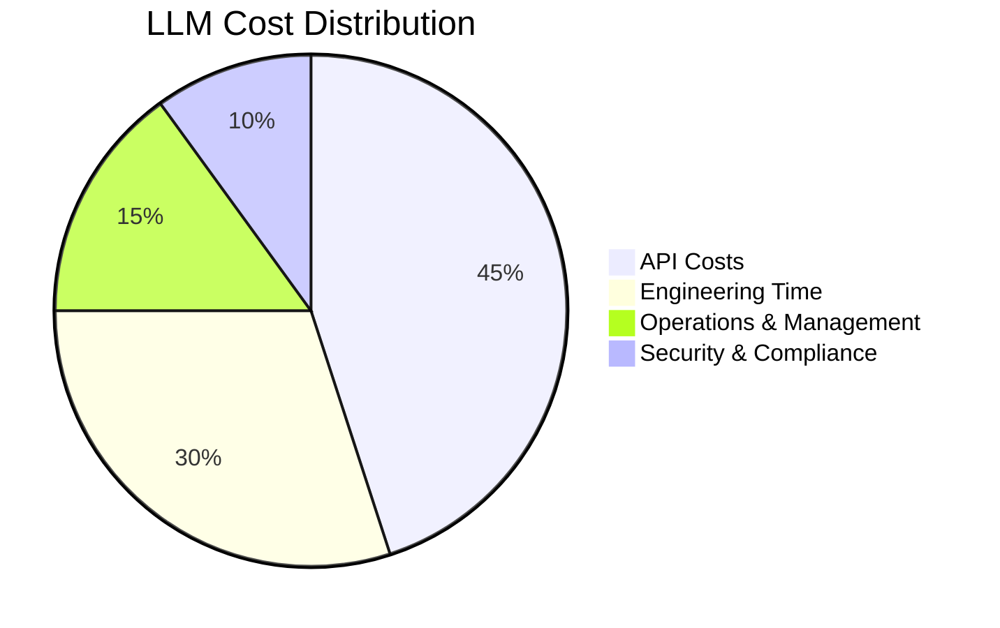
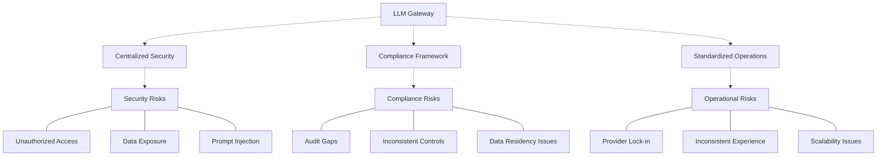

# Business Value Proposition

## Table of Contents

- [Core Value Proposition](#core-value-proposition)
- [Business Outcomes](#business-outcomes)
- [Industry-Specific Pain Points](#industry-specific-pain-points)
- [Strategic Alignment](#strategic-alignment)
- [Value Drivers](#value-drivers)

## Core Value Proposition

The LLM Gateway transforms how enterprises implement and manage Large Language Models by providing a unified, secure, and cost-effective platform that standardizes access across multiple providers while ensuring governance, optimizing costs, and accelerating time-to-value.

### What the LLM Gateway Does

The LLM Gateway serves as a central orchestration layer that:

1. **Unifies Access**: Provides a standardized API interface to multiple LLM providers (OpenAI, Anthropic, Cohere, open-source models)

2. **Manages Prompts**: Creates a library of vetted, version-controlled prompt templates that can be reused across the organization

3. **Controls Costs**: Implements intelligent caching, provider routing, and usage controls to optimize expenditure

4. **Ensures Security**: Enforces consistent authentication, authorization, encryption, and data handling policies

5. **Enables Governance**: Provides comprehensive monitoring, logging, and policy enforcement capabilities

### Why It Matters

This approach delivers substantial business value by addressing the most critical challenges in enterprise AI adoption:

- **Reduced Risk**: Centralized security, compliance, and governance controls
- **Lower Costs**: Optimized usage and elimination of redundant implementations
- **Faster Innovation**: Standardized implementation and reusable components
- **Future-Proofing**: Flexibility to adapt as the LLM landscape evolves
- **Operational Efficiency**: Consistent management, monitoring, and scaling

## Business Outcomes

Organizations implementing the LLM Gateway can expect the following outcomes:

### Operational Improvements

- **Standardization**: Consistent integration patterns across the organization
- **Centralized Management**: Single pane of glass for all LLM operations
- **Resource Optimization**: Reduced duplication of effort across teams
- **Enhanced Visibility**: Comprehensive usage analytics and performance metrics
- **Simplified Troubleshooting**: Centralized monitoring and diagnostics

### Financial Benefits

- **Cost Control**: 30-50% reduction in LLM API expenses through caching and optimization
- **Resource Efficiency**: 25-40% reduction in engineering resources required for AI initiatives
- **Faster ROI**: 40-60% reduction in time-to-value for LLM implementations
- **Predictable Spending**: Budget controls and usage quotas ensure no surprise bills
- **Vendor Leverage**: Ability to negotiate better terms with providers

### Strategic Advantages

- **Provider Flexibility**: Freedom to select the best model for each use case
- **Future-Proofing**: Ability to quickly adopt new models as they emerge
- **Governance at Scale**: Consistent policies across all AI initiatives
- **Knowledge Sharing**: Organization-wide prompt library and best practices
- **Risk Mitigation**: Reduced security, privacy, and compliance exposure

## Industry-Specific Pain Points

The LLM Gateway addresses unique challenges across different industries:

### Financial Services

- **Regulatory Compliance**: Strict data handling requirements (GLBA, SOX, GDPR)
- **Data Privacy**: Sensitive customer and transaction information
- **Audit Requirements**: Comprehensive logging and traceability
- **Security Standards**: Stringent security controls and certifications

**How LLM Gateway Helps**: Implements compliant data handling, comprehensive audit logging, role-based access control, and has necessary security certifications.

### Healthcare

- **PHI Protection**: HIPAA compliance for patient data
- **Clinical Safety**: Accuracy and appropriateness of AI outputs
- **Integration Complexity**: Connection to EHR and clinical systems
- **Validation Requirements**: Verification of AI outputs for clinical use

**How LLM Gateway Helps**: Offers HIPAA-compliant operations, content filtering capabilities, standard integration patterns, and validation workflows.

### Retail & E-commerce

- **Seasonal Scaling**: Handling volume fluctuations
- **Personalization at Scale**: Managing customer-specific contexts
- **Cost Pressure**: Competitive margins require cost efficiency
- **Omnichannel Consistency**: Same experience across touchpoints

**How LLM Gateway Helps**: Provides elastic scaling, contextual prompt management, cost optimization, and consistent experience delivery across channels.

### Technology & SaaS

- **Developer Experience**: Integration simplicity for engineering teams
- **Multi-tenant Architecture**: Supporting multiple customer environments
- **API Performance**: Low-latency requirements
- **Innovation Velocity**: Rapid adoption of new capabilities

**How LLM Gateway Helps**: Delivers developer-friendly SDKs, multi-tenant isolation, optimized performance, and rapid integration of new models.

## Strategic Alignment

The LLM Gateway aligns with key strategic initiatives in enterprise organizations:

### Digital Transformation

- Accelerates AI adoption across business functions
- Provides foundation for intelligent automation
- Enhances digital experiences with AI capabilities
- Supports data-driven decision making

### Cloud Modernization

- Aligns with cloud-native architecture principles
- Supports multi-cloud and hybrid deployments
- Integrates with modern DevOps practices
- Enables containerized, microservices-based deployments

### Customer Experience Enhancement

- Powers personalized customer interactions
- Enables context-aware customer support
- Supports omnichannel consistency
- Facilitates self-service capabilities

### Operational Excellence

- Standardizes implementation patterns
- Reduces redundant development work
- Centralizes management and monitoring
- Improves resource utilization

### Risk Management & Compliance

- Centralizes security controls
- Ensures consistent policy enforcement
- Provides comprehensive audit trails
- Supports regulatory compliance requirements

## Value Drivers

The key drivers of value from the LLM Gateway include:

### Speed to Market

```mermaid
gantt
    title LLM Project Implementation Timeline
    dateFormat X
    axisFormat %s
    
    section Without LLM Gateway
    Requirements      :a1, 0, 30d
    Provider Research :a2, after a1, 20d
    Security Review   :a3, after a2, 25d
    Implementation    :a4, after a3, 45d
    Testing           :a5, after a4, 30d
    Deployment        :a6, after a5, 15d
    
    section With LLM Gateway
    Requirements      :b1, 0, 30d
    Implementation    :b2, after b1, 30d
    Testing           :b3, after b2, 20d
    Deployment        :b4, after b3, 10d
```

*The LLM Gateway typically reduces implementation time by 40-60% through pre-built integrations, standardized security controls, and reusable components.*

### Cost Optimization

*The LLM Gateway addresses all cost categories, with particularly strong impact on API costs (through caching and optimization) and engineering time (through standardization).*

### Risk Reduction

*The LLM Gateway provides a comprehensive approach to risk management across security, compliance, and operational dimensions.*

---

**Previous**: [Executive Summary](./executive-summary.md) | **Next**: [Key Differentiators](./key-differentiators.md)