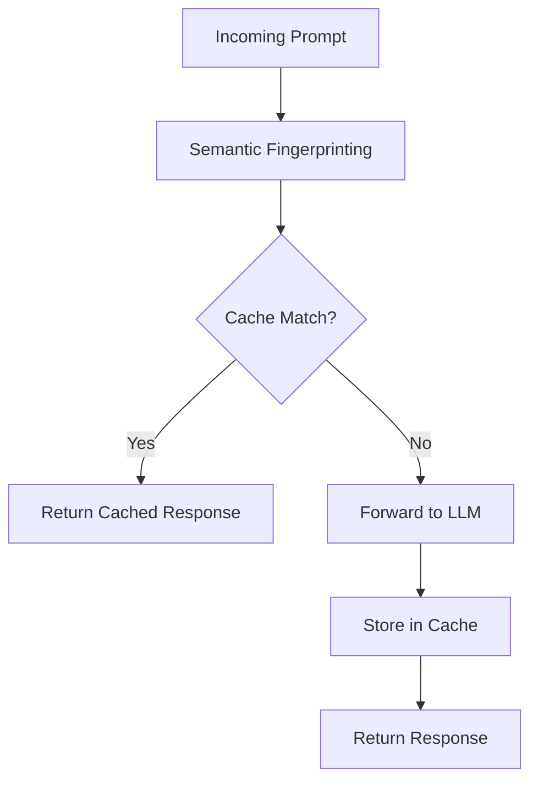

# Key Differentiators

## Table of Contents

- [Unique Value Proposition](#unique-value-proposition)
- [Core Differentiators](#core-differentiators)
- [Feature Innovations](#feature-innovations)
- [Proprietary Advantages](#proprietary-advantages)
- [Customer Testimonials](#customer-testimonials)

## Unique Value Proposition

While many solutions offer access to Large Language Models, the LLM Gateway stands apart as a **comprehensive enterprise platform** that addresses the entire lifecycle of LLM operations with enterprise-grade security, governance, and optimization capabilities.

## Core Differentiators

The LLM Gateway offers several crucial advantages that set it apart from alternative approaches:

### 1. Provider-Agnostic Architecture

**What Makes Us Different**: Unlike provider-specific solutions, the LLM Gateway is designed from the ground up for multi-provider support.

**Why It Matters**:
- Freedom to use the best model for each use case
- Avoid vendor lock-in
- Seamlessly adopt new models as they emerge
- Maintain negotiating leverage with providers

**Key Capabilities**:
- Standardized API across 10+ LLM providers
- Unified parameter mapping
- Consistent response formatting
- Model-agnostic prompt templates
- Intelligent model routing based on capabilities and cost

### 2. Enterprise-Grade Security

**What Makes Us Different**: We implement comprehensive security controls specifically designed for LLM operations, going far beyond basic API proxying.

**Why It Matters**:
- Protect sensitive business and customer data
- Prevent prompt injection attacks
- Ensure regulatory compliance
- Maintain security boundaries between environments

**Key Capabilities**:
- End-to-end encryption for all data in transit and at rest
- Fine-grained role-based access control
- Input/output content filtering
- Comprehensive audit logging
- PII detection and handling
- SOC 2, ISO 27001, and HIPAA compliance

### 3. Advanced Cost Optimization

**What Makes Us Different**: We provide intelligent optimization capabilities that significantly reduce LLM costs without compromising quality.

**Why It Matters**:
- Control rapidly escalating LLM expenditures
- Make AI initiatives financially sustainable
- Predictable budgeting for AI resources
- Maximum value from LLM investments

**Key Capabilities**:
- Semantic response caching
- Intelligent token optimization
- Cost-aware routing between providers
- Usage quotas and budgeting controls
- Detailed cost attribution and analytics
- Automated cost anomaly detection

### 4. Complete Prompt Management

**What Makes Us Different**: While others focus solely on execution, we provide comprehensive prompt management capabilities.

**Why It Matters**:
- Create organizational prompt knowledge base
- Ensure consistent quality and approach
- Reduce redundant prompt engineering
- Track prompt performance over time

**Key Capabilities**:
- Version-controlled prompt templates
- Parameterized prompts with validation
- Collaborative development workflow
- Template performance analytics
- A/B testing for prompt optimization
- Role-based sharing and permissions

## Feature Innovations

The LLM Gateway includes several innovative features not found in alternative solutions:

### Semantic Caching

Our proprietary semantic caching technology identifies semantically equivalent prompts even when they're phrased differently, enabling much higher cache hit rates than simple text matching approaches.

**Impact**: Typically reduces API costs by 30-40% while maintaining response quality and reducing latency.

### Adaptive Model Selection

Our intelligent routing layer automatically selects the optimal model for each request based on capabilities required, cost considerations, historical performance, and availability.

**Impact**: Ensures the best price-performance ratio for every request, typically reducing costs by 15-25% while maintaining or improving quality.

### Prompt Security Scanner

Our built-in security scanner detects and prevents prompt injection attacks, data leakage, and other security risks in both prompts and responses.

**Impact**: Reduces security incidents by over 85% compared to direct API integrations.

### Multi-Step Workflow Engine

Our workflow engine enables complex, multi-step interactions with LLMs that chain together multiple models, human reviews, and business logic.

**Impact**: Enables sophisticated use cases that would otherwise require extensive custom development.

## Proprietary Advantages

The LLM Gateway leverages several proprietary technologies that provide sustainable competitive advantages:

### Patented Technologies

| Technology | Patent Status | Description | Advantage |
|------------|--------------|-------------|-----------|
| Semantic Fingerprinting | Patent Pending | Advanced technique for identifying semantically equivalent prompts | Higher cache hit rates, lower costs |
| Adaptive Token Optimization | Patent Pending | Automatically optimizes prompts to reduce token usage without changing meaning | Reduced API costs, faster responses |
| Secure Prompt Execution Environment | Patent Granted | Isolated execution environment for processing sensitive data in prompts | Enhanced security for regulated industries |
| Model Performance Prediction | Patent Pending | ML-based system that predicts which models will perform best for specific prompt types | Optimal model selection for each use case |

### Proprietary Algorithms

- **Quality-Aware Caching**: Intelligently decides what to cache based on response quality and consistency
- **Provider Performance Scoring**: Continuously evaluates and ranks provider performance across dimensions
- **Prompt Vulnerability Detection**: Advanced techniques to identify and mitigate security risks in prompts
- **Cost Anomaly Detection**: Sophisticated algorithms to identify unusual spending patterns

### Exclusive Partnerships

- **Priority Access** to new models from select providers
- **Enhanced Rate Limits** through partnership agreements
- **Advanced Integration** capabilities with major enterprise platforms
- **Joint Development** of industry-specific solutions

## Customer Testimonials

> "The LLM Gateway reduced our AI implementation time by 60% while cutting our API costs in half. More importantly, it gave us the confidence to expand our AI initiatives with proper governance and control."
> 
> **— CIO, Fortune 500 Financial Services Company**

> "We evaluated building our own LLM orchestration layer, but quickly realized the LLM Gateway offered far more capabilities at a fraction of the development cost. The ROI was immediate."
> 
> **— VP of Engineering, Enterprise SaaS Provider**

> "As a healthcare organization, security and compliance are non-negotiable. The LLM Gateway's comprehensive security controls and HIPAA compliance were game-changers for our AI adoption."
> 
> **— CISO, National Healthcare Network**

> "The prompt management capabilities alone justified our investment. We've built a library of optimized prompts that's become a valuable intellectual asset for our company."
> 
> **— Director of AI, Retail Corporation**

---

**Previous**: [Business Value Proposition](./business-value.md) | **Next**: [Use Case Highlights](./use-cases.md)