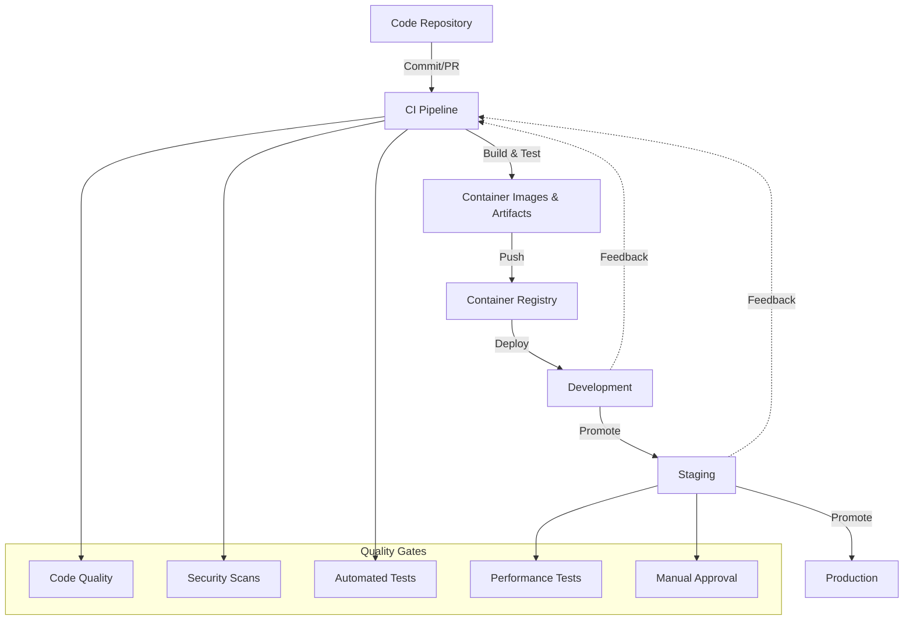
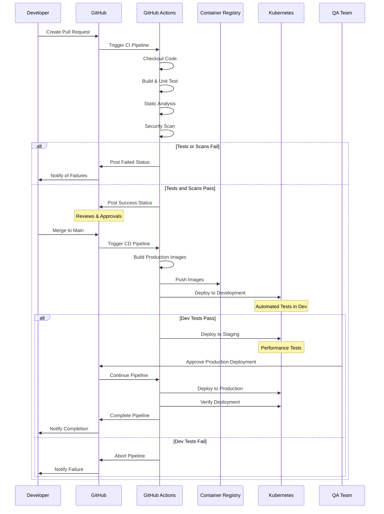
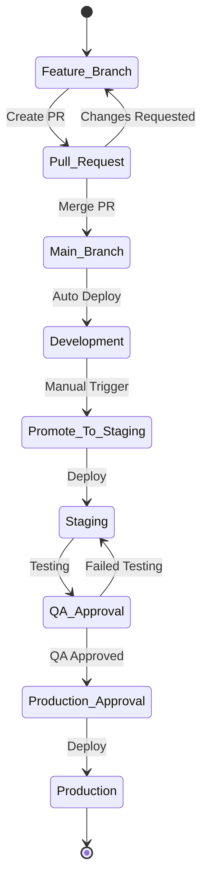
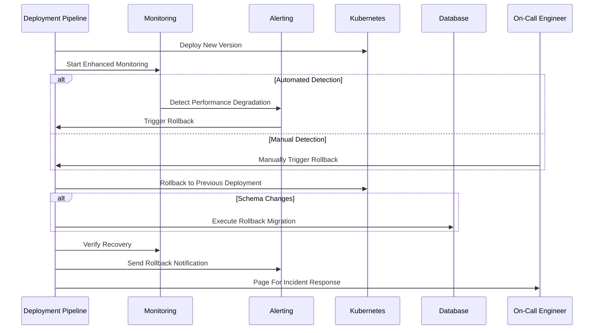

# CI/CD Pipeline

This document details the Continuous Integration and Continuous Deployment (CI/CD) pipeline used for the LLM Gateway service.

## Table of Contents

- [Pipeline Overview](#pipeline-overview)
- [Pipeline Stages](#pipeline-stages)
- [Infrastructure](#infrastructure)
- [Pipeline Triggers](#pipeline-triggers)
- [Environments and Promotion](#environments-and-promotion)
- [Quality Gates](#quality-gates)
- [Rollback Process](#rollback-process)
- [Deployment Best Practices](#deployment-best-practices)

## Pipeline Overview

The LLM Gateway uses GitHub Actions for CI/CD, enabling automated testing, building, and deployment across multiple environments. The pipeline is designed to ensure consistent, reliable, and secure deployments with appropriate approvals and quality gates.

### High-Level Pipeline Flow

## Pipeline Stages

The CI/CD pipeline consists of the following stages:

### 1. Code Validation

- **Static Code Analysis**: Using SonarQube
- **Linting**: Using language-specific linters
- **Style Checks**: Enforcing coding standards

### 2. Build

- **Compile code**: Building application artifacts
- **Generate Documentation**: Auto-generating API docs
- **Create Docker Images**: Building containerized applications

### 3. Test

- **Unit Tests**: Testing individual functions and components
- **Integration Tests**: Testing component interactions
- **API Tests**: Testing API endpoints
- **Security Scans**: Checking for vulnerabilities

### 4. Publish

- **Tag Images**: Tagging Docker images with build metadata
- **Push to Registry**: Publishing to Amazon ECR
- **Artifact Storage**: Storing build artifacts in S3

### 5. Deploy

- **Infrastructure Updates**: Applying Terraform changes if needed
- **Kubernetes Deployments**: Using Helm charts
- **Database Migrations**: Applying schema changes
- **Smoke Tests**: Verifying basic functionality

### 6. Validate

- **End-to-End Tests**: Full workflow testing
- **Performance Tests**: Load and performance testing
- **Security Validation**: Dynamic security analysis
- **Monitoring Check**: Verifying monitoring setup

## Detailed Pipeline Flow

## Infrastructure

The CI/CD pipeline uses the following infrastructure components:

| Component | Tool | Purpose |
|-----------|------|---------|
| Source Control | GitHub | Code and configuration storage |
| CI/CD Orchestration | GitHub Actions | Pipeline execution |
| Artifact Repository | Amazon ECR | Container image storage |
| Secret Management | GitHub Secrets & AWS Secrets Manager | Secure credential storage |
| Deployment Tool | Helm | Kubernetes application deployment |
| Infrastructure Deployment | Terraform | Infrastructure provisioning |

### Self-Hosted Runners

For better performance and security, the pipeline uses self-hosted GitHub Actions runners running in the same AWS account as the deployment targets:

| Environment | Runner Type | Count | Instance Type | Auto-Scaling |
|-------------|------------|-------|--------------|--------------|
| Development | EC2 | 2 | c5.large | Yes (1-3) |
| Staging | EC2 | 2 | c5.large | Yes (1-3) |
| Production | EC2 | 3 | c5.xlarge | Yes (2-5) |

## Pipeline Triggers

The pipeline is triggered by various events:

| Trigger | Pipeline | Environments | Description |
|---------|----------|--------------|-------------|
| Pull Request | CI | None | Validation only, no deployment |
| Push to Main | CI/CD | Development | Auto-deploy to development |
| Manual Trigger | CD | Staging | Manual promotion to staging |
| Release Tag | CD | Production | Tagged releases deploy to production |
| Schedule | CI | None | Nightly builds and extended tests |

## Environments and Promotion

The code flows through multiple environments with controlled promotions:

### Environment Definitions

| Environment | Purpose | Promotion Method | Auto-deploy? |
|-------------|---------|-----------------|--------------|
| Development | Feature testing | Automatic on merge to main | Yes |
| Staging | Pre-production validation | Manual promotion | No |
| Production | Live traffic | Manual promotion with approvals | No |

### Promotion Process

## Quality Gates

The pipeline includes multiple quality gates to ensure code and deployment quality:

| Gate | Stage | Tool | Threshold | Action on Failure |
|------|-------|------|-----------|-------------------|
| Code Coverage | CI | Jest/Codecov | ≥80% | Block PR |
| Code Quality | CI | SonarQube | No "Blockers" or "Critical" | Block PR |
| Security Vulnerabilities | CI | Snyk/Trivy | No "High" or "Critical" | Block PR |
| Unit Tests | CI | Jest | 100% Pass | Block PR |
| Integration Tests | CI | Jest | 100% Pass | Block PR |
| API Tests | CD (Dev) | Postman/Newman | 100% Pass | Block Promotion |
| Performance Tests | CD (Staging) | k6 | Meets SLOs | Warning |
| Security Scan | CD (Staging) | OWASP ZAP | No "High" | Block Promotion |
| Manual Approval | CD (Prod) | GitHub | Required approvals | Block Deployment |

## Rollback Process

In case of deployment failures, the pipeline supports automated and manual rollbacks:

### Automated Rollback Triggers

- Health check failures following deployment
- Error rate exceeding threshold (2x baseline)
- Latency exceeding threshold (2x baseline)

### Rollback Process

### Rollback Considerations

- **Stateless Components**: Simple rollback via Kubernetes deployment version
- **Database Changes**: Requires compatible backward migrations
- **Configuration Changes**: Versioned configuration maps
- **Dependent Services**: Coordinated rollback for dependent systems

## Deployment Best Practices

The following best practices are implemented in the CI/CD pipeline:

### Deployment Strategies

- **Blue/Green Deployment**: For major releases
- **Canary Releases**: For controlled feature rollouts (10% → 50% → 100%)
- **Progressive Delivery**: Using service mesh for traffic control

### Deployment Windows

| Environment | Standard Window | Blackout Periods |
|-------------|-----------------|------------------|
| Development | Anytime | None |
| Staging | Business hours | None |
| Production | Tuesdays & Thursdays 10am-2pm ET | End of month, holidays |

### Release Tagging

All releases follow semantic versioning:
- Format: `v{MAJOR}.{MINOR}.{PATCH}`
- Example: `v1.3.2`

### Notifications

The pipeline sends notifications at key points:
- Pipeline start/complete
- Deployment start/complete
- Quality gate failures
- Rollbacks
- Production deployments

Notifications are sent via:
- Slack (#llm-gateway-deployments)
- Email (for critical notifications)
- PagerDuty (for failures)

---

**Previous**: [Infrastructure as Code](./infrastructure-as-code.md) | **Next**: [Configuration & Secrets Management](./configuration-secrets.md)