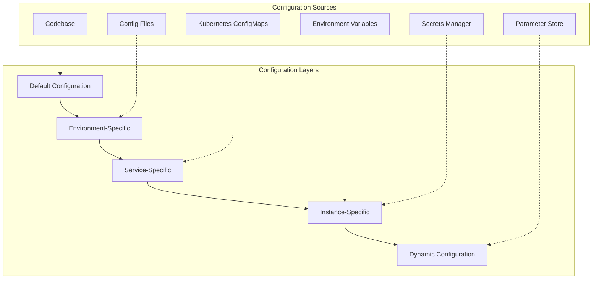
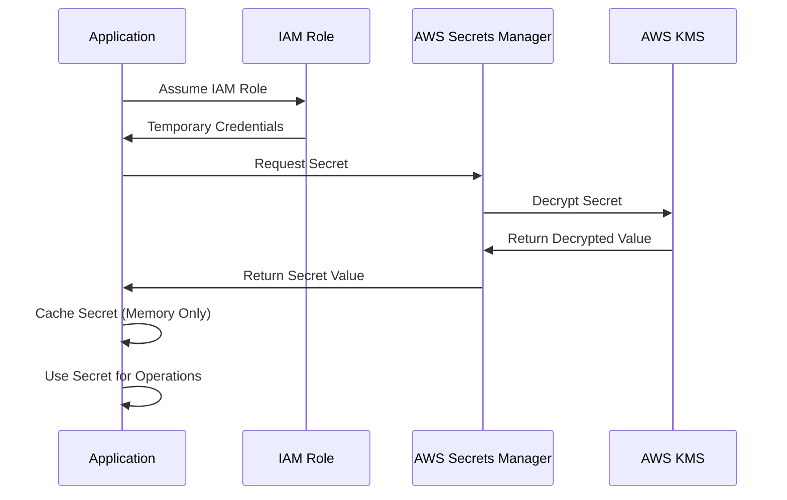
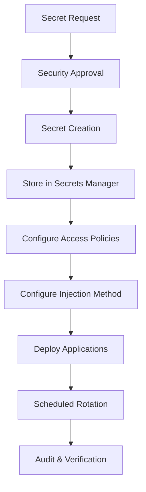
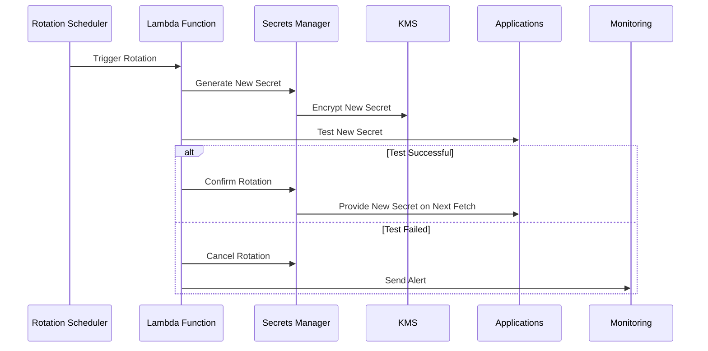
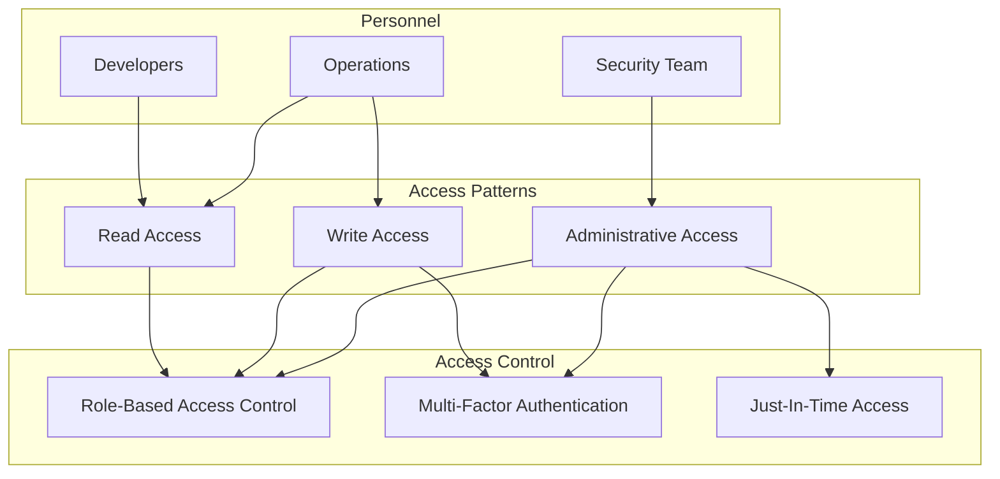

# Configuration & Secrets Management

This document outlines the approach to configuration management and secrets handling in the LLM Gateway system.

## Table of Contents

- [Configuration Approach](#configuration-approach)
- [Environment Configuration](#environment-configuration)
- [Secrets Management](#secrets-management)
- [Encryption Strategy](#encryption-strategy)
- [Rotation Policies](#rotation-policies)
- [Access Control](#access-control)
- [Audit and Compliance](#audit-and-compliance)

## Configuration Approach

The LLM Gateway follows a layered approach to configuration management, ensuring flexibility, security, and proper separation of concerns.

### Configuration Layers



### Configuration Principles

1. **Immutable Infrastructure**: Configuration changes trigger new deployments
2. **Environment Parity**: Same configuration structure across environments
3. **Least Privilege**: Configuration access limited to required services
4. **Auditability**: All configuration changes are tracked and logged
5. **Separation**: Clear separation between configuration and secrets

## Environment Configuration

Configuration is structured by environment, with progressive overrides:

### Configuration Structure

```
config/
├── base/                   # Base configuration, common to all environments
│   ├── app-config.yaml     # Core application settings
│   └── logging-config.yaml # Logging configuration
├── environments/           # Environment-specific overrides
│   ├── development/        # Development environment
│   ├── staging/            # Staging environment
│   └── production/         # Production environment
└── services/               # Service-specific configuration
    ├── api-service/        # API service config
    ├── execution-service/  # Execution service config
    └── ...                 # Other services
```

### Configuration Management

Configuration is managed through the following tools and practices:

| Aspect | Implementation | Tool/Approach |
|--------|---------------|--------------|
| Storage | Git repository | GitHub with branch protection |
| Deployment | ConfigMaps | Kubernetes ConfigMaps via Helm |
| Validation | Schema validation | JSON Schema validation in CI |
| Template Processing | Value substitution | Helm templating |
| Access Control | RBAC | Kubernetes RBAC permissions |

### Environment Variables

Critical configuration values can be injected as environment variables:

| Category | Naming Convention | Example |
|----------|-------------------|---------|
| Service Endpoints | `SERVICE_NAME_ENDPOINT` | `CACHE_SERVICE_ENDPOINT` |
| Feature Flags | `FEATURE_NAME_ENABLED` | `SEMANTIC_CACHE_ENABLED` |
| Resource Limits | `RESOURCE_NAME_LIMIT` | `MAX_CONCURRENT_REQUESTS` |
| API Keys Reference | `SERVICE_NAME_API_KEY_NAME` | `OPENAI_API_KEY_NAME` |

## Secrets Management

The LLM Gateway uses AWS Secrets Manager for secure secrets management, with careful integration into the application.

### Secret Types

| Secret Type | Examples | Storage | Rotation Policy |
|-------------|----------|---------|-----------------|
| API Keys | OpenAI API Key, Anthropic API Key | AWS Secrets Manager | 90 days |
| Database Credentials | PostgreSQL password, Redis auth | AWS Secrets Manager | 90 days |
| JWT Signing Keys | Auth service signing keys | AWS Secrets Manager | 180 days |
| TLS Certificates | API gateway certificates | AWS Certificate Manager | Auto-renewal before expiry |
| OAuth Client Secrets | Auth provider credentials | AWS Secrets Manager | 180 days |

### Secret Access Flow



### Secret Injection

Secrets are provided to applications using the following methods:

1. **Environment Variables**: Non-sensitive references to secret names
2. **AWS SDK Integration**: Direct integration with Secrets Manager API
3. **Kubernetes Secrets**: For Kubernetes-native applications
4. **External Secrets Operator**: Syncs AWS Secrets to Kubernetes
5. **IAM Roles for Service Accounts**: Secure access from pods

### Secret Management Workflow



## Encryption Strategy

The LLM Gateway implements a multi-layered encryption strategy:

### Data Classification

| Classification | Examples | Encryption Approach |
|----------------|---------|---------------------|
| Public | Public documentation, model capabilities | No encryption required |
| Internal | Logs, metrics, configuration | Encryption in transit |
| Confidential | Prompt templates, usage analytics | Encryption in transit and at rest |
| Restricted | API keys, credentials, customer prompts | Encryption in transit and at rest with key rotation |

### Encryption Layers

1. **Encryption in Transit**:
   - TLS 1.3 for all external communications
   - TLS 1.3 for all internal service communication
   - mTLS for critical service-to-service communication

2. **Encryption at Rest**:
   - AWS RDS with encryption enabled (AES-256)
   - AWS ElastiCache with encryption enabled
   - S3 with server-side encryption
   - EBS volumes with encryption enabled

3. **Encryption for Specific Data Types**:
   - API keys: Encrypted in application memory
   - User data: Encrypted with tenant-specific keys
   - Audit logs: Encrypted and integrity-protected

### Key Management

All encryption keys are managed through AWS KMS:

- **Key Hierarchy**: Multi-level key hierarchy with master keys and data keys
- **Key Rotation**: Automatic rotation based on classification
- **Access Control**: Strict IAM policies for key usage
- **Audit**: Comprehensive CloudTrail logs for key usage

## Rotation Policies

Secrets are rotated according to defined schedules:

### Rotation Process



### Automated Rotation

The following secrets leverage automated rotation:

| Secret Type | Rotation Mechanism | Frequency | Fallback |
|-------------|-------------------|-----------|----------|
| Database Credentials | AWS Secrets Manager native rotation | 90 days | Manual rotation |
| IAM Access Keys | Lambda function | 90 days | Manual rotation |
| JWT Signing Keys | Custom rotation lambda | 180 days | Multiple valid keys during transition |
| Application API Keys | Custom rotation service | 90 days | Graceful degradation |

## Access Control

Access to configuration and secrets follows strict principles:

### Access Model



### Access Policies

| Role | Configuration Access | Secrets Access | Requirement |
|------|---------------------|---------------|-------------|
| Developer | Read-only to non-production | No direct access | PR for changes |
| DevOps | Read/Write to all environments | Read production, Read/Write non-production | MFA |
| Security | Read all, Write security configs | Read all, Write security secrets | MFA + JIT |
| Service Accounts | Environment-specific read | Specific secrets read only | IAM constraints |

## Audit and Compliance

Configuration and secrets management is fully auditable:

### Audit Trail

All operations on configuration and secrets are logged:

- **What**: Action performed (create, read, update, delete)
- **When**: Timestamp of the action
- **Who**: Identity that performed the action
- **Where**: Source (IP address, service)
- **Context**: Additional information about the request

### Compliance Features

The following features ensure compliance with security requirements:

1. **Comprehensive Logging**: All access and changes are logged
2. **Immutable Audit Logs**: Tamper-evident logs stored securely
3. **Access Reviews**: Regular reviews of access permissions
4. **Automated Scanning**: Regular scanning for misconfigurations
5. **Secret Detection**: Automated scanning for hardcoded secrets

---

**Previous**: [CI/CD Pipeline](./cicd-pipeline.md) | **Next**: [Monitoring & Alerting](./monitoring-alerting.md)