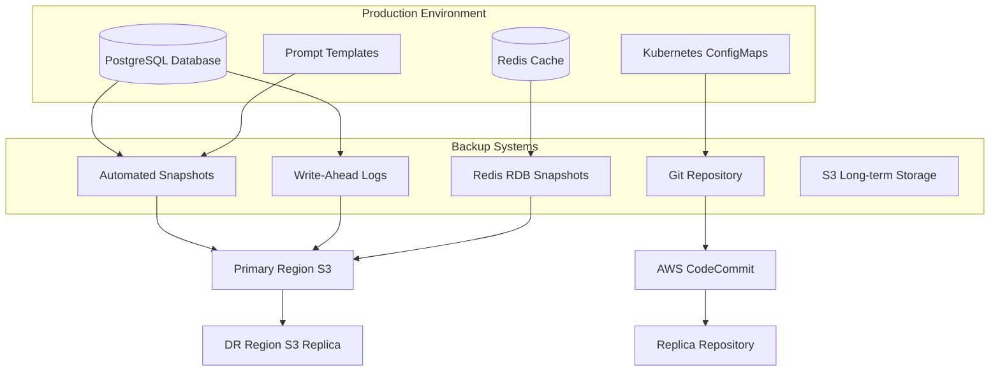
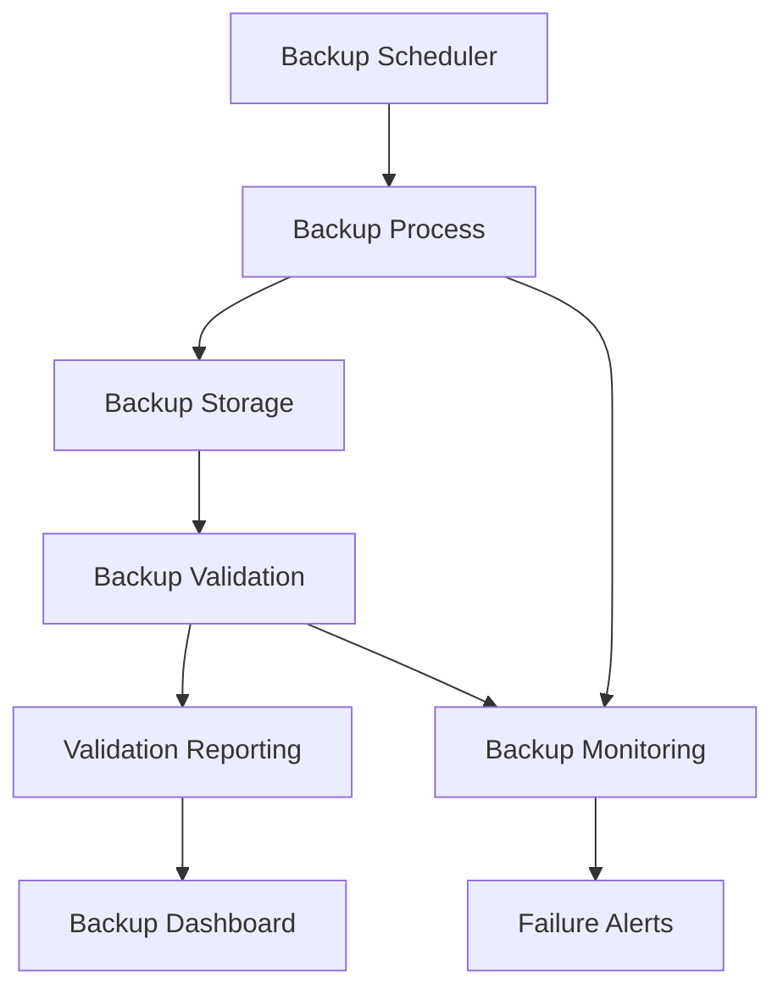
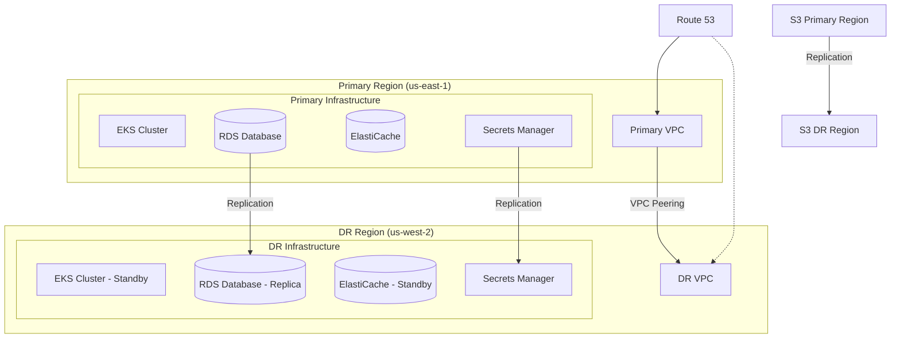
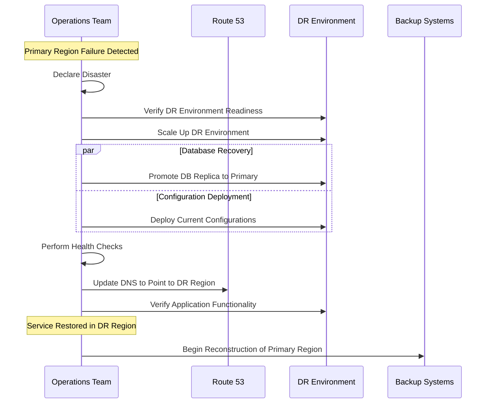
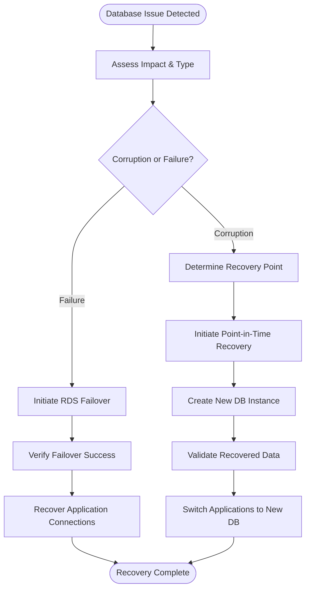
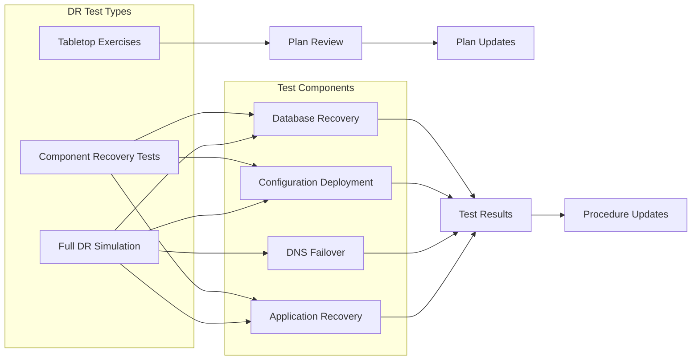
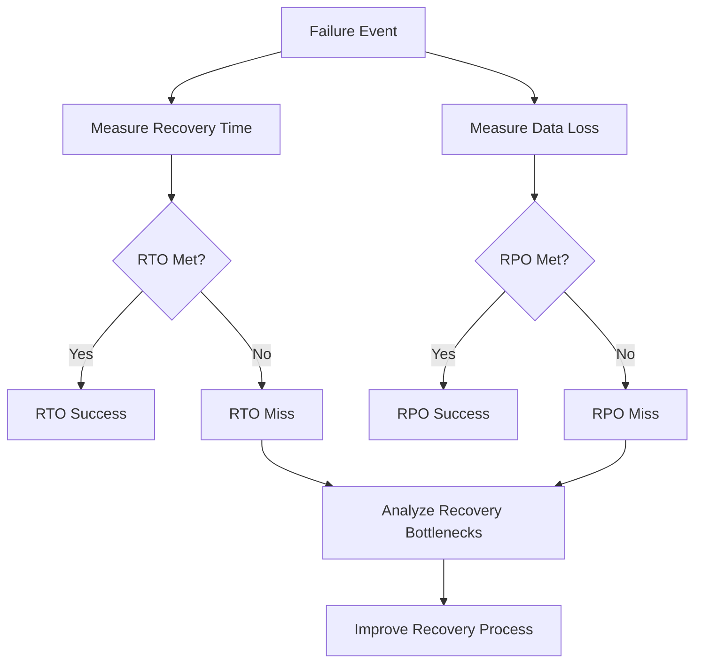

# Disaster Recovery & Backup Strategy

This document outlines the disaster recovery (DR) and backup strategies for the LLM Gateway service, ensuring business continuity in the event of major disruptions or data loss.

## Table of Contents

- [Backup Strategy](#backup-strategy)
- [Disaster Recovery Plan](#disaster-recovery-plan)
- [Recovery Procedures](#recovery-procedures)
- [DR Testing](#dr-testing)
- [Recovery Time Objectives](#recovery-time-objectives)
- [Business Continuity](#business-continuity)

## Backup Strategy

The LLM Gateway implements a comprehensive backup strategy to protect all critical data and configurations.

### Backup Components

The following components are included in the backup strategy:

| Component | Data Type | Backup Method | Frequency | Retention |
|-----------|-----------|---------------|-----------|-----------|
| PostgreSQL Database | Structured data | Automated snapshots | Daily full, 5-minute WAL | 30 days |
| Redis Cache | Cache data | RDB snapshots | Every 6 hours | 7 days |
| Configuration | Kubernetes configs | GitOps repository | On change | Indefinite |
| Infrastructure | Terraform state | S3 + versioning | On change | Indefinite |
| Prompt Templates | Business data | Database + separate export | Daily | 90 days |
| Logs | Operational data | S3 archival | Streaming | 90 days |
| Metrics | Time-series data | S3 long-term storage | Daily aggregation | 1 year |

### Backup Architecture



### Database Backup Strategy

Database backups follow a multi-layered approach:

1. **Automated RDS Snapshots**: 
   - Daily full database snapshots
   - Retained for 30 days
   - Encrypted at rest

2. **Point-in-Time Recovery**:
   - Transaction logs (WAL) archived every 5 minutes
   - Allows recovery to any point in the last 30 days
   - Automated verification of recovery capability

3. **Cross-Region Backup Replication**:
   - Snapshots replicated to DR region
   - Scheduled with 1-hour delay
   - Regular validation of replica integrity

### Configuration Backup

All configuration is stored in version control:

1. **GitOps Repository**:
   - All Kubernetes manifests
   - Helm chart values
   - Application configurations
   - Deployment specifications

2. **Infrastructure as Code**:
   - Terraform state files in S3 with versioning
   - Terraform code in Git repository
   - AWS CloudFormation templates (when used)

3. **Secrets Backup**:
   - AWS Secrets Manager automatic replication
   - Encryption key backups in AWS KMS

### Backup Monitoring and Validation

All backups are monitored and regularly validated:



1. **Automated Verification**:
   - Daily verification of backup integrity
   - Random backup recovery tests
   - Database consistency checks

2. **Monitoring and Alerting**:
   - Alerts for backup failures
   - Metrics for backup size and duration
   - Compliance reporting for backup SLAs

## Disaster Recovery Plan

The LLM Gateway has a comprehensive DR plan to handle various failure scenarios.

### DR Architecture



### Failure Scenarios

The DR plan addresses the following failure scenarios:

| Scenario | Impact | Recovery Approach | RTO | RPO |
|----------|--------|-------------------|-----|-----|
| Single AZ Failure | Partial service degradation | Auto-scaling across remaining AZs | < 5 minutes | 0 |
| Database Failure | Potential data access disruption | Automatic failover to standby | < 5 minutes | < 1 minute |
| Full Region Failure | Complete service outage | Cross-region failover | < 4 hours | < 15 minutes |
| Data Corruption | Data integrity issues | Point-in-time recovery | < 1 hour | Depends on detection |
| Malicious Attack | Security breach | Isolation and clean recovery | < 8 hours | Depends on detection |
| Provider Outage | Service degradation | Multi-provider failover | < 10 minutes | 0 |

### DR Environments

The LLM Gateway maintains the following environments for disaster recovery:

1. **Production (Primary)**:
   - Fully scaled production environment
   - Multi-AZ deployment for high availability
   - Located in US East (N. Virginia)

2. **Disaster Recovery (Standby)**:
   - Scaled-down standby environment
   - Pre-provisioned critical infrastructure
   - Located in US West (Oregon)
   - Database replication from primary
   - Regularly updated with configuration changes

3. **Backup Recovery**:
   - Automated scripts to rebuild environment
   - Terraform automation for infrastructure
   - Kubernetes deployment automation

## Recovery Procedures

### Regional Failover Procedure

**When to use**: Complete primary region failure



**Detailed Steps**:

1. **Declare Disaster Event**
   - Incident commander declares DR event
   - Notify stakeholders of service disruption
   - Assemble recovery team

2. **Activate DR Environment**
   ```bash
   # Scale up DR environment
   aws autoscaling update-auto-scaling-group \
     --auto-scaling-group-name llm-gateway-dr-workers \
     --min-size 9 \
     --max-size 18 \
     --desired-capacity 9
   ```

3. **Promote Database Replica**
   ```bash
   # Promote RDS read replica to primary
   aws rds promote-read-replica \
     --db-instance-identifier llm-gateway-dr-db
   ```

4. **Deploy Current Configurations**
   ```bash
   # Apply latest configuration
   kubectl apply -f kubernetes/dr-deployment/ --context dr-cluster
   ```

5. **Verify DR Environment Health**
   ```bash
   # Perform health checks
   for service in api-service execution-service prompt-service cache-service; do
     kubectl exec -it $(kubectl get pods -l app=$service -o jsonpath='{.items[0].metadata.name}' --context dr-cluster) --context dr-cluster -- curl localhost:8080/health/deep
   done
   ```

6. **Update DNS**
   ```bash
   # Switch DNS to DR environment
   aws route53 change-resource-record-sets \
     --hosted-zone-id $HOSTED_ZONE_ID \
     --change-batch file://dns/failover-to-dr.json
   ```

7. **Verify Application Functionality**
   ```bash
   # Run synthetic transactions
   ./scripts/run-dr-validation-tests.sh
   ```

8. **Begin Primary Region Recovery**
   - Assess primary region status
   - Begin rebuilding primary environment
   - Plan for failback when ready

### Database Recovery Procedure

**When to use**: Database corruption or failure



**Detailed Steps for Corruption Recovery**:

1. **Isolate the Issue**
   - Identify affected data
   - Document corruption timeline
   - Take database snapshot before recovery

2. **Determine Recovery Point**
   ```bash
   # List available recovery points
   aws rds describe-db-snapshots \
     --db-instance-identifier llm-gateway-db
   
   # List automated backups with recovery time
   aws rds describe-db-instance-automated-backups \
     --db-instance-identifier llm-gateway-db
   ```

3. **Initiate Point-in-Time Recovery**
   ```bash
   # Restore to point in time before corruption
   aws rds restore-db-instance-to-point-in-time \
     --source-db-instance-identifier llm-gateway-db \
     --target-db-instance-identifier llm-gateway-db-recovered \
     --restore-time 2023-05-15T04:00:00Z
   ```

4. **Validate Recovered Data**
   ```bash
   # Connect to new instance and verify data
   PGPASSWORD=$DB_PASSWORD psql -h llm-gateway-db-recovered.example.us-east-1.rds.amazonaws.com -U admin -c "SELECT count(*) FROM prompts WHERE updated_at > '2023-05-14';"
   ```

5. **Prepare for Switchover**
   ```bash
   # Scale down application to minimize disruption
   kubectl scale deployment api-service execution-service prompt-service --replicas=1 -n llm-gateway
   ```

6. **Update Database Connection**
   ```bash
   # Update connection secret
   aws secretsmanager update-secret \
     --secret-id llm-gateway/database/credentials \
     --secret-string "{\"host\":\"llm-gateway-db-recovered.example.us-east-1.rds.amazonaws.com\",\"username\":\"$DB_USER\",\"password\":\"$DB_PASSWORD\"}"
   
   # Restart services to pick up new connection
   kubectl rollout restart deployment api-service execution-service prompt-service -n llm-gateway
   ```

7. **Verify and Scale Up**
   ```bash
   # Verify applications are working with recovered data
   curl -X GET https://api.example.com/health/deep
   
   # Scale back to normal operation
   kubectl scale deployment api-service --replicas=6 execution-service --replicas=12 prompt-service --replicas=4 -n llm-gateway
   ```

### Service Recovery Timeline

The following timeline shows the recovery process and approximate durations:

```mermaid
gantt
    title Disaster Recovery Timeline
    dateFormat  X
    axisFormat %s
    
    section Incident Response
    Detect Incident                  :a1, 0, 5m
    Declare Disaster                 :a2, after a1, 10m
    Assemble Recovery Team           :a3, after a2, 15m
    
    section DR Environment
    Scale DR Environment             :b1, after a3, 20m
    Verify DR Readiness              :b2, after b1, 10m
    
    section Database Recovery
    Promote Database Replica         :c1, after a3, 15m
    Verify Database Functionality    :c2, after c1, 10m
    
    section Application Recovery
    Deploy Configurations            :d1, after b2, 15m
    Verify Application Health        :d2, after d1, 15m
    
    section Transition
    Update DNS                       :e1, after c2, after d2, 5m
    DNS Propagation                  :e2, after e1, 30m
    Verify End-to-End Functionality  :e3, after e2, 20m
    
    section Post-Recovery
    Notify Stakeholders              :f1, after e3, 10m
    Begin Primary Region Recovery    :f2, after f1, 0m
```

## DR Testing

The LLM Gateway DR capabilities are regularly tested to ensure recovery readiness.

### Testing Strategy



### Testing Schedule

The following tests are performed regularly:

| Test Type | Frequency | Components | Duration | Impact |
|-----------|-----------|------------|----------|--------|
| Tabletop Exercise | Monthly | Recovery procedures, Team readiness | 2 hours | None |
| Component Tests | Quarterly | Database recovery, Application restore | 4 hours | None (isolated environment) |
| DR Simulation | Semi-annually | Full region failover | 8 hours | Minimal (during maintenance window) |
| Backup Verification | Daily | Automated backup verification | Automated | None |
| Chaos Engineering | Monthly | Resilience verification | 4 hours | Minimal (isolated components) |

### DR Test Procedure

Each DR test follows a standardized process:

1. **Test Planning**
   - Define test objectives and success criteria
   - Create detailed test plan and schedule
   - Identify participants and responsibilities

2. **Pre-Test Preparation**
   - Review and update recovery procedures
   - Verify backup integrity
   - Prepare test environment

3. **Test Execution**
   - Follow documented recovery procedures
   - Document all actions and outcomes
   - Measure recovery times

4. **Test Evaluation**
   - Assess whether RTO and RPO were met
   - Identify issues and bottlenecks
   - Document lessons learned

5. **Improvement Implementation**
   - Update recovery procedures
   - Address identified issues
   - Implement process improvements

## Recovery Time Objectives

The LLM Gateway has defined the following recovery objectives:

| Scenario | RTO (Recovery Time Objective) | RPO (Recovery Point Objective) |
|----------|-------------------------------|--------------------------------|
| Single AZ Failure | < 5 minutes | 0 (no data loss) |
| Database Primary Failure | < 5 minutes | < 1 minute |
| Cache Failure | < 5 minutes | 0 (reconstructible from database) |
| Full Region Failure | < 4 hours | < 15 minutes |
| Data Corruption | < 1 hour | Depends on detection time |
| Multi-Region Failure | < 24 hours | < 1 hour |

### RTO/RPO Measurement

Recovery objectives are measured and validated during DR tests:



## Business Continuity

Beyond technical recovery, the LLM Gateway has a broader business continuity plan.

### Communication Plan

During DR events, communication follows a defined plan:

| Stakeholder | Communication Method | Timing | Information Provided |
|-------------|----------------------|--------|---------------------|
| Operations Team | PagerDuty, Slack | Immediate | Technical details, recovery actions |
| Leadership | Email, Phone | Within 15 minutes | Incident summary, impact assessment, ETA |
| Customers | Status Page, Email | Within 30 minutes | Service status, estimated resolution |
| Partners | Email, Support Portal | Within 1 hour | Impact assessment, mitigation options |

### Continuity Procedures

1. **Service Degradation Mode**
   - Implement reduced functionality mode
   - Prioritize critical business functions
   - Throttle non-essential traffic

2. **Manual Operational Procedures**
   - Documented manual processes for critical functions
   - Emergency access procedures
   - Alternate operational workflows

3. **Customer Communication Templates**
   - Pre-approved notification templates
   - Regular status update formats
   - Post-incident report template

### Recovery Metrics and Reporting

After a DR event, the following metrics are collected and reported:

1. **Technical Metrics**
   - Actual recovery time achieved
   - Data loss assessment
   - Component recovery times
   - Error rates during recovery

2. **Business Impact Metrics**
   - Service downtime duration
   - Affected customers and requests
   - Financial impact assessment
   - SLA impact analysis

3. **Process Effectiveness**
   - Team response time
   - Procedure adherence
   - Communication effectiveness
   - Decision-making efficiency

---

**Previous**: [Runbook / Operations Playbook](./runbook.md) | **Next**: [Security and Compliance](./security-compliance.md)