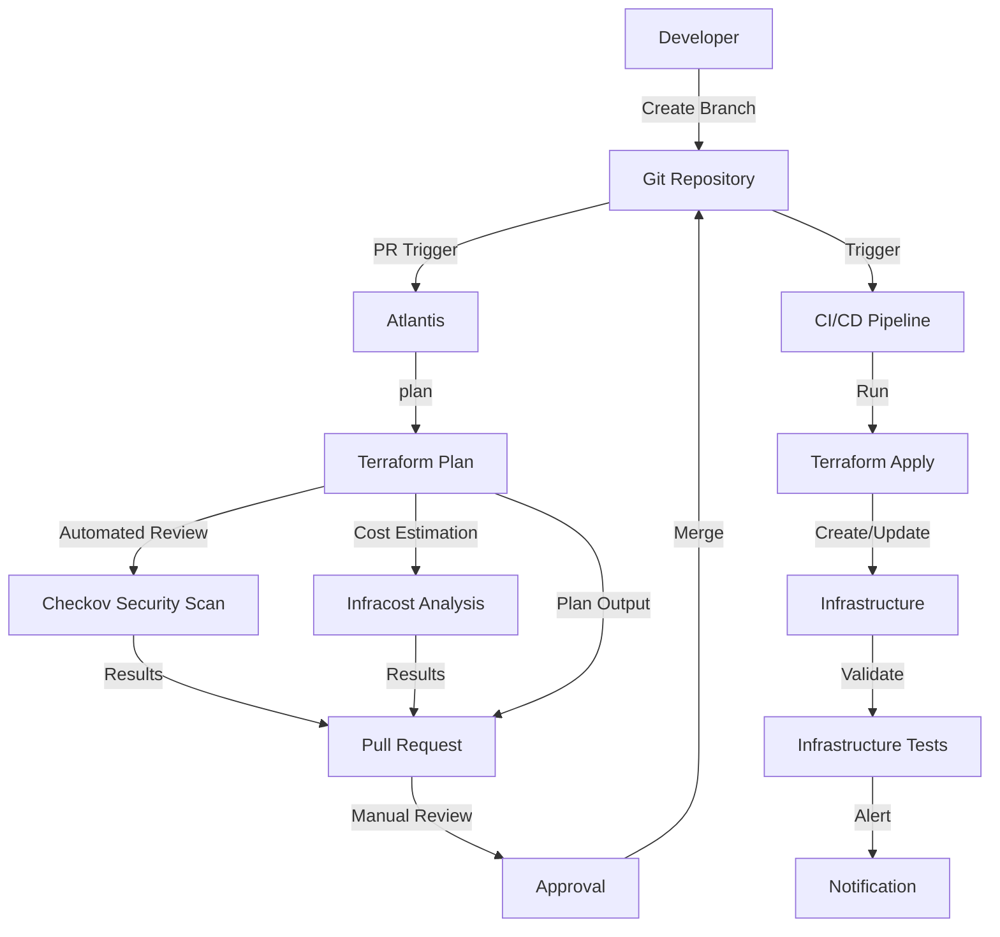
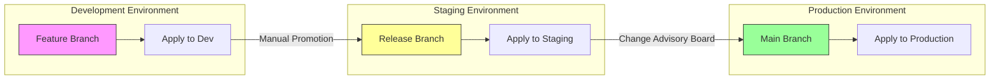

# Infrastructure as Code

This document describes the Infrastructure as Code (IaC) approach used for provisioning and managing the LLM Gateway infrastructure.

## Table of Contents

- [IaC Approach](#iac-approach)
- [Repository Structure](#repository-structure)
- [Environments](#environments)
- [Provisioning Workflow](#provisioning-workflow)
- [Environment Promotion](#environment-promotion)
- [Key Infrastructure Components](#key-infrastructure-components)
- [Secrets Management](#secrets-management)
- [Best Practices](#best-practices)

## IaC Approach

The LLM Gateway uses Terraform for infrastructure provisioning across all environments. This ensures consistent, repeatable deployments and infrastructure versioning. All Terraform configurations are stored in a dedicated Git repository.

### Tools and Technologies

| Tool | Version | Purpose |
|------|---------|---------|
| Terraform | >= 1.0.0 | Primary IaC tool |
| AWS Provider | >= 4.0.0 | AWS resource provisioning |
| Kubernetes Provider | >= 2.10.0 | Kubernetes resource management |
| Helm Provider | >= 2.5.0 | Application deployment via Helm |
| Terragrunt | >= 0.36.0 | Terraform wrapper for DRY configurations |
| Atlantis | >= 0.19.0 | Terraform Pull Request Automation |
| Checkov | >= 2.0.0 | IaC security scanning |
| Infracost | >= 0.10.0 | Cost estimation for changes |

## Repository Structure

The Terraform code follows a modular structure organized by environment and component:

```
terraform/
├── modules/                    # Reusable modules
│   ├── networking/             # VPC, subnets, security groups
│   ├── kubernetes/             # EKS cluster and node groups
│   ├── databases/              # RDS and ElastiCache
│   ├── monitoring/             # Monitoring stack
│   └── llm-gateway/            # Gateway-specific resources
├── environments/               # Environment-specific configurations
│   ├── development/            # Development environment
│   ├── staging/                # Staging environment
│   ├── production/             # Production environment
│   └── dr/                     # Disaster recovery environment
└── live/                       # Terragrunt configurations
    ├── dev/                    # Development
    ├── stage/                  # Staging
    ├── prod/                   # Production
    └── global/                 # Global resources
```

## Environments

The LLM Gateway is deployed across multiple environments, each with specific purposes and configurations:

| Environment | Purpose | AWS Account | Region(s) | Scale |
|-------------|---------|------------|-----------|-------|
| Development | Feature development and testing | 123456789012 | us-east-1 | Small (2-3 nodes) |
| Staging | Pre-production testing and integration | 210987654321 | us-east-1 | Medium (3-6 nodes) |
| Production | Live customer traffic | 987654321098 | us-east-1, eu-west-1, ap-northeast-1 | Large (9+ nodes) |
| DR | Disaster recovery | 987654321098 | us-west-2 | Medium (standby) |

## Provisioning Workflow

The infrastructure provisioning follows a defined workflow utilizing GitOps principles:



### Process Steps

1. **Development**:
   - Infrastructure changes are proposed in a feature branch
   - Terraform configurations are validated locally using `terraform validate`
   - Changes are pushed to the repository

2. **Pull Request**:
   - Pull request triggers Atlantis to run `terraform plan`
   - Automated checks run (Checkov for security, Infracost for cost analysis)
   - Results are posted on the PR for review

3. **Review and Approval**:
   - Proposed changes are reviewed by infrastructure team
   - Approvals required from at least two team members
   - Comments and adjustments made as needed

4. **Deployment**:
   - After approval, changes are merged to the main branch
   - CI/CD pipeline triggers `terraform apply`
   - Applied changes are validated with automated tests
   - Success or failure notifications are sent to the team

5. **Documentation**:
   - Infrastructure changes are documented in architectural decision records
   - Infrastructure diagrams are updated if necessary
   - Changes are communicated to relevant stakeholders

## Environment Promotion

Changes flow through environments in a controlled manner:



### Promotion Process

- **Dev to Staging**: After successful testing in development
  - Requires approval from technical lead
  - Integration tests must pass
  - No high-severity security issues
  
- **Staging to Production**: After validation in staging
  - Requires Change Advisory Board approval
  - Full suite of tests must pass
  - Security review must be completed
  - Scheduled during maintenance window if disruptive

## Key Infrastructure Components

The following key infrastructure components are managed via Terraform:

### Networking

- **VPC**: Isolated network environment
- **Subnets**: Public and private subnets across AZs
- **Security Groups**: Controlled network access
- **NACLs**: Additional network security layer
- **Load Balancers**: Application Load Balancers for traffic distribution

### Compute

- **EKS Cluster**: Managed Kubernetes service
- **Node Groups**: Auto-scaling worker nodes
- **Launch Templates**: Standardized node configurations

### Data Stores

- **RDS**: Relational database for persistence
- **ElastiCache**: Redis for caching and temporary data
- **S3**: Object storage for backups and artifacts

### Supporting Services

- **CloudWatch**: Monitoring and logging
- **Route53**: DNS management
- **Secret Manager**: Secure secrets storage
- **IAM**: Identity and access management

## Secrets Management

Infrastructure secrets are managed securely using the following approach:

1. **Terraform State**: 
   - Encrypted and stored in an S3 bucket
   - State locking using DynamoDB
   - Access limited to authorized roles

2. **Sensitive Variables**:
   - Stored in AWS Secrets Manager or Parameter Store
   - Referenced using Terraform data sources
   - Never committed to version control

3. **Provider Authentication**:
   - Uses IAM roles with least privilege
   - Different roles for different environments
   - Temporary credentials via AWS STS

## Best Practices

The following best practices are enforced for infrastructure management:

### Immutable Infrastructure

- Infrastructure changes are made via code, not manual adjustments
- Servers are never modified after deployment; instead, new versions are deployed
- Automated testing verifies infrastructure correctness

### Security

- All resources follow least privilege principle
- Security groups deny all traffic by default
- Regular security scanning of IaC code
- Compliance with corporate security policies

### Documentation

- Architecture Decision Records for significant changes
- Detailed comments in Terraform code
- Auto-generated documentation using terraform-docs
- up-to-date diagrams of the infrastructure

### Cost Management

- Resource tagging for cost allocation
- Regular cost reviews
- Automated cost estimation for changes
- Dev/Test environments scheduled to scale down during off-hours

---

**Previous**: [System Architecture Overview](./system-architecture.md) | **Next**: [CI/CD Pipeline](./cicd-pipeline.md)