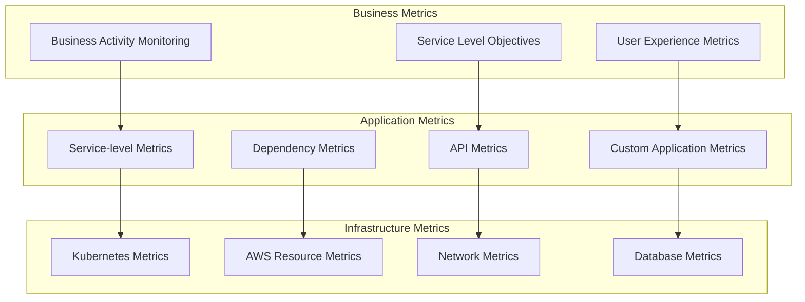
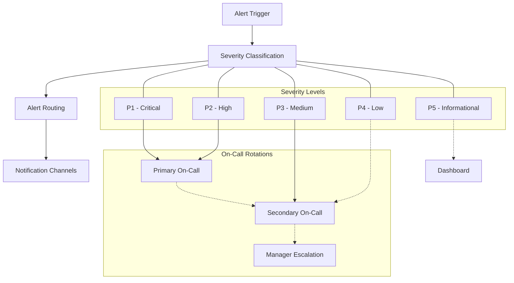
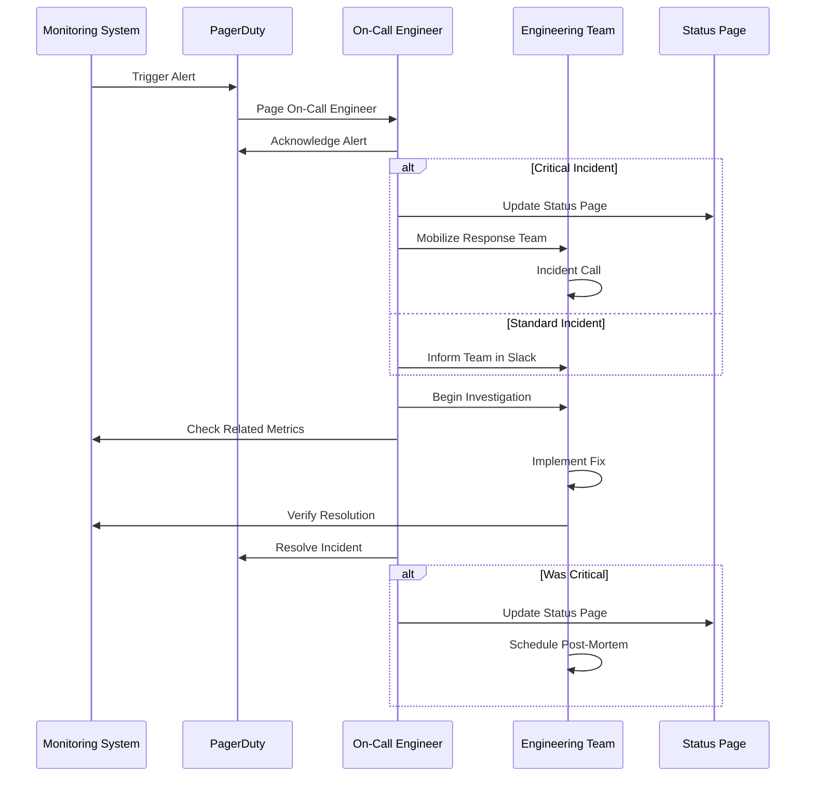
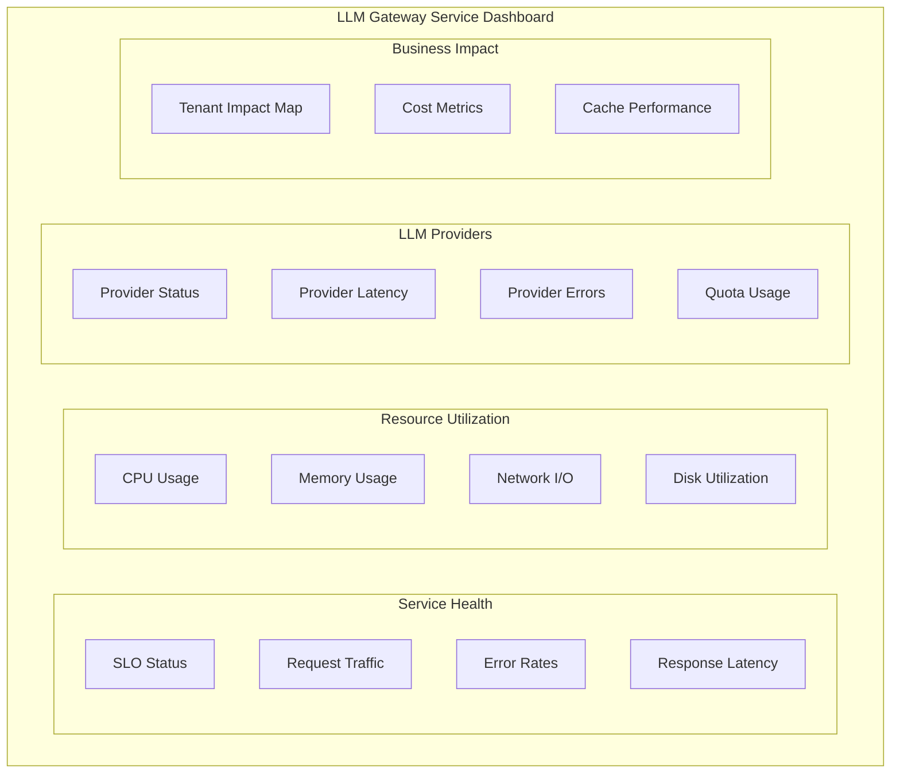
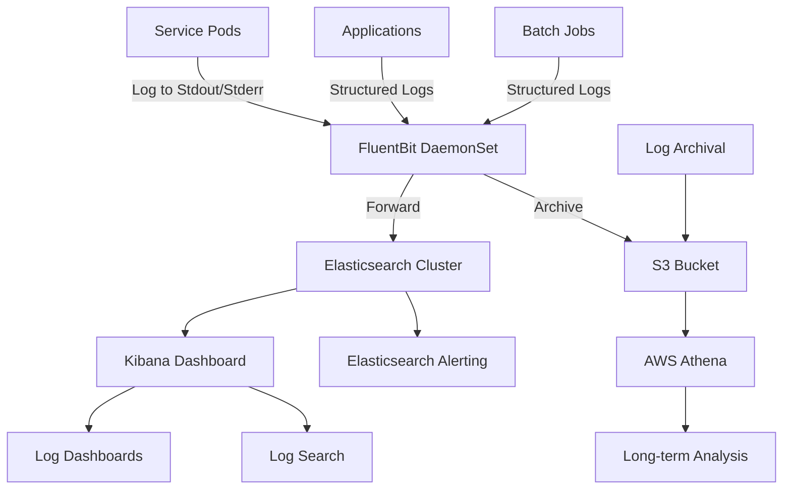
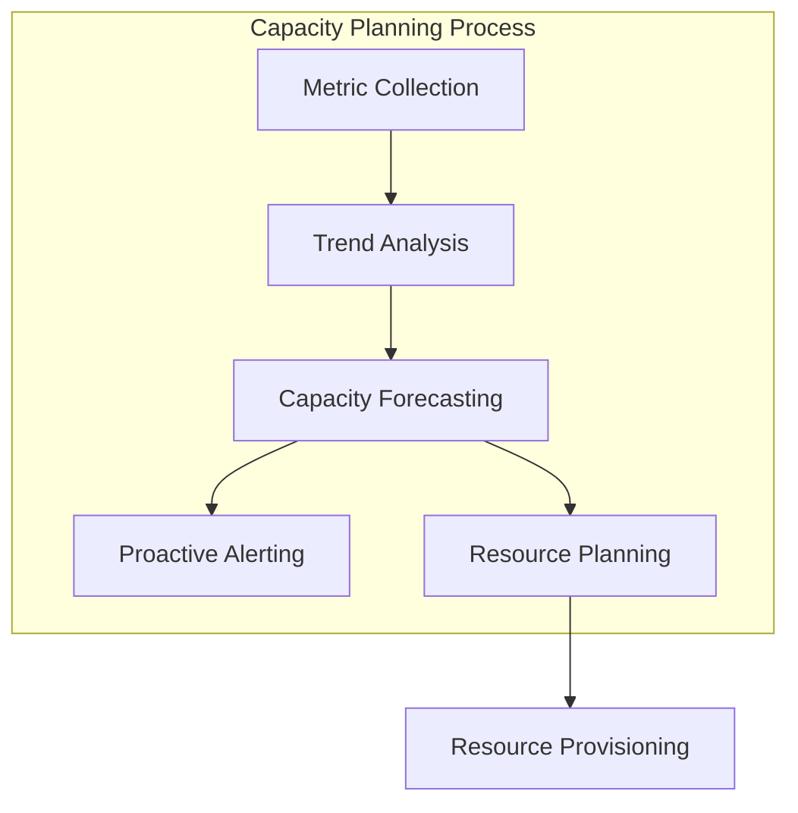
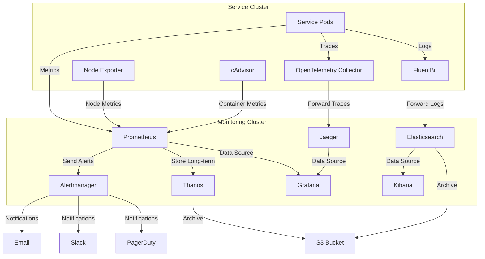

# Monitoring & Alerting

This document describes the monitoring and alerting strategy for the LLM Gateway service.

## Table of Contents

- [Monitoring Strategy](#monitoring-strategy)
- [Metrics & Telemetry](#metrics--telemetry)
- [Alerting](#alerting)
- [Dashboards](#dashboards)
- [Logging](#logging)
- [Tracing](#tracing)
- [Health Checks](#health-checks)
- [Capacity Planning](#capacity-planning)
- [Monitoring Infrastructure](#monitoring-infrastructure)

## Monitoring Strategy

The LLM Gateway implements a comprehensive monitoring strategy based on the Four Golden Signals methodology, with additional AI-specific metrics.

### Monitoring Principles

1. **Actionable Metrics**: Focus on metrics that drive actions
2. **Early Detection**: Identify issues before they impact users
3. **Correlation**: Ability to correlate events across components
4. **Drill-Down**: Progressive drill-down from high-level to detailed metrics
5. **Business Context**: Technical metrics connected to business outcomes

### Monitoring Layers



## Metrics & Telemetry

The LLM Gateway collects the following categories of metrics:

### Core Service Metrics (The Four Golden Signals)

| Metric Type | Key Metrics | Collection Method | SLO Target |
|------------|------------|-------------------|------------|
| Latency | API Response Time, LLM Request Time | Prometheus | P95 < 500ms for API, P95 < 2s for LLM |
| Traffic | Requests per Second, Bandwidth | Prometheus | N/A (Capacity planning) |
| Errors | 4xx/5xx Rates, Failed LLM Calls | Prometheus | < 0.1% for 5xx, < 1% for 4xx |
| Saturation | CPU, Memory, Connection Pool, Queue Depth | Prometheus | < 80% utilization |

### LLM-Specific Metrics

| Metric | Description | Collection Method | Target |
|--------|-------------|-------------------|--------|
| Model Performance | Response quality, token processing rate | Custom collectors | Model-dependent |
| Token Usage | Tokens used per request/response | App metrics | Optimize for cost |
| Provider Availability | Availability by provider | Synthetic checks | > 99.9% |
| Cache Hit Rate | Percentage of cached responses | Service metrics | > 80% |
| Cost per Request | Calculated cost per request type | Custom collectors | < $0.05 avg |

### Infrastructure Metrics

| Component | Key Metrics | Collection Method | Target |
|-----------|------------|-------------------|--------|
| Kubernetes Nodes | CPU, Memory, Disk, Network | Prometheus Node Exporter | < 80% utilization |
| Pods | Restarts, OOM Events, CPU/Memory | Kubernetes Metrics Server | 0 OOM kills, < 5% restarts |
| Databases | Connections, Query Performance, Replication Lag | Database Exporters | < 100ms query time, < 10s lag |
| Caching | Hit Rate, Evictions, Memory | Redis Exporter | > 85% hit rate, < 10% evictions |
| Network | Throughput, Latency, Packet Loss | VPC Flow Logs, Synthetic Tests | < 1ms internal latency, 0% packet loss |

### Business Metrics

| Metric | Description | Collection Method | Target |
|--------|-------------|-------------------|--------|
| Request Volume | Total volume by customer | Application metrics | N/A (Growth indicator) |
| Error Impact | Customer-impacting errors | Calculated from logs | < 0.01% of requests |
| Availability | Service availability by tenant | Calculated from synthetic tests | > 99.99% |
| Cost Efficiency | Cost per 1000 requests | Custom collectors | < $1 per 1000 |

## Alerting

The alerting system is designed to provide timely notifications for actionable issues while minimizing alert fatigue.

### Alerting Hierarchy



### Key Alerts

| Alert Name | Condition | Severity | Response Time | Notification Channel |
|------------|-----------|----------|--------------|---------------------|
| Service Down | Multiple endpoint failures | P1 | 5 minutes | PagerDuty + Slack + SMS |
| High Error Rate | > 1% 5xx errors for 5 min | P1 | 5 minutes | PagerDuty + Slack |
| Elevated Latency | P95 latency > 1s for 10 min | P2 | 15 minutes | PagerDuty + Slack |
| Provider Issue | Specific provider > 5% error rate | P2 | 15 minutes | PagerDuty + Slack |
| High Resource Utilization | CPU/Memory > 90% for 15 min | P3 | 30 minutes | Slack |
| Cache Performance | Hit rate < 60% for 30 min | P3 | 30 minutes | Slack |
| Quota Approaching | > 80% of provider quotas | P4 | 4 hours | Email + Slack |
| Unusual Traffic Pattern | Deviation from baseline | P4 | 4 hours | Slack |

### Alert Definitions

Alerts are defined as Prometheus Alerting Rules:

```yaml
groups:
- name: LLM-Gateway-Alerts
  rules:
  - alert: HighErrorRate
    expr: sum(rate(http_requests_total{status=~"5.."}[5m])) / sum(rate(http_requests_total[5m])) > 0.01
    for: 5m
    labels:
      severity: critical
    annotations:
      summary: "High error rate detected"
      description: "Error rate is {{ $value | humanizePercentage }} over the last 5 minutes"
```

### Incident Management Flow



## Dashboards

Operational dashboards provide visibility into system health and performance.

### Dashboard Hierarchy

1. **Executive Dashboard**: High-level service health and business metrics
2. **Service Health Dashboard**: Overall service status and SLOs
3. **Service-Specific Dashboards**: Detailed metrics for each service
4. **Infrastructure Dashboard**: Kubernetes and AWS resource metrics
5. **On-Call Dashboard**: Focused on metrics relevant during incidents

### Main Dashboard Panels

The primary service dashboard includes:

- **Traffic**: Requests per second, by endpoint and tenant
- **Error Rates**: Error percentages by type and endpoint
- **Latency**: Response time percentiles (p50, p95, p99)
- **Saturation**: Resource utilization across the system
- **Business Impact**: Affected tenants and request volumes
- **LLM Metrics**: Provider performance and availability

### Example Dashboard Layout



## Logging

The LLM Gateway implements structured logging with centralized collection.

### Log Levels and Usage

| Level | Usage | Examples | Retention |
|-------|-------|----------|-----------|
| ERROR | Service failures requiring immediate action | API crash, database connection failure | 90 days |
| WARN | Issues that don't prevent operation but require attention | Slow database query, throttling | 90 days |
| INFO | Normal operation events | Request handling, cache operations | 30 days |
| DEBUG | Detailed information for troubleshooting | Request/response details, configuration values | 7 days |
| TRACE | Extremely verbose information | Function calls, detailed logic flow | 2 days |

### Structured Log Format

All logs use structured JSON format:

```json
{
  "timestamp": "2023-05-15T14:22:33.456Z",
  "level": "INFO",
  "service": "execution-service",
  "instance": "execution-service-5d87f94df6-8nvk2",
  "traceId": "5f4e7b3c2a1e0d9f8c7b6a5e",
  "spanId": "1a2b3c4d5e6f7g8h",
  "tenantId": "tenant-123",
  "userId": "user-456",
  "message": "Prompt execution completed successfully",
  "context": {
    "promptId": "pr_7890",
    "executionTimeMs": 450,
    "provider": "openai",
    "model": "gpt-4",
    "cacheHit": false,
    "tokenCount": {
      "input": 150,
      "output": 300
    }
  }
}
```

### Log Collection Architecture



### Log Monitoring Rules

Logs are monitored for important patterns:

| Pattern | Description | Alert Severity |
|---------|-------------|----------------|
| Multiple ERROR logs in short period | Potential service degradation | P2 |
| Authentication failures | Potential security issue | P2 |
| Specific error messages (DB connection, etc.) | Infrastructure issues | P2-P3 |
| Sudden increase in log volume | Potential issue or DoS | P3 |
| LLM provider errors | Provider-side issues | P3 |

## Tracing

Distributed tracing tracks requests across different services.

### Tracing Implementation

- **Technology**: OpenTelemetry + Jaeger
- **Integration**: Auto-instrumentation for services
- **Sampling Rate**: 100% for errors, 10% for normal traffic
- **Retention**: 7 days for traces

### Key Spans Tracked

| Service | Spans | Attributes |
|---------|-------|------------|
| API Gateway | Request handling, authentication | Endpoint, method, status code |
| Execution Service | Provider selection, prompt processing, response handling | Prompt size, model, latency |
| Provider Service | External API calls | Provider, model, request size, response size |
| Cache Service | Cache lookup, store operations | Cache key, hit/miss, size |
| Database Services | Database operations | Query type, table, latency |

### Trace Example

```mermaid
gantt
    title Request Execution Trace
    dateFormat  SSS
    axisFormat %L ms
    
    API Request Processing      :a1, 000, 030
    Authentication              :a2, 030, 050
    Routing                     :a3, 050, 055
    Prompt Template Retrieval   :b1, 055, 070
    Prompt Parameter Processing :b2, 070, 080
    Cache Lookup                :c1, 080, 090
    Provider Selection          :c2, 090, 100
    LLM Request Preparation     :c3, 100, 110
    LLM API Call                :c4, 110, 550
    Response Processing         :c5, 550, 570
    Cache Update                :c6, 570, 580
    Response Formatting         :d1, 580, 590
    Response Delivery           :d2, 590, 600
```



## Health Checks

Health checks provide status information about service components.

### Health Check Types

| Type | Purpose | Frequency | Endpoint |
|------|---------|-----------|----------|
| Liveness | Determines if service is running | 10 seconds | `/health/liveness` |
| Readiness | Determines if service can handle requests | 30 seconds | `/health/readiness` |
| Startup | Determines if service has completed startup | Initial | `/health/startup` |
| Deep | Comprehensive system health check | 5 minutes | `/health/deep` |

### Health Check Implementation

Each service exposes standardized health check endpoints:

```yaml
# Kubernetes Health Check Configuration
livenessProbe:
  httpGet:
    path: /health/liveness
    port: 8080
  initialDelaySeconds: 10
  periodSeconds: 10
  timeoutSeconds: 2
  failureThreshold: 3

readinessProbe:
  httpGet:
    path: /health/readiness
    port: 8080
  initialDelaySeconds: 30
  periodSeconds: 30
  timeoutSeconds: 5
  failureThreshold: 2

startupProbe:
  httpGet:
    path: /health/startup
    port: 8080
  initialDelaySeconds: 5
  periodSeconds: 5
  failureThreshold: 12
  timeoutSeconds: 5
```

### Health Check Response Format

Health check endpoints return standardized JSON responses:

```json
{
  "status": "healthy",
  "version": "1.2.3",
  "checks": [
    {
      "component": "api",
      "status": "healthy",
      "time": "2023-05-15T14:22:33.456Z"
    },
    {
      "component": "database",
      "status": "healthy",
      "time": "2023-05-15T14:22:33.400Z",
      "metrics": {
        "connectionCount": 5,
        "latencyMs": 3
      }
    },
    {
      "component": "cache",
      "status": "healthy",
      "time": "2023-05-15T14:22:33.420Z",
      "metrics": {
        "hitRate": 0.85
      }
    }
  ]
}
```

## Capacity Planning

Monitoring data drives capacity planning decisions.

### Key Capacity Metrics

| Resource | Key Metrics | Growth Indicators | Scaling Trigger |
|----------|------------|-------------------|-----------------|
| Kubernetes Nodes | CPU, Memory, Pod Density | Sustained >70% utilization | >80% utilization for 30 min |
| Database | Connections, CPU, Storage, IOPS | Query latency increasing | >70% utilization for 15 min |
| Cache | Memory usage, Eviction rate | Cache hit rate decreasing | >80% memory usage |
| Network | Throughput, Connection count | Increasing latency | >70% of capacity |

### Capacity Forecasting



## Monitoring Infrastructure

The monitoring infrastructure itself is deployed as code and monitored for reliability.

### Monitoring Stack

| Component | Technology | Purpose | Scaling |
|-----------|------------|---------|---------|
| Metrics Collection | Prometheus | Collect, store, and query metrics | Federated clusters |
| Metric Storage | Thanos | Long-term metric storage | S3 bucket storage |
| Visualization | Grafana | Dashboards and visualization | Clustered deployment |
| Alerting | Alertmanager | Alert routing and management | Clustered with HA |
| Log Collection | FluentBit | Log collection and forwarding | DaemonSet on each node |
| Log Storage | Elasticsearch | Log storage and analysis | Clustered with sharding |
| Log Visualization | Kibana | Log dashboards and search | Load-balanced instances |
| Tracing | Jaeger | Distributed tracing collection | Clustered with Cassandra |

### Monitoring Architecture



### Monitoring for the Monitoring Stack

The monitoring infrastructure itself is monitored using:

- Meta-monitoring with a separate basic Prometheus instance
- Regular health checks on all components
- Alerting for monitoring infrastructure failures
- Automated recovery procedures for common issues

---

**Previous**: [Configuration & Secrets Management](./configuration-secrets.md) | **Next**: [Runbook / Operations Playbook](./runbook.md)