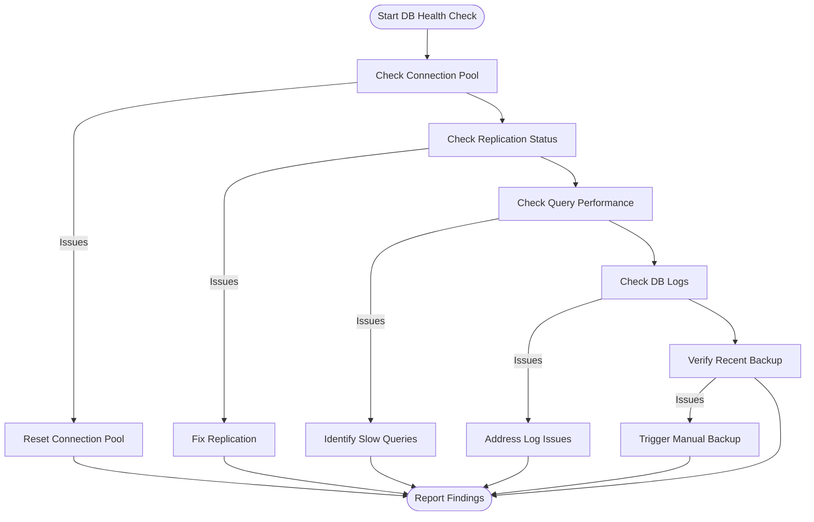
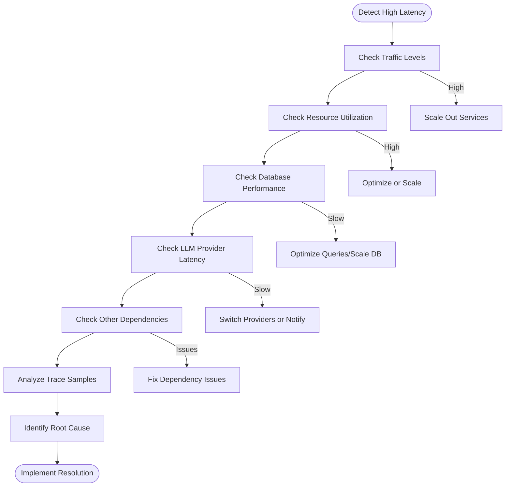
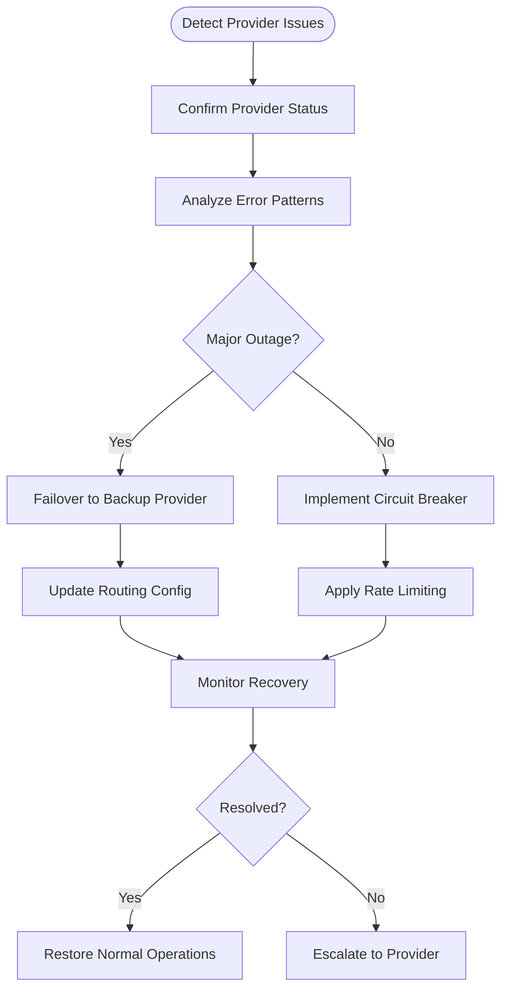
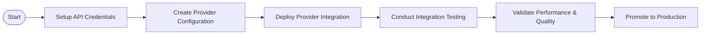

# Runbook / Operations Playbook

This runbook provides step-by-step procedures for common operational tasks and troubleshooting scenarios for the LLM Gateway service.

## Table of Contents

- [Common Operations](#common-operations)
  - [Deployment Operations](#deployment-operations)
  - [Scaling Operations](#scaling-operations)
  - [Maintenance Operations](#maintenance-operations)
- [Health Checks](#health-checks)
- [Troubleshooting](#troubleshooting)
  - [Service Degradation](#service-degradation)
  - [External Dependency Issues](#external-dependency-issues)
  - [Infrastructure Issues](#infrastructure-issues)
  - [Common Error Scenarios](#common-error-scenarios)
- [LLM Provider Management](#llm-provider-management)
- [Operational Security](#operational-security)
- [Change Management](#change-management)

## Common Operations

### Deployment Operations

#### Deploying a New Version

**When to use**: Scheduled release of a new LLM Gateway version

**Prerequisites**:
- Release has been approved by Change Advisory Board
- All tests pass in staging environment
- Deployment window is active (Tuesday/Thursday 10am-2pm ET)

**Procedure**:

1. **Verify Release Readiness**
   ```bash
   # Check if release branch is ready
   git checkout release/v1.2.3
   git pull
   
   # Verify release has passed CI
   gh run list --branch release/v1.2.3 --status success
   ```

2. **Create Deployment PR**
   ```bash
   gh pr create --title "Deploy v1.2.3 to Production" --body "
   # Deployment PR for v1.2.3
   
   ## Changes
   - Feature A
   - Bugfix B
   - Performance improvement C
   
   ## Rollback Plan
   Standard rollback procedure applies.
   
   ## Testing
   All tests pass in staging.
   " --base main --head release/v1.2.3
   ```

3. **Trigger Deployment**
   ```bash
   # After PR is approved and merged
   gh workflow run deploy-production.yml --ref main
   ```

4. **Monitor Deployment**
   - Watch deployment in CI/CD dashboard
   - Monitor metrics during and after deployment
   - Check logs for any errors or warnings

5. **Verify Deployment**
   ```bash
   # Verify deployment status
   kubectl get deployments -n llm-gateway
   
   # Verify service health
   curl -X GET https://api.example.com/health/deep
   ```

#### Rolling Back a Deployment

**When to use**: When a deployment causes service degradation or outage

**Prerequisites**:
- Confirmed that issues are caused by the recent deployment
- Decision made to roll back rather than fix forward

**Procedure**:

1. **Initiate Rollback**
   ```bash
   # Option 1: Via GitHub Actions
   gh workflow run rollback-production.yml -f version=v1.2.2
   
   # Option 2: Manual Kubernetes rollback
   kubectl rollout undo deployment/api-service -n llm-gateway
   kubectl rollout undo deployment/execution-service -n llm-gateway
   kubectl rollout undo deployment/prompt-service -n llm-gateway
   ```

2. **Verify Database Compatibility**
   - Check if DB migrations need to be reversed
   - If needed, execute downgrade migrations:
   ```bash
   kubectl exec -it $(kubectl get pods -n llm-gateway -l app=db-migration -o jsonpath='{.items[0].metadata.name}') -n llm-gateway -- ./migrate down -version=v1.2.2
   ```

3. **Monitor Rollback**
   - Watch rollback process in dashboard
   - Monitor metrics for recovery
   - Check logs for any errors

4. **Communicate Status**
   - Update status page 
   - Notify stakeholders of rollback
   - Create incident ticket if needed

5. **Post-Rollback Analysis**
   - Investigate what caused the issues
   - Update deployment procedures if needed
   - Schedule post-mortem meeting

### Scaling Operations

#### Scaling Services Horizontally

**When to use**: When experiencing high load or in preparation for traffic increase

**Prerequisites**:
- Monitoring shows increased resource utilization
- Sufficient cluster capacity is available

**Procedure**:

1. **Analyze Current Utilization**
   ```bash
   # Check current resource usage
   kubectl top pods -n llm-gateway
   
   # Check HPA status
   kubectl get hpa -n llm-gateway
   ```

2. **Adjust Horizontal Pod Autoscaler**
   ```bash
   # Increase minimum replicas
   kubectl patch hpa api-service -n llm-gateway --patch '{"spec":{"minReplicas": 5}}'
   
   # Increase maximum replicas
   kubectl patch hpa execution-service -n llm-gateway --patch '{"spec":{"maxReplicas": 20}}'
   ```

3. **Verify Scaling**
   ```bash
   # Watch pods being created
   kubectl get pods -n llm-gateway -w
   
   # Check distribution across nodes
   kubectl get pods -n llm-gateway -o wide
   ```

4. **Monitor Performance**
   - Watch latency metrics during scaling
   - Check database connection pool utilization
   - Verify cache performance with new instances

5. **Adjust Related Resources**
   - Scale related services if needed
   - Check if database connections need to be adjusted
   - Update cache configuration if necessary

#### Scaling Database Resources

**When to use**: When database performance is degrading under load

**Prerequisites**:
- Monitoring shows increased database latency or resource utilization
- Approval for potential brief connection interruption

**Procedure**:

1. **Analyze Database Metrics**
   ```bash
   # Check current metrics
   aws cloudwatch get-metric-data \
     --metric-data-queries file://db-metric-queries.json \
     --start-time 2023-01-01T00:00:00Z \
     --end-time 2023-01-02T00:00:00Z
   ```

2. **Prepare for Scaling Operation**
   - Notify team of potential brief interruption
   - Ensure applications have proper retry logic

3. **Scale Database Instance**
   ```bash
   # Through AWS CLI
   aws rds modify-db-instance \
     --db-instance-identifier llm-gateway-db \
     --db-instance-class db.r5.2xlarge \
     --apply-immediately
   ```

4. **Monitor Scaling Operation**
   - Watch RDS events for completion
   - Monitor application logs for connection errors
   - Check latency metrics as scaling completes

5. **Verify Successful Scaling**
   ```bash
   # Check instance status
   aws rds describe-db-instances \
     --db-instance-identifier llm-gateway-db \
     --query 'DBInstances[0].DBInstanceStatus'
   ```

### Maintenance Operations

#### Database Maintenance

**When to use**: Regular database maintenance or applying patches

**Prerequisites**:
- Maintenance window approved
- Read replicas are up-to-date
- Backups are current

**Procedure**:

1. **Prepare for Maintenance**
   ```bash
   # Check replica lag
   aws rds describe-db-instances \
     --db-instance-identifier llm-gateway-db-replica \
     --query 'DBInstances[0].ReplicaLag'
   
   # Take final snapshot before maintenance
   aws rds create-db-snapshot \
     --db-snapshot-identifier llm-gateway-pre-maintenance-$(date +%Y%m%d) \
     --db-instance-identifier llm-gateway-db
   ```

2. **Notify Team and Set Expectations**
   - Send maintenance notification
   - Set read-only mode if necessary:
   ```bash
   kubectl apply -f maintenance/read-only-mode.yaml
   ```

3. **Perform Maintenance**
   ```bash
   # Apply pending updates
   aws rds apply-pending-maintenance-action \
     --resource-identifier arn:aws:rds:us-east-1:123456789012:db:llm-gateway-db \
     --apply-action system-update \
     --opt-in-type immediate
   ```

4. **Monitor Maintenance**
   - Watch RDS events
   - Check application logs for errors
   - Monitor metrics for abnormalities

5. **Verify and Restore Full Service**
   ```bash
   # Verify database is available
   aws rds describe-db-instances \
     --db-instance-identifier llm-gateway-db \
     --query 'DBInstances[0].DBInstanceStatus'
   
   # Remove read-only mode if applied
   kubectl delete -f maintenance/read-only-mode.yaml
   ```

## Health Checks

### System Health Verification

**When to use**: As part of regular health checks or when investigating issues

**Procedure**:

1. **Check Service Health**
   ```bash
   # Get overall service health
   curl -X GET https://api.example.com/health/deep
   
   # Check individual components
   for component in api-service execution-service prompt-service cache-service; do
     echo "Checking $component..."
     kubectl exec -it $(kubectl get pods -n llm-gateway -l app=$component -o jsonpath='{.items[0].metadata.name}') -n llm-gateway -- curl localhost:8080/health
   done
   ```

2. **Verify Infrastructure Health**
   ```bash
   # Check node status
   kubectl get nodes
   
   # Check pod status
   kubectl get pods -n llm-gateway
   
   # Check persistent volumes
   kubectl get pv,pvc -n llm-gateway
   ```

3. **Verify External Dependencies**
   ```bash
   # Check database connectivity
   kubectl exec -it $(kubectl get pods -n llm-gateway -l app=api-service -o jsonpath='{.items[0].metadata.name}') -n llm-gateway -- curl localhost:8080/health/dependencies?component=database
   
   # Check LLM provider connectivity
   kubectl exec -it $(kubectl get pods -n llm-gateway -l app=execution-service -o jsonpath='{.items[0].metadata.name}') -n llm-gateway -- curl localhost:8080/health/dependencies?component=llm-providers
   ```

4. **Run Synthetic Tests**
   ```bash
   # Execute basic prompt test
   curl -X POST https://api.example.com/v1/tenants/test/llm/execute \
     -H "Authorization: Bearer $TEST_TOKEN" \
     -H "Content-Type: application/json" \
     -d '{"prompt": "This is a test", "model": "gpt-3.5-turbo"}'
   ```

5. **Check Metrics and Logs**
   - Review current metrics in monitoring dashboard
   - Check recent logs for errors or warnings
   - Verify alerting system is functioning

### Database Health Check

**When to use**: When monitoring indicates potential database issues

**Procedure**:



1. **Check Database Connectivity**
   ```bash
   # Check connection pool status
   kubectl exec -it $(kubectl get pods -n llm-gateway -l app=api-service -o jsonpath='{.items[0].metadata.name}') -n llm-gateway -- curl localhost:8080/actuator/metrics/hikaricp.connections
   
   # Test direct connection
   kubectl exec -it db-util -n llm-gateway -- psql -h $DB_HOST -U $DB_USER -c "SELECT 1"
   ```

2. **Check Replication Status (if applicable)**
   ```bash
   # For PostgreSQL
   kubectl exec -it db-util -n llm-gateway -- psql -h $DB_HOST -U $DB_USER -c "SELECT * FROM pg_stat_replication"
   ```

3. **Check Query Performance**
   ```bash
   # Check for slow queries
   kubectl exec -it db-util -n llm-gateway -- psql -h $DB_HOST -U $DB_USER -c "SELECT query, calls, total_time, mean_time FROM pg_stat_statements ORDER BY mean_time DESC LIMIT 10"
   ```

4. **Check Database Logs**
   ```bash
   # Get recent database logs
   aws rds download-db-log-file-portion \
     --db-instance-identifier llm-gateway-db \
     --log-file-name postgresql.log \
     --output text
   ```

5. **Verify Recent Backup**
   ```bash
   # Check recent automated backups
   aws rds describe-db-snapshots \
     --db-instance-identifier llm-gateway-db \
     --query 'sort_by(DBSnapshots, &SnapshotCreateTime)[-5:]'
   ```

## Troubleshooting

### Service Degradation

#### High Latency Investigation

**When to use**: When monitoring shows increased API response times

**Procedure**:



1. **Check Traffic and Load**
   ```bash
   # Check current traffic levels
   kubectl exec -it $(kubectl get pods -n llm-gateway -l app=prometheus -o jsonpath='{.items[0].metadata.name}') -n monitoring -- curl -s 'localhost:9090/api/v1/query?query=sum(rate(http_requests_total{namespace="llm-gateway"}[5m]))%20by%20(service)'
   ```

2. **Check Resource Utilization**
   ```bash
   # Check pod resource usage
   kubectl top pods -n llm-gateway
   
   # Check node resource usage
   kubectl top nodes
   ```

3. **Analyze Latency Breakdown**
   ```bash
   # Get latency percentiles
   kubectl exec -it $(kubectl get pods -n llm-gateway -l app=prometheus -o jsonpath='{.items[0].metadata.name}') -n monitoring -- curl -s 'localhost:9090/api/v1/query?query=histogram_quantile(0.95,sum(rate(http_request_duration_seconds_bucket{namespace="llm-gateway"}[5m]))%20by%20(service,%20le))'
   ```

4. **Check Database Performance**
   ```bash
   # Get database latency metrics
   kubectl exec -it $(kubectl get pods -n llm-gateway -l app=prometheus -o jsonpath='{.items[0].metadata.name}') -n monitoring -- curl -s 'localhost:9090/api/v1/query?query=histogram_quantile(0.95,sum(rate(db_query_duration_seconds_bucket{namespace="llm-gateway"}[5m]))%20by%20(query_type,%20le))'
   ```

5. **Check LLM Provider Performance**
   ```bash
   # Get LLM provider latency
   kubectl exec -it $(kubectl get pods -n llm-gateway -l app=prometheus -o jsonpath='{.items[0].metadata.name}') -n monitoring -- curl -s 'localhost:9090/api/v1/query?query=histogram_quantile(0.95,sum(rate(llm_request_duration_seconds_bucket{namespace="llm-gateway"}[5m]))%20by%20(provider,%20le))'
   ```

6. **Analyze Distributed Traces**
   - Access Jaeger UI to view trace samples
   - Identify slow spans in the request flow
   - Look for patterns in slow requests

7. **Implement Resolution**
   - Scale out services if under load
   - Optimize slow code paths
   - Address database issues
   - Consider switching LLM providers if needed
   - Adjust caching strategies

#### High Error Rate Troubleshooting

**When to use**: When monitoring shows increased error rates

**Procedure**:

1. **Identify Error Types and Sources**
   ```bash
   # Get error rate by endpoint and status code
   kubectl exec -it $(kubectl get pods -n llm-gateway -l app=prometheus -o jsonpath='{.items[0].metadata.name}') -n monitoring -- curl -s 'localhost:9090/api/v1/query?query=sum(rate(http_requests_total{namespace="llm-gateway",status_code=~"5.."}[5m]))%20by%20(service,%20endpoint,%20status_code)'
   ```

2. **Check Recent Deployments or Changes**
   ```bash
   # Get recent deployments
   kubectl rollout history deployment -n llm-gateway
   
   # Get recent configuration changes
   kubectl get configmaps -n llm-gateway -o yaml > current-configmaps.yaml
   diff saved-configmaps.yaml current-configmaps.yaml
   ```

3. **Examine Application Logs**
   ```bash
   # Get logs from affected services
   kubectl logs -n llm-gateway -l app=api-service --tail=100
   
   # Search for specific error patterns
   kubectl logs -n llm-gateway -l app=execution-service | grep -i error
   ```

4. **Check External Dependencies**
   ```bash
   # Check LLM provider status
   curl -X GET https://api.example.com/health/dependencies?component=llm-providers
   
   # Check database status
   curl -X GET https://api.example.com/health/dependencies?component=database
   ```

5. **Take Mitigation Actions**
   - Rollback recent changes if needed
   - Scale resources if under pressure
   - Implement circuit breakers for failing dependencies
   - Switch to backup providers if primary is failing

### External Dependency Issues

#### LLM Provider Outage

**When to use**: When a specific LLM provider is experiencing issues

**Procedure**:



1. **Confirm Provider Status**
   ```bash
   # Check provider error rates
   kubectl exec -it $(kubectl get pods -n llm-gateway -l app=prometheus -o jsonpath='{.items[0].metadata.name}') -n monitoring -- curl -s 'localhost:9090/api/v1/query?query=sum(rate(llm_request_errors_total{namespace="llm-gateway"}[5m]))%20by%20(provider)'
   
   # Check provider status page (if available)
   curl -s https://status.openai.com/api/v2/status.json
   ```

2. **Analyze Error Patterns**
   ```bash
   # Get error details from logs
   kubectl logs -n llm-gateway -l app=execution-service | grep -i "provider=openai.*error"
   ```

3. **Implement Circuit Breaker**
   ```bash
   # Apply circuit breaker configuration
   kubectl apply -f operations/circuit-breaker-openai.yaml
   ```

4. **Failover to Backup Provider**
   ```bash
   # Update routing configuration
   kubectl apply -f operations/provider-failover.yaml
   ```

5. **Adjust Rate Limiting**
   ```bash
   # Reduce traffic to affected provider
   kubectl apply -f operations/provider-rate-limit.yaml
   ```

6. **Monitor Recovery**
   - Watch error rates and latency
   - Monitor backup provider performance
   - Track provider status announcements

7. **Restore Normal Operations**
   ```bash
   # When provider recovers, remove temporary configurations
   kubectl delete -f operations/provider-failover.yaml
   kubectl delete -f operations/circuit-breaker-openai.yaml
   kubectl delete -f operations/provider-rate-limit.yaml
   ```

#### Database Connectivity Issues

**When to use**: When experiencing database connection problems

**Procedure**:

1. **Verify Database Status**
   ```bash
   # Check RDS status
   aws rds describe-db-instances \
     --db-instance-identifier llm-gateway-db \
     --query 'DBInstances[0].DBInstanceStatus'
   
   # Check connection from utility pod
   kubectl exec -it db-util -n llm-gateway -- psql -h $DB_HOST -U $DB_USER -c "SELECT 1"
   ```

2. **Check Connection Pooling**
   ```bash
   # Check connection pool metrics
   kubectl exec -it $(kubectl get pods -n llm-gateway -l app=api-service -o jsonpath='{.items[0].metadata.name}') -n llm-gateway -- curl localhost:8080/actuator/metrics/hikaricp.connections
   ```

3. **Verify Network Connectivity**
   ```bash
   # Check network policies
   kubectl get networkpolicies -n llm-gateway
   
   # Check security groups
   aws ec2 describe-security-groups \
     --group-ids $DB_SECURITY_GROUP \
     --query 'SecurityGroups[0].IpPermissions'
   ```

4. **Reset Connection Pools if Needed**
   ```bash
   # Apply connection pool reset
   kubectl apply -f operations/reset-db-connections.yaml
   ```

5. **Check for Database Resource Constraints**
   ```bash
   # Check CPU and memory metrics
   aws cloudwatch get-metric-data \
     --metric-data-queries file://db-resource-metrics.json \
     --start-time 2023-01-01T00:00:00Z \
     --end-time 2023-01-02T00:00:00Z
   ```

6. **Implement Remediation**
   - Restart services with connection issues
   - Scale database if resource-constrained
   - Adjust connection pool settings
   - Implement circuit breaker for persistent issues

### Infrastructure Issues

#### Kubernetes Node Failures

**When to use**: When Kubernetes nodes are experiencing issues

**Procedure**:

1. **Identify Problem Nodes**
   ```bash
   # Check node status
   kubectl get nodes
   
   # Get node conditions
   kubectl describe nodes | grep -A5 Conditions
   
   # Check node events
   kubectl get events --field-selector involvedObject.kind=Node
   ```

2. **Check Pods on Affected Nodes**
   ```bash
   # List pods on specific node
   kubectl get pods -A -o wide --field-selector spec.nodeName=node-name
   ```

3. **Cordon Problematic Nodes**
   ```bash
   # Prevent new pods from being scheduled
   kubectl cordon node-name
   ```

4. **Drain Pods if Necessary**
   ```bash
   # Safely evict pods
   kubectl drain node-name --ignore-daemonsets --delete-local-data
   ```

5. **Investigate Node Issues**
   ```bash
   # Check node logs
   aws ec2 get-console-output --instance-id i-1234567890abcdef0
   
   # Check CloudWatch metrics
   aws cloudwatch get-metric-data \
     --metric-data-queries file://node-metrics.json \
     --start-time 2023-01-01T00:00:00Z \
     --end-time 2023-01-02T00:00:00Z
   ```

6. **Replace or Repair Node**
   ```bash
   # For managed node groups
   aws eks update-nodegroup-version \
     --cluster-name llm-gateway-cluster \
     --nodegroup-name workers
   
   # For self-managed nodes
   aws ec2 terminate-instances --instance-ids i-1234567890abcdef0
   ```

7. **Verify Recovery**
   ```bash
   # Check new node joins the cluster
   kubectl get nodes -w
   
   # Check pod distribution
   kubectl get pods -n llm-gateway -o wide
   ```

#### Network Connectivity Issues

**When to use**: When experiencing network communication problems

**Procedure**:

1. **Verify Service Connectivity**
   ```bash
   # Check service endpoints
   kubectl get endpoints -n llm-gateway
   
   # Test service DNS resolution
   kubectl exec -it network-util -n llm-gateway -- nslookup api-service.llm-gateway.svc.cluster.local
   ```

2. **Check Network Policies**
   ```bash
   # List network policies
   kubectl get networkpolicies -n llm-gateway -o yaml
   
   # Temporarily disable restrictive policies for testing
   kubectl annotate networkpolicy restrictive-policy -n llm-gateway network.kubernetes.io/policy-disabled=true
   ```

3. **Test Pod-to-Pod Communication**
   ```bash
   # Run connectivity test
   kubectl exec -it network-util -n llm-gateway -- curl api-service.llm-gateway.svc.cluster.local:8080/health
   ```

4. **Check AWS Network Components**
   ```bash
   # Verify VPC components
   aws ec2 describe-nat-gateways --filter Name=vpc-id,Values=$VPC_ID
   aws ec2 describe-route-tables --filter Name=vpc-id,Values=$VPC_ID
   ```

5. **Implement Resolution**
   - Update network policies if too restrictive
   - Fix DNS configuration issues
   - Repair AWS networking components
   - Update service definitions if needed

### Common Error Scenarios

#### High Token Usage Costs

**When to use**: When monitoring shows unexpected token usage increases

**Procedure**:

1. **Analyze Token Usage Patterns**
   ```bash
   # Get token usage by tenant and endpoint
   kubectl exec -it $(kubectl get pods -n llm-gateway -l app=prometheus -o jsonpath='{.items[0].metadata.name}') -n monitoring -- curl -s 'localhost:9090/api/v1/query?query=sum(rate(llm_token_usage_total{namespace="llm-gateway"}[24h]))%20by%20(tenant_id,%20endpoint)'
   
   # Check changes over time
   kubectl exec -it $(kubectl get pods -n llm-gateway -l app=prometheus -o jsonpath='{.items[0].metadata.name}') -n monitoring -- curl -s 'localhost:9090/api/v1/query_range?query=sum(rate(llm_token_usage_total{namespace="llm-gateway"}[1h]))&start=2023-01-01T00:00:00Z&end=2023-01-02T00:00:00Z&step=1h'
   ```

2. **Identify High-Usage Tenants or Services**
   ```bash
   # Find top consumers
   kubectl exec -it $(kubectl get pods -n llm-gateway -l app=prometheus -o jsonpath='{.items[0].metadata.name}') -n monitoring -- curl -s 'localhost:9090/api/v1/query?query=topk(5,sum(llm_token_usage_total{namespace="llm-gateway"})%20by%20(tenant_id))'
   ```

3. **Check for Token Usage Anomalies**
   ```bash
   # Look for unusual patterns
   kubectl logs -n llm-gateway -l app=analytics-service | grep "token_usage_anomaly"
   ```

4. **Implement Mitigation**
   ```bash
   # Apply or update tenant quotas
   kubectl apply -f operations/update-tenant-quotas.yaml
   
   # Enable more aggressive caching
   kubectl apply -f operations/enhance-caching.yaml
   ```

5. **Optimize Prompt Templates**
   - Review and optimize verbose prompts
   - Implement prompt compression techniques
   - Use more efficient parameters

#### Cache Performance Issues

**When to use**: When cache hit rate drops significantly

**Procedure**:

1. **Analyze Cache Metrics**
   ```bash
   # Get cache hit rate
   kubectl exec -it $(kubectl get pods -n llm-gateway -l app=prometheus -o jsonpath='{.items[0].metadata.name}') -n monitoring -- curl -s 'localhost:9090/api/v1/query?query=sum(rate(cache_hits_total{namespace="llm-gateway"}[5m]))%20/%20sum(rate(cache_requests_total{namespace="llm-gateway"}[5m]))'
   
   # Check cache memory usage
   kubectl exec -it $(kubectl get pods -n llm-gateway -l app=prometheus -o jsonpath='{.items[0].metadata.name}') -n monitoring -- curl -s 'localhost:9090/api/v1/query?query=sum(redis_memory_used_bytes{namespace="llm-gateway"})%20/%20sum(redis_memory_max_bytes{namespace="llm-gateway"})'
   ```

2. **Check for Cache Evictions**
   ```bash
   # Get eviction metrics
   kubectl exec -it $(kubectl get pods -n llm-gateway -l app=prometheus -o jsonpath='{.items[0].metadata.name}') -n monitoring -- curl -s 'localhost:9090/api/v1/query?query=rate(redis_evicted_keys_total{namespace="llm-gateway"}[5m])'
   ```

3. **Inspect Cache Configuration**
   ```bash
   # Get current config
   kubectl exec -it $(kubectl get pods -n llm-gateway -l app=redis -o jsonpath='{.items[0].metadata.name}') -n llm-gateway -- redis-cli CONFIG GET maxmemory-policy
   ```

4. **Implement Improvements**
   ```bash
   # Update cache configuration
   kubectl apply -f operations/update-cache-config.yaml
   
   # Scale cache resources
   kubectl apply -f operations/scale-cache.yaml
   ```

5. **Monitor Recovery**
   - Watch hit rate trends
   - Check cache latency
   - Monitor memory usage

## LLM Provider Management

### Adding a New LLM Provider

**When to use**: When integrating a new LLM service provider

**Procedure**:



1. **Store Provider Credentials**
   ```bash
   # Create secret in Secrets Manager
   aws secretsmanager create-secret \
     --name llm-gateway/providers/new-provider-api-key \
     --secret-string '{"api_key":"sk-...","organization_id":"org-..."}'
   ```

2. **Create Provider Configuration**
   ```bash
   # Apply configuration
   kubectl apply -f providers/new-provider-config.yaml
   ```

3. **Deploy Provider Integration**
   ```bash
   # Apply updated service configuration
   kubectl apply -f providers/deploy-provider-integration.yaml
   ```

4. **Test Provider Integration**
   ```bash
   # Run integration tests
   kubectl exec -it $(kubectl get pods -n llm-gateway -l app=test-runner -o jsonpath='{.items[0].metadata.name}') -n llm-gateway -- pytest tests/providers/test_new_provider.py
   ```

5. **Validate Performance**
   - Run benchmark tests
   - Compare latency and token efficiency
   - Evaluate response quality

6. **Enable in Production**
   ```bash
   # Update routing configuration to include new provider
   kubectl apply -f providers/update-routing-config.yaml
   ```

### Managing Provider Quotas and Rate Limits

**When to use**: When configuring or adjusting provider usage limits

**Procedure**:

1. **Review Current Usage and Limits**
   ```bash
   # Get current usage metrics
   kubectl exec -it $(kubectl get pods -n llm-gateway -l app=prometheus -o jsonpath='{.items[0].metadata.name}') -n monitoring -- curl -s 'localhost:9090/api/v1/query?query=sum(rate(llm_request_total{namespace="llm-gateway"}[24h]))%20by%20(provider)'
   ```

2. **Configure Provider Rate Limits**
   ```bash
   # Apply or update rate limits
   kubectl apply -f providers/update-provider-rate-limits.yaml
   ```

3. **Set Up Usage Alerts**
   ```bash
   # Configure alerts for approaching limits
   kubectl apply -f providers/quota-alerts.yaml
   ```

4. **Implement Token Budgeting**
   ```bash
   # Apply token budget configurations
   kubectl apply -f providers/token-budgets.yaml
   ```

5. **Monitor Usage**
   - Track usage against quota
   - Watch for throttling events
   - Monitor cost metrics

## Operational Security

### Security Incident Response

**When to use**: When responding to potential security incidents

**Procedure**:

1. **Initial Assessment**
   ```bash
   # Check for unauthorized access attempts
   kubectl logs -n llm-gateway -l app=api-gateway | grep -i "unauthorized"
   
   # Check for unusual API usage patterns
   kubectl exec -it $(kubectl get pods -n llm-gateway -l app=prometheus -o jsonpath='{.items[0].metadata.name}') -n monitoring -- curl -s 'localhost:9090/api/v1/query?query=sum(rate(http_requests_total{namespace="llm-gateway",status_code="401"}[1h]))%20by%20(client_ip)'
   ```

2. **Contain the Incident**
   ```bash
   # Block suspicious IPs if necessary
   kubectl apply -f security/block-suspicious-ips.yaml
   
   # Revoke compromised credentials
   aws secretsmanager update-secret-version-stage \
     --secret-id llm-gateway/auth/service-credentials \
     --version-stage AWSCURRENT \
     --move-to-version-id previous-version-id
   ```

3. **Investigate the Scope**
   ```bash
   # Review audit logs
   aws cloudwatch filter-log-events \
     --log-group-name /aws/eks/llm-gateway/auth-logs \
     --filter-pattern '{ $.level = "ERROR" || $.level = "WARN" }'
   ```

4. **Document and Report**
   - Create incident ticket
   - Document timeline and actions taken
   - Notify security team

5. **Remediate and Recover**
   ```bash
   # Apply security patches if needed
   kubectl apply -f security/patches/
   
   # Rotate affected credentials
   ./scripts/rotate-credentials.sh
   ```

## Change Management

### Configuration Changes

**When to use**: When making configuration changes to production environment

**Procedure**:

1. **Create Configuration Change Plan**
   - Document current and proposed configuration
   - Assess impact and risk
   - Create rollback plan

2. **Test in Lower Environment**
   ```bash
   # Apply change to staging
   kubectl apply -f config/new-cache-config.yaml -n llm-gateway-staging
   
   # Verify functionality
   ./scripts/test-configuration.sh -e staging
   ```

3. **Get Approval**
   - Submit change request
   - Get approval from Change Advisory Board
   - Schedule change window

4. **Apply Change**
   ```bash
   # Apply to production
   kubectl apply -f config/new-cache-config.yaml -n llm-gateway
   ```

5. **Monitor Impact**
   ```bash
   # Watch related metrics
   kubectl exec -it $(kubectl get pods -n llm-gateway -l app=prometheus -o jsonpath='{.items[0].metadata.name}') -n monitoring -- curl -s 'localhost:9090/api/v1/query_range?query=cache_hit_ratio&start=2023-01-01T00:00:00Z&end=2023-01-02T00:00:00Z&step=5m'
   ```

6. **Document Results**
   - Update configuration documentation
   - Update runbook if procedures changed
   - Close change request with results

---

**Previous**: [Monitoring & Alerting](./monitoring-alerting.md) | **Next**: [Disaster Recovery & Backup Strategy](./disaster-recovery.md)