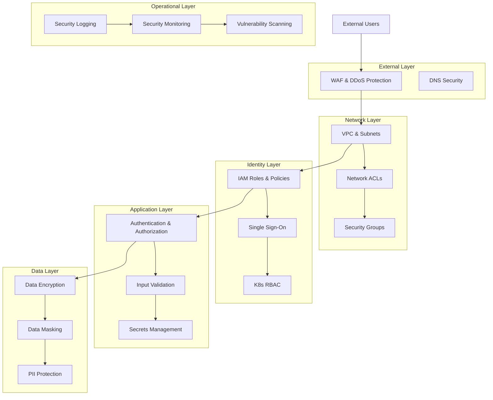
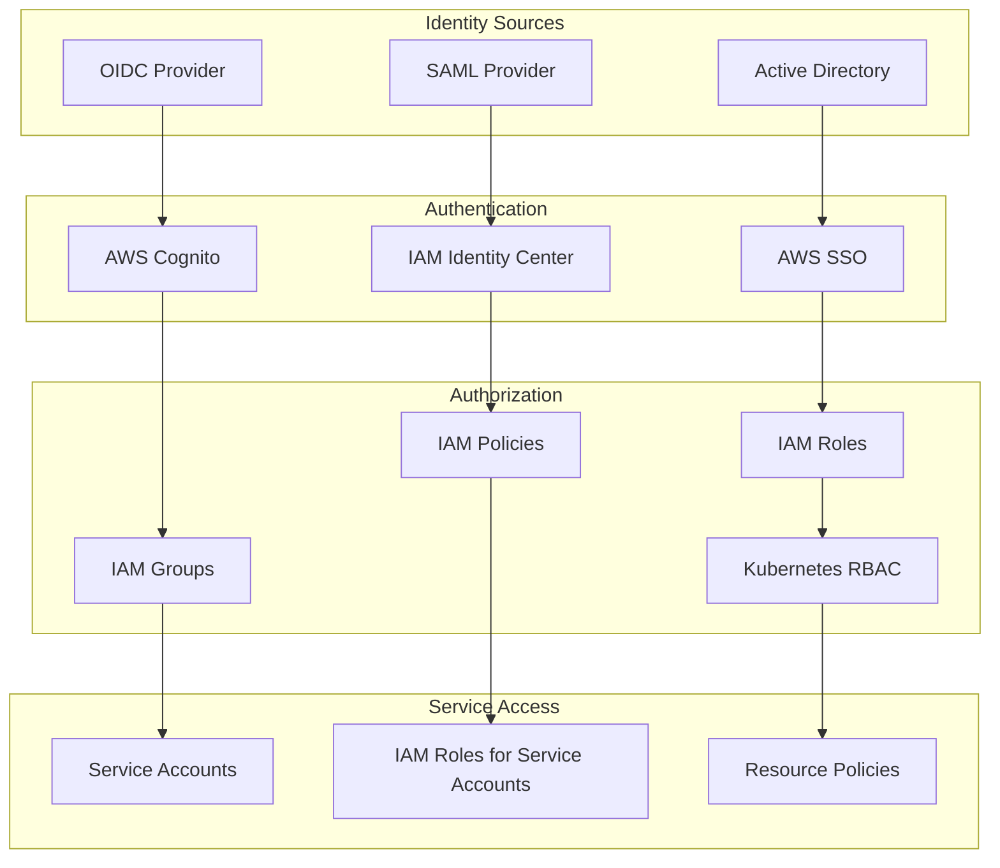
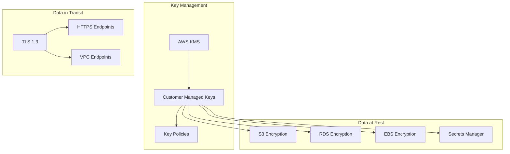
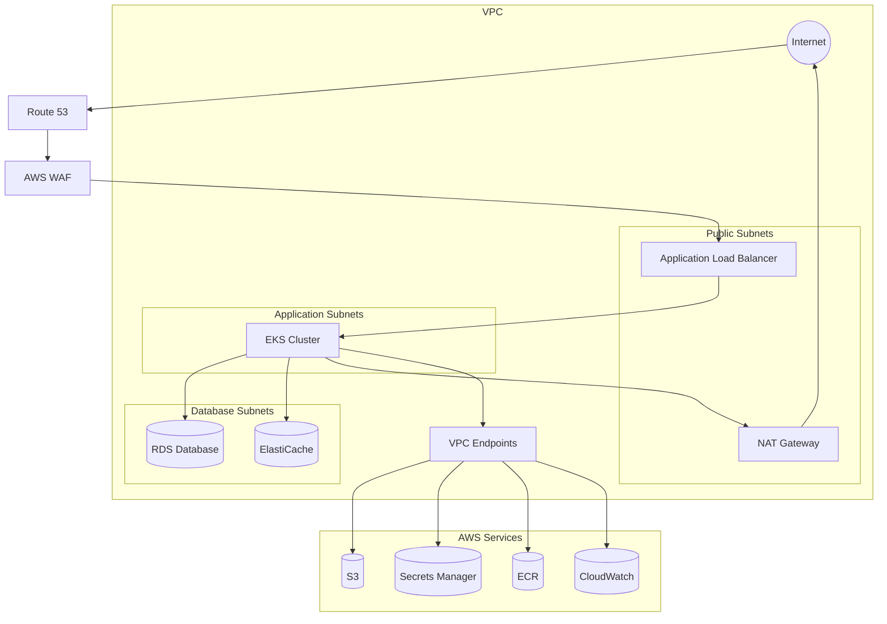
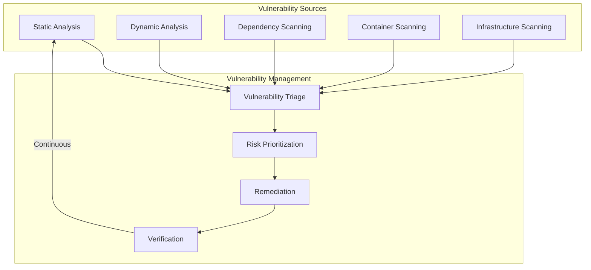
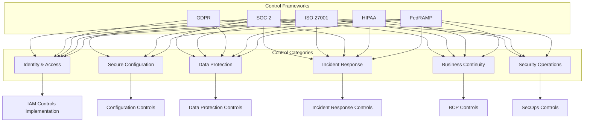
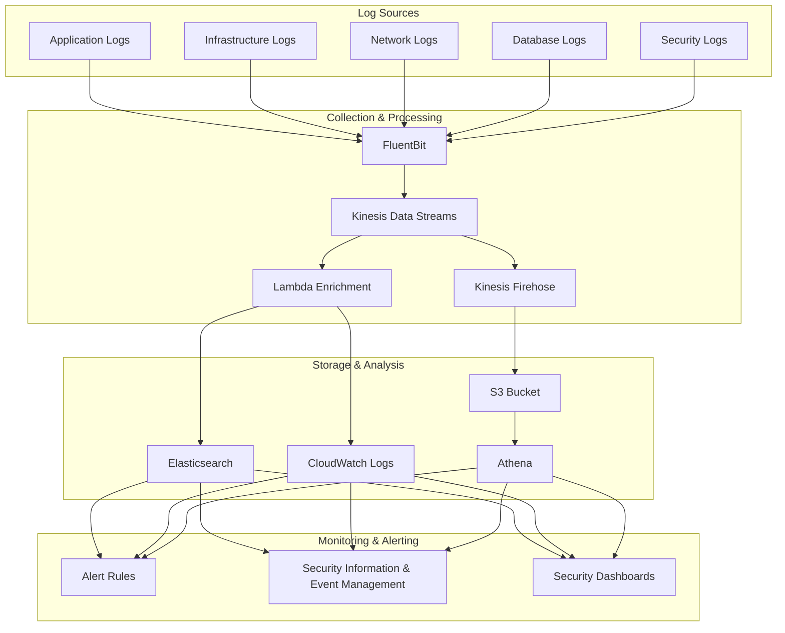
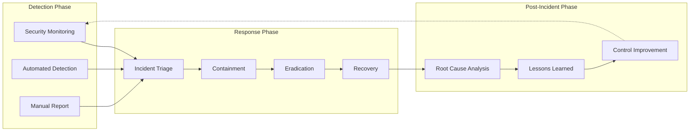

# Security and Compliance

This document outlines the security architecture, controls, and compliance frameworks for the LLM Gateway service.

## Table of Contents

- [Security Architecture](#security-architecture)
- [Identity and Access Management](#identity-and-access-management)
- [Data Protection](#data-protection)
- [Network Security](#network-security)
- [Infrastructure Security](#infrastructure-security)
- [Application Security](#application-security)
- [Compliance Framework](#compliance-framework)
- [Auditing and Logging](#auditing-and-logging)
- [Security Operations](#security-operations)

## Security Architecture

The LLM Gateway follows a defense-in-depth approach with security controls at multiple layers.

### Security Architecture Overview

### Security Principles

The LLM Gateway security architecture is guided by the following principles:

1. **Zero Trust Architecture**: No implicit trust based on network location
2. **Least Privilege**: Minimal access rights for entities
3. **Defense in Depth**: Multiple security controls at different layers
4. **Secure by Default**: Security built in from the beginning
5. **Security as Code**: Security controls defined and deployed as code
6. **Continuous Verification**: Regular testing and validation of controls

## Identity and Access Management

The LLM Gateway implements comprehensive identity and access management controls.

### IAM Architecture

### Access Control Model

The LLM Gateway implements a role-based access control (RBAC) model with the following components:

#### User Roles

| Role | Description | Permissions |
|------|-------------|-------------|
| Administrator | System administration | Full access to all resources |
| Operator | Day-to-day operations | Read/write access to operational resources |
| Developer | Development and testing | Read/write access to dev resources |
| Auditor | Compliance auditing | Read-only access to all resources |
| User | End-user of the service | Access to specific API endpoints |

#### Service Roles

| Role | Purpose | Access Scope |
|------|---------|--------------|
| API Service | Handle API requests | API Gateway, Lambda |
| Execution Service | Execute LLM requests | LLM provider connections, cache |
| Monitoring Service | Collect metrics | CloudWatch, custom metrics |
| Backup Service | Perform backups | S3, RDS, EBS |

### Authentication Methods

The LLM Gateway supports multiple authentication methods:

1. **API Access**:
   - API Keys with mandatory rotation
   - JWT tokens for short-lived access
   - OAuth2 client credentials flow

2. **Management Access**:
   - SAML-based SSO for console access
   - MFA enforced for all human users
   - Temporary credentials for CLI access

3. **Service-to-Service**:
   - IAM roles for internal AWS services
   - Service accounts for Kubernetes resources
   - mTLS for critical service communication

## Data Protection

The LLM Gateway implements comprehensive data protection measures for data at rest and in transit.

### Data Classification

Data is classified according to sensitivity:

| Classification | Examples | Protection Requirements |
|----------------|----------|-------------------------|
| Public | Model capabilities, documentation | No special protection required |
| Internal | System metrics, non-sensitive logs | Encryption in transit |
| Confidential | Customer prompt templates, usage analytics | Encryption in transit and at rest |
| Restricted | API keys, credentials, PII in prompts | Encryption, access controls, audit logging |

### Encryption Architecture

### Encryption Implementation

1. **Data at Rest**:
   - RDS with AWS KMS encryption (AES-256)
   - S3 with server-side encryption
   - EBS volumes encrypted by default
   - ElastiCache with encryption enabled
   - Secrets Manager with KMS encryption

2. **Data in Transit**:
   - TLS 1.3 for all API endpoints
   - TLS for all internal service communication
   - mTLS for critical service interfaces
   - VPC endpoints for AWS service access

### Data Handling Controls

1. **PII Handling**:
   - PII detection in prompt content
   - Automated redaction capabilities
   - Strict access controls for PII data
   - Retention limits for sensitive data

2. **Data Minimization**:
   - Collection limited to necessary data
   - Automated data purging workflows
   - Anonymization for analytics data
   - Temporary storage for transient data

## Network Security

The LLM Gateway implements multiple layers of network security controls.

### Network Architecture

### Network Security Controls

1. **VPC Configuration**:
   - Isolated VPC with private subnets
   - Public subnets only for load balancers
   - No direct internet access from application layer
   - VPC flow logs enabled for network monitoring

2. **Access Controls**:
   - Security groups with least-privilege rules
   - Network ACLs as subnet-level firewalls
   - Service security groups for fine-grained control
   - Default deny for all ingress/egress traffic

3. **Traffic Protection**:
   - WAF for application layer protection
   - Shield Advanced for DDoS protection
   - TLS termination at load balancer
   - Private API Gateway endpoints

4. **Service Isolation**:
   - Kubernetes network policies
   - Service mesh for inter-service TLS
   - Namespace isolation for service boundaries
   - Micro-segmentation for critical services

## Infrastructure Security

The LLM Gateway employs multiple infrastructure security controls.

### Infrastructure Hardening

1. **Compute Resources**:
   - Hardened AMIs for EC2 instances
   - Regular patching through automation
   - Immutable infrastructure approach
   - Host-based intrusion detection

2. **Container Security**:
   - Image scanning in CI/CD pipeline
   - Minimal base images
   - Non-root container execution
   - Image signing and verification

3. **Kubernetes Security**:
   - Pod security policies
   - Admission controllers
   - Security context constraints
   - Control plane security

### Vulnerability Management

1. **Scanning Schedule**:

| Asset Type | Tool | Frequency | Integration Point |
|------------|------|-----------|-------------------|
| Source Code | SonarQube, Snyk | On commit | CI/CD pipeline |
| Dependencies | Dependabot, Snyk | Daily | Repository |
| Container Images | Trivy, ECR scanning | On build | CI/CD pipeline |
| Infrastructure | Prowler, ScoutSuite | Weekly | Scheduled scan |
| Runtime | Falco | Continuous | Kubernetes |

2. **Remediation SLAs**:

| Severity | Timeframe | Approval Process |
|----------|-----------|------------------|
| Critical | 24 hours | Emergency change |
| High | 7 days | Expedited review |
| Medium | 30 days | Standard review |
| Low | 90 days | Batch process |

## Application Security

The LLM Gateway includes multiple application security controls.

### Secure Development Practices

1. **Secure SDLC**:
   - Security requirements definition
   - Threat modeling for new features
   - Security code reviews
   - Secure coding guidelines

2. **Security Testing**:
   - Unit tests for security controls
   - Integration testing for security features
   - Penetration testing (quarterly)
   - Fuzz testing for API endpoints

### API Security

1. **Input Validation**:
   - Schema validation for all inputs
   - Strict type checking
   - Input sanitization
   - Maximum size limits

2. **Output Encoding**:
   - Content security policy implementation
   - Safe output encoding
   - Response validation
   - Error message scrubbing

3. **Rate Limiting**:
   - Per-endpoint rate limits
   - Per-user quotas
   - Graduated response to abusive traffic
   - Automated abuse detection

### Prompt Security

1. **Prompt Injection Protection**:
   - Prompt boundary enforcement
   - Context isolation
   - Input sanitization
   - Dangerous pattern detection

2. **LLM Output Safety**:
   - Content filtering
   - Toxicity detection
   - PII detection in responses
   - Output validation

## Compliance Framework

The LLM Gateway is designed to meet various compliance requirements.

### Compliance Certifications

The service is compliant with or designed to support:

| Framework | Status | Scope | Last Assessment |
|-----------|--------|-------|-----------------|
| SOC 2 Type II | Certified | Security, Availability, Confidentiality | Q2 2023 |
| ISO 27001 | Certified | Information Security Management | Q2 2023 |
| GDPR | Compliant | Data Protection | Q1 2023 |
| HIPAA | BAA Available | For healthcare customers | Q3 2023 |
| FedRAMP Moderate | In Progress | For government customers | Expected Q4 2023 |

### Compliance Controls Mapping

### Compliance Documentation

The following compliance documentation is maintained:

1. **System Security Plan (SSP)**:
   - Comprehensive system description
   - Control implementation details
   - Risk assessment results
   - Continuous monitoring approach

2. **Policies and Procedures**:
   - Information security policy
   - Access control policy
   - Data protection policy
   - Incident response procedures
   - Change management procedures
   - Backup and recovery procedures

3. **Compliance Evidence**:
   - Control testing results
   - Vulnerability scanning reports
   - Penetration testing reports
   - Audit logs and reviews
   - Access reviews
   - Training records

## Auditing and Logging

The LLM Gateway implements comprehensive audit logging for security and compliance purposes.

### Logging Architecture

### Logged Events

The following security events are logged:

1. **Authentication Events**:
   - Authentication attempts (successful and failed)
   - Token issuance and validation
   - Session management
   - Privilege changes

2. **Authorization Events**:
   - Authorization decisions
   - Permission changes
   - Access denials
   - Privilege escalation

3. **Data Access Events**:
   - Sensitive data access
   - Data modifications
   - Bulk data exports
   - Unusual data access patterns

4. **Administrative Events**:
   - Configuration changes
   - Security control modifications
   - User and role management
   - Policy changes

5. **System Events**:
   - Service starts and stops
   - System failures
   - Resource exhaustion
   - Security boundary violations

### Log Management

Logs are managed according to the following policies:

1. **Retention**:
   - Security logs: 1 year
   - Compliance-related logs: 7 years
   - Operational logs: 90 days
   - Debug logs: 7 days

2. **Protection**:
   - Immutable storage in S3
   - Encryption at rest
   - Access controls on log data
   - Integrity verification

3. **Monitoring**:
   - Real-time alerting for critical events
   - Automated log analysis
   - Anomaly detection
   - Correlation across log sources

## Security Operations

The LLM Gateway is supported by a Security Operations Center (SOC) that provides continuous monitoring and incident response.

### Security Monitoring

The following security monitoring is performed:

1. **Continuous Monitoring**:
   - Real-time log analysis
   - Network traffic analysis
   - Behavior anomaly detection
   - Threat intelligence integration

2. **Scheduled Assessments**:
   - Vulnerability scanning
   - Configuration compliance checks
   - Security control effectiveness testing
   - Access reviews

### Incident Response

1. **Incident Response Process**:

| Phase | Activities | Timeframe | Documentation |
|-------|------------|-----------|---------------|
| Preparation | Playbooks, training, tools | Ongoing | IR plan, runbooks |
| Detection | Monitoring, alerts, reports | Real-time | Alert records |
| Analysis | Triage, impact assessment | 30 minutes | Incident ticket |
| Containment | Isolation, traffic blocking | 1-2 hours | Action log |
| Eradication | Malware removal, fixing vulnerabilities | 4-24 hours | Remediation log |
| Recovery | Service restoration, verification | 2-8 hours | Recovery report |
| Lessons Learned | Root cause analysis, improvements | 7 days | Post-mortem report |

2. **Incident Severity Levels**:

| Severity | Description | Response Time | Notification | Example |
|----------|-------------|---------------|--------------|---------|
| Critical | Service-wide security breach | Immediate | All stakeholders | Data breach, system compromise |
| High | Limited security breach | < 1 hour | Security, engineering, leadership | Unauthorized access, targeted attack |
| Medium | Security policy violation | < 4 hours | Security, engineering | Misconfiguration, policy violation |
| Low | Potential security issue | < 24 hours | Security team | Suspicious activity, minor vulnerability |

---

**Previous**: [Disaster Recovery & Backup Strategy](./disaster-recovery.md) | **Next**: [README](./README.md)