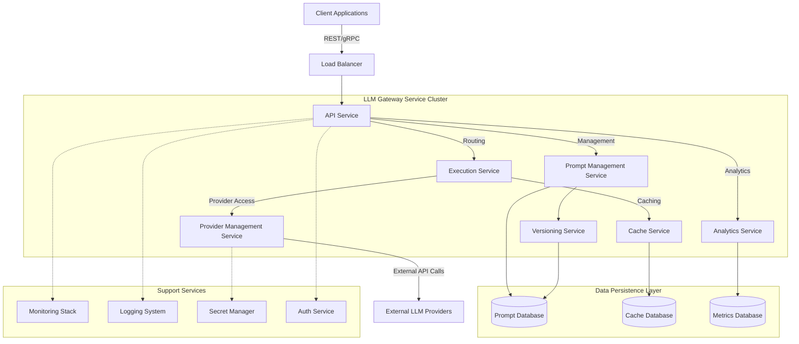
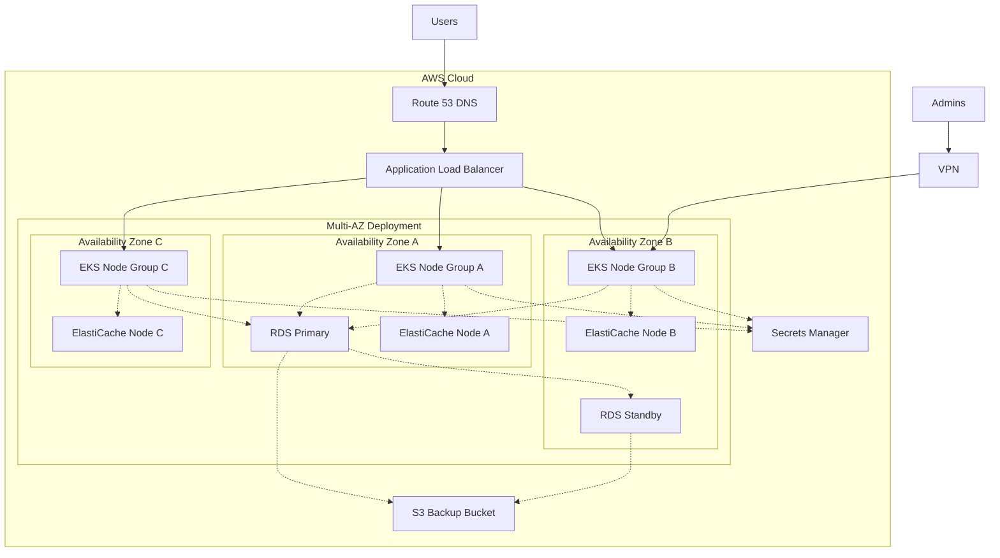
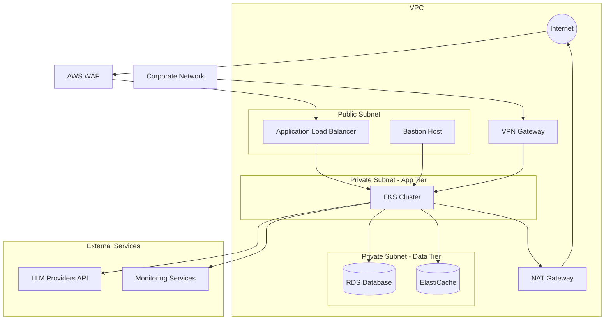
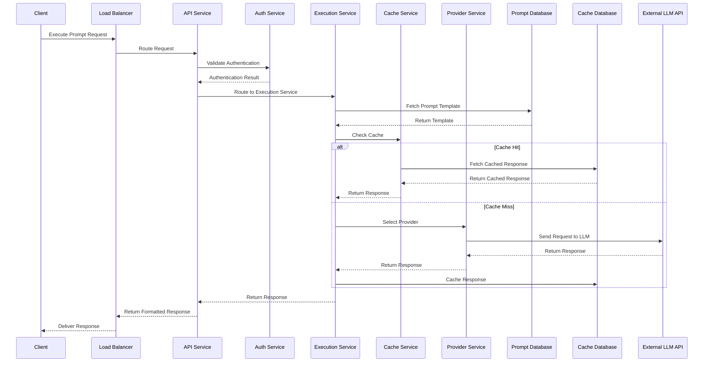

# System Architecture Overview

This document provides a high-level overview of the LLM Gateway system architecture from an operational perspective, focusing on deployment components, networking, and infrastructure elements.

## Table of Contents

- [Architecture Components](#architecture-components)
- [Deployment Architecture](#deployment-architecture)
- [Networking Architecture](#networking-architecture)
- [Data Flow](#data-flow)
- [Scaling Considerations](#scaling-considerations)
- [Infrastructure Dependencies](#infrastructure-dependencies)

## Architecture Components

The LLM Gateway system consists of several key components, each with specific operational requirements:

### Component Diagram

### Core Components

| Component | Description | Service Type | Scaling Pattern |
|-----------|-------------|--------------|-----------------|
| API Service | Entry point for all API requests (REST and gRPC) | Kubernetes Deployment | Horizontal Pod Autoscaler |
| Execution Service | Handles prompt execution and model interactions | Kubernetes Deployment | Horizontal Pod Autoscaler |
| Prompt Management Service | Manages prompt templates and metadata | Kubernetes Deployment | Horizontal Pod Autoscaler |
| Provider Management Service | Handles connections to LLM providers | Kubernetes Deployment | Horizontal Pod Autoscaler |
| Cache Service | Optimizes response time and reduces provider costs | Kubernetes Deployment | Fixed Replica Set |
| Analytics Service | Collects and processes usage and performance data | Kubernetes Deployment | Horizontal Pod Autoscaler |
| Versioning Service | Manages prompt template versions | Kubernetes Deployment | Fixed Replica Set |

### Data Persistence

| Database | Purpose | Technology | Backup Strategy | Scaling |
|----------|---------|------------|-----------------|---------|
| Prompt Database | Stores prompts, templates, and metadata | PostgreSQL | Daily Snapshots | Vertical + Read Replicas |
| Cache Database | Stores cached responses | Redis Cluster | Persistence | Horizontal Sharding |
| Metrics Database | Stores time-series metrics and analytics | Prometheus/TimescaleDB | Regular Snapshots | Retention Policy + Sharding |

### Supporting Systems

| System | Description | Technology | Criticality |
|--------|-------------|------------|-------------|
| Monitoring Stack | End-to-end system monitoring | Prometheus, Grafana, Alert Manager | High |
| Logging System | Centralized logging | Elasticsearch, Fluentd, Kibana | High |
| Secret Manager | Secures API keys and credentials | AWS Secrets Manager / HashiCorp Vault | Critical |
| Auth Service | Handles authentication and authorization | OAuth2/OIDC Provider | Critical |

## Deployment Architecture

The LLM Gateway is deployed on Kubernetes across multiple availability zones within a single region, with the option for multi-region deployment for global customers.

### Infrastructure Diagram

### Deployment Specifications

- **Kubernetes**: Amazon EKS (Elastic Kubernetes Service)
- **Container Registry**: Amazon ECR
- **Nodes**: 
  - Production: Minimum 9 nodes across 3 AZs
  - Staging: 6 nodes across 2 AZs
  - Development: 3 nodes in single AZ
- **Node Types**:
  - API/Execution Services: c5.2xlarge
  - Support Services: m5.xlarge
  - Analytics: r5.xlarge

### Regional Deployments

The LLM Gateway can be deployed in multiple AWS regions for global distribution:

- **Primary Region**: US East (N. Virginia)
- **Secondary Regions**: EU (Ireland), Asia Pacific (Tokyo)
- **DR Region**: US West (Oregon)

## Networking Architecture

### Network Diagram

### Network Specifications

- **VPC CIDR**: 10.0.0.0/16
- **Public Subnets**: 10.0.0.0/24, 10.0.1.0/24, 10.0.2.0/24
- **App Tier Subnets**: 10.0.10.0/24, 10.0.11.0/24, 10.0.12.0/24
- **Data Tier Subnets**: 10.0.20.0/24, 10.0.21.0/24, 10.0.22.0/24
- **Security Groups**:
  - ALB: Ports 80 (redirect to 443), 443
  - App Tier: Port 8080 (API), 8081 (gRPC)
  - Data Tier: PostgreSQL (5432), Redis (6379)
- **Network Access Control Lists** implement additional security layers

## Data Flow

The following diagram illustrates the data flow through the system for a typical prompt execution request:

## Scaling Considerations

The LLM Gateway is designed to scale horizontally to handle increasing load, with several key scaling considerations:

### Scaling Thresholds

| Component | Scaling Metric | Threshold | Scaling Action |
|-----------|---------------|-----------|----------------|
| API Service | CPU Utilization | >70% | Scale Out |
| API Service | Memory Utilization | >80% | Scale Out |
| Execution Service | Concurrent Requests | >1000/node | Scale Out |
| Prompt Service | Request Latency | >200ms | Scale Out |
| Cache Service | Cache Hit Rate | <70% | Increase Cache Size |
| Database | CPU Utilization | >60% | Increase Instance Size |
| Database | Storage Usage | >80% | Increase Storage |

### Autoscaling Configurations

- **Horizontal Pod Autoscaler (HPA)** is configured for all core services
- **Node Autoscaler** provisions additional nodes based on cluster utilization
- **Database Read Replicas** are added based on read query volume
- **Cache Cluster** expands based on memory pressure metrics

## Infrastructure Dependencies

The LLM Gateway has the following external dependencies:

| Dependency | Purpose | SLA Requirement | Fallback Strategy |
|------------|---------|-----------------|-------------------|
| LLM Providers (OpenAI, Anthropic, etc.) | Core LLM functionality | 99.9% | Multi-provider routing |
| AWS Services | Infrastructure | 99.99% | Multi-AZ/Region |
| DNS Providers | Domain resolution | 100% | Multiple providers |
| Monitoring Services | System observability | 99.9% | Local monitoring |
| Authentication Provider | User authentication | 99.99% | Local cache + degraded mode |

### Dependency Map

```mermaid
graph TD
    LLMGateway[LLM Gateway]
    
    LLMGateway --> AWS[AWS Infrastructure]
    LLMGateway --> LLMProviders[LLM API Providers]
    LLMGateway --> Auth[Authentication Services]
    LLMGateway --> Monitoring[Monitoring Services]
    
    subgraph "AWS Dependencies"
        AWS --> EC2[EC2/EKS]
        AWS --> RDS[RDS]
        AWS --> ElastiCache[ElastiCache]
        AWS --> S3[S3]
        AWS --> Route53[Route53]
        AWS --> SM[Secrets Manager]
    end
    
    subgraph "LLM Providers"
        LLMProviders --> OpenAI[OpenAI API]
        LLMProviders --> Anthropic[Anthropic API]
        LLMProviders --> Cohere[Cohere API]
        LLMProviders --> AzureOpenAI[Azure OpenAI]
    end
    
    subgraph "Auth Providers"
        Auth --> Cognito[AWS Cognito]
        Auth --> OIDC[OIDC Provider]
    end
    
    subgraph "Monitoring Stack"
        Monitoring --> Prometheus[Prometheus]
        Monitoring --> Grafana[Grafana]
        Monitoring --> Datadog[Datadog]
        Monitoring --> CloudWatch[CloudWatch]
    end
    
    style LLMGateway fill:#f9f,stroke:#333,stroke-width:4px
```

---

**Previous**: [README](./README.md) | **Next**: [Infrastructure as Code](./infrastructure-as-code.md)