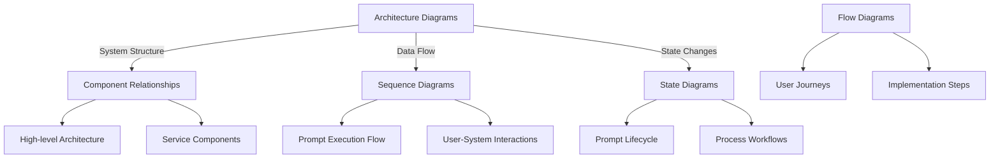

# LLM Gateway Product Documentation

## Table of Contents

- [Product Overview](./product-overview.md)
- [Key Features](./key-features.md)
- [User Journeys & Use Cases](./user-journeys.md)
- [System Architecture](./system-architecture.md)
- [Release Roadmap](./release-roadmap.md)
- [Business Impact](./business-impact.md)
- [FAQs & Known Limitations](./faqs.md)
- [Technical Documentation](../llm-gateway-api-development-guide/README.md)

## Introduction

Welcome to the LLM Gateway Product Documentation. This comprehensive guide provides detailed information about the LLM Gateway product, its features, use cases, architecture, and business impact.

The LLM Gateway serves as a unified interface between your applications and various Large Language Models (LLMs), providing standardized access, management, and control capabilities for LLM interactions.

## Visual Documentation Approach

This documentation uses UML diagrams created with Mermaid to enhance understanding of key concepts:

### Diagram Types

1. **Architecture Diagrams** (in [System Architecture](./system-architecture.md))
   - Visualizing the high-level structure of the LLM Gateway
   - Showing relationships between components and services

2. **Component Diagrams** (in [System Architecture](./system-architecture.md))
   - Illustrating classes and methods in key services
   - Depicting interfaces and dependencies

3. **Sequence Diagrams** (in [System Architecture](./system-architecture.md))
   - Demonstrating interaction flows between system components
   - Visualizing process steps in chronological order

4. **State Diagrams** (in [System Architecture](./system-architecture.md))
   - Showing lifecycle states of key entities
   - Displaying transitions and decision points

5. **Flow Diagrams** (in [User Journeys](./user-journeys.md))
   - Mapping implementation steps and user journeys
   - Illustrating workflow processes

All diagrams use Mermaid syntax for consistency, maintainability, and native rendering in documentation tools.

### How to Use This Documentation

This product documentation is organized into several sections to help different audiences find the information they need:

- **Product Managers & Business Stakeholders**: Focus on [Product Overview](./product-overview.md), [Key Features](./key-features.md), [User Journeys](./user-journeys.md), and [Business Impact](./business-impact.md)
- **Architects & Technical Leaders**: Review [System Architecture](./system-architecture.md) and [Technical Documentation](../llm-gateway-api-development-guide/README.md)
- **Development Teams**: Explore [Technical Documentation](../llm-gateway-api-development-guide/README.md) with detailed API reference
- **Project Planners**: Check [Release Roadmap](./release-roadmap.md) for upcoming features and timeline

### Related Documentation

For detailed technical implementation guidance, please refer to:
- [API Developer Guide](../llm-gateway-api-development-guide/README.md)
- [Getting Started Guide](../llm-gateway-api-development-guide/getting-started.md)
- [API Reference](../llm-gateway-api-development-guide/api-reference/README.md)