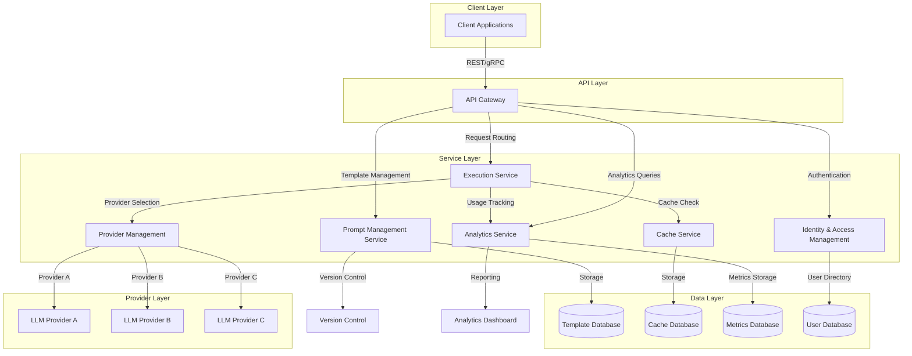
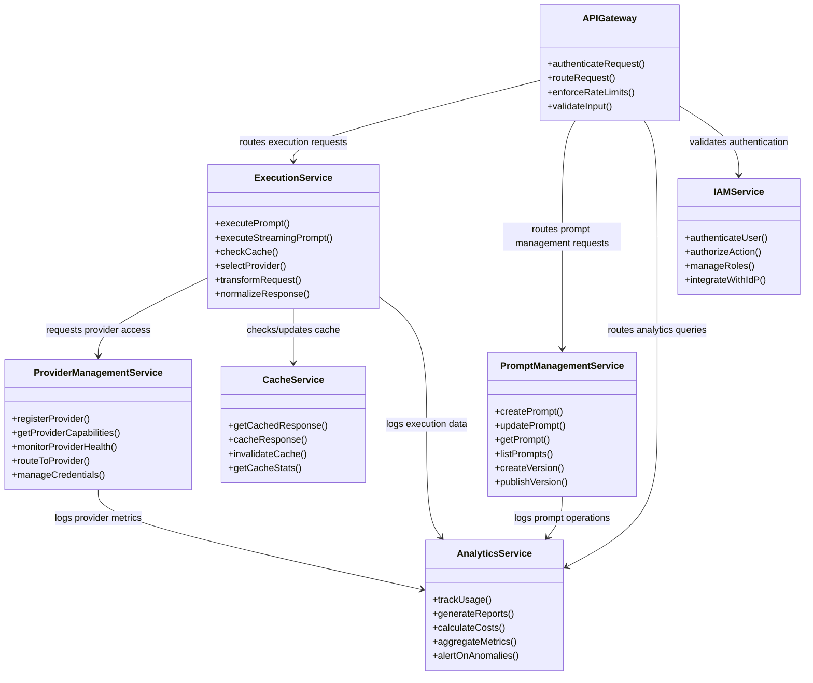
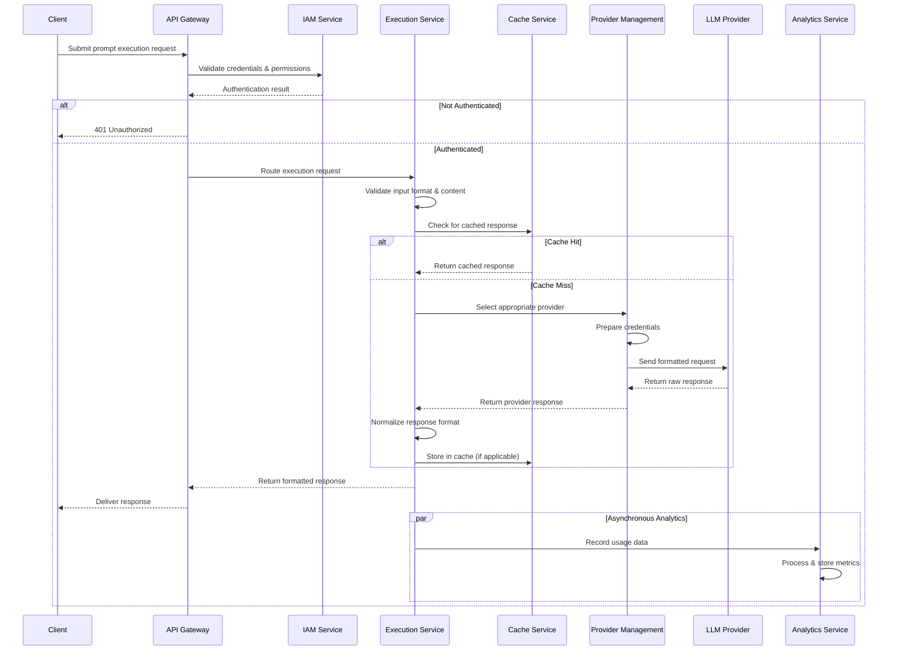
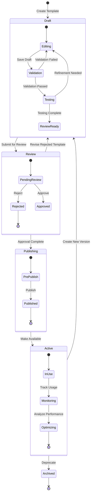

# System Architecture

## Table of Contents
- [Architecture Overview](#architecture-overview)
- [Core Components](#core-components)
- [Integration Points](#integration-points)
- [Deployment Models](#deployment-models)
- [Scalability and Performance](#scalability-and-performance)
- [Security Architecture](#security-architecture)
- [Data Flow](#data-flow)

## Architecture Overview

The LLM Gateway is built on a modern, cloud-native architecture designed for scalability, resilience, and extensibility. The system employs a microservices approach with containerized components that can be deployed across various environments.

### Architectural Principles

The LLM Gateway architecture adheres to the following key principles:

1. **Service Abstraction**: Providing a unified interface that abstracts the complexities of diverse LLM providers
2. **Horizontal Scalability**: Allowing the system to scale out to handle increased load
3. **High Availability**: Ensuring reliability through redundancy and failover mechanisms
4. **Security by Design**: Implementing security at every layer of the architecture
5. **Extensibility**: Supporting easy integration of new LLM providers and capabilities
6. **Observability**: Providing comprehensive monitoring, logging, and analytics

### Architecture Diagram

*The above diagram illustrates the high-level architecture of the LLM Gateway, showing the main components and their interactions across different layers of the system.*

## Core Components

The LLM Gateway consists of several core components, each responsible for specific aspects of functionality:

### Component Diagram

*This component diagram shows the relationship between core services and their primary functions within the LLM Gateway architecture.*

### API Layer

The API Layer serves as the primary interface for client applications, providing REST and gRPC endpoints for all Gateway functionality.

**Key Capabilities:**
- Request validation and authentication
- Rate limiting and quota enforcement
- Request routing to appropriate services
- API versioning and compatibility management
- Documentation and developer resources

**Technologies:**
- REST API with OpenAPI specifications
- gRPC API with Protocol Buffers
- API Gateway for management and security

### Prompt Management Service

The Prompt Management Service handles the creation, storage, retrieval, and versioning of prompt templates.

**Key Capabilities:**
- CRUD operations for prompt templates
- Parameterized template processing
- Version control and publishing workflow
- Template organization and categorization
- Access control and permissions

**Technologies:**
- Document-oriented database for template storage
- Version control system for template history
- Template rendering engine for parameter substitution

### Execution Service

The Execution Service manages the processing of prompts against various LLM providers, handling request formatting, response processing, and optimizations.

**Key Capabilities:**
- Prompt formatting for specific providers
- Request transmission to LLM providers
- Response processing and normalization
- Streaming support for real-time responses
- Error handling and retry logic

**Technologies:**
- Asynchronous processing framework
- Provider-specific adapters
- Stream processing capabilities
- Queue management for high throughput

### Provider Management Service

The Provider Management Service maintains connections to various LLM providers, handling authentication, capability discovery, and provider-specific configurations.

**Key Capabilities:**
- Provider connection management
- Credential storage and rotation
- Model and capability discovery
- Provider health monitoring
- Configuration management

**Technologies:**
- Secure credential storage
- Service discovery mechanisms
- Health check system
- Configuration management database

### Cache Service

The Cache Service optimizes performance and reduces costs by storing and retrieving results for identical or similar prompt requests.

**Key Capabilities:**
- Deterministic request hashing
- Configurable cache policies
- Cache invalidation mechanisms
- Cache analytics and monitoring
- Distributed cache management

**Technologies:**
- Distributed caching system
- Content-addressable storage
- Time-to-live management
- Cache consistency protocols

### Analytics Service

The Analytics Service collects, processes, and reports on system usage, performance, and business metrics.

**Key Capabilities:**
- Usage data collection and aggregation
- Performance metric tracking
- Cost analysis and reporting
- User and application analytics
- Custom report generation

**Technologies:**
- Time-series database for metrics
- Data warehouse for analytics
- Real-time processing pipeline
- Visualization tools

### Identity and Access Management

The Identity and Access Management component handles authentication, authorization, and user management across the system.

**Key Capabilities:**
- User authentication and session management
- Role-based access control
- Resource-level permissions
- Multi-tenancy support
- Integration with enterprise identity providers

**Technologies:**
- OAuth 2.0 / OpenID Connect
- SAML integration
- Policy enforcement points
- Directory services integration

## Integration Points

The LLM Gateway provides multiple integration points for connecting with external systems and services:

### LLM Provider Integrations

The system integrates with various LLM providers through standardized adaptors:

- **Commercial API Providers**: OpenAI, Anthropic, Cohere, AI21, etc.
- **Cloud Provider Services**: AWS Bedrock, Azure OpenAI, Google Vertex AI, etc.
- **Open Source Models**: Integration with self-hosted models like Llama, Falcon, Mistral
- **Custom Models**: Support for organization-specific fine-tuned models

### Enterprise System Integrations

The Gateway connects with existing enterprise systems for seamless operation:

- **Identity Providers**: Integration with LDAP, Active Directory, Okta, Auth0, etc.
- **Monitoring Systems**: Prometheus, Grafana, DataDog, New Relic, etc.
- **Logging Systems**: ELK Stack, Splunk, GrayLog, etc.
- **SIEM Solutions**: Integration with security information and event management systems

### Client Integrations

Multiple options are available for client applications to integrate with the Gateway:

- **REST API**: Standard HTTP-based integration for broad compatibility
- **gRPC API**: High-performance binary protocol for efficiency
- **Client SDKs**: Language-specific libraries for Python, JavaScript, Java, etc.
- **Webhooks**: Event notifications for asynchronous workflows

## Deployment Models

The LLM Gateway supports multiple deployment models to meet different organizational requirements:

### Cloud-Hosted SaaS

- Fully managed service hosted in the cloud
- Multi-tenant architecture with secure isolation
- Automatic updates and maintenance
- Elastic scaling based on demand
- Regional deployments for data sovereignty

### Self-Hosted Cloud

- Deployed in customer's cloud environment (AWS, Azure, GCP)
- Customer maintains control over data and infrastructure
- Integrates with existing cloud services
- Leverages cloud provider security and scaling
- Support for multi-region deployments

### On-Premises

- Deployed within customer's data center
- Complete data control and air-gapped operation if needed
- Integration with on-premises identity and security
- Support for private networks and restricted environments
- Compatible with virtualization and container platforms

### Hybrid

- Combination of cloud and on-premises components
- Flexible architecture to meet specific requirements
- Data processing where most appropriate
- Bridge between cloud and on-premises systems
- Progressive migration path

## Scalability and Performance

The LLM Gateway is designed to scale efficiently to meet growing demands:

### Horizontal Scaling

- Stateless services for easy replication
- Load balancing across service instances
- Auto-scaling based on load metrics
- Resource-based scaling policies
- No single point of failure

### Performance Optimizations

- Distributed caching for response reuse
- Connection pooling to LLM providers
- Asynchronous processing for high throughput
- Query optimization for database operations
- Content compression for network efficiency

### Resource Management

- Fine-grained resource allocation
- Priority queuing for critical workloads
- Resource quotas by tenant or application
- Graceful degradation under extreme load
- Resource usage monitoring and optimization

### High Availability

- Multi-zone and multi-region deployment options
- Automated failover mechanisms
- Disaster recovery capabilities
- Data replication for resilience
- Regular backup procedures

## Security Architecture

Security is implemented at multiple layers throughout the system:

### Authentication and Authorization

- Multi-factor authentication support
- Fine-grained permission model
- OAuth 2.0 and OpenID Connect
- API key management with rotation
- JWT-based session management

### Data Protection

- Encryption in transit (TLS 1.3)
- Encryption at rest (AES-256)
- Key management system
- Data anonymization capabilities
- PII detection and handling

### Network Security

- Network segmentation
- Web Application Firewall
- DDoS protection
- IP allowlisting
- Traffic encryption

### Compliance Controls

- Comprehensive audit logging
- Compliance reporting
- Data residency controls
- Retention policy enforcement
- Privacy controls

### Vulnerability Management

- Regular security scanning
- Dependency vulnerability checking
- Penetration testing
- Security patch management
- Responsible disclosure program

## Data Flow

The following sections describe the primary data flows through the system:

### Prompt Execution Flow

The sequence diagram above illustrates the flow of a prompt execution request through the system, including:

1. **Request Reception**: Client submits prompt execution request via API
2. **Authentication & Authorization**: System validates credentials and permissions
3. **Request Validation**: Input is validated for format and content policies
4. **Cache Check**: System checks if identical request exists in cache
5. **Provider Selection**: If not cached, appropriate LLM provider is selected
6. **Request Transformation**: Prompt is formatted for selected provider
7. **Provider Execution**: Request is sent to LLM provider
8. **Response Processing**: Response is normalized to standard format
9. **Caching**: Response is cached for future requests if applicable
10. **Response Delivery**: Formatted response is returned to client
11. **Analytics Capture**: Usage data is recorded for analytics

### Prompt Management Flow

The state diagram above illustrates the lifecycle of a prompt template through the system, including:

1. **Template Creation**: User creates or updates a prompt template
2. **Validation**: System validates template structure and parameters
3. **Version Creation**: New version is created in draft state
4. **Testing**: Template can be tested with sample parameters
5. **Approval**: Template version moves through approval workflow
6. **Publishing**: Version is published for production use
7. **Distribution**: Published template is available across the system
8. **Usage Tracking**: Template usage is tracked for analytics

### Analytics Data Flow

1. **Event Capture**: System captures API calls, execution metrics, errors
2. **Data Processing**: Raw events are processed and enriched
3. **Aggregation**: Data is aggregated at various dimensions and time scales
4. **Storage**: Processed data is stored in appropriate databases
5. **Analysis**: Analytical queries process the data
6. **Visualization**: Results are presented in dashboards and reports
7. **Alerting**: Anomalies trigger notifications based on rules
8. **Archival**: Historical data is archived according to retention policies

---

**Previous**: [User Journeys & Use Cases](./user-journeys.md) | **Next**: [Release Roadmap](./release-roadmap.md)