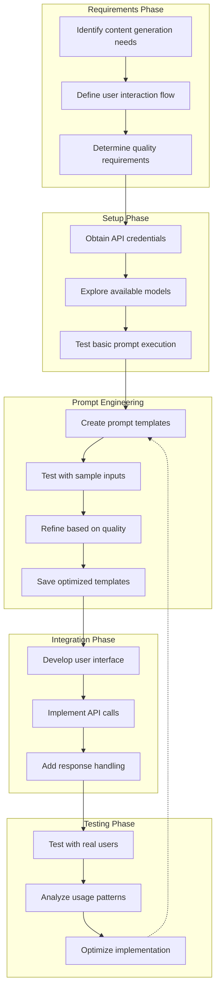

# User Journeys & Use Cases

## Table of Contents
- [Enterprise Adoption Journeys](#enterprise-adoption-journeys)
- [Developer Journeys](#developer-journeys)
- [AI Engineer Journeys](#ai-engineer-journeys)
- [Operations Journeys](#operations-journeys)
- [Business Stakeholder Journeys](#business-stakeholder-journeys)
- [End-User Journeys](#end-user-journeys)

This document describes real-world user journeys and use cases enabled by the LLM Gateway. These scenarios illustrate how different personas interact with the system to achieve their goals and realize value from the product.

## Enterprise Adoption Journeys

### Journey: Centralizing LLM Access and Governance

**User**: Enterprise IT and Security Teams

#### Scenario
As a large financial services organization, we need to establish governance and security standards before allowing broad LLM adoption across the company. We need centralized controls, monitoring, and auditing capabilities.

#### Journey Steps

1. **Assessment and Planning**
   - Identify existing LLM usage across the organization
   - Define security and compliance requirements
   - Establish governance policies and access controls

2. **Initial Deployment**
   - Deploy LLM Gateway in a controlled environment
   - Connect to approved LLM providers
   - Implement authentication and access controls

3. **Policy Implementation**
   - Configure content filtering policies
   - Set up usage quotas and budgets
   - Establish audit logging

4. **Pilot Projects**
   - Enable access for select teams
   - Monitor usage and compliance
   - Gather feedback and refine policies

5. **Organization-wide Rollout**
   - Expand access to additional teams
   - Implement department-specific policies
   - Scale infrastructure to support growing demand

#### Value Delivered
- Consistent security and compliance controls
- Centralized monitoring and management
- Reduced risk of shadow IT
- Cost visibility and control
- Compliance with regulatory requirements

### Journey: Migrating from Direct Provider Integration

**User**: Technology Leadership and Development Teams

#### Scenario
Our organization has multiple applications directly integrating with OpenAI's APIs. As we expand our LLM usage and explore additional providers, we need to standardize our approach and reduce dependency on any single provider.

#### Journey Steps

1. **Current State Assessment**
   - Inventory existing OpenAI integrations
   - Document current usage patterns and requirements
   - Identify pain points and limitations

2. **LLM Gateway Implementation**
   - Deploy and configure LLM Gateway
   - Connect to OpenAI and alternative providers
   - Establish migration strategy

3. **Initial Migration**
   - Select a non-critical application for migration
   - Adapt integration to use LLM Gateway API
   - Test functionality and performance

4. **Provider Diversification**
   - Test alternative models for specific use cases
   - Implement smart routing for cost optimization
   - Configure fallback providers for resilience

5. **Complete Migration**
   - Migrate remaining applications
   - Decommission direct provider integrations
   - Optimize usage across providers

#### Value Delivered
- Reduced vendor lock-in
- Improved resilience through provider redundancy
- Consistent interface across applications
- Cost optimization through model selection
- Simplified maintenance and updates

## Developer Journeys

### Journey: Integrating LLM Capabilities into a Web Application

**User**: Application Developers

#### Scenario
As a developer, I want to add intelligent content generation capabilities to our content management system, allowing editors to generate draft content based on topics and guidelines.

#### Journey Steps

1. **Requirements Gathering**
   - Identify specific content generation needs
   - Define user interaction flow
   - Determine quality and performance requirements

2. **LLM Gateway Setup**
   - Obtain API credentials for LLM Gateway
   - Explore available models and capabilities
   - Test basic prompt execution

3. **Prompt Engineering**
   - Create and test prompt templates for content generation
   - Refine prompts based on output quality
   - Save optimized templates in LLM Gateway

4. **Frontend Integration**
   - Develop user interface for content requirements input
   - Implement API calls to LLM Gateway
   - Add response handling and content display

5. **Testing and Refinement**
   - Test with real users and content scenarios
   - Analyze usage patterns and performance
   - Optimize based on feedback and metrics

#### Value Delivered
- Rapid implementation of AI capabilities
- Consistent and reliable content generation
- Flexibility to improve without changing application code
- Usage tracking and performance monitoring
- Ease of switching or upgrading underlying models

### Journey: Building a Customer Service AI Assistant

**User**: Full-Stack Development Team

#### Scenario
As a development team, we need to build a customer service AI assistant that can answer product questions, troubleshoot issues, and escalate to human agents when necessary.

#### Journey Steps

1. **Solution Design**
   - Define assistant capabilities and limitations
   - Create conversation flow diagrams
   - Identify integration points with existing systems

2. **Knowledge Base Integration**
   - Connect LLM Gateway to company knowledge base
   - Create prompt templates that incorporate relevant documentation
   - Test knowledge retrieval accuracy

3. **Conversation Management**
   - Implement multi-turn conversation handling
   - Create context management system
   - Develop escalation triggers and processes

4. **User Experience Development**
   - Build chat interface for customers
   - Implement typing indicators and response streaming
   - Create fallback and clarification flows

5. **Deployment and Monitoring**
   - Launch assistant in limited availability
   - Monitor conversations and success rates
   - Continuously improve based on real interactions

#### Value Delivered
- Reduced development time through ready-made LLM infrastructure
- Consistent response quality across different chat scenarios
- Scalable solution that handles peak demand
- Detailed analytics on customer questions and pain points
- Continuous improvement without code changes

## AI Engineer Journeys

### Journey: Prompt Engineering and Optimization

**User**: AI Engineers and Prompt Engineers

#### Scenario
As an AI engineer, I need to develop and refine prompt templates that deliver consistent, high-quality results across various business use cases while optimizing for cost and performance.

#### Journey Steps

1. **Use Case Analysis**
   - Define specific requirements for each use case
   - Identify success criteria and evaluation metrics
   - Select appropriate models based on capabilities

2. **Prompt Development**
   - Create initial prompt templates in LLM Gateway
   - Test with representative input examples
   - Document prompt structure and rationale

3. **Systematic Testing**
   - Run prompts against test datasets
   - Compare performance across different models
   - Identify edge cases and failure modes

4. **Optimization**
   - Refine prompts based on test results
   - Optimize token usage to reduce costs
   - Balance quality, latency, and cost considerations

5. **Version Management**
   - Publish optimized prompts for production use
   - Document version changes and improvements
   - Collaborate with other teams on prompt refinement

#### Value Delivered
- Systematic approach to prompt engineering
- Measurable quality improvements
- Cost optimization through efficient prompts
- Knowledge sharing across the organization
- Version control for prompts

### Journey: LLM Evaluation and Selection

**User**: AI Research Team

#### Scenario
As an AI research team, we need to evaluate different LLM providers and models to determine which ones are most effective and cost-efficient for our specific use cases.

#### Journey Steps

1. **Evaluation Framework**
   - Define evaluation criteria and benchmarks
   - Create standardized test cases
   - Establish scoring methodology

2. **Provider Integration**
   - Connect multiple LLM providers to LLM Gateway
   - Configure authentication and settings
   - Verify basic connectivity and functionality

3. **Systematic Testing**
   - Execute test cases across all models
   - Collect performance, quality, and cost metrics
   - Document strengths and weaknesses of each model

4. **Comparative Analysis**
   - Analyze results across dimensions
   - Identify optimal models for specific use cases
   - Calculate cost-performance ratios

5. **Recommendations and Implementation**
   - Document findings and recommendations
   - Configure routing rules based on results
   - Establish ongoing evaluation process

#### Value Delivered
- Data-driven model selection
- Optimized cost-quality balance
- Reduced dependency on single providers
- Adaptability to evolving model landscape
- Validated performance for specific use cases

## Operations Journeys

### Journey: Monitoring and Managing LLM Costs

**User**: DevOps and Finance Teams

#### Scenario
As operations and finance teams, we need to monitor, control, and optimize our LLM usage costs across all applications and departments.

#### Journey Steps

1. **Cost Structure Analysis**
   - Analyze current LLM usage patterns
   - Identify cost drivers and inefficiencies
   - Establish cost allocation framework

2. **Monitoring Setup**
   - Configure cost tracking in LLM Gateway
   - Set up department and application tagging
   - Create cost dashboards and reports

3. **Budget Implementation**
   - Establish usage quotas by department
   - Configure budget alerts and notifications
   - Implement enforcement policies

4. **Optimization Initiatives**
   - Identify high-cost, low-value usage patterns
   - Implement caching for common requests
   - Optimize prompt efficiency

5. **Continuous Management**
   - Regular cost review meetings
   - Adjust budgets based on business priorities
   - Forecast future costs based on growth

#### Value Delivered
- Transparent cost allocation
- Predictable LLM expenditures
- Early detection of usage anomalies
- Targeted optimization efforts
- Balanced resource allocation

### Journey: Scaling LLM Infrastructure

**User**: DevOps and Platform Teams

#### Scenario
As the platform team, we need to scale our LLM Gateway infrastructure to support growing usage across the organization while maintaining performance and reliability.

#### Journey Steps

1. **Capacity Planning**
   - Analyze current usage patterns and growth trends
   - Identify peak loads and bottlenecks
   - Project future capacity needs

2. **Infrastructure Expansion**
   - Scale horizontal capacity for request handling
   - Optimize caching infrastructure
   - Enhance database performance for prompt storage

3. **Load Testing**
   - Create realistic load test scenarios
   - Validate performance under projected load
   - Identify and address performance bottlenecks

4. **Reliability Enhancements**
   - Implement enhanced failover mechanisms
   - Configure cross-region redundancy
   - Establish disaster recovery procedures

5. **Monitoring and Alerting**
   - Configure performance monitoring
   - Set up proactive alerts for potential issues
   - Create operational dashboards

#### Value Delivered
- Consistent performance under increasing load
- Proactive capacity management
- High availability for critical services
- Reduced operational incidents
- Data-driven infrastructure decisions

## Business Stakeholder Journeys

### Journey: Driving ROI from LLM Investments

**User**: Business Leaders and Product Owners

#### Scenario
As business leaders, we need to ensure that our investments in LLM technology deliver measurable business value and support strategic objectives.

#### Journey Steps

1. **Value Identification**
   - Define business outcomes for LLM initiatives
   - Establish success metrics and KPIs
   - Align with strategic business priorities

2. **Usage Analysis**
   - Review LLM usage across business functions
   - Identify high-impact applications
   - Evaluate quality and business outcomes

3. **ROI Measurement**
   - Calculate cost savings from automation
   - Measure productivity improvements
   - Evaluate customer experience impacts

4. **Strategic Alignment**
   - Prioritize resources based on business impact
   - Redirect resources from lower-value use cases
   - Identify new opportunities for LLM applications

5. **Future Planning**
   - Develop roadmap for expanded LLM adoption
   - Align budget and resources with priority areas
   - Establish governance for ongoing value assessment

#### Value Delivered
- Quantified business impact of LLM investments
- Optimized resource allocation
- Strategic alignment of AI initiatives
- Data-driven investment decisions
- Visible return on AI investments

### Journey: Expanding LLM Use Cases

**User**: Innovation Teams and Business Units

#### Scenario
As the innovation team, we want to identify and implement new use cases for LLMs across the organization, driving new capabilities and business value.

#### Journey Steps

1. **Opportunity Mapping**
   - Conduct workshops with business units
   - Identify pain points and opportunities
   - Prioritize potential use cases

2. **Proof of Concept Development**
   - Select high-priority use cases for initial testing
   - Create rapid prototypes using LLM Gateway
   - Test with real users and data

3. **Value Assessment**
   - Measure impact on efficiency, quality, or experience
   - Calculate potential ROI at scale
   - Document findings and recommendations

4. **Expansion Planning**
   - Develop implementation roadmap for successful POCs
   - Identify resource requirements
   - Create training and change management plans

5. **Knowledge Sharing**
   - Document successful patterns and best practices
   - Create internal case studies and examples
   - Build community of practice across teams

#### Value Delivered
- Accelerated innovation cycles
- Validated business cases for LLM adoption
- Reusable patterns for similar use cases
- Measured outcomes from AI initiatives
- Cross-organizational knowledge sharing

## End-User Journeys

### Journey: Content Creation with AI Assistance

**User**: Marketing and Content Teams

#### Scenario
As a marketing team member, I want to leverage AI to accelerate content creation while maintaining our brand voice and quality standards.

#### Journey Steps

1. **Project Setup**
   - Define content requirements and guidelines
   - Create project-specific prompt templates
   - Establish review and approval workflow

2. **Content Generation**
   - Provide topic, audience, and format inputs
   - Generate initial content drafts using LLM Gateway
   - Review and select promising outputs

3. **Refinement and Editing**
   - Edit AI-generated content for accuracy and style
   - Use AI for targeted improvements and variations
   - Combine human expertise with AI capabilities

4. **Optimization**
   - Test content variations with target audiences
   - Use AI to generate optimized versions
   - Measure performance and refine approach

5. **Scaling Production**
   - Standardize successful workflows
   - Create reusable templates for common content types
   - Train team members on effective AI collaboration

#### Value Delivered
- Accelerated content production
- Consistent quality and brand voice
- More creative variations and options
- Reduced time spent on routine writing tasks
- Improved content performance

### Journey: Customer Support Enhancement

**User**: Customer Support Teams

#### Scenario
As a customer support manager, I want to use LLMs to augment my team's capabilities, improve response times, and enhance the quality of customer interactions.

#### Journey Steps

1. **Support Workflow Analysis**
   - Identify common support scenarios
   - Map current response processes
   - Determine opportunities for AI augmentation

2. **AI Assistant Configuration**
   - Create prompt templates for common issues
   - Configure knowledge base connections
   - Establish escalation criteria

3. **Agent Augmentation Implementation**
   - Integrate LLM Gateway with support platform
   - Train agents on working with AI suggestions
   - Implement feedback mechanisms

4. **Quality and Efficiency Monitoring**
   - Track response times and resolution rates
   - Measure customer satisfaction
   - Identify areas for improvement

5. **Continuous Improvement**
   - Refine prompts based on performance data
   - Expand coverage to additional scenarios
   - Share best practices across support teams

#### Value Delivered
- Faster response times for customers
- More consistent support quality
- Reduced agent cognitive load
- Higher first-contact resolution rates
- Improved agent productivity and satisfaction

---

**Previous**: [Key Features](./key-features.md) | **Next**: [System Architecture](./system-architecture.md)