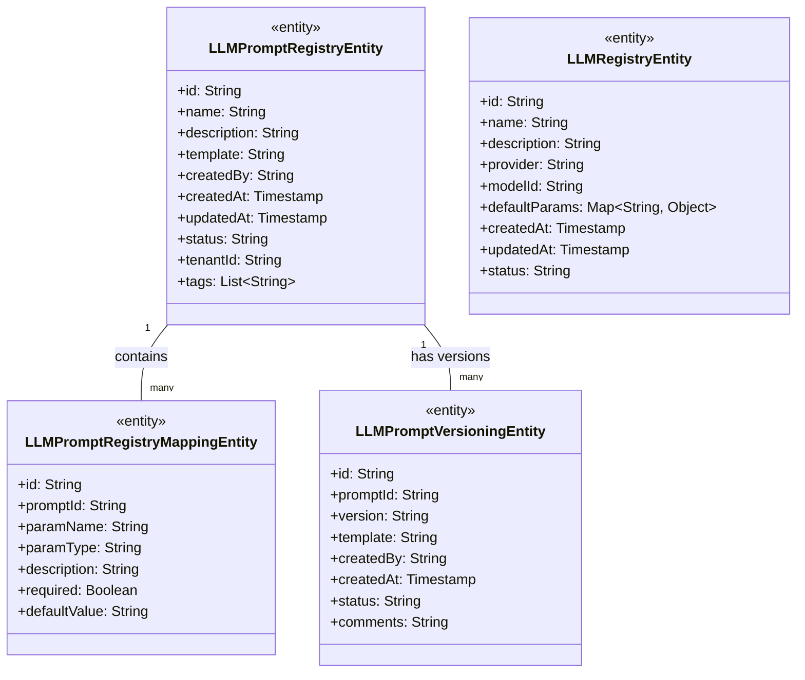
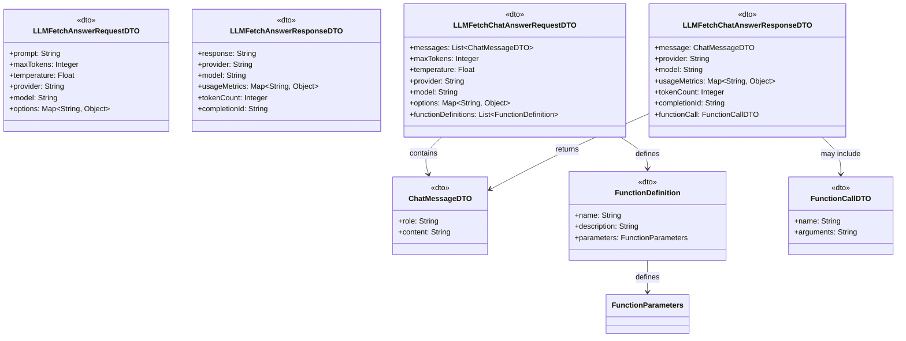
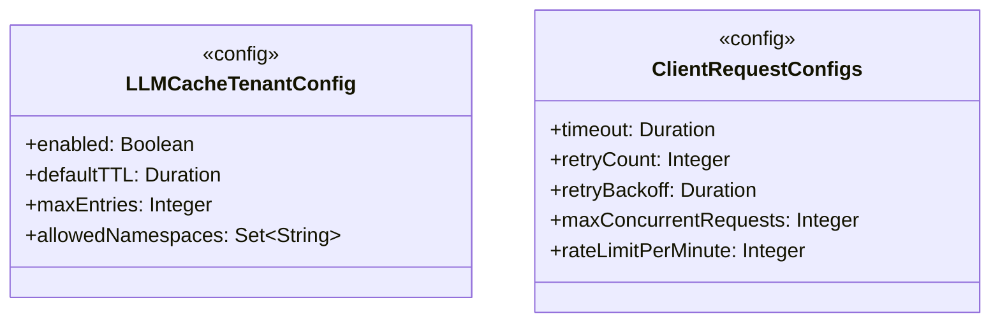
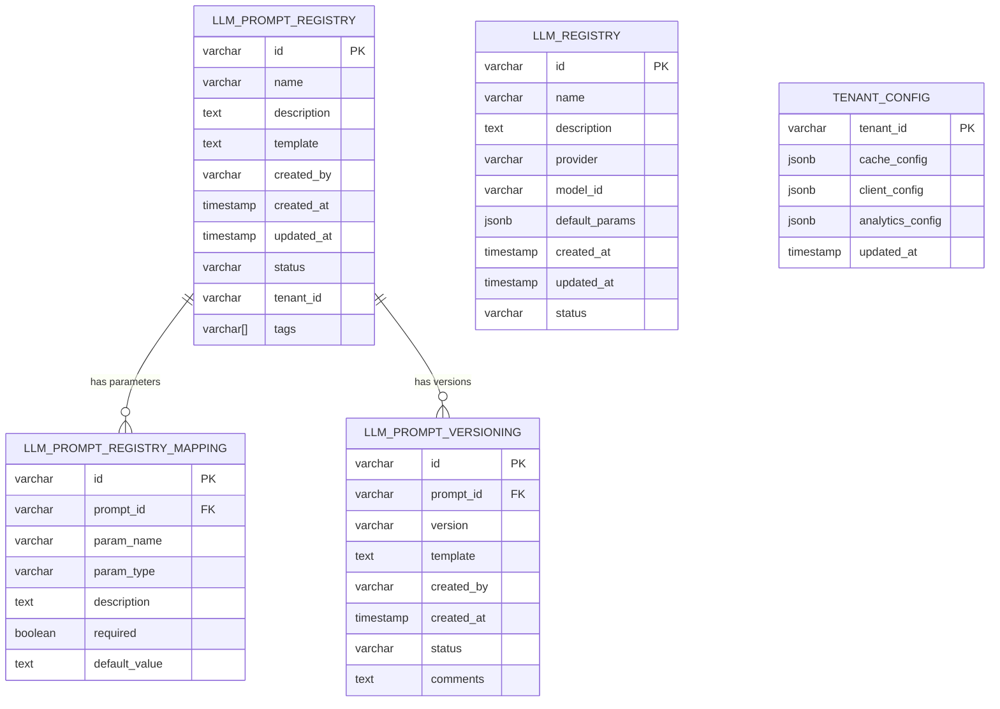
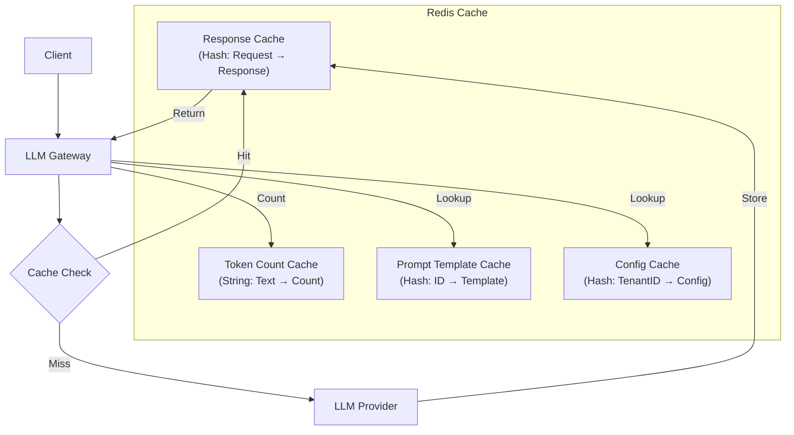
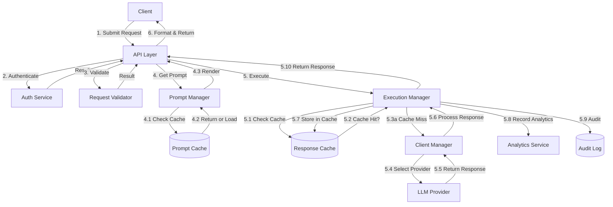
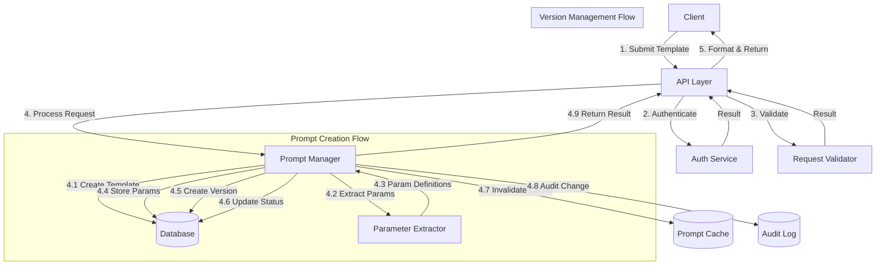
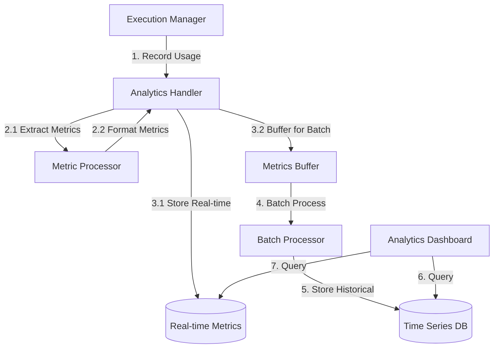

# Data Flow and Storage Design

## Table of Contents

- [Introduction](#introduction)
- [Data Models](#data-models)
  - [Core Domain Entities](#core-domain-entities)
  - [Request/Response Objects](#requestresponse-objects)
  - [Configuration Models](#configuration-models)
- [Storage Architecture](#storage-architecture)
  - [Database Schema](#database-schema)
  - [Cache Architecture](#cache-architecture)
- [Data Flows](#data-flows)
  - [Prompt Execution Flow](#prompt-execution-flow)
  - [Prompt Management Flow](#prompt-management-flow)
  - [Analytics Collection Flow](#analytics-collection-flow)
- [Data Serialization](#data-serialization)
- [Data Retention and Lifecycle](#data-retention-and-lifecycle)

## Introduction

This document details the data flow and storage architecture of the LLM Gateway, including entity models, database schemas, caching strategies, and the lifecycle of data as it moves through the system. The LLM Gateway handles various types of data including user requests, LLM responses, prompt templates, configuration settings, and analytics information.

## Data Models

### Core Domain Entities

The core domain entities represent the primary data structures that are persisted in the system's storage.

**Entity Descriptions:**

- `LLMPromptRegistryEntity`: Represents a prompt template with metadata
- `LLMPromptRegistryMappingEntity`: Defines parameters for prompt templates
- `LLMPromptVersioningEntity`: Tracks versions of prompt templates
- `LLMRegistryEntity`: Describes available LLM models and configurations

### Request/Response Objects

These data structures represent the request and response objects used in API interactions.

**DTO Descriptions:**

- `LLMFetchAnswerRequestDTO`: Request for basic text completion
- `LLMFetchAnswerResponseDTO`: Response from text completion
- `LLMFetchChatAnswerRequestDTO`: Request for chat-based completion
- `LLMFetchChatAnswerResponseDTO`: Response from chat-based completion
- `ChatMessageDTO`: Represents a message in a chat conversation
- `FunctionDefinition`: Defines a function that can be called by the LLM
- `FunctionCallDTO`: Represents a function call in an LLM response

### Configuration Models

These models represent configuration settings for the system.

**Configuration Descriptions:**

- `LLMCacheTenantConfig`: Tenant-specific cache configuration
- `ClientRequestConfigs`: Configuration for LLM client requests including timeouts and retries

## Storage Architecture

The LLM Gateway uses multiple storage systems for different types of data:

1. **Relational Database**: For structured data like prompt templates and configurations
2. **Redis Cache**: For high-speed access to frequently used data and LLM responses
3. **Time-Series Database**: For metrics and analytics data
4. **Log Storage**: For audit logs and operational logs

### Database Schema

The primary database schema includes the following tables:

**Table Descriptions:**

- `LLM_PROMPT_REGISTRY`: Stores prompt templates and metadata
- `LLM_PROMPT_REGISTRY_MAPPING`: Maps parameters to prompt templates
- `LLM_PROMPT_VERSIONING`: Tracks versions of prompt templates
- `LLM_REGISTRY`: Stores information about available LLM models
- `TENANT_CONFIG`: Stores tenant-specific configuration settings

### Cache Architecture

The LLM Gateway uses a Redis-based cache for various caching needs:

**Cache Structures:**

1. **Response Cache**
   - Key: Hash of normalized request parameters
   - Value: Serialized response object
   - TTL: Configurable per tenant and request type
   - Eviction: LRU when memory limit reached

2. **Token Count Cache**
   - Key: Hash of text content
   - Value: Token count
   - TTL: Long-lived (days)
   - Purpose: Optimize token counting for repeated content

3. **Prompt Template Cache**
   - Key: Prompt template ID
   - Value: Compiled template with parameter definitions
   - Invalidation: On template updates
   - Purpose: Speed up prompt rendering

4. **Configuration Cache**
   - Key: Tenant ID
   - Value: Serialized configuration objects
   - Invalidation: On configuration changes
   - Purpose: Reduce database load for config lookups

## Data Flows

### Prompt Execution Flow

This flow illustrates how data moves through the system during prompt execution:

**Data Flow Description:**

1. Client submits a request with prompt parameters
2. API layer authenticates the request
3. Request is validated for correctness
4. If prompt ID provided, template is retrieved and rendered
5. Execution manager checks cache for identical request
6. If cache miss, appropriate client is selected and called
7. Response is processed, cached, and analytics are recorded
8. Formatted response is returned to client

### Prompt Management Flow

This flow illustrates the data flow for prompt template management:

**Data Flow Description:**

1. Client submits a prompt template creation/update request
2. API layer authenticates the request
3. Template is validated for correctness and syntax
4. Prompt manager processes the template
5. Parameters are extracted and stored
6. Version information is created if applicable
7. Cache is invalidated for the affected template
8. Audit record is created for the change
9. Result is returned to the client

### Analytics Collection Flow

This flow illustrates how analytics data is collected and processed:

**Data Flow Description:**

1. Execution manager records usage after each request
2. Analytics handler extracts and formats metrics
3. Real-time metrics are stored for immediate access
4. Metrics are buffered for batch processing
5. Batch processor aggregates and stores historical metrics
6. Analytics dashboards query both real-time and historical data

## Data Serialization

The LLM Gateway uses the following serialization strategies:

1. **JSON Serialization**
   - Used for API requests/responses
   - Used for cache storage
   - Library: Jackson with custom serializers/deserializers

2. **Protocol Buffers**
   - Used for gRPC interfaces
   - Used for some high-volume internal communication
   - Provides more compact binary representation

3. **Database Mapping**
   - ORM: Hibernate for entity-relational mapping
   - Custom converters for complex types
   - JSON column types for flexible schema

## Data Retention and Lifecycle

The LLM Gateway implements the following data retention policies:

1. **Prompt Templates**
   - Retention: Indefinite (with soft deletion option)
   - Versioning: All versions retained by default
   - Archive Policy: Manual archiving of unused templates

2. **Cache Data**
   - LLM Response Cache: TTL-based expiration (minutes to hours)
   - Token Count Cache: TTL-based expiration (days)
   - Eviction: LRU algorithm when memory limits reached

3. **Analytics Data**
   - Raw Metrics: 7-30 days (configurable)
   - Aggregated Metrics: 1 year+
   - Rollup Strategy: Hourly → Daily → Monthly aggregation

4. **Audit Logs**
   - Security Events: 1 year minimum
   - Operational Events: 90 days
   - Retention Policy: Configurable per tenant and log type

---

**Previous**: [Module-Level Architecture](./module-level-architecture.md) | **Next**: [Runtime Behavior & Concurrency](./runtime-behavior-concurrency.md)