# Deployment and Scaling Architecture

## Table of Contents

- [Introduction](#introduction)
- [Deployment Models](#deployment-models)
  - [SaaS Deployment](#saas-deployment)
  - [Dedicated Cloud Deployment](#dedicated-cloud-deployment)
  - [On-Premises Deployment](#on-premises-deployment)
  - [Hybrid Deployment](#hybrid-deployment)
  - [Air-Gapped Deployment](#air-gapped-deployment)
- [Container Architecture](#container-architecture)
  - [Container Structure](#container-structure)
  - [Image Layers](#image-layers)
  - [Resource Requirements](#resource-requirements)
- [Kubernetes Deployment](#kubernetes-deployment)
  - [Pod Specifications](#pod-specifications)
  - [Service Configuration](#service-configuration)
  - [Stateful Components](#stateful-components)
  - [ConfigMaps and Secrets](#configmaps-and-secrets)
- [Scaling Strategy](#scaling-strategy)
  - [Horizontal Scaling](#horizontal-scaling)
  - [Vertical Scaling](#vertical-scaling)
  - [Auto-Scaling Configuration](#auto-scaling-configuration)
- [High Availability Setup](#high-availability-setup)
  - [Redundancy Patterns](#redundancy-patterns)
  - [Failure Recovery](#failure-recovery)
- [Network Architecture](#network-architecture)
  - [Service Mesh](#service-mesh)
  - [Load Balancing](#load-balancing)
  - [Traffic Management](#traffic-management)
- [Storage Architecture](#storage-architecture)
  - [Database Options](#database-options)
  - [Cache Infrastructure](#cache-infrastructure)
  - [Persistent Volume Management](#persistent-volume-management)
- [Infrastructure as Code](#infrastructure-as-code)
  - [Terraform Modules](#terraform-modules)
  - [Helm Charts](#helm-charts)
- [Deployment Pipeline](#deployment-pipeline)

## Introduction

This document describes the deployment and scaling architecture of the LLM Gateway, including different deployment models, container architecture, Kubernetes configuration, scaling strategies, high availability setup, and infrastructure as code approaches. The LLM Gateway is designed to be highly scalable, resilient, and deployable in various environments from cloud to on-premises.

## Deployment Models

The LLM Gateway supports multiple deployment models to accommodate different security, compliance, and operational requirements.

### SaaS Deployment

The SaaS deployment model provides a fully managed, multi-tenant service:

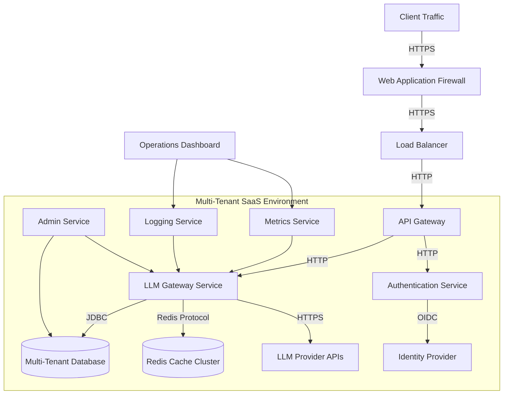
```mermaid
graph TD
    Internet[Client Traffic] --> |HTTPS| WAF[Web Application Firewall]
    WAF --> |HTTPS| LB[Load Balancer]
    LB --> |HTTP| GW[API Gateway]
    
    subgraph "Multi-Tenant SaaS Environment"
        GW --> |HTTP| AuthSvc[Authentication Service]
        GW --> |HTTP| LLMSvc[LLM Gateway Service]
        
        LLMSvc --> |JDBC| DB[(Multi-Tenant Database)]
        LLMSvc --> |Redis Protocol| Cache[(Redis Cache Cluster)]
        LLMSvc --> |HTTPS| LLMProviders[LLM Provider APIs]
        
        AuthSvc --> |OIDC| IdP[Identity Provider]
        
        MetricsSvc[Metrics Service] --> LLMSvc
        LoggingSvc[Logging Service] --> LLMSvc
        
        AdminSvc[Admin Service] --> LLMSvc
        AdminSvc --> DB
    end
    
    OpsDashboard[Operations Dashboard] --> MetricsSvc
    OpsDashboard --> LoggingSvc
```

**Key Characteristics:**

- Multi-tenant architecture with logical tenant isolation
- Fully managed by the service provider
- Automatic scaling based on demand
- Shared infrastructure with tenant isolation
- Standard SLAs with tiered support levels
- Global availability through multiple regions

### Dedicated Cloud Deployment

The dedicated cloud deployment provides a single-tenant instance in the cloud:

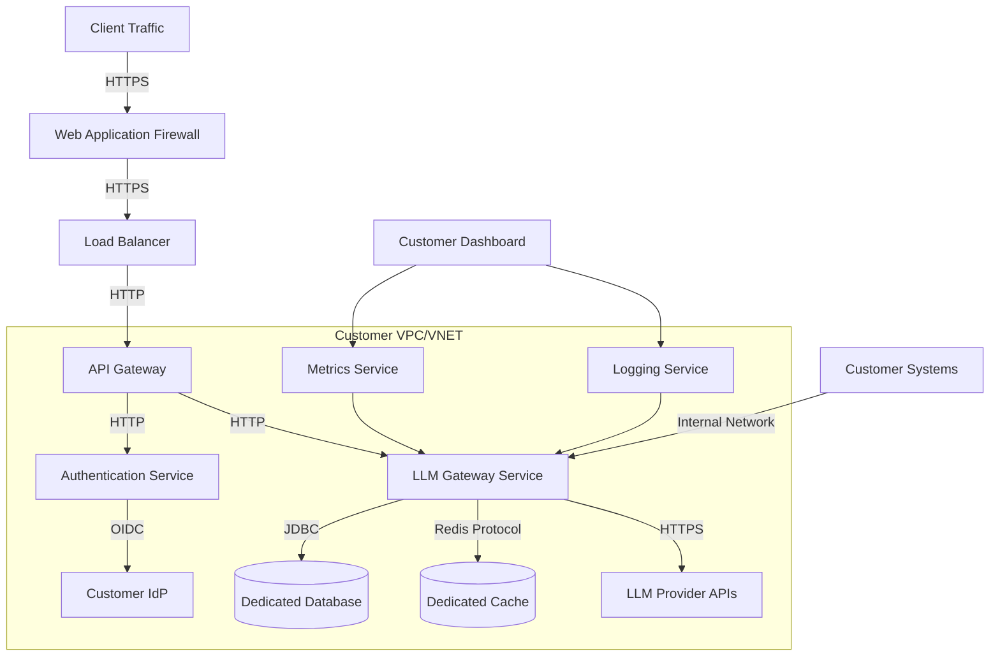
```mermaid
graph TD
    Internet[Client Traffic] --> |HTTPS| WAF[Web Application Firewall]
    WAF --> |HTTPS| LB[Load Balancer]
    LB --> |HTTP| GW[API Gateway]
    
    subgraph "Customer VPC/VNET"
        GW --> |HTTP| AuthSvc[Authentication Service]
        GW --> |HTTP| LLMSvc[LLM Gateway Service]
        
        LLMSvc --> |JDBC| DB[(Dedicated Database)]
        LLMSvc --> |Redis Protocol| Cache[(Dedicated Cache)]
        LLMSvc --> |HTTPS| LLMProviders[LLM Provider APIs]
        
        AuthSvc --> |OIDC| IdP[Customer IdP]
        
        MetricsSvc[Metrics Service] --> LLMSvc
        LoggingSvc[Logging Service] --> LLMSvc
    end
    
    CustomerInteg[Customer Systems] --> |Internal Network| LLMSvc
    CustomerDashboard[Customer Dashboard] --> MetricsSvc
    CustomerDashboard --> LoggingSvc
```

**Key Characteristics:**

- Single-tenant architecture with physical isolation
- Deployed in customer's cloud environment
- Customer-controlled scaling and resource allocation
- Integration with customer's identity provider
- Customer-specific customizations
- Supports customer-specific compliance requirements

### On-Premises Deployment

The on-premises deployment provides a self-hosted solution in the customer's data center:

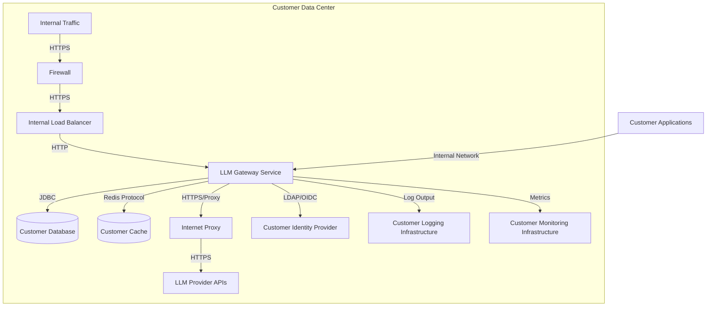
```mermaid
graph TD
    subgraph "Customer Data Center"
        InternalTraffic[Internal Traffic] --> |HTTPS| FW[Firewall]
        FW --> |HTTPS| InternalLB[Internal Load Balancer]
        InternalLB --> |HTTP| LLMSvc[LLM Gateway Service]
        
        LLMSvc --> |JDBC| DB[(Customer Database)]
        LLMSvc --> |Redis Protocol| Cache[(Customer Cache)]
        
        LLMSvc --> |HTTPS/Proxy| InternetProxy[Internet Proxy]
        InternetProxy --> |HTTPS| LLMProviders[LLM Provider APIs]
        
        LLMSvc --> |LDAP/OIDC| CustomerIdP[Customer Identity Provider]
        
        LLMSvc --> |Log Output| LogInfra[Customer Logging Infrastructure]
        LLMSvc --> |Metrics| MonInfra[Customer Monitoring Infrastructure]
    end
    
    CustomerApps[Customer Applications] --> |Internal Network| LLMSvc
```

**Key Characteristics:**

- Self-hosted in customer's data center
- Fully integrated with customer's infrastructure
- Customer-managed scaling and resource allocation
- Air-gap option for high-security environments
- Support for offline LLMs
- Custom network and security configurations

### Hybrid Deployment

The hybrid deployment combines cloud and on-premises components:

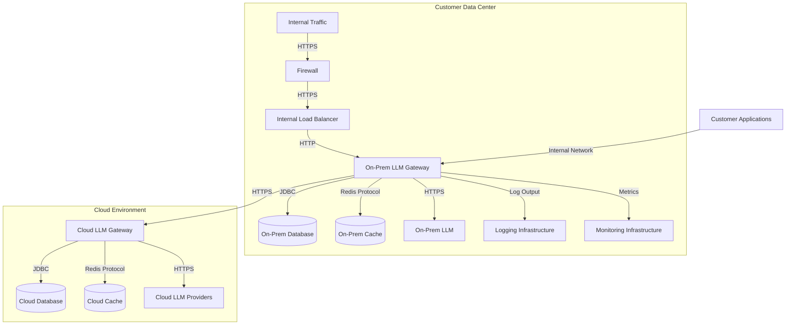
```mermaid
graph TD
    subgraph "Customer Data Center"
        InternalTraffic[Internal Traffic] --> |HTTPS| FW[Firewall]
        FW --> |HTTPS| InternalLB[Internal Load Balancer]
        InternalLB --> |HTTP| OnPremLLMSvc[On-Prem LLM Gateway]
        
        OnPremLLMSvc --> |JDBC| OnPremDB[(On-Prem Database)]
        OnPremLLMSvc --> |Redis Protocol| OnPremCache[(On-Prem Cache)]
        OnPremLLMSvc --> |HTTPS| OnPremLLM[On-Prem LLM]
        
        OnPremLLMSvc --> |Log Output| LogInfra[Logging Infrastructure]
        OnPremLLMSvc --> |Metrics| MonInfra[Monitoring Infrastructure]
    end
    
    subgraph "Cloud Environment"
        OnPremLLMSvc --> |HTTPS| CloudLLMSvc[Cloud LLM Gateway]
        
        CloudLLMSvc --> |JDBC| CloudDB[(Cloud Database)]
        CloudLLMSvc --> |Redis Protocol| CloudCache[(Cloud Cache)]
        CloudLLMSvc --> |HTTPS| CloudLLM[Cloud LLM Providers]
    end
    
    CustomerApps[Customer Applications] --> |Internal Network| OnPremLLMSvc
```

**Key Characteristics:**

- Sensitive operations in customer data center
- Cloud-based model access for advanced capabilities
- Policy-based routing of requests
- Synchronized configuration across environments
- Fallback capabilities for resilience
- Unified management plane

### Air-Gapped Deployment

The air-gapped deployment provides a completely isolated solution:

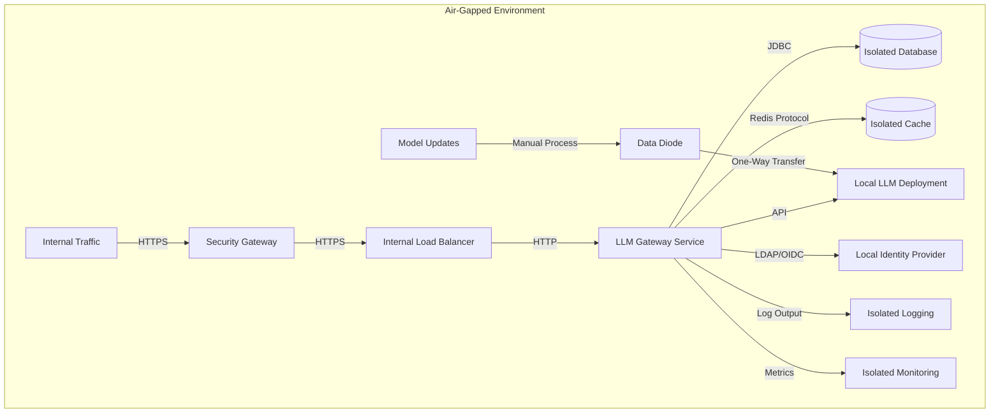
```mermaid
graph TD
    subgraph "Air-Gapped Environment"
        InternalTraffic[Internal Traffic] --> |HTTPS| SecurityGW[Security Gateway]
        SecurityGW --> |HTTPS| InternalLB[Internal Load Balancer]
        InternalLB --> |HTTP| LLMSvc[LLM Gateway Service]
        
        LLMSvc --> |JDBC| DB[(Isolated Database)]
        LLMSvc --> |Redis Protocol| Cache[(Isolated Cache)]
        LLMSvc --> |API| LocalLLM[Local LLM Deployment]
        
        LLMSvc --> |LDAP/OIDC| LocalIdP[Local Identity Provider]
        
        LLMSvc --> |Log Output| LogInfra[Isolated Logging]
        LLMSvc --> |Metrics| MonInfra[Isolated Monitoring]
        
        ModelUpdates[Model Updates] --> |Manual Process| DataDiode[Data Diode]
        DataDiode --> |One-Way Transfer| LocalLLM
    end
```

**Key Characteristics:**

- No external network connections
- Self-contained LLM deployment
- Manual updates through secure channels
- Complete isolation from external networks
- Specialized security controls
- Support for classified environments

## Container Architecture

The LLM Gateway is containerized using Docker for consistent deployment across environments.

### Container Structure

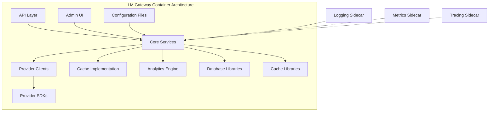
```mermaid
graph TD
    subgraph "LLM Gateway Container Architecture"
        API[API Layer] --> Core[Core Services]
        Admin[Admin UI] --> Core
        
        Core --> Providers[Provider Clients]
        Core --> CacheImpl[Cache Implementation]
        Core --> Analytics[Analytics Engine]
        
        Providers --> ProviderSDKs[Provider SDKs]
        
        Core --> DBLib[Database Libraries]
        Core --> CacheLib[Cache Libraries]
        
        ConfigFiles[Configuration Files] --> Core
    end
    
    Sidecar1[Logging Sidecar] -.-> Core
    Sidecar2[Metrics Sidecar] -.-> Core
    Sidecar3[Tracing Sidecar] -.-> Core
```

### Image Layers

The container images use a layered approach for efficiency:

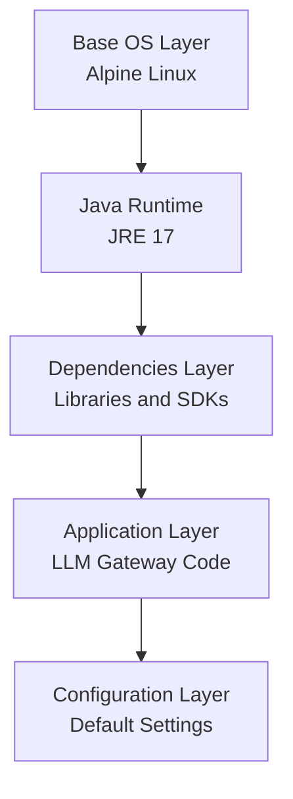
```mermaid
graph TD
    BaseOS[Base OS Layer<br>Alpine Linux] --> JavaRuntime[Java Runtime<br>JRE 17]
    
    JavaRuntime --> Dependencies[Dependencies Layer<br>Libraries and SDKs]
    
    Dependencies --> Application[Application Layer<br>LLM Gateway Code]
    
    Application --> Config[Configuration Layer<br>Default Settings]
```

**Layer Details:**

1. **Base OS Layer**: Alpine Linux for minimal footprint (120MB)
2. **Java Runtime**: OpenJDK JRE 17 optimized for containers (180MB)
3. **Dependencies**: Third-party libraries and SDKs (200MB)
4. **Application**: LLM Gateway application code (50MB)
5. **Configuration**: Default configuration files (5MB)

Total image size: Approximately 555MB

### Resource Requirements

Resource requirements vary by deployment size:

| Deployment Size | CPU | Memory | Disk | Network | Instances |
|-----------------|-----|--------|------|---------|-----------|
| Small (100 req/min) | 2 cores | 4GB | 20GB | 100Mbps | 2 |
| Medium (500 req/min) | 4 cores | 8GB | 40GB | 500Mbps | 3-5 |
| Large (2000 req/min) | 8 cores | 16GB | 80GB | 1Gbps | 5-10 |
| Enterprise (5000+ req/min) | 16 cores | 32GB | 160GB | 10Gbps | 10+ |

## Kubernetes Deployment

The LLM Gateway is designed for deployment on Kubernetes.

### Pod Specifications

```yaml
# Example pod specification
apiVersion: v1
kind: Pod
metadata:
  name: llm-gateway
  labels:
    app: llm-gateway
    component: api
spec:
  containers:
  - name: llm-gateway
    image: llm-gateway:1.0.0
    ports:
    - containerPort: 8080
    resources:
      requests:
        memory: "4Gi"
        cpu: "2"
      limits:
        memory: "8Gi"
        cpu: "4"
    env:
    - name: SPRING_PROFILES_ACTIVE
      value: "production"
    - name: DB_HOST
      valueFrom:
        configMapKeyRef:
          name: llm-gateway-config
          key: db.host
    - name: DB_PASSWORD
      valueFrom:
        secretKeyRef:
          name: llm-gateway-secrets
          key: db.password
    volumeMounts:
    - name: config-volume
      mountPath: /app/config
    - name: logs-volume
      mountPath: /app/logs
    readinessProbe:
      httpGet:
        path: /actuator/health/readiness
        port: 8080
      initialDelaySeconds: 30
      periodSeconds: 10
    livenessProbe:
      httpGet:
        path: /actuator/health/liveness
        port: 8080
      initialDelaySeconds: 60
      periodSeconds: 15
  volumes:
  - name: config-volume
    configMap:
      name: llm-gateway-config
  - name: logs-volume
    emptyDir: {}
```

### Service Configuration

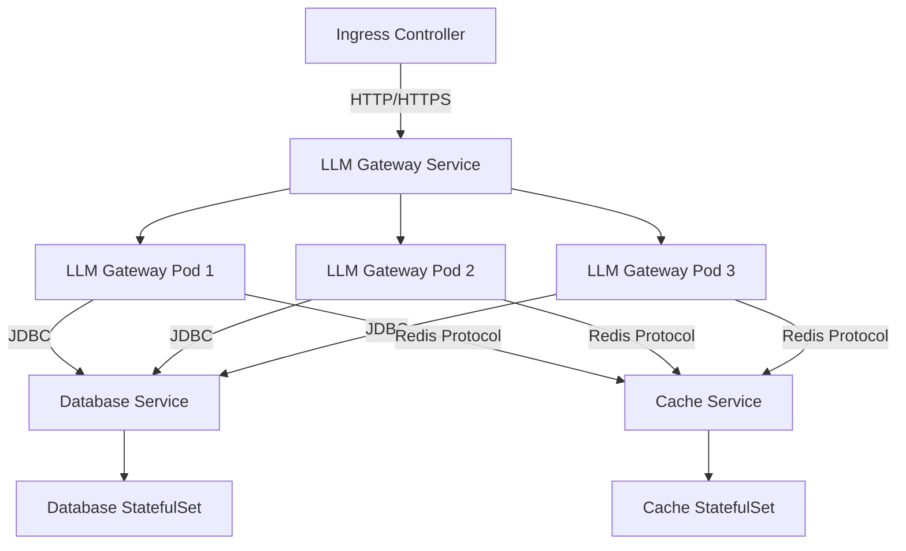
```mermaid
graph TD
    Ingress[Ingress Controller] --> |HTTP/HTTPS| Service[LLM Gateway Service]
    
    Service --> Pod1[LLM Gateway Pod 1]
    Service --> Pod2[LLM Gateway Pod 2]
    Service --> Pod3[LLM Gateway Pod 3]
    
    Pod1 --> |JDBC| DBService[Database Service]
    Pod2 --> |JDBC| DBService
    Pod3 --> |JDBC| DBService
    
    Pod1 --> |Redis Protocol| CacheService[Cache Service]
    Pod2 --> |Redis Protocol| CacheService
    Pod3 --> |Redis Protocol| CacheService
    
    DBService --> DBStatefulSet[Database StatefulSet]
    CacheService --> CacheStatefulSet[Cache StatefulSet]
```

### Stateful Components

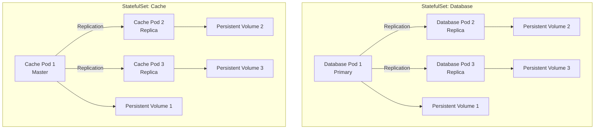
```mermaid
graph TD
    subgraph "StatefulSet: Database"
        DBPod1[Database Pod 1<br>Primary] --> |Replication| DBPod2[Database Pod 2<br>Replica]
        DBPod1 --> |Replication| DBPod3[Database Pod 3<br>Replica]
        
        DBPod1 --> DBStorage1[Persistent Volume 1]
        DBPod2 --> DBStorage2[Persistent Volume 2]
        DBPod3 --> DBStorage3[Persistent Volume 3]
    end
    
    subgraph "StatefulSet: Cache"
        CachePod1[Cache Pod 1<br>Master] --> |Replication| CachePod2[Cache Pod 2<br>Replica]
        CachePod1 --> |Replication| CachePod3[Cache Pod 3<br>Replica]
        
        CachePod1 --> CacheStorage1[Persistent Volume 1]
        CachePod2 --> CacheStorage2[Persistent Volume 2]
        CachePod3 --> CacheStorage3[Persistent Volume 3]
    end
```

### ConfigMaps and Secrets

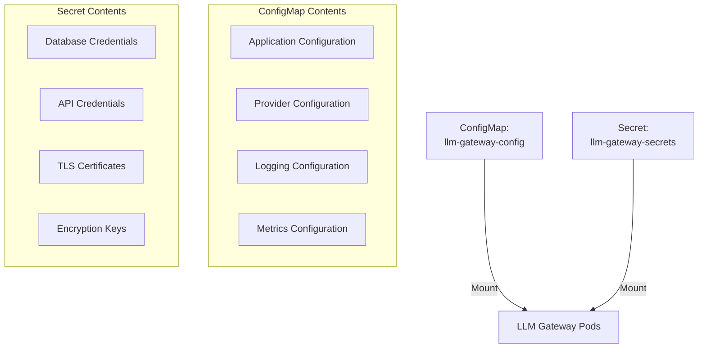
```mermaid
graph TD
    ConfigMap[ConfigMap:<br>llm-gateway-config] --> |Mount| Pods[LLM Gateway Pods]
    
    subgraph "ConfigMap Contents"
        AppConfig[Application Configuration]
        ProviderConfig[Provider Configuration]
        LoggingConfig[Logging Configuration]
        MetricsConfig[Metrics Configuration]
    end
    
    Secret[Secret:<br>llm-gateway-secrets] --> |Mount| Pods
    
    subgraph "Secret Contents"
        DBCreds[Database Credentials]
        APICreds[API Credentials]
        TLSCerts[TLS Certificates]
        EncryptionKeys[Encryption Keys]
    end
```

## Scaling Strategy

### Horizontal Scaling

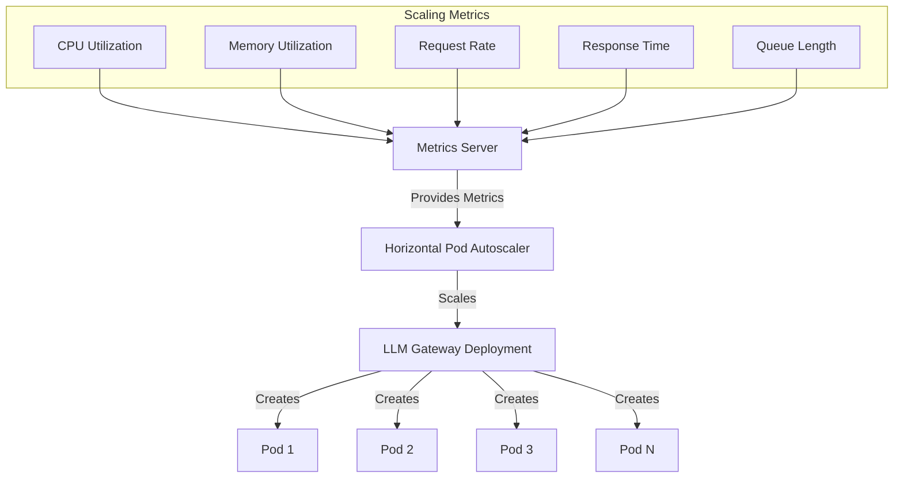
```mermaid
graph TD
    HPA[Horizontal Pod Autoscaler] --> |Scales| Deployment[LLM Gateway Deployment]
    
    Metrics[Metrics Server] --> |Provides Metrics| HPA
    
    Deployment --> |Creates| Pod1[Pod 1]
    Deployment --> |Creates| Pod2[Pod 2]
    Deployment --> |Creates| Pod3[Pod 3]
    Deployment --> |Creates| PodN[Pod N]
    
    subgraph "Scaling Metrics"
        CPU[CPU Utilization]
        Memory[Memory Utilization]
        RequestRate[Request Rate]
        ResponseTime[Response Time]
        QueueLength[Queue Length]
    end
    
    CPU --> Metrics
    Memory --> Metrics
    RequestRate --> Metrics
    ResponseTime --> Metrics
    QueueLength --> Metrics
```

**Horizontal Scaling Configuration:**

```yaml
# Example HPA configuration
apiVersion: autoscaling/v2
kind: HorizontalPodAutoscaler
metadata:
  name: llm-gateway-hpa
spec:
  scaleTargetRef:
    apiVersion: apps/v1
    kind: Deployment
    name: llm-gateway
  minReplicas: 3
  maxReplicas: 20
  metrics:
  - type: Resource
    resource:
      name: cpu
      target:
        type: Utilization
        averageUtilization: 70
  - type: Resource
    resource:
      name: memory
      target:
        type: Utilization
        averageUtilization: 75
  - type: Pods
    pods:
      metric:
        name: http_requests_per_second
      target:
        type: AverageValue
        averageValue: 100
  behavior:
    scaleUp:
      stabilizationWindowSeconds: 60
      policies:
      - type: Percent
        value: 100
        periodSeconds: 60
    scaleDown:
      stabilizationWindowSeconds: 300
      policies:
      - type: Percent
        value: 20
        periodSeconds: 60
```

### Vertical Scaling

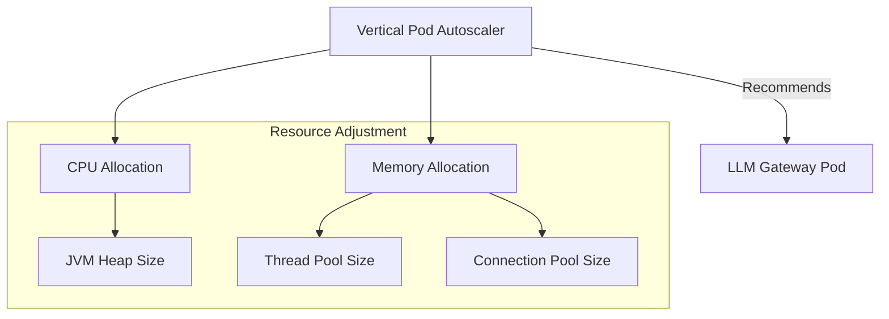
```mermaid
graph TD
    VPA[Vertical Pod Autoscaler] --> |Recommends| Pod[LLM Gateway Pod]
    
    subgraph "Resource Adjustment"
        CPU[CPU Allocation]
        Memory[Memory Allocation]
        JVMHeap[JVM Heap Size]
        ThreadPool[Thread Pool Size]
        ConnectionPool[Connection Pool Size]
    end
    
    VPA --> CPU
    VPA --> Memory
    CPU --> JVMHeap
    Memory --> ThreadPool
    Memory --> ConnectionPool
```

**Vertical Scaling Configuration:**

```yaml
# Example VPA configuration
apiVersion: autoscaling.k8s.io/v1
kind: VerticalPodAutoscaler
metadata:
  name: llm-gateway-vpa
spec:
  targetRef:
    apiVersion: apps/v1
    kind: Deployment
    name: llm-gateway
  updatePolicy:
    updateMode: Auto
  resourcePolicy:
    containerPolicies:
    - containerName: '*'
      minAllowed:
        cpu: 1
        memory: 2Gi
      maxAllowed:
        cpu: 8
        memory: 16Gi
```

### Auto-Scaling Configuration

The LLM Gateway implements a multi-dimensional scaling strategy:

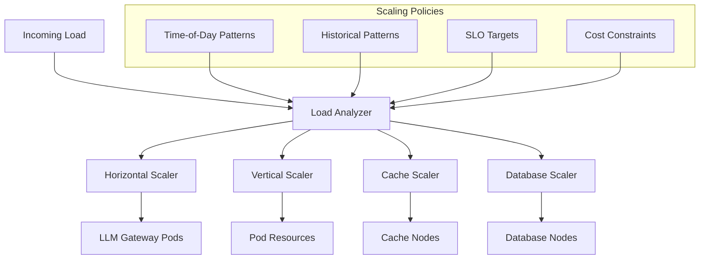
```mermaid
graph TD
    Load[Incoming Load] --> LoadAnalyzer[Load Analyzer]
    
    LoadAnalyzer --> HorizontalScaler[Horizontal Scaler]
    LoadAnalyzer --> VerticalScaler[Vertical Scaler]
    LoadAnalyzer --> CacheScaler[Cache Scaler]
    LoadAnalyzer --> DBScaler[Database Scaler]
    
    HorizontalScaler --> Pods[LLM Gateway Pods]
    VerticalScaler --> Resources[Pod Resources]
    CacheScaler --> CacheNodes[Cache Nodes]
    DBScaler --> DBNodes[Database Nodes]
    
    subgraph "Scaling Policies"
        TimeOfDay[Time-of-Day Patterns]
        UsagePatterns[Historical Patterns]
        SLOTargets[SLO Targets]
        CostConstraints[Cost Constraints]
    end
    
    TimeOfDay --> LoadAnalyzer
    UsagePatterns --> LoadAnalyzer
    SLOTargets --> LoadAnalyzer
    CostConstraints --> LoadAnalyzer
```

**Scaling Rules:**

1. **Predictive Scaling**: Scale based on historical patterns
2. **Reactive Scaling**: Respond to unexpected load changes
3. **Cost-Based Scaling**: Balance performance and cost
4. **SLO-Based Scaling**: Maintain service level objectives
5. **Cache Adjustment**: Scale cache size based on hit ratio
6. **Database Scaling**: Adjust database resources based on query performance

## High Availability Setup

### Redundancy Patterns

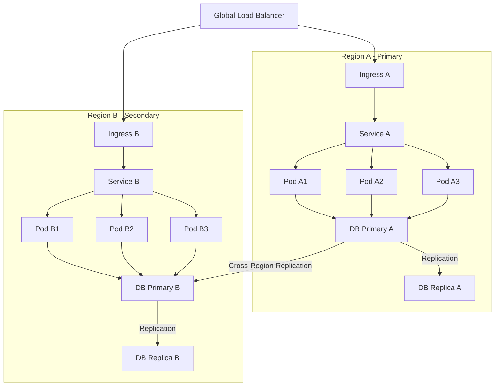
```mermaid
graph TD
    subgraph "Region A - Primary"
        IngressA[Ingress A] --> ServiceA[Service A]
        
        ServiceA --> PodA1[Pod A1]
        ServiceA --> PodA2[Pod A2]
        ServiceA --> PodA3[Pod A3]
        
        PodA1 --> DBPrimaryA[DB Primary A]
        PodA2 --> DBPrimaryA
        PodA3 --> DBPrimaryA
        
        DBPrimaryA --> |Replication| DBReplicaA[DB Replica A]
    end
    
    subgraph "Region B - Secondary"
        IngressB[Ingress B] --> ServiceB[Service B]
        
        ServiceB --> PodB1[Pod B1]
        ServiceB --> PodB2[Pod B2]
        ServiceB --> PodB3[Pod B3]
        
        PodB1 --> DBPrimaryB[DB Primary B]
        PodB2 --> DBPrimaryB
        PodB3 --> DBPrimaryB
        
        DBPrimaryB --> |Replication| DBReplicaB[DB Replica B]
    end
    
    GlobalLB[Global Load Balancer] --> IngressA
    GlobalLB --> IngressB
    
    DBPrimaryA --> |Cross-Region Replication| DBPrimaryB
```

### Failure Recovery

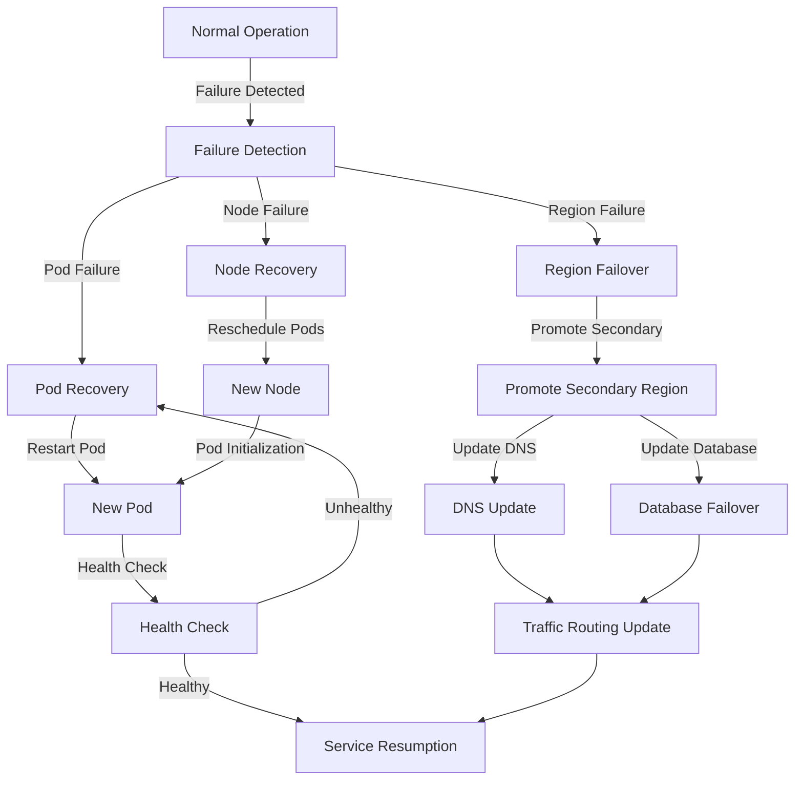
```mermaid
flowchart TD
    Normal[Normal Operation] --> |Failure Detected| FailureDetection[Failure Detection]
    
    FailureDetection --> |Pod Failure| PodRecovery[Pod Recovery]
    FailureDetection --> |Node Failure| NodeRecovery[Node Recovery]
    FailureDetection --> |Region Failure| RegionFailover[Region Failover]
    
    PodRecovery --> |Restart Pod| NewPod[New Pod]
    NewPod --> |Health Check| HealthCheck[Health Check]
    HealthCheck --> |Healthy| ServiceResume[Service Resumption]
    HealthCheck --> |Unhealthy| PodRecovery
    
    NodeRecovery --> |Reschedule Pods| NewNode[New Node]
    NewNode --> |Pod Initialization| NewPod
    
    RegionFailover --> |Promote Secondary| PromoteSecondary[Promote Secondary Region]
    PromoteSecondary --> |Update DNS| DNSUpdate[DNS Update]
    PromoteSecondary --> |Update Database| DBFailover[Database Failover]
    DNSUpdate --> RoutingUpdate[Traffic Routing Update]
    DBFailover --> RoutingUpdate
    RoutingUpdate --> ServiceResume
```

**Recovery Time Objectives:**

| Failure Type | Recovery Time Objective | Recovery Process |
|--------------|-------------------------|------------------|
| Pod Failure | < 30 seconds | Kubernetes automatically restarts the pod |
| Node Failure | < 2 minutes | Kubernetes reschedules pods on healthy nodes |
| Zone Failure | < 5 minutes | Multi-zone deployment ensures service continuity |
| Region Failure | < 15 minutes | Manual or automated region failover process |
| Database Failure | < 3 minutes | Automatic promotion of replica to primary |
| Cache Failure | < 1 minute | Automatic failover to replica cache |

## Network Architecture

### Service Mesh

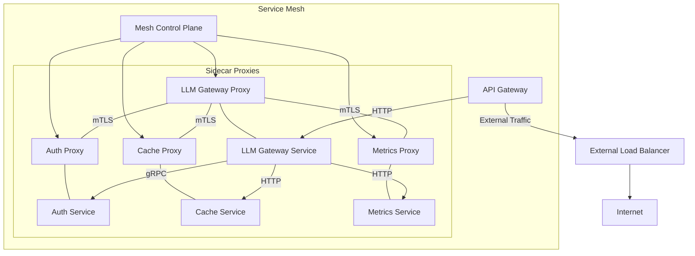
```mermaid
graph TD
    subgraph "Service Mesh"
        Gateway[API Gateway] --> |HTTP| LLMService[LLM Gateway Service]
        LLMService --> |gRPC| AuthService[Auth Service]
        LLMService --> |HTTP| CacheService[Cache Service]
        LLMService --> |HTTP| MetricsService[Metrics Service]
        
        subgraph "Sidecar Proxies"
            LLMProxy[LLM Gateway Proxy] --- LLMService
            AuthProxy[Auth Proxy] --- AuthService
            CacheProxy[Cache Proxy] --- CacheService
            MetricsProxy[Metrics Proxy] --- MetricsService
        end
        
        LLMProxy ---|mTLS| AuthProxy
        LLMProxy ---|mTLS| CacheProxy
        LLMProxy ---|mTLS| MetricsProxy
        
        MeshControl[Mesh Control Plane] --> LLMProxy
        MeshControl --> AuthProxy
        MeshControl --> CacheProxy
        MeshControl --> MetricsProxy
    end
    
    Gateway --> |External Traffic| ExternalLB[External Load Balancer]
    ExternalLB --> Internet[Internet]
```

**Service Mesh Features:**

1. **mTLS**: Mutual TLS authentication between services
2. **Traffic Management**: Advanced routing and load balancing
3. **Observability**: Distributed tracing and metrics
4. **Resilience**: Circuit breaking and fault injection
5. **Security**: Access control and encryption

### Load Balancing

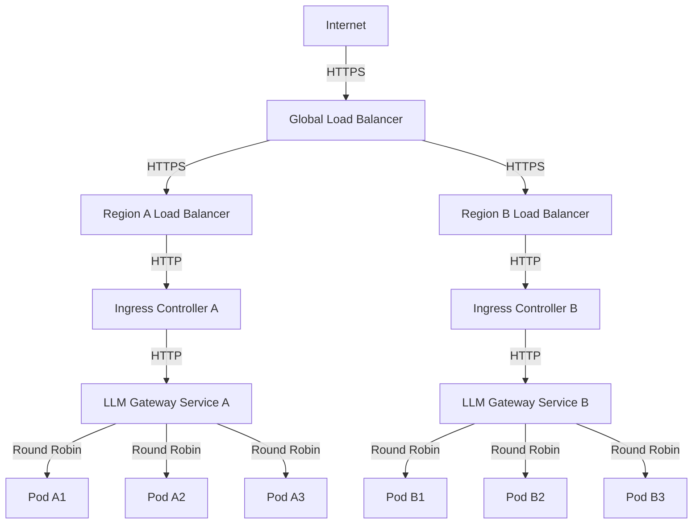
```mermaid
graph TD
    Internet[Internet] --> |HTTPS| GlobalLB[Global Load Balancer]
    
    GlobalLB --> |HTTPS| RegionALB[Region A Load Balancer]
    GlobalLB --> |HTTPS| RegionBLB[Region B Load Balancer]
    
    RegionALB --> |HTTP| IngressA[Ingress Controller A]
    RegionBLB --> |HTTP| IngressB[Ingress Controller B]
    
    IngressA --> |HTTP| ServiceA[LLM Gateway Service A]
    IngressB --> |HTTP| ServiceB[LLM Gateway Service B]
    
    ServiceA --> |Round Robin| PodA1[Pod A1]
    ServiceA --> |Round Robin| PodA2[Pod A2]
    ServiceA --> |Round Robin| PodA3[Pod A3]
    
    ServiceB --> |Round Robin| PodB1[Pod B1]
    ServiceB --> |Round Robin| PodB2[Pod B2]
    ServiceB --> |Round Robin| PodB3[Pod B3]
```

**Load Balancing Methods:**

1. **Global**: Geographic routing based on client location and region health
2. **Regional**: Load distribution across multiple availability zones
3. **Service**: Kubernetes service-level load balancing
4. **Session Affinity**: Sticky sessions for streaming connections
5. **Health-Aware**: Routing based on service health and capacity

### Traffic Management

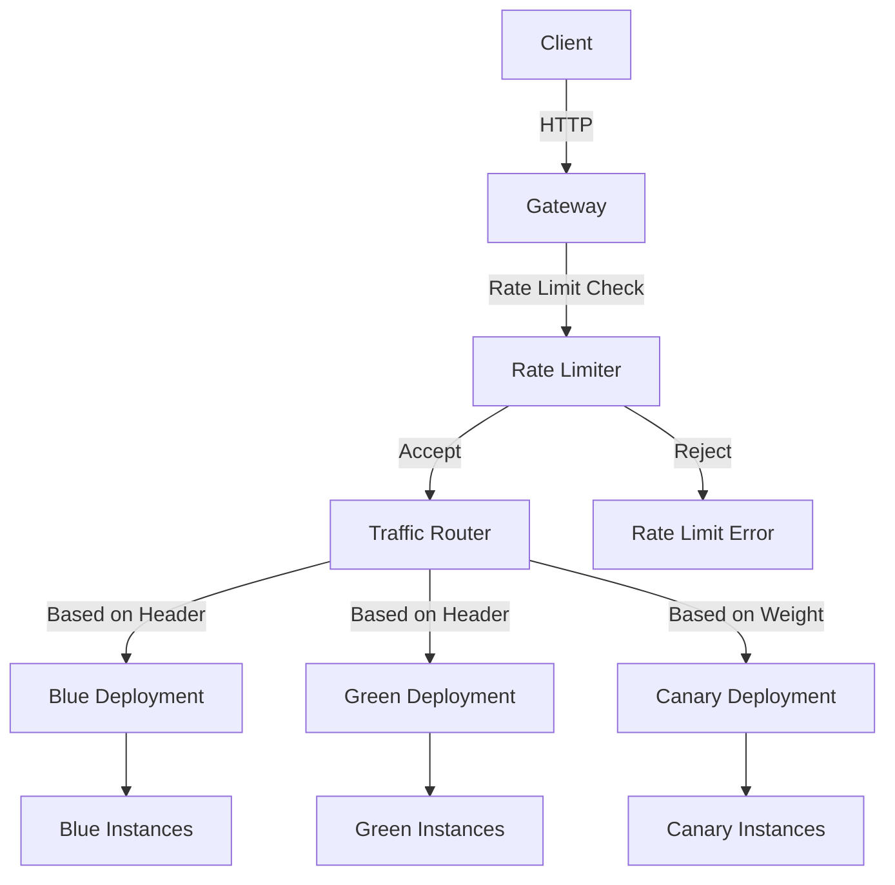
```mermaid
graph TD
    Client[Client] --> |HTTP| Gateway[Gateway]
    
    Gateway --> |Rate Limit Check| RateLimiter[Rate Limiter]
    
    RateLimiter --> |Accept| Router[Traffic Router]
    RateLimiter --> |Reject| RateError[Rate Limit Error]
    
    Router --> |Based on Header| BlueService[Blue Deployment]
    Router --> |Based on Header| GreenService[Green Deployment]
    Router --> |Based on Weight| CanaryService[Canary Deployment]
    
    BlueService --> BlueInstances[Blue Instances]
    GreenService --> GreenInstances[Green Instances]
    CanaryService --> CanaryInstances[Canary Instances]
```

**Traffic Management Capabilities:**

1. **Blue-Green Deployments**: Switch between deployment versions
2. **Canary Releases**: Gradual rollout of new versions
3. **A/B Testing**: Split traffic for feature testing
4. **Circuit Breaking**: Prevent cascading failures
5. **Rate Limiting**: Protect services from traffic spikes
6. **Traffic Splitting**: Route by percentage or header values

## Storage Architecture

### Database Options

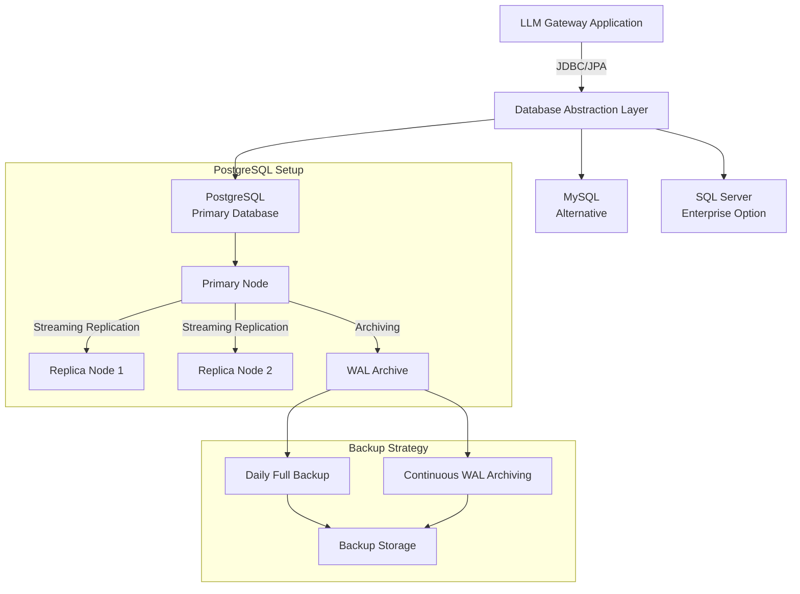
```mermaid
graph TD
    App[LLM Gateway Application] --> |JDBC/JPA| DBAbstraction[Database Abstraction Layer]
    
    DBAbstraction --> PostgreSQL[PostgreSQL<br>Primary Database]
    DBAbstraction --> MySQL[MySQL<br>Alternative]
    DBAbstraction --> SQLServer[SQL Server<br>Enterprise Option]
    
    subgraph "PostgreSQL Setup"
        PostgreSQL --> PGPrimary[Primary Node]
        PGPrimary --> |Streaming Replication| PGReplica1[Replica Node 1]
        PGPrimary --> |Streaming Replication| PGReplica2[Replica Node 2]
        PGPrimary --> |Archiving| WALArchive[WAL Archive]
    end
    
    subgraph "Backup Strategy"
        WALArchive --> DailyBackup[Daily Full Backup]
        WALArchive --> ContinuousArchiving[Continuous WAL Archiving]
        DailyBackup --> BackupStorage[Backup Storage]
        ContinuousArchiving --> BackupStorage
    end
```

**Database Requirements:**

1. **Performance**: Support for high transaction rates
2. **Scalability**: Horizontal read scaling through replicas
3. **Reliability**: Automatic failover and high availability
4. **Backup**: Point-in-time recovery capabilities
5. **Security**: Column-level encryption for sensitive data

### Cache Infrastructure

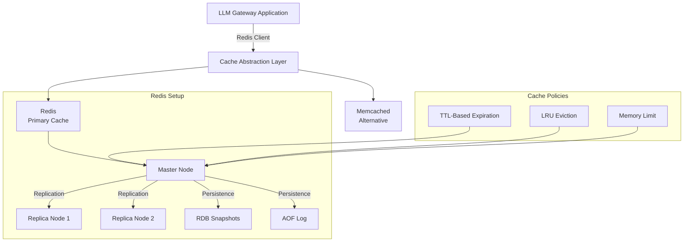
```mermaid
graph TD
    App[LLM Gateway Application] --> |Redis Client| CacheAbstraction[Cache Abstraction Layer]
    
    CacheAbstraction --> Redis[Redis<br>Primary Cache]
    CacheAbstraction --> Memcached[Memcached<br>Alternative]
    
    subgraph "Redis Setup"
        Redis --> RedisMaster[Master Node]
        RedisMaster --> |Replication| RedisSlave1[Replica Node 1]
        RedisMaster --> |Replication| RedisSlave2[Replica Node 2]
        
        RedisMaster --> |Persistence| RDB[RDB Snapshots]
        RedisMaster --> |Persistence| AOF[AOF Log]
    end
    
    subgraph "Cache Policies"
        TTLPolicy[TTL-Based Expiration]
        LRUPolicy[LRU Eviction]
        SizeLimit[Memory Limit]
    end
    
    TTLPolicy --> RedisMaster
    LRUPolicy --> RedisMaster
    SizeLimit --> RedisMaster
```

**Cache Design:**

1. **High Availability**: Multi-node Redis cluster
2. **Persistence**: RDB snapshots and AOF logs
3. **Eviction Policies**: TTL and LRU-based approaches
4. **Memory Management**: Configurable memory limits
5. **Data Partitioning**: Sharding for large deployments

### Persistent Volume Management

```mermaid
graph TD
    Pod[LLM Gateway Pod] --> |Volume Mount| PV[Persistent Volume]
    
    PV --> |Storage Class| SC[Storage Class]
    
    SC --> |Dynamic Provisioning| StorageBackend[Storage Backend]
    
    subgraph "Storage Options"
        BlockStorage[Block Storage<br>EBS, Persistent Disk]
        FileStorage[File Storage<br>EFS, Azure Files]
        ObjectStorage[Object Storage<br>S3, Blob Storage]
    end
    
    StorageBackend --> BlockStorage
    StorageBackend --> FileStorage
    StorageBackend --> ObjectStorage
```

**Storage Requirements:**

1. **Performance**: Low-latency storage for databases
2. **Reliability**: Redundant storage for critical data
3. **Scalability**: Dynamically expandable volumes
4. **Backup**: Integration with backup systems
5. **Security**: Encryption at rest for sensitive data

## Infrastructure as Code

### Terraform Modules

```mermaid
graph TD
    Root[Root Module] --> NetworkModule[Network Module]
    Root --> ComputeModule[Compute Module]
    Root --> StorageModule[Storage Module]
    Root --> DatabaseModule[Database Module]
    Root --> CacheModule[Cache Module]
    Root --> KubernetesModule[Kubernetes Module]
    
    NetworkModule --> VPC[VPC Resources]
    NetworkModule --> Subnets[Subnet Resources]
    NetworkModule --> SecurityGroups[Security Group Resources]
    
    ComputeModule --> NodePool[Node Pool Resources]
    ComputeModule --> LoadBalancer[Load Balancer Resources]
    
    StorageModule --> PersistentStorage[Persistent Storage Resources]
    StorageModule --> ObjectStorage[Object Storage Resources]
    
    DatabaseModule --> DBCluster[Database Cluster Resources]
    DatabaseModule --> DBBackup[Database Backup Resources]
    
    CacheModule --> CacheCluster[Cache Cluster Resources]
    
    KubernetesModule --> K8sCluster[Kubernetes Cluster Resources]
    KubernetesModule --> K8sConfig[Kubernetes Configuration Resources]
```

**Terraform Structure:**

1. **Modular Architecture**: Composable infrastructure components
2. **Environment Separation**: Dev, staging, production configurations
3. **Provider Abstraction**: Support for multiple cloud providers
4. **State Management**: Remote state with locking
5. **Secret Handling**: Integration with secret management systems

### Helm Charts

```mermaid
graph TD
    LLMGatewayChart[LLM Gateway Helm Chart] --> APIChart[API Chart]
    LLMGatewayChart --> WebChart[Web UI Chart]
    LLMGatewayChart --> DBChart[Database Chart]
    LLMGatewayChart --> CacheChart[Cache Chart]
    
    APIChart --> APIDeployment[API Deployment]
    APIChart --> APIService[API Service]
    APIChart --> APIIngress[API Ingress]
    APIChart --> APIConfig[API ConfigMap]
    APIChart --> APISecret[API Secret]
    
    WebChart --> WebDeployment[Web Deployment]
    WebChart --> WebService[Web Service]
    WebChart --> WebIngress[Web Ingress]
    
    DBChart --> DBStatefulSet[DB StatefulSet]
    DBChart --> DBService[DB Service]
    DBChart --> DBSecret[DB Secret]
    DBChart --> DBPersistentVolume[DB PersistentVolume]
    
    CacheChart --> CacheStatefulSet[Cache StatefulSet]
    CacheChart --> CacheService[Cache Service]
    CacheChart --> CacheConfig[Cache ConfigMap]
    CacheChart --> CachePersistentVolume[Cache PersistentVolume]
```

**Helm Chart Features:**

1. **Environment Parameterization**: Values files for different environments
2. **Dependency Management**: Chart dependencies for components
3. **Resource Templates**: Templated Kubernetes resources
4. **Hooks**: Pre/post-install and upgrade hooks
5. **Versioning**: Chart versioning for release management

## Deployment Pipeline

```mermaid
graph TD
    Code[Source Code] --> |Git Push| CI[CI Pipeline]
    
    CI --> UnitTests[Unit Tests]
    CI --> IntegrationTests[Integration Tests]
    CI --> SecurityScan[Security Scan]
    CI --> BuildImage[Build Container Image]
    
    BuildImage --> |Tag & Push| Registry[Container Registry]
    
    Registry --> |Deployment Request| CD[CD Pipeline]
    
    CD --> ValuesGen[Generate Values]
    ValuesGen --> HelmDeploy[Helm Deployment]
    
    HelmDeploy --> Kubernetes[Kubernetes Cluster]
    
    Kubernetes --> |Deployment| ValidationTests[Validation Tests]
    ValidationTests --> |Success| NotifySuccess[Notification - Success]
    ValidationTests --> |Failure| RollBack[Rollback]
    RollBack --> NotifyFailure[Notification - Failure]
```

**Deployment Pipeline Features:**

1. **Automated Testing**: Comprehensive test suite execution
2. **Security Scanning**: Vulnerability and compliance checks
3. **Image Management**: Versioned and signed container images
4. **Configuration Generation**: Environment-specific configuration
5. **Deployment Automation**: Helm-based deployment process
6. **Validation**: Post-deployment testing and verification
7. **Rollback**: Automated rollback on deployment failures

---

**Previous**: [Domain Model and Business Logic](./domain-model.md) | **Next**: [Observability and Telemetry](./observability-telemetry.md)