# Domain Model and Business Logic

## Table of Contents

- [Introduction](#introduction)
- [Core Domain Concepts](#core-domain-concepts)
- [Domain Model](#domain-model)
  - [LLM Domain](#llm-domain)
  - [Prompt Domain](#prompt-domain)
  - [Execution Domain](#execution-domain)
  - [Analytics Domain](#analytics-domain)
- [Service Layer](#service-layer)
  - [Service Interactions](#service-interactions)
- [Business Logic](#business-logic)
  - [Prompt Management](#prompt-management)
  - [Execution Logic](#execution-logic)
  - [Provider Selection](#provider-selection)
  - [Caching Strategy](#caching-strategy)
- [Cross-Cutting Concerns](#cross-cutting-concerns)
  - [Multi-Tenancy](#multi-tenancy)
  - [Authorization and Access Control](#authorization-and-access-control)
  - [Auditing and Compliance](#auditing-and-compliance)
- [Domain Events](#domain-events)
- [Business Rules](#business-rules)

## Introduction

This document describes the domain model and business logic of the LLM Gateway. It explains the core domain concepts, entities, relationships, and the services that implement the business logic. The domain model provides a conceptual framework for understanding the system, while the business logic describes how these concepts interact to fulfill the system's requirements.

## Core Domain Concepts

The LLM Gateway's domain centers around several core concepts:

1. **LLM Provider**: An external service that provides large language model capabilities
2. **Prompt**: A template with variables that is rendered and sent to an LLM
3. **Execution**: The process of sending a prompt to an LLM and receiving a response
4. **Cache**: Storage for LLM responses to improve performance and reduce costs
5. **Tenant**: An organization or logical grouping of users and resources
6. **Metrics**: Usage and performance data for analysis and billing

These concepts form the foundation of the domain model and drive the system's architecture.

## Domain Model

### LLM Domain

The LLM domain encompasses the entities related to LLM providers and their capabilities:

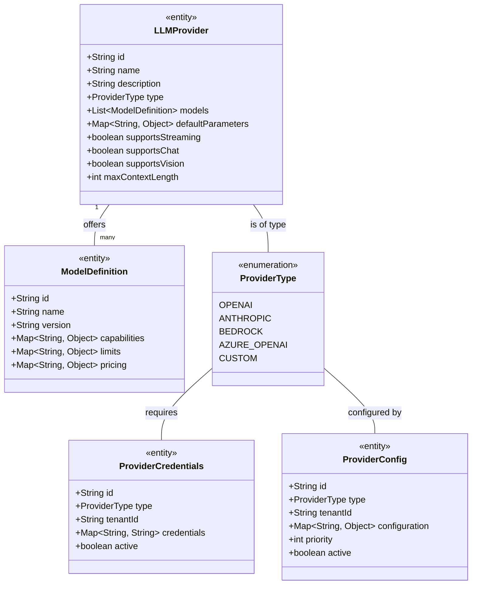

**Domain Logic:**

- `LLMProvider` entities represent available language model providers
- Each provider offers multiple `ModelDefinition` entities with specific capabilities
- `ProviderCredentials` store authentication information for providers
- `ProviderConfig` contains tenant-specific configuration for providers

### Prompt Domain

The Prompt domain encompasses the entities related to prompt templates and their parameters:

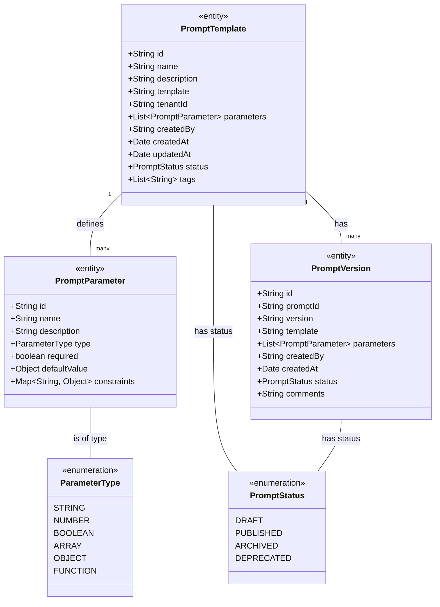

**Domain Logic:**

- `PromptTemplate` entities represent prompt templates with variables
- Each template defines `PromptParameter` entities that specify expected inputs
- `PromptVersion` entities track changes to templates over time
- Templates can be in different states represented by `PromptStatus`

### Execution Domain

The Execution domain encompasses the entities related to executing prompts and handling responses:

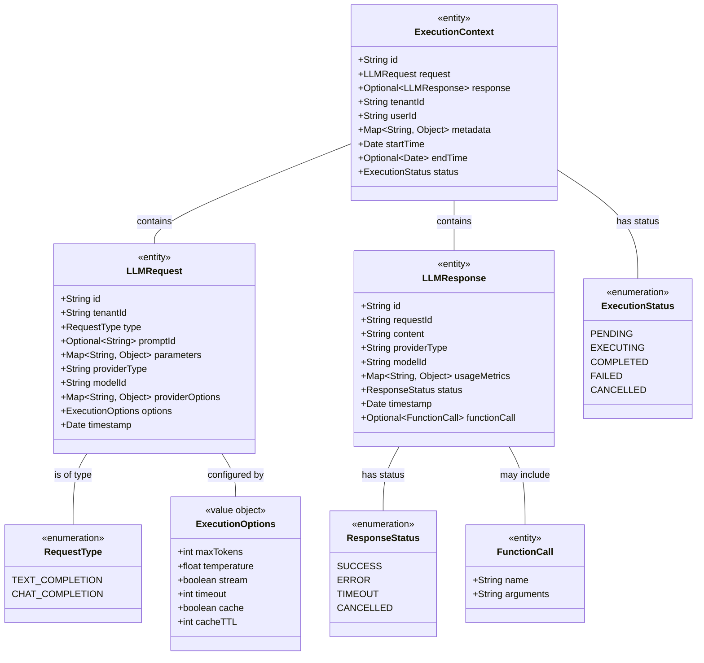

**Domain Logic:**

- `LLMRequest` entities represent requests to LLM providers
- `LLMResponse` entities represent responses from LLM providers
- `ExecutionContext` entities track the lifecycle of request execution
- `ExecutionOptions` define how requests should be processed

### Analytics Domain

The Analytics domain encompasses the entities related to usage metrics and analysis:

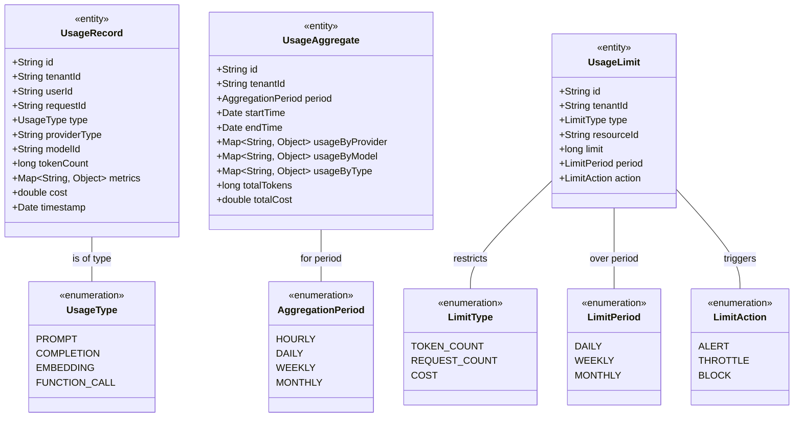

**Domain Logic:**

- `UsageRecord` entities capture detailed usage information for each request
- `UsageAggregate` entities store aggregated usage statistics for reporting
- `UsageLimit` entities define usage constraints for tenants

## Service Layer

The Service Layer implements the business logic that operates on the domain model. The key services are:

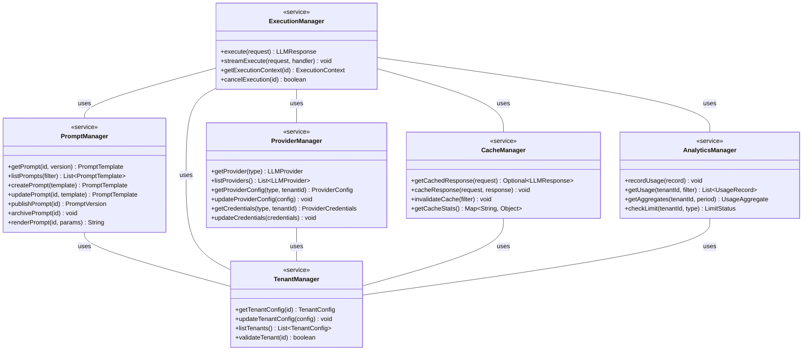

### Service Interactions

The services interact to implement the system's business logic:

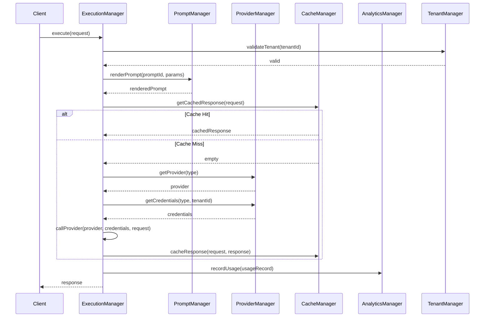

## Business Logic

### Prompt Management

The prompt management logic handles the lifecycle of prompt templates:

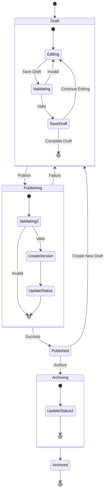

**Key Business Rules:**

1. Prompt templates must have unique names within a tenant
2. Published templates cannot be modified directly - a new draft must be created
3. Templates must be syntactically valid before publishing
4. Template parameters must have defined types and validation rules
5. Draft templates can be modified by their creator or administrators
6. Published templates can be used by any authorized user within the tenant

### Execution Logic

The execution logic handles the processing of LLM requests:

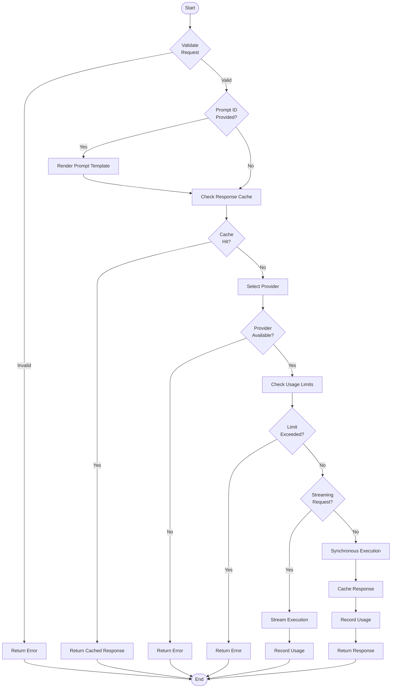

**Key Business Rules:**

1. Requests must be validated before execution
2. Tenant must be authenticated and authorized
3. If a prompt ID is provided, the template must be rendered
4. Cache should be checked before calling external providers
5. Provider selection follows priority and capability rules
6. Usage limits must be enforced before execution
7. Responses should be cached according to caching policy
8. Usage must be recorded for analytics and billing

### Provider Selection

The provider selection logic determines which LLM provider to use for a request:

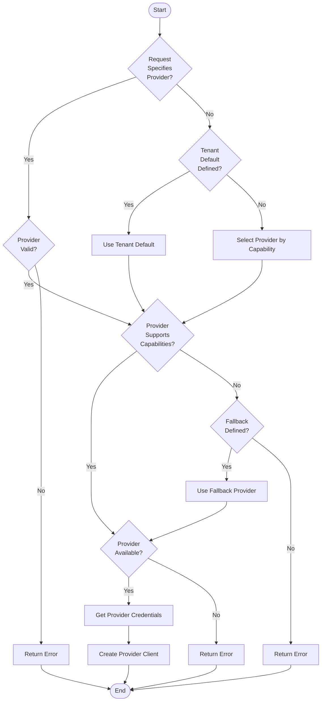

**Key Business Rules:**

1. If the request explicitly specifies a provider, use it if valid
2. If no provider is specified, use tenant default if defined
3. Otherwise, select a provider based on required capabilities
4. Verify that the selected provider supports the required capabilities
5. Fall back to an alternative provider if defined and primary is unavailable
6. Provider must be available (not in failure state or circuit-broken)
7. Provider credentials must be available for the tenant

### Caching Strategy

The caching strategy determines if and how responses are cached:

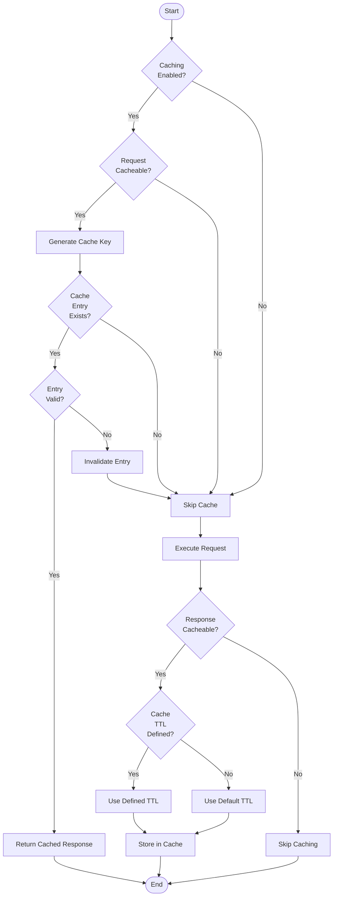

**Key Business Rules:**

1. Caching must be enabled at system and tenant level
2. Request must be cacheable (deterministic, idempotent)
3. Cache key must uniquely identify the request
4. Cached entries must be validated before use
5. Invalid entries must be invalidated
6. Response must be cacheable (success, complete)
7. Cache TTL should respect request or default settings
8. Cache should respect tenant-specific storage limits

## Cross-Cutting Concerns

### Multi-Tenancy

The LLM Gateway implements a multi-tenant architecture:

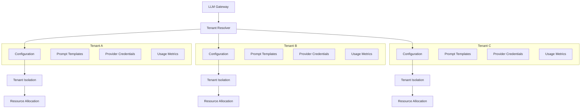

**Multi-Tenancy Implementation:**

1. Tenant identification through API key, JWT, or request parameter
2. Tenant-specific configuration for providers, caching, limits
3. Data isolation at database and cache level
4. Resource allocation and throttling per tenant
5. Usage tracking and billing per tenant

### Authorization and Access Control

The LLM Gateway implements a role-based access control system:

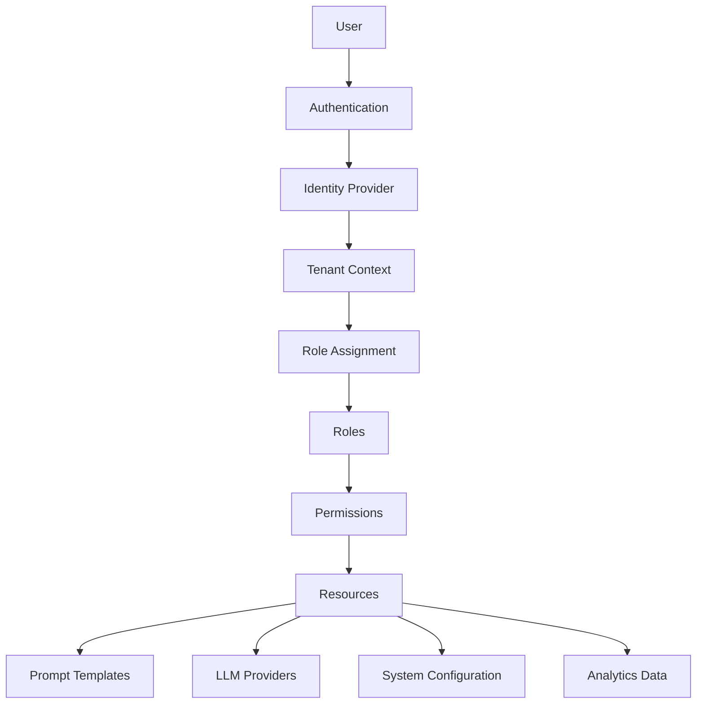

**Access Control Implementation:**

1. User authentication through identity provider
2. Tenant context establishment
3. Role assignment based on tenant and user
4. Permission checking for operations
5. Resource-level access control

### Auditing and Compliance

The LLM Gateway implements comprehensive auditing for compliance:

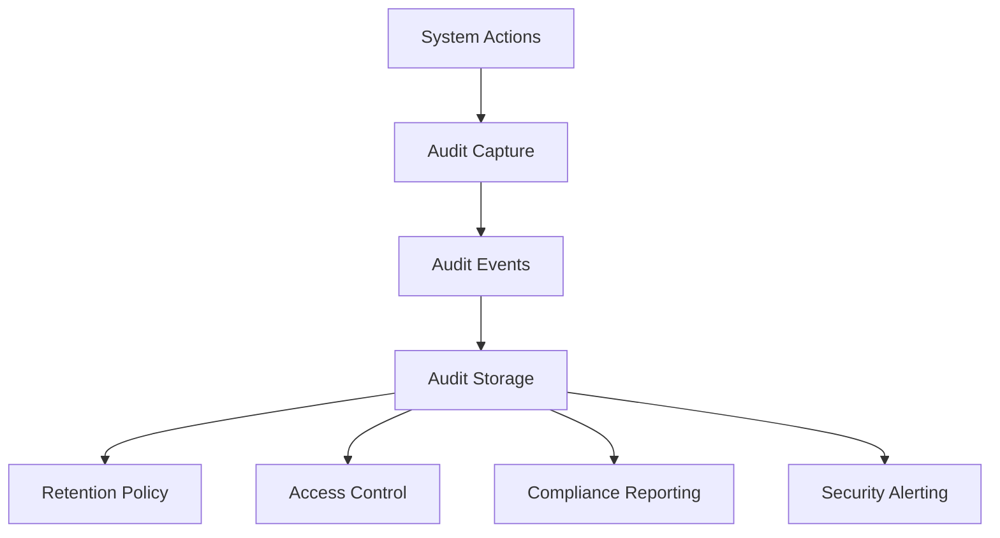

**Auditing Implementation:**

1. Capture of all significant system actions
2. Standardized audit event format
3. Secure, tamper-evident storage
4. Configurable retention policies
5. Access control for audit data
6. Compliance reporting and alerting

## Domain Events

The LLM Gateway uses domain events to communicate between components:

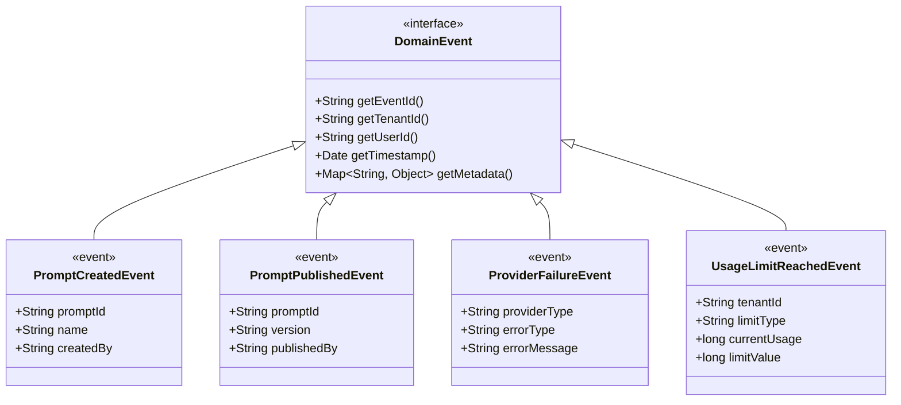

**Event Handling:**

1. Events are published to an event bus
2. Components subscribe to relevant events
3. Events are processed asynchronously
4. Events can trigger system actions or notifications
5. Events are recorded for audit purposes

## Business Rules

The LLM Gateway implements the following key business rules:

1. **Tenant Isolation**
   - Data from one tenant must never be accessible to another tenant
   - Resources must be allocated and tracked per tenant
   - Configuration must be tenant-specific

2. **Provider Management**
   - Provider credentials must be securely stored
   - Provider failures must be handled gracefully
   - Provider selection must follow defined priority and capability rules

3. **Prompt Governance**
   - Prompt templates must follow a version-controlled lifecycle
   - Published prompts must be immutable
   - Prompt usage must be tracked for audit and analytics

4. **Usage Control**
   - Usage limits must be enforced at tenant and user level
   - Usage must be tracked accurately for billing and analytics
   - Rate limiting must prevent abuse and ensure fair resource allocation

5. **Security and Compliance**
   - All actions must be authenticated and authorized
   - Sensitive operations must be audited
   - Compliance requirements must be configurable per tenant

---

**Previous**: [Extension Points and Plug-In Strategy](./extension-points.md) | **Next**: [Deployment and Scaling Architecture](./deployment-scaling.md)