# Error Handling and Resilience

## Table of Contents

- [Introduction](#introduction)
- [Error Classification](#error-classification)
  - [Error Taxonomy](#error-taxonomy)
  - [Error Severity Levels](#error-severity-levels)
- [Error Handling Strategies](#error-handling-strategies)
  - [Client-Side Errors](#client-side-errors)
  - [Server-Side Errors](#server-side-errors)
  - [Provider Errors](#provider-errors)
  - [Infrastructure Errors](#infrastructure-errors)
  - [Security Errors](#security-errors)
- [Error Propagation](#error-propagation)
  - [Error Context Enrichment](#error-context-enrichment)
  - [Cross-Component Propagation](#cross-component-propagation)
- [Resilience Patterns](#resilience-patterns)
  - [Retry Strategies](#retry-strategies)
  - [Circuit Breaking](#circuit-breaking)
  - [Fallback Mechanisms](#fallback-mechanisms)
  - [Bulkheading](#bulkheading)
  - [Timeout Management](#timeout-management)
- [Graceful Degradation](#graceful-degradation)
  - [Partial Failures](#partial-failures)
  - [Feature Toggles](#feature-toggles)
  - [Service Levels](#service-levels)
- [Fault Tolerance](#fault-tolerance)
  - [Redundancy Design](#redundancy-design)
  - [Failure Modes Analysis](#failure-modes-analysis)
- [Error Monitoring and Analysis](#error-monitoring-and-analysis)
  - [Error Logging](#error-logging)
  - [Error Metrics](#error-metrics)
  - [Error Aggregation](#error-aggregation)
  - [Root Cause Analysis](#root-cause-analysis)
- [Recovery Mechanisms](#recovery-mechanisms)
  - [Automatic Recovery](#automatic-recovery)
  - [Manual Recovery](#manual-recovery)
  - [Data Recovery](#data-recovery)
- [Disaster Recovery](#disaster-recovery)
  - [Failover Strategies](#failover-strategies)
  - [Recovery Point Objectives](#recovery-point-objectives)
  - [Recovery Time Objectives](#recovery-time-objectives)

## Introduction

This document describes the error handling and resilience strategies implemented in the LLM Gateway. The system is designed to handle various failure scenarios gracefully, maintain service continuity during partial failures, and recover automatically when possible. These capabilities are essential for maintaining high availability and reliability in a production environment.

## Error Classification

### Error Taxonomy

The LLM Gateway categorizes errors using a structured taxonomy for consistent handling and reporting:

```mermaid
graph TD
    subgraph "Error Categories"
        ClientErrors[Client Errors]
        ServerErrors[Server Errors]
        ProviderErrors[Provider Errors]
        InfraErrors[Infrastructure Errors]
        SecurityErrors[Security Errors]
    end
    
    subgraph "Client Errors"
        InvalidRequest[Invalid Request]
        ValidationError[Validation Error]
        AuthenticationError[Authentication Error]
        AuthorizationError[Authorization Error]
        RateLimitError[Rate Limit Error]
    end
    
    subgraph "Server Errors"
        InternalError[Internal Server Error]
        ServiceUnavailable[Service Unavailable]
        DependencyFailure[Dependency Failure]
        ResourceExhaustion[Resource Exhaustion]
        UnhandledException[Unhandled Exception]
    end
    
    subgraph "Provider Errors"
        ProviderTimeout[Provider Timeout]
        ProviderRejection[Provider Rejection]
        ProviderUnavailable[Provider Unavailable]
        ProviderRateLimit[Provider Rate Limit]
        ModelError[Model-Specific Error]
    end
    
    subgraph "Infrastructure Errors"
        NetworkFailure[Network Failure]
        DatabaseError[Database Error]
        CacheFailure[Cache Failure]
        DiskError[Disk Error]
        ResourceContention[Resource Contention]
    end
    
    subgraph "Security Errors"
        AccessViolation[Access Violation]
        DataLeakPrevention[Data Leak Prevention]
        TamperedRequest[Tampered Request]
        AnomalousActivity[Anomalous Activity]
        ComplianceViolation[Compliance Violation]
    end
    
    ClientErrors --> InvalidRequest
    ClientErrors --> ValidationError
    ClientErrors --> AuthenticationError
    ClientErrors --> AuthorizationError
    ClientErrors --> RateLimitError
    
    ServerErrors --> InternalError
    ServerErrors --> ServiceUnavailable
    ServerErrors --> DependencyFailure
    ServerErrors --> ResourceExhaustion
    ServerErrors --> UnhandledException
    
    ProviderErrors --> ProviderTimeout
    ProviderErrors --> ProviderRejection
    ProviderErrors --> ProviderUnavailable
    ProviderErrors --> ProviderRateLimit
    ProviderErrors --> ModelError
    
    InfraErrors --> NetworkFailure
    InfraErrors --> DatabaseError
    InfraErrors --> CacheFailure
    InfraErrors --> DiskError
    InfraErrors --> ResourceContention
    
    SecurityErrors --> AccessViolation
    SecurityErrors --> DataLeakPrevention
    SecurityErrors --> TamperedRequest
    SecurityErrors --> AnomalousActivity
    SecurityErrors --> ComplianceViolation
```

### Error Severity Levels

Errors are categorized by severity to guide response prioritization:

| Severity Level | Description | Response Time | Examples |
|----------------|-------------|---------------|----------|
| **Critical** | Service-wide outage or severe impact affecting all users | Immediate (24/7) | Database complete failure, region-wide network outage |
| **High** | Significant impact affecting multiple users or core functionality | < 1 hour | Provider unavailability, authentication service failure |
| **Medium** | Limited impact affecting specific functionality or subset of users | < 4 hours | Elevated error rates, performance degradation, caching issues |
| **Low** | Minimal impact with acceptable workarounds available | < 24 hours | Cosmetic issues, non-critical feature limitations, isolated errors |
| **Info** | Informational errors and warnings | Monitored | Retried operations that succeeded, minor configuration issues |

## Error Handling Strategies

### Client-Side Errors

Client-side errors (4xx HTTP status codes) are handled with detailed feedback:

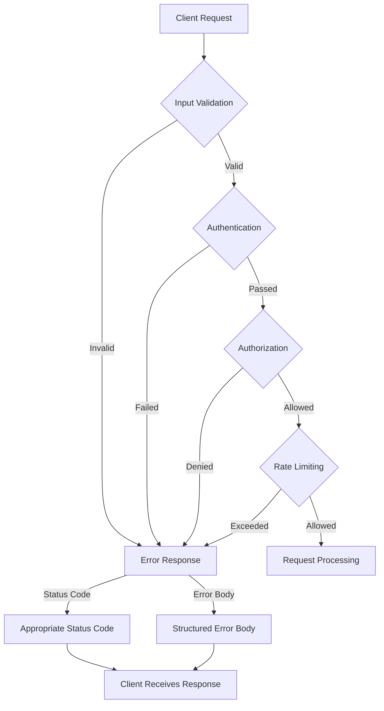

**Client Error Response Format:**

```json
{
  "error": {
    "code": "VALIDATION_ERROR",
    "message": "The request could not be processed due to validation errors",
    "details": [
      {
        "field": "prompt",
        "message": "Prompt text must not be empty",
        "constraint": "notEmpty"
      },
      {
        "field": "maxTokens",
        "message": "Maximum tokens must be between 1 and 4096",
        "constraint": "range",
        "min": 1,
        "max": 4096
      }
    ],
    "requestId": "req-1234-5678-90ab-cdef",
    "timestamp": "2023-05-15T14:22:18.543Z",
    "documentation": "https://docs.example.com/api/errors#validation_error"
  }
}
```

**Client Error Handling Strategy:**

1. **Clear Error Messages**: Concise, actionable error messages
2. **Field-Level Validation**: Specific field validation errors
3. **Request Identification**: Unique request ID for troubleshooting
4. **Documentation Links**: References to relevant documentation
5. **Appropriate Status Codes**: Standard HTTP status codes

### Server-Side Errors

Server-side errors (5xx HTTP status codes) are handled with appropriate information disclosure:

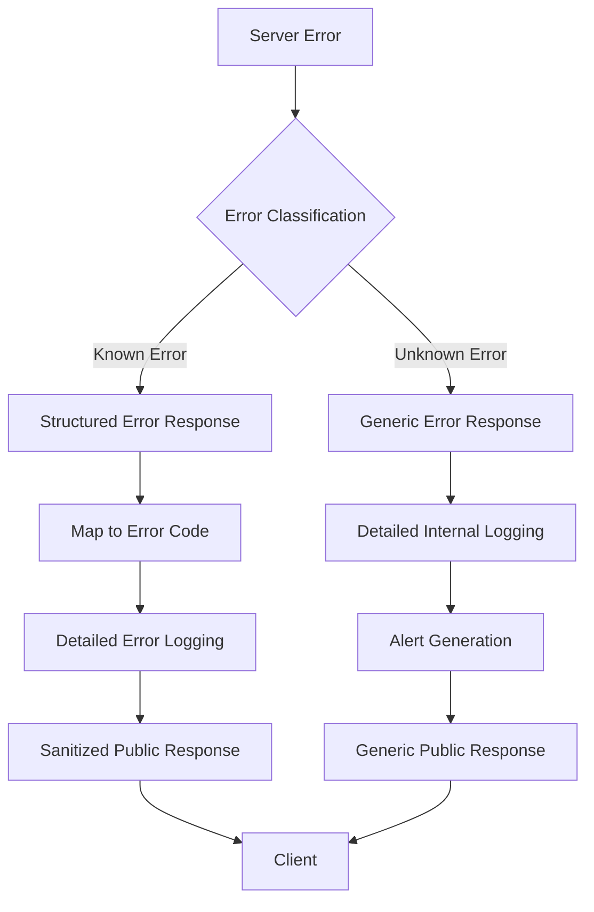

**Server Error Response Format:**

```json
{
  "error": {
    "code": "INTERNAL_SERVER_ERROR",
    "message": "The server encountered an unexpected condition",
    "requestId": "req-1234-5678-90ab-cdef",
    "timestamp": "2023-05-15T14:22:18.543Z",
    "retryable": false,
    "documentation": "https://docs.example.com/api/errors#internal_server_error"
  }
}
```

**Server Error Handling Strategy:**

1. **Limited Information Disclosure**: Prevent leaking implementation details
2. **Comprehensive Internal Logging**: Detailed error information for debugging
3. **Unique Error Identification**: Request ID for correlation
4. **Automatic Alerting**: Alerts for unexpected errors
5. **Retryability Indication**: Whether retry is likely to succeed

### Provider Errors

Errors from LLM providers receive specialized handling:

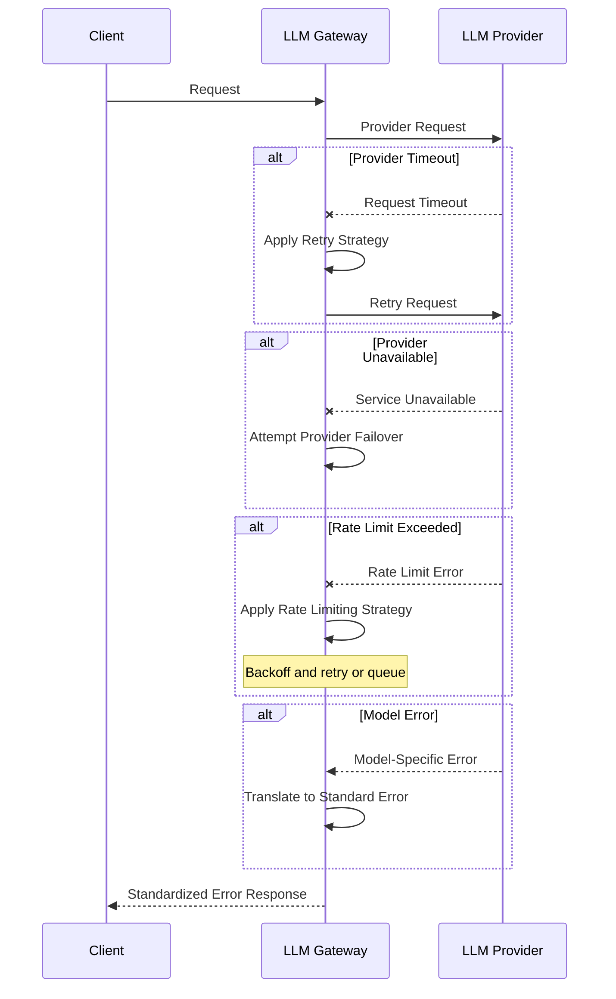

**Provider Error Handling Strategy:**

1. **Error Normalization**: Provider-specific errors mapped to standard formats
2. **Intelligent Retry**: Automatic retry for transient errors
3. **Provider Failover**: Attempt alternative providers when available
4. **Rate Limit Management**: Backoff strategies for rate limits
5. **Error Translation**: Translate technical errors to meaningful client messages

### Infrastructure Errors

Errors from infrastructure components receive specialized handling:

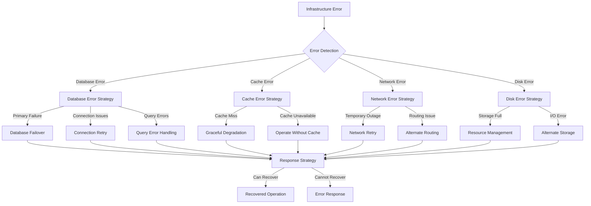

**Infrastructure Error Handling Strategy:**

1. **Component-Specific Strategies**: Tailored approaches for each infrastructure component
2. **Automatic Failover**: Switch to backup components when available
3. **Degraded Operation**: Continue with limited functionality when possible
4. **Resource Management**: Handle resource exhaustion gracefully
5. **Self-Healing**: Automatic recovery when conditions permit

### Security Errors

Security-related errors receive special handling to prevent information disclosure:

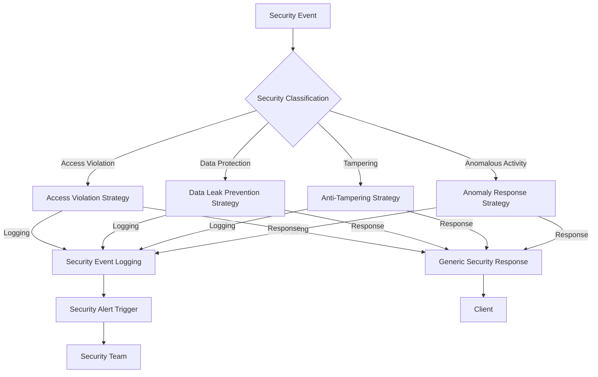

**Security Error Response Format:**

```json
{
  "error": {
    "code": "ACCESS_DENIED",
    "message": "You do not have permission to perform this action",
    "requestId": "req-1234-5678-90ab-cdef",
    "timestamp": "2023-05-15T14:22:18.543Z"
  }
}
```

**Security Error Handling Strategy:**

1. **Minimal Information Disclosure**: Prevent security information leakage
2. **Detailed Security Logging**: Comprehensive logging for security analysis
3. **Alert Generation**: Immediate alerts for security events
4. **Standard Responses**: Consistent generic responses for security issues
5. **Audit Trail**: Complete audit trail of security events

## Error Propagation

### Error Context Enrichment

Errors are enriched with context as they propagate through the system:

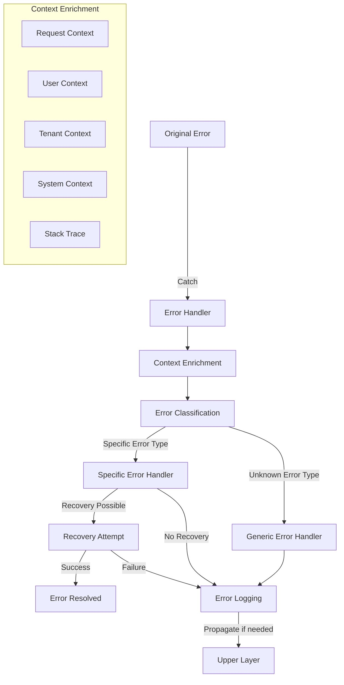

**Context Enrichment Implementation:**

1. **Request Information**:
   - Request ID and timestamp
   - API endpoint and method
   - Client information (IP, agent)
   - Request parameters (sanitized)

2. **Execution Context**:
   - Component and operation name
   - Tenant and user identifiers
   - Execution stage
   - Performance metrics

3. **System Context**:
   - System load and state
   - Dependent service status
   - Resource utilization
   - Recent related errors

### Cross-Component Propagation

Errors propagate across components with consistent handling:

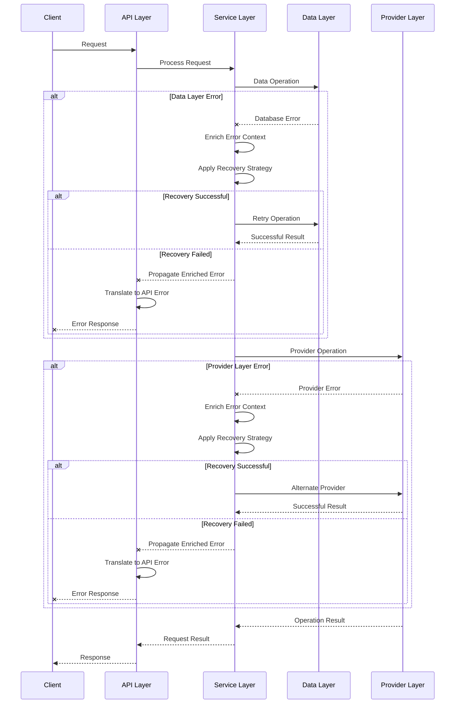

**Cross-Component Propagation Strategy:**

1. **Error Transformation**: Layer-appropriate error transformation
2. **Context Preservation**: Maintaining context across boundaries
3. **Recovery at Appropriate Layer**: Each layer attempts recovery for errors it can handle
4. **Clean Error Propagation**: Errors propagate cleanly through layers
5. **Consistent Client Experience**: Consistent error format regardless of origin

## Resilience Patterns

### Retry Strategies

The LLM Gateway implements sophisticated retry strategies:

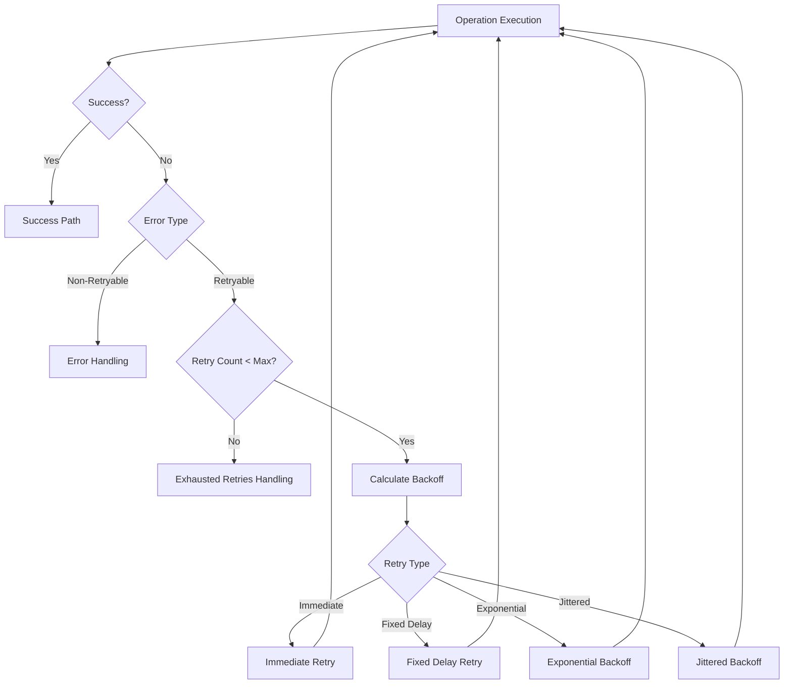

**Retry Configuration for Different Scenarios:**

| Error Scenario | Retry Strategy | Max Attempts | Initial Delay | Max Delay | Jitter |
|----------------|----------------|--------------|--------------|-----------|--------|
| LLM Provider Timeout | Exponential with Jitter | 3 | 500ms | 5000ms | 0.3 |
| Database Connection Error | Exponential | 5 | 100ms | 2000ms | None |
| Network Transient Error | Exponential with Jitter | 3 | 200ms | 2000ms | 0.25 |
| Rate Limiting | Fixed Delay | 2 | Based on Retry-After | None | None |
| Cache Miss | Immediate | 1 | None | None | None |

**Retry Implementation:**

1. **Retryable Error Detection**: Automatic detection of retryable vs. non-retryable errors
2. **Multiple Backoff Strategies**: Support for different backoff algorithms
3. **Configurable Parameters**: Adjustable retry limits and delays
4. **Jitter Implementation**: Randomization to prevent thundering herd
5. **Retry Observability**: Metrics and logging for retry operations

### Circuit Breaking

The circuit breaker pattern prevents cascading failures:

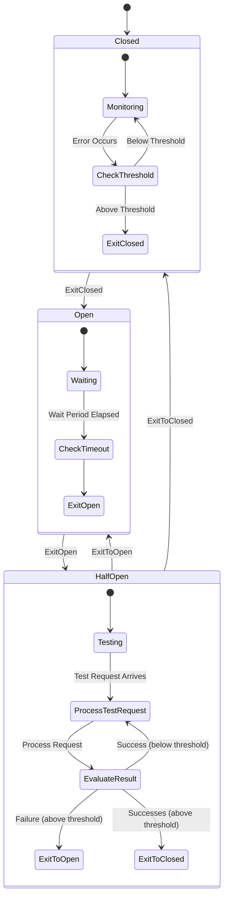

**Circuit Breaker Configuration:**

| Component | Error Threshold | Sample Size | Open Duration | Half-Open Requests | Success Threshold |
|-----------|-----------------|-------------|---------------|-------------------|-------------------|
| LLM Provider API | 50% | 20 requests | 30 seconds | 3 | 2 |
| Database | 30% | 10 requests | 15 seconds | 2 | 2 |
| Cache | 70% | 30 requests | 10 seconds | 5 | 3 |
| Internal Services | 40% | 15 requests | 20 seconds | 3 | 2 |

**Circuit Breaker Implementation:**

1. **Per-Component Breakers**: Separate breakers for different components
2. **Configurable Thresholds**: Adjustable error thresholds and timeouts
3. **Half-Open State**: Controlled testing of recovered services
4. **Circuit Events**: Notifications for state transitions
5. **Fallback Actions**: Defined fallback behavior when circuit is open

### Fallback Mechanisms

The system implements fallback mechanisms for graceful degradation:

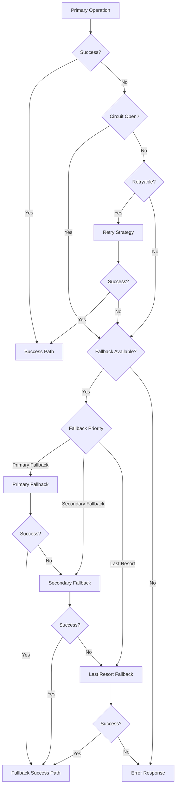

**Fallback Strategies for Different Components:**

| Component | Primary Fallback | Secondary Fallback | Last Resort |
|-----------|------------------|-------------------|-------------|
| LLM Provider | Alternative Provider | Cached Response | Predefined Response |
| Prompt Template | Default Template | Basic Template | Direct Text Processing |
| Database Read | Read Replica | Cache | Empty Result Set |
| Database Write | Queue for Later | Local Storage | Error with Retry Guidance |
| Cache | Skip Cache | Local Memory Cache | Proceed Without Caching |

**Fallback Implementation:**

1. **Ordered Fallback Chain**: Prioritized fallback options
2. **Context-Aware Selection**: Selecting appropriate fallback based on context
3. **Degraded Functionality**: Clear indication of reduced functionality
4. **Performance Implications**: Understanding performance trade-offs
5. **Client Notification**: Transparent communication about fallback usage

### Bulkheading

The system uses bulkheading to isolate failures:

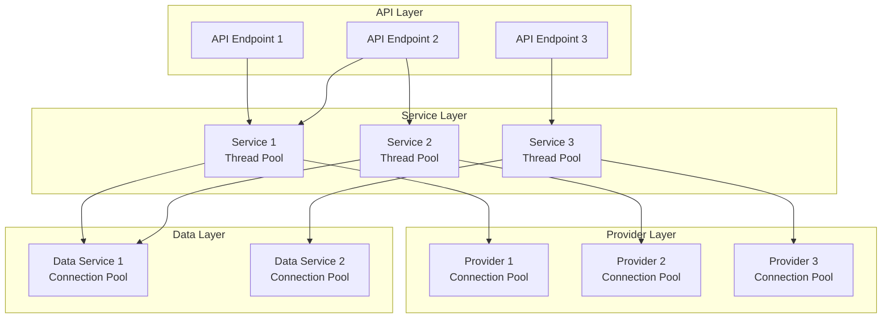

**Bulkhead Configuration:**

| Component | Isolation Level | Thread Pool Size | Queue Size | Timeout |
|-----------|-----------------|------------------|-----------|---------|
| API Layer | Per Endpoint | 20 | 100 | 30s |
| Service Layer | Per Service | 30 | 50 | Varies |
| Provider Layer | Per Provider | 40 | 20 | Varies |
| Data Layer | Per Operation Type | 15 | 30 | 5s |

**Bulkhead Implementation:**

1. **Isolated Thread Pools**: Separate pools for different components
2. **Resource Limits**: Clear resource boundaries for each bulkhead
3. **Queue Management**: Controlled queuing for each isolated component
4. **Rejection Policy**: Defined behavior when bulkhead is full
5. **Dynamic Sizing**: Adaptive sizing based on load patterns

### Timeout Management

The system implements comprehensive timeout management:

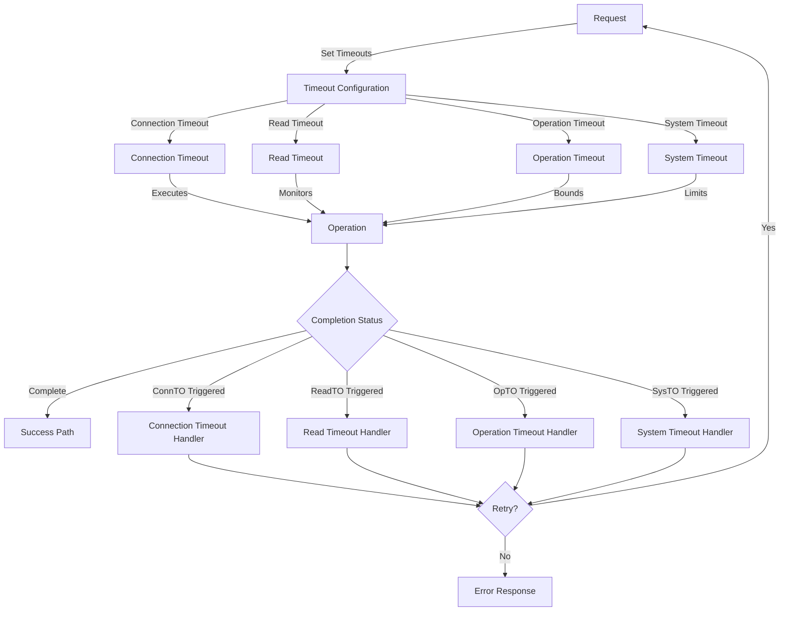

**Timeout Configuration:**

| Operation Type | Connection Timeout | Read Timeout | Operation Timeout | System Timeout |
|----------------|-------------------|--------------|-------------------|----------------|
| LLM API Request | 5s | 60s | 120s | 180s |
| DB Read Operation | 2s | 10s | 15s | 30s |
| DB Write Operation | 2s | 15s | 20s | 30s |
| Cache Operation | 1s | 3s | 5s | 10s |
| Internal API Call | 3s | 10s | 15s | 20s |

**Timeout Implementation:**

1. **Multi-Level Timeouts**: Different timeout types for different failure modes
2. **Context-Specific Configuration**: Different timeouts for different operations
3. **Timeout Hierarchy**: Clear hierarchy of timeout enforcement
4. **Graceful Handling**: Clean handling of timeout conditions
5. **Timeout Metrics**: Tracking of timeout occurrences for optimization

## Graceful Degradation

### Partial Failures

The system is designed to handle partial failures with minimal impact:

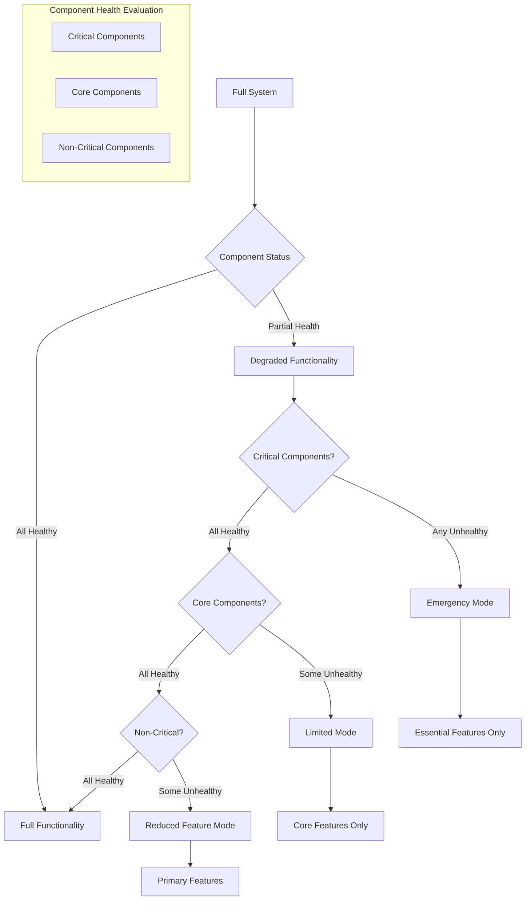

**Degradation Levels:**

| Degradation Level | Available Features | Unavailable Features | User Experience |
|-------------------|---------------------|----------------------|-----------------|
| Full Functionality | All features | None | Normal operation |
| Reduced Feature Mode | Primary features, core capabilities | Enhanced features, optimizations | Slightly reduced capabilities |
| Limited Mode | Core features only | Enhanced features, some primary features | Basic functionality only |
| Emergency Mode | Essential features only | Most features | Minimal functionality |

**Partial Failure Handling:**

1. **Component Health Monitoring**: Continuous health checks
2. **Feature Availability Matrix**: Understanding of feature dependencies
3. **Graceful Feature Disablement**: Clean disabling of affected features
4. **User Communication**: Clear communication about degraded functionality
5. **Recovery Monitoring**: Continuous checking for component recovery

### Feature Toggles

The system uses feature toggles for resilience:

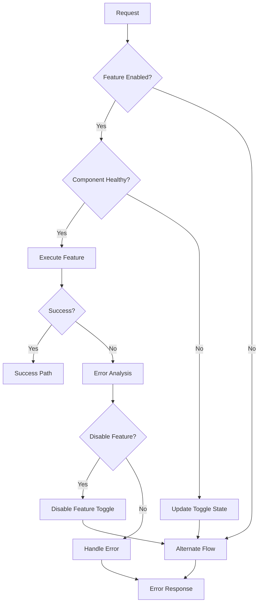

**Toggle Categories:**

1. **Reliability Toggles**: Disable features causing system instability
2. **Performance Toggles**: Disable resource-intensive features during high load
3. **Dependency Toggles**: Control features based on dependency health
4. **Capacity Toggles**: Manage features based on system capacity
5. **Recovery Toggles**: Enable gradual recovery of features

**Toggle Implementation:**

1. **Dynamic Configuration**: Runtime-adjustable toggle states
2. **Automatic Management**: Automated toggle adjustments based on system health
3. **Granular Control**: Fine-grained control of specific features
4. **Default Safe States**: Fail-safe default toggle positions
5. **Toggle Monitoring**: Visibility into toggle states and transitions

### Service Levels

The system defines multiple service levels for degraded conditions:

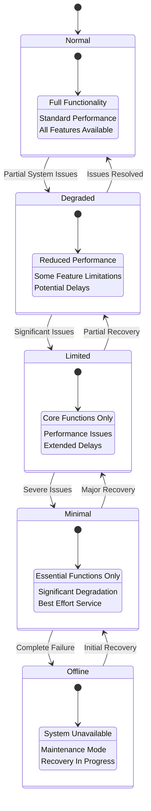

**Service Level Definitions:**

| Service Level | Availability | Performance | Features | Response Time | Error Rate |
|---------------|--------------|-------------|----------|---------------|------------|
| Normal | 99.9%+ | Full | All | <500ms | <0.1% |
| Degraded | 99.5%+ | 80%+ | Most | <1s | <1% |
| Limited | 99%+ | 50%+ | Core Only | <2s | <5% |
| Minimal | 95%+ | 30%+ | Essential | <5s | <10% |
| Offline | <95% | N/A | None | N/A | N/A |

**Service Level Implementation:**

1. **Service Level Detection**: Automatic detection of current service level
2. **User Communication**: Clear communication of current service level
3. **SLA Adjustment**: Appropriate SLA adjustments for each level
4. **Recovery Planning**: Defined recovery paths for each level
5. **Business Continuity**: Business continuity plans for severe degradation

## Fault Tolerance

### Redundancy Design

The system implements multiple layers of redundancy:

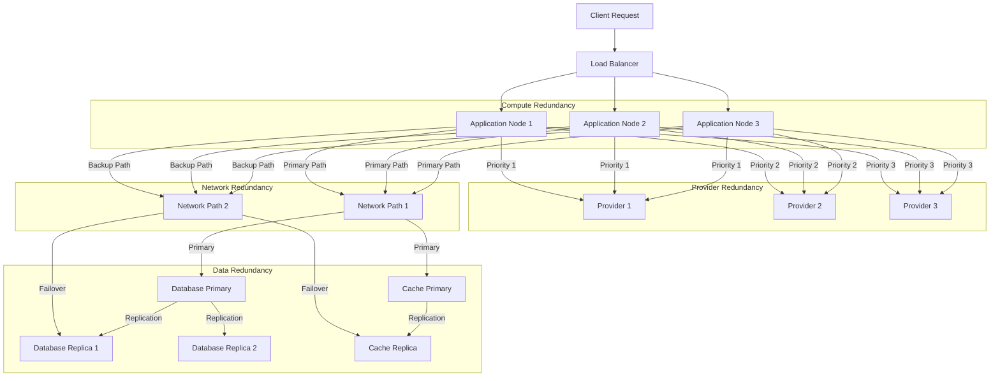

**Redundancy Implementation:**

1. **N+1 Redundancy**: At least one extra instance beyond requirements
2. **Active-Active Configuration**: Multiple active instances for load distribution
3. **Geographic Redundancy**: Distribution across regions/zones
4. **Provider Redundancy**: Multiple LLM providers for critical functions
5. **Data Redundancy**: Replicated storage for resilience

### Failure Modes Analysis

The system's design is informed by comprehensive failure modes analysis:

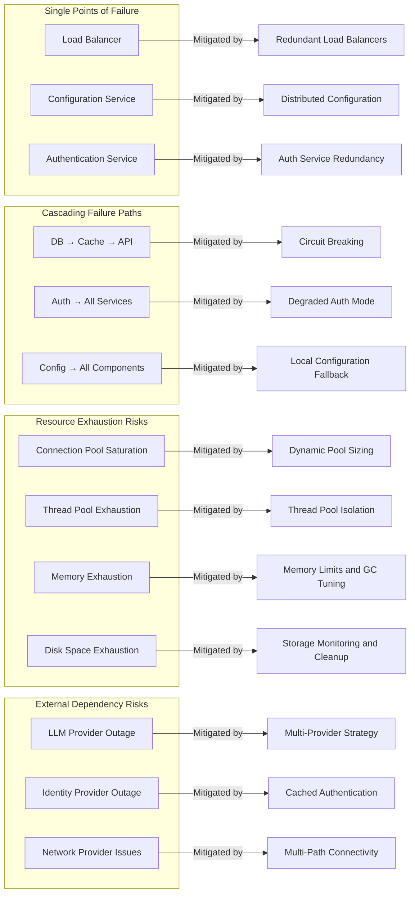

**Failure Mode Analysis Approach:**

1. **Systematic Analysis**: Structured review of potential failure points
2. **Impact Assessment**: Evaluation of business impact for each failure mode
3. **Probability Estimation**: Assessment of failure likelihood
4. **Mitigation Design**: Specific mitigations for each significant failure mode
5. **Validation Testing**: Regular testing of failure scenarios and mitigations

## Error Monitoring and Analysis

### Error Logging

The system implements comprehensive error logging:

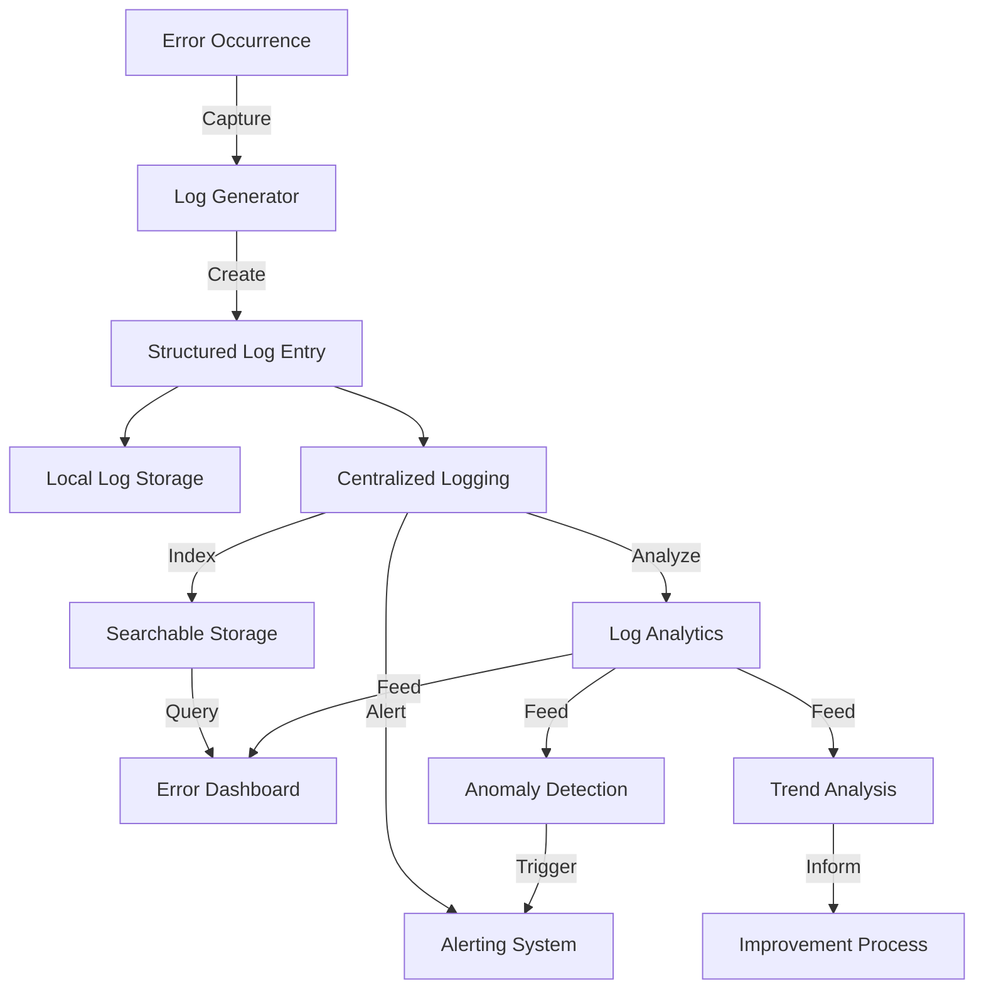

**Error Log Structure:**

```json
{
  "timestamp": "2023-05-15T14:22:18.543Z",
  "level": "ERROR",
  "logger": "com.aisera.service.llm.execution.ExecutionManagerImpl",
  "message": "Failed to execute prompt request",
  "errorCode": "PROVIDER_UNAVAILABLE",
  "errorType": "ProviderException",
  "stackTrace": "[truncated for brevity]",
  "context": {
    "requestId": "req-1234-5678-90ab-cdef",
    "tenantId": "tenant-123",
    "userId": "user-456",
    "providerType": "OPENAI",
    "modelId": "gpt-4",
    "operation": "promptExecution",
    "component": "executionManager"
  },
  "metadata": {
    "attemptNumber": 2,
    "elapsedTimeMs": 1532,
    "responseStatus": "503",
    "responseBody": "[sanitized]"
  },
  "traceId": "trace-1234-5678-90ab-cdef",
  "spanId": "span-1234-5678-90ab-cdef"
}
```

**Error Logging Implementation:**

1. **Structured Format**: JSON-formatted logs for machine processing
2. **Comprehensive Context**: Full context for debugging
3. **Sanitized Content**: Sensitive information removal
4. **Correlation Identifiers**: Request IDs and trace IDs for correlation
5. **Centralized Collection**: Aggregation in centralized log storage

### Error Metrics

The system collects detailed error metrics:

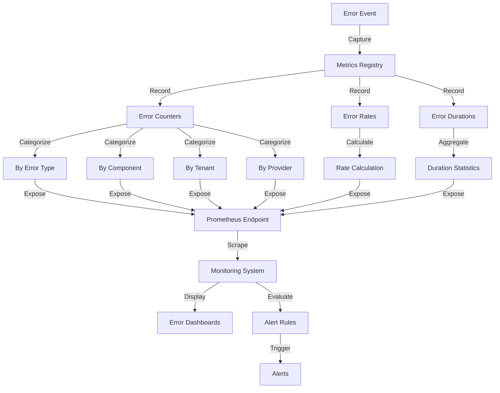

**Key Error Metrics:**

| Metric | Type | Labels | Purpose |
|--------|------|--------|---------|
| `error_total` | Counter | `type`, `component`, `tenant`, `provider` | Count of errors by type and context |
| `error_rate` | Gauge | `type`, `component`, `tenant`, `provider` | Error rate as percentage of requests |
| `error_duration_seconds` | Histogram | `type`, `component` | Time spent in error handling |
| `retry_total` | Counter | `error_type`, `component`, `result` | Count of retry attempts |
| `circuit_breaker_state` | Gauge | `component`, `state` | Circuit breaker state (0=closed, 1=open, 0.5=half-open) |
| `fallback_total` | Counter | `component`, `fallback_type`, `result` | Count of fallback activations |

**Error Metric Implementation:**

1. **Dimensional Metrics**: Multiple dimensions for detailed analysis
2. **Rate Calculations**: Error rates relative to total operations
3. **Statistical Aggregations**: Percentiles for duration metrics
4. **Custom Metric Types**: Specific metric types for different error aspects
5. **Standardized Labels**: Consistent labeling across metrics

### Error Aggregation

The system aggregates errors for analysis:

```mermaid
graph TD
    ErrorLogs[Error Logs] --> |Ingest| LogAggregator[Log Aggregator]
    ErrorMetrics[Error Metrics] --> |Ingest| MetricsAggregator[Metrics Aggregator]
    
    LogAggregator --> |Process| ErrorCorrelation[Error Correlation]
    MetricsAggregator --> |Process| ErrorCorrelation
    
    ErrorCorrelation --> |Group| ErrorClusters[Error Clusters]
    ErrorClusters --> |Analyze| PatternDetection[Pattern Detection]
    ErrorClusters --> |Analyze| ImpactAnalysis[Impact Analysis]
    ErrorClusters --> |Analyze| FrequencyAnalysis[Frequency Analysis]
    
    PatternDetection --> |Output| CommonPatterns[Common Error Patterns]
    ImpactAnalysis --> |Output| ServiceImpact[Service Impact Assessment]
    FrequencyAnalysis --> |Output| ErrorFrequency[Error Frequency Analysis]
    
    CommonPatterns --> |Feed| ErrorDashboard[Error Dashboard]
    ServiceImpact --> |Feed| ErrorDashboard
    ErrorFrequency --> |Feed| ErrorDashboard
    
    ErrorDashboard --> |Inform| PriorityAssignment[Priority Assignment]
    PriorityAssignment --> |Drive| RemediationPlan[Remediation Planning]
```

**Error Aggregation Approach:**

1. **Multi-Source Aggregation**: Combining logs, metrics, and traces
2. **Pattern Recognition**: Identifying common error patterns
3. **Impact Assessment**: Evaluating business impact of errors
4. **Priority Determination**: Data-driven prioritization of issues
5. **Temporal Analysis**: Tracking error patterns over time

### Root Cause Analysis

The system facilitates root cause analysis of errors:

```mermaid
graph TD
    ErrorEvent[Error Event] --> |Trigger| RCAProcess[RCA Process]
    
    RCAProcess --> DataCollection[Data Collection]
    
    subgraph "Data Sources"
        Logs[Error Logs]
        Metrics[System Metrics]
        Traces[Distributed Traces]
        Config[Configuration Data]
        DeployHistory[Deployment History]
    end
    
    DataCollection --> Logs
    DataCollection --> Metrics
    DataCollection --> Traces
    DataCollection --> Config
    DataCollection --> DeployHistory
    
    DataCollection --> TimelineConstruction[Timeline Construction]
    TimelineConstruction --> CorrelationAnalysis[Correlation Analysis]
    
    CorrelationAnalysis --> FailureGraph[Failure Graph]
    FailureGraph --> RootCauseIdentification[Root Cause Identification]
    
    RootCauseIdentification --> |Document| RCAReport[RCA Report]
    RCAReport --> |Inform| PreventionMeasures[Prevention Measures]
    PreventionMeasures --> |Implement| SystemImprovements[System Improvements]
```

**RCA Process:**

1. **Data Collection**: Gathering comprehensive diagnostic data
2. **Timeline Construction**: Building event sequence
3. **Correlation Analysis**: Identifying related events
4. **Failure Graphing**: Mapping failure propagation
5. **Root Cause Identification**: Determining primary cause
6. **Prevention Planning**: Designing mitigation measures

## Recovery Mechanisms

### Automatic Recovery

The system implements automatic recovery for many failure scenarios:

```mermaid
graph TD
    FailureDetection[Failure Detection] --> |Trigger| RecoveryCoordinator[Recovery Coordinator]
    
    RecoveryCoordinator --> FailureClassification{Failure Type}
    
    FailureClassification -->|Transient| TransientRecovery[Transient Failure Recovery]
    FailureClassification -->|Resource| ResourceRecovery[Resource Failure Recovery]
    FailureClassification -->|Component| ComponentRecovery[Component Failure Recovery]
    FailureClassification -->|System| SystemRecovery[System Failure Recovery]
    
    TransientRecovery --> |Strategy| RetryMechanism[Retry Mechanism]
    ResourceRecovery --> |Strategy| ResourceManagement[Resource Management]
    ComponentRecovery --> |Strategy| ComponentRestart[Component Restart]
    SystemRecovery --> |Strategy| SystemFailover[System Failover]
    
    RetryMechanism --> RecoveryVerification[Recovery Verification]
    ResourceManagement --> RecoveryVerification
    ComponentRestart --> RecoveryVerification
    SystemFailover --> RecoveryVerification
    
    RecoveryVerification --> RecoveryStatus{Recovery Status}
    
    RecoveryStatus -->|Success| ServiceRestoration[Service Restoration]
    RecoveryStatus -->|Failure| EscalationDecision{Escalation Decision}
    
    EscalationDecision -->|Retry Different| RecoveryCoordinator
    EscalationDecision -->|Manual Intervention| ManualRecovery[Manual Recovery Process]
```

**Automatic Recovery Implementation:**

1. **Recovery Orchestration**: Coordinated recovery process
2. **Failure-Specific Strategies**: Tailored approaches for different failures
3. **Verification Mechanisms**: Validation of recovery success
4. **Escalation Paths**: Clear escalation when automatic recovery fails
5. **Recovery Metrics**: Measurement of recovery effectiveness

### Manual Recovery

The system supports manual recovery procedures:

```mermaid
flowchart TD
    AutoRecovery[Automatic Recovery] --> RecoveryResult{Success?}
    
    RecoveryResult -->|Yes| NormalOperation[Normal Operation]
    RecoveryResult -->|No| AlertGeneration[Alert Generation]
    
    AlertGeneration --> OnCallEngineer[On-Call Engineer]
    
    OnCallEngineer --> Diagnosis[Diagnosis]
    Diagnosis --> RecoveryPlan[Recovery Plan]
    
    RecoveryPlan --> |Requires| RunbookSelection[Runbook Selection]
    
    RunbookSelection --> RecoveryExecution[Recovery Execution]
    RecoveryExecution --> RecoveryOutcome{Outcome}
    
    RecoveryOutcome -->|Success| ServiceRestoration[Service Restoration]
    RecoveryOutcome -->|Failure| EscalationTier{Escalation Tier}
    
    EscalationTier -->|Tier 2| SeniorEngineer[Senior Engineer]
    EscalationTier -->|Tier 3| EngineeringTeam[Engineering Team]
    
    SeniorEngineer --> AdvancedDiagnosis[Advanced Diagnosis]
    AdvancedDiagnosis --> CustomRecovery[Custom Recovery]
    
    EngineeringTeam --> EmergencyResponse[Emergency Response]
    EmergencyResponse --> CriticalRecovery[Critical Recovery]
    
    CustomRecovery --> ServiceRestoration
    CriticalRecovery --> ServiceRestoration
```

**Manual Recovery Resources:**

1. **Runbooks**: Step-by-step recovery procedures
2. **Diagnosis Guides**: Troubleshooting workflows
3. **Recovery Tools**: Administrative interfaces for recovery
4. **Escalation Procedures**: Clear escalation paths and contacts
5. **Post-Recovery Analysis**: Learning from manual interventions

### Data Recovery

The system implements data recovery mechanisms:

```mermaid
graph TD
    DataCorruption[Data Issue Detection] --> |Trigger| DataRecoveryProcess[Data Recovery Process]
    
    DataRecoveryProcess --> IssueClassification{Issue Type}
    
    IssueClassification -->|Corruption| CorruptionRecovery[Corruption Recovery]
    IssueClassification -->|Loss| LossRecovery[Data Loss Recovery]
    IssueClassification -->|Inconsistency| ConsistencyRecovery[Consistency Recovery]
    
    CorruptionRecovery --> |Strategy| RepairStrategy[Repair Strategy]
    LossRecovery --> |Strategy| RestoreStrategy[Restore Strategy]
    ConsistencyRecovery --> |Strategy| ReconciliationStrategy[Reconciliation Strategy]
    
    RepairStrategy --> |Source| RepairSource{Repair Source}
    RepairSource -->|Redundant Data| RedundantRepair[Repair from Redundancy]
    RepairSource -->|Historical| HistoricalRepair[Repair from History]
    RepairSource -->|Generated| GeneratedRepair[Repair from Generation]
    
    RestoreStrategy --> |Source| RestoreSource{Restore Source}
    RestoreSource -->|Backup| BackupRestore[Restore from Backup]
    RestoreSource -->|Replication| ReplicationRestore[Restore from Replica]
    RestoreSource -->|Archive| ArchiveRestore[Restore from Archive]
    
    ReconciliationStrategy --> |Method| ReconciliationMethod{Reconciliation Method}
    ReconciliationMethod -->|Validation| ValidationReconcile[Reconcile via Validation]
    ReconciliationMethod -->|Consensus| ConsensusReconcile[Reconcile via Consensus]
    ReconciliationMethod -->|Rebuild| RebuildReconcile[Reconcile via Rebuild]
    
    RedundantRepair --> DataValidation[Data Validation]
    HistoricalRepair --> DataValidation
    GeneratedRepair --> DataValidation
    
    BackupRestore --> DataValidation
    ReplicationRestore --> DataValidation
    ArchiveRestore --> DataValidation
    
    ValidationReconcile --> DataValidation
    ConsensusReconcile --> DataValidation
    RebuildReconcile --> DataValidation
    
    DataValidation --> RecoveryStatus{Recovery Status}
    
    RecoveryStatus -->|Success| DataRestoration[Data Restoration]
    RecoveryStatus -->|Failure| ManualRecovery[Manual Recovery]
```

**Data Recovery Implementation:**

1. **Backup Mechanisms**: Regular data backups
2. **Point-in-Time Recovery**: Ability to restore to specific points
3. **Consistency Verification**: Validation of recovered data
4. **Transaction Replay**: Replay of transactions for recovery
5. **Data Reconstruction**: Techniques for data rebuilding

## Disaster Recovery

### Failover Strategies

The system implements comprehensive failover strategies:

```mermaid
graph TD
    DisasterEvent[Disaster Event] --> DetectionSystem[Detection System]
    
    DetectionSystem --> |Trigger| FailoverSystem[Failover System]
    
    FailoverSystem --> ImpactAssessment{Impact Assessment}
    
    ImpactAssessment -->|Component Level| ComponentFailover[Component Failover]
    ImpactAssessment -->|Zone Level| ZoneFailover[Availability Zone Failover]
    ImpactAssessment -->|Region Level| RegionFailover[Region Failover]
    
    ComponentFailover --> |Execute| ComponentAction[Activate Redundant Component]
    ZoneFailover --> |Execute| ZoneAction[Redirect to Alternate Zone]
    RegionFailover --> |Execute| RegionAction[Activate Disaster Recovery Site]
    
    ComponentAction --> FailoverValidation[Failover Validation]
    ZoneAction --> FailoverValidation
    RegionAction --> FailoverValidation
    
    FailoverValidation --> ValidationResult{Validation Result}
    
    ValidationResult -->|Success| ServiceRestore[Service Restoration]
    ValidationResult -->|Failure| ManualFailover[Manual Failover Process]
```

**Failover Implementation:**

1. **Multi-Level Strategy**: Tailored approaches for different failure scopes
2. **Automated Detection**: Rapid identification of disaster conditions
3. **Orchestrated Failover**: Coordinated failover processes
4. **Validation Procedures**: Verification of failover success
5. **Manual Intervention**: Clear paths for manual failover when needed

### Recovery Point Objectives

The system is designed to meet specific recovery point objectives:

| System Component | RPO | Implementation Method |
|------------------|-----|------------------------|
| Prompt Templates | Near-Zero | Multi-region replication, Write-through caching |
| User Data | 5 Minutes | Database replication, Transaction logs |
| Analytics Data | 1 Hour | Periodic snapshots, Aggregated summaries |
| Configuration | Near-Zero | Distributed configuration service, Multi-region replication |
| Logs and Metrics | Best-Effort | Real-time streaming, Buffering and replay |

**RPO Implementation:**

1. **Data Prioritization**: Different RPOs for different data types
2. **Replication Strategies**: Appropriate replication for RPO targets
3. **Transaction Logging**: Detailed logging for point-in-time recovery
4. **Change Capture**: Change data capture for critical updates
5. **Verification**: Regular testing of RPO capabilities

### Recovery Time Objectives

The system is designed to meet specific recovery time objectives:

| Recovery Scenario | RTO | Implementation Method |
|-------------------|-----|------------------------|
| Single Component Failure | < 1 Minute | Automatic failover, Redundant components |
| Availability Zone Failure | < 5 Minutes | Multi-zone deployment, Automated zone failover |
| Region Failure | < 30 Minutes | Multi-region active-passive, Orchestrated failover |
| Complete Outage | < 4 Hours | Disaster recovery site, Prioritized service restoration |

**RTO Implementation:**

1. **Tiered Recovery**: Different RTOs for different failure scenarios
2. **Automated Recovery**: Automation to meet aggressive RTOs
3. **Redundant Infrastructure**: Standby resources for rapid recovery
4. **Recovery Prioritization**: Service restoration priorities
5. **Regular Testing**: Disaster recovery drills to validate RTOs

---

**Previous**: [Security Architecture](./security-architecture.md) | **Next**: [API Reference](./api-reference.md)