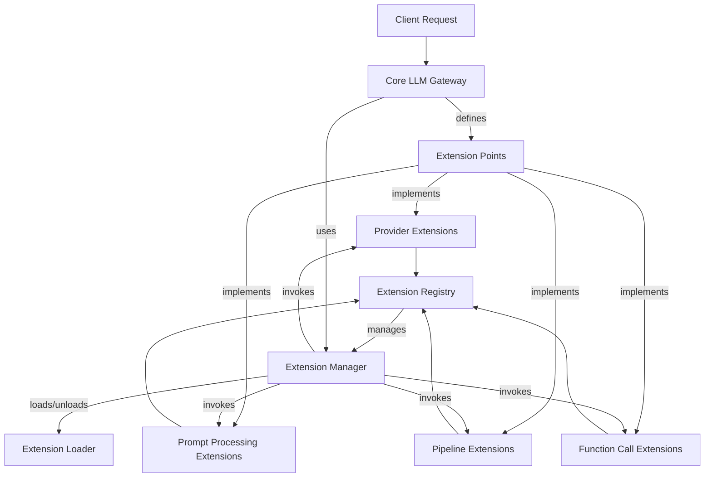
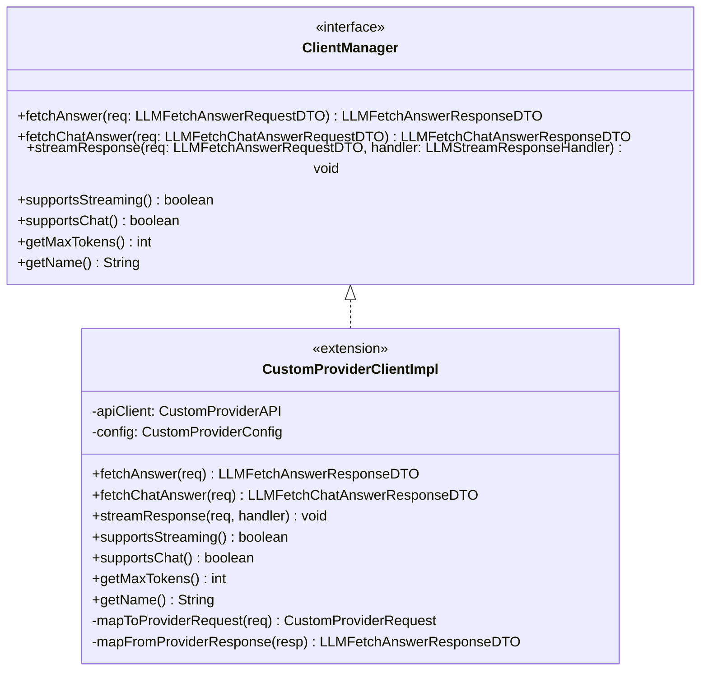
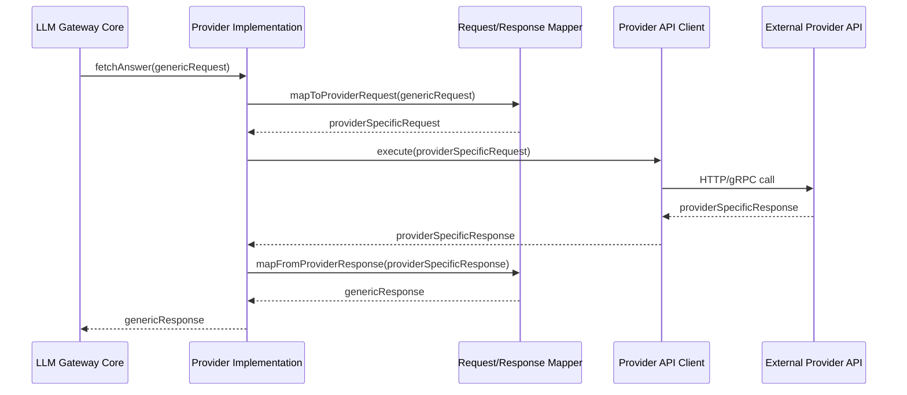
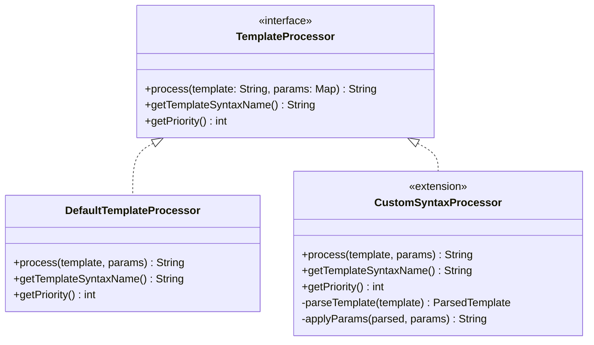
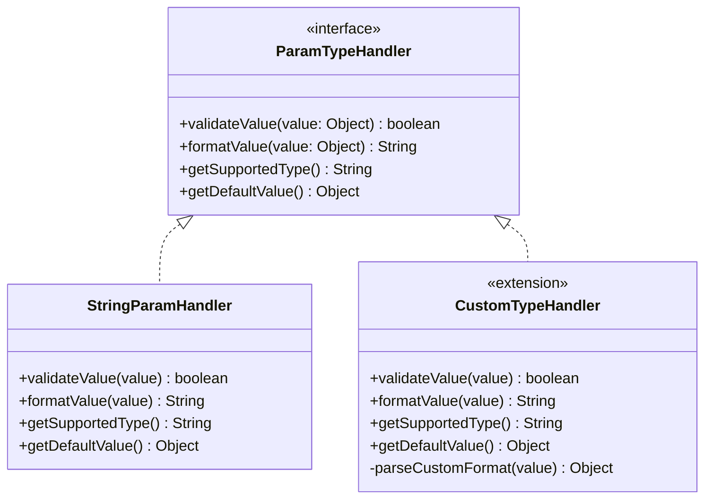
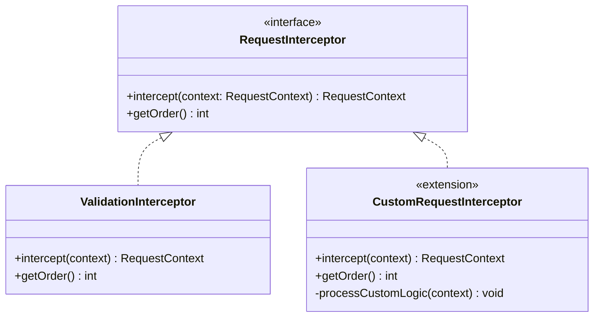
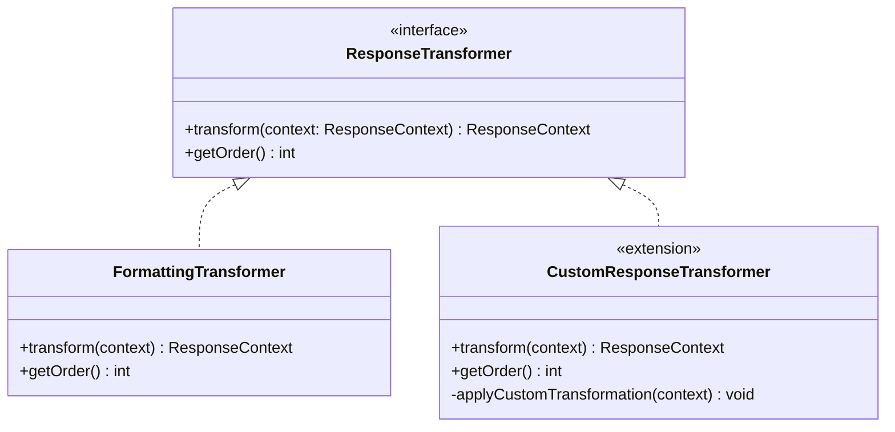
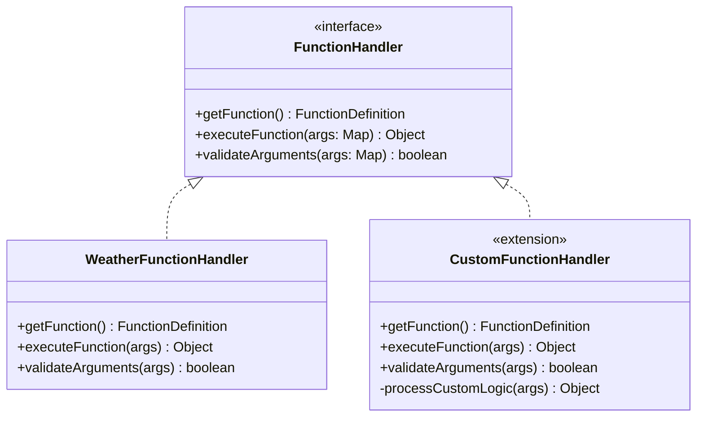
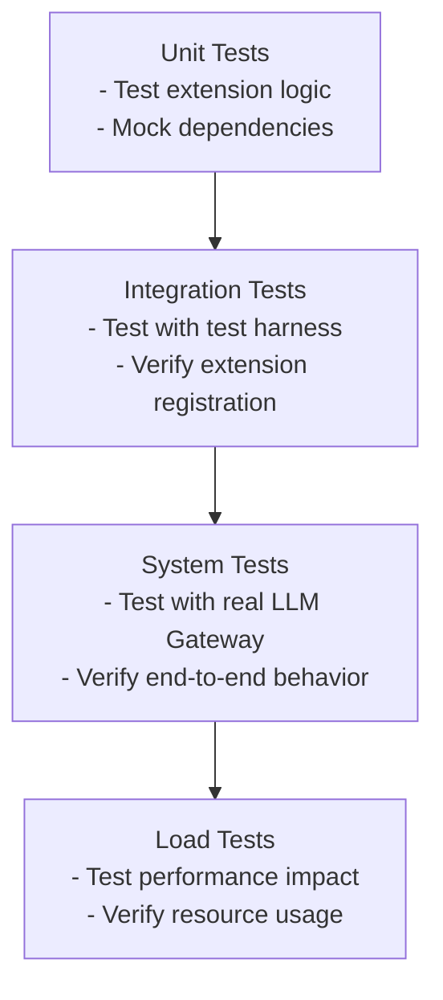
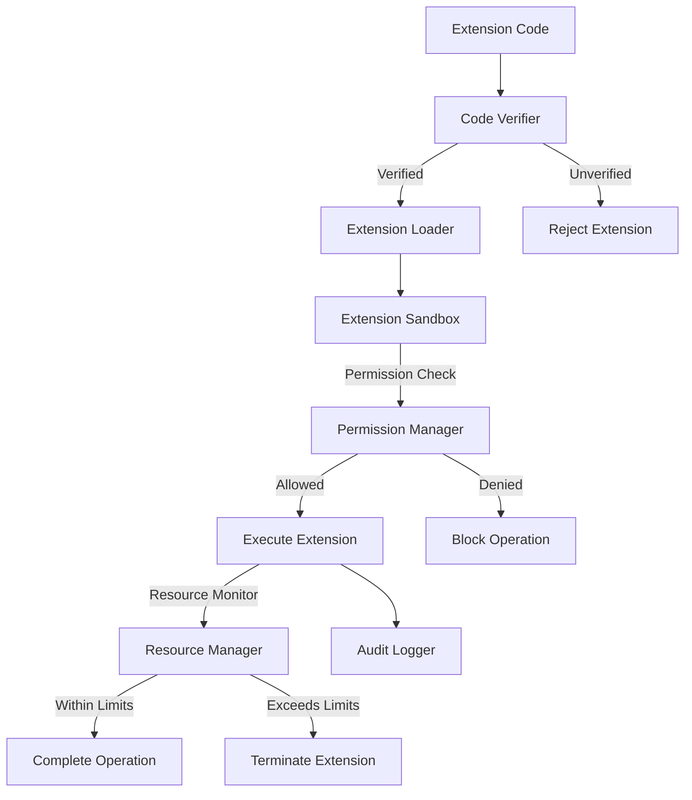

# Extension Points and Plug-In Strategy

## Table of Contents

- [Introduction](#introduction)
- [Core Extension Architecture](#core-extension-architecture)
- [Provider Integration Framework](#provider-integration-framework)
  - [Provider Client Interface](#provider-client-interface)
  - [Provider Registration](#provider-registration)
  - [Request/Response Mapping](#requestresponse-mapping)
- [Prompt Processing Extensions](#prompt-processing-extensions)
  - [Custom Template Processors](#custom-template-processors)
  - [Parameter Type Handlers](#parameter-type-handlers)
- [Pre/Post Processing Pipeline](#prepost-processing-pipeline)
  - [Request Interceptors](#request-interceptors)
  - [Response Transformers](#response-transformers)
- [Custom Function Calling](#custom-function-calling)
- [Plugin Development Guidelines](#plugin-development-guidelines)
  - [Development Process](#development-process)
  - [Testing Extensions](#testing-extensions)
  - [Distribution and Deployment](#distribution-and-deployment)
- [Extension Configuration](#extension-configuration)
- [Security Considerations](#security-considerations)

## Introduction

This document describes the extension points and plugin architecture of the LLM Gateway, which allows developers to customize and extend the system's functionality. The LLM Gateway is designed with extensibility as a core principle, providing well-defined interfaces and integration points for custom components.

## Core Extension Architecture

The LLM Gateway's extension architecture is built around the following principles:

1. **Interface-Based Design**: Core components define interfaces that can be implemented by extensions
2. **Registration Mechanism**: Extensions register themselves with the system through service discovery
3. **Prioritization**: Multiple extensions can be registered for the same extension point with priority ordering
4. **Configuration-Driven**: Extensions can be enabled, disabled, and configured dynamically
5. **Isolation**: Extensions run in isolated contexts to prevent system-wide failures

The high-level extension architecture is illustrated below:



## Provider Integration Framework

The Provider Integration Framework allows developers to add support for new LLM providers to the system.

### Provider Client Interface

New LLM providers are implemented by creating a class that implements the `ClientManager` interface:



**Implementation Requirements:**

1. Implement all required methods in the `ClientManager` interface
2. Handle authentication and connection management
3. Transform LLM Gateway requests to provider-specific formats
4. Transform provider responses to LLM Gateway response format
5. Implement proper error handling and retries
6. Support capability reporting (streaming, chat, etc.)

### Provider Registration

New providers are registered with the system through the `ClientRegistry`:

```java
// Example provider registration
@Component
public class CustomProviderClientImpl implements ClientManager, ApplicationListener<ContextRefreshedEvent> {
    
    @Autowired
    private ClientRegistry clientRegistry;
    
    // Implementation of ClientManager methods...
    
    @Override
    public void onApplicationEvent(ContextRefreshedEvent event) {
        // Register this provider with the registry
        clientRegistry.registerClient(ClientType.CUSTOM_PROVIDER, this);
    }
}
```

Providers can also be registered through configuration:

```yaml
llm:
  providers:
    - type: CUSTOM_PROVIDER
      class: com.example.CustomProviderClientImpl
      enabled: true
      config:
        apiKey: ${CUSTOM_PROVIDER_API_KEY}
        endpoint: https://api.custom-provider.com/v1
        connectionTimeout: 5000
        readTimeout: 30000
```

### Request/Response Mapping

Provider implementations must map between the LLM Gateway's generic request/response format and the provider-specific format:



**Mapping Requirements:**

1. Transform LLM Gateway's generic request to provider-specific format
2. Handle provider-specific parameters and options
3. Transform provider's response to LLM Gateway's generic format
4. Normalize error responses
5. Extract and normalize usage metrics (tokens, costs)

## Prompt Processing Extensions

The Prompt Processing extension points allow customization of how prompt templates are processed and applied.

### Custom Template Processors

Custom template processors implement the `TemplateProcessor` interface to add support for new template syntaxes or processing logic:



**Implementation Requirements:**

1. Process template strings with custom syntax/logic
2. Handle parameter substitution
3. Validate template syntax
4. Return processed template string
5. Report template syntax name and priority

### Parameter Type Handlers

Parameter type handlers implement the `ParamTypeHandler` interface to add support for new parameter types:



**Implementation Requirements:**

1. Validate parameter values against type constraints
2. Format parameter values for inclusion in templates
3. Provide default values for optional parameters
4. Handle type-specific conversion logic

## Pre/Post Processing Pipeline

The processing pipeline extension points allow insertion of custom logic before and after request execution.

### Request Interceptors

Request interceptors implement the `RequestInterceptor` interface to process requests before they are executed:



**Implementation Requirements:**

1. Process request context with custom logic
2. Optionally modify the request parameters
3. Return modified context or throw exception to halt processing
4. Specify execution order relative to other interceptors

### Response Transformers

Response transformers implement the `ResponseTransformer` interface to process responses before they are returned:



**Implementation Requirements:**

1. Process response context with custom logic
2. Optionally modify the response content
3. Return modified context
4. Specify execution order relative to other transformers

## Custom Function Calling

Function calling extensions implement the `FunctionHandler` interface to add support for custom functions:



**Implementation Requirements:**

1. Define function signature with parameters
2. Validate function arguments
3. Execute function logic with provided arguments
4. Return function result in a format compatible with LLM responses

**Function Registration:**

```java
@Component
public class CustomFunctionHandler implements FunctionHandler, ApplicationListener<ContextRefreshedEvent> {
    
    @Autowired
    private FunctionRegistry functionRegistry;
    
    // Implementation of FunctionHandler methods...
    
    @Override
    public void onApplicationEvent(ContextRefreshedEvent event) {
        // Register this function with the registry
        functionRegistry.registerFunction(this);
    }
}
```

## Plugin Development Guidelines

### Development Process

The recommended development process for LLM Gateway extensions:

1. **Identify Extension Point**: Determine which extension point best fits your needs
2. **Implement Interface**: Create a class that implements the appropriate interface
3. **Configure Extension**: Create configuration metadata for your extension
4. **Test Locally**: Test the extension in a development environment
5. **Package Extension**: Package the extension as a JAR with proper metadata
6. **Deploy**: Deploy the extension to production environments

### Testing Extensions

Extensions should be tested using the following approach:



**Testing Requirements:**

1. Unit tests for extension logic
2. Integration tests with the extension framework
3. System tests with a running LLM Gateway instance
4. Load tests to verify performance characteristics
5. Security tests for extensions with external connections

### Distribution and Deployment

Extensions can be distributed and deployed using several methods:

1. **JAR Deployment**: Package as JAR and place in classpath
2. **Spring Boot Starter**: Create a starter for easy integration
3. **Container Layer**: Add as a layer in Docker/OCI containers
4. **Configuration-Only**: For simple extensions that just need configuration

**Distribution Metadata:**

```json
{
  "name": "custom-provider-extension",
  "version": "1.0.0",
  "description": "Integration with Custom LLM Provider",
  "author": "Example Inc.",
  "extensionPoints": ["com.aisera.service.llm.client.ClientManager"],
  "dependencies": {
    "llm-gateway-core": ">=1.0.0 <2.0.0"
  },
  "configuration": {
    "schema": "custom-provider-schema.json",
    "defaults": "custom-provider-defaults.json"
  }
}
```

## Extension Configuration

Extensions can be configured through the LLM Gateway's configuration system:

```yaml
extensions:
  directory: /opt/llm-gateway/extensions
  scan-classpath: true
  
  providers:
    custom-provider:
      enabled: true
      priority: 10
      config:
        apiKey: ${CUSTOM_PROVIDER_API_KEY}
        endpoint: https://api.custom-provider.com/v1
        connectionTimeout: 5000
        readTimeout: 30000
  
  template-processors:
    custom-syntax:
      enabled: true
      priority: 20
      config:
        cacheSize: 1000
        strictMode: false
  
  interceptors:
    custom-request-interceptor:
      enabled: true
      order: 10
      config:
        logLevel: INFO
        validateParams: true
  
  transformers:
    custom-response-transformer:
      enabled: true
      order: 20
      config:
        formatOutput: true
        maxLength: 1000
  
  functions:
    custom-function:
      enabled: true
      config:
        timeout: 5000
        cacheResults: true
```

## Security Considerations

Extensions present security considerations that must be addressed:

1. **Code Verification**: Extensions should be from trusted sources and verified
2. **Isolation**: Extensions should run in isolated contexts where possible
3. **Resource Limits**: Extensions should have configurable resource limits
4. **Permission Model**: Extensions should have an explicit permission model
5. **Audit Trail**: Extension operations should be logged for audit

**Extension Security Model:**



**Recommended Security Practices:**

1. Always verify extension code signatures
2. Run extensions with minimal required permissions
3. Monitor extension resource usage
4. Implement timeouts for extension operations
5. Maintain a detailed audit log of extension activities
6. Perform security assessments before deploying extensions

---

**Previous**: [Runtime Behavior & Concurrency](./runtime-behavior-concurrency.md) | **Next**: [Domain Model and Business Logic](./domain-model.md)