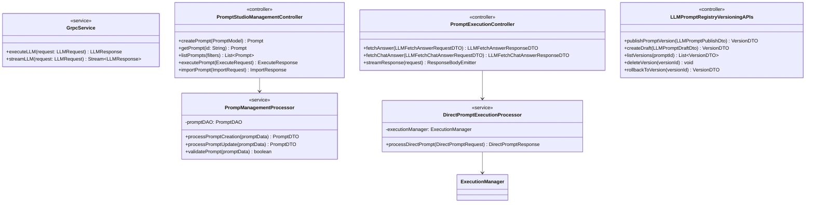
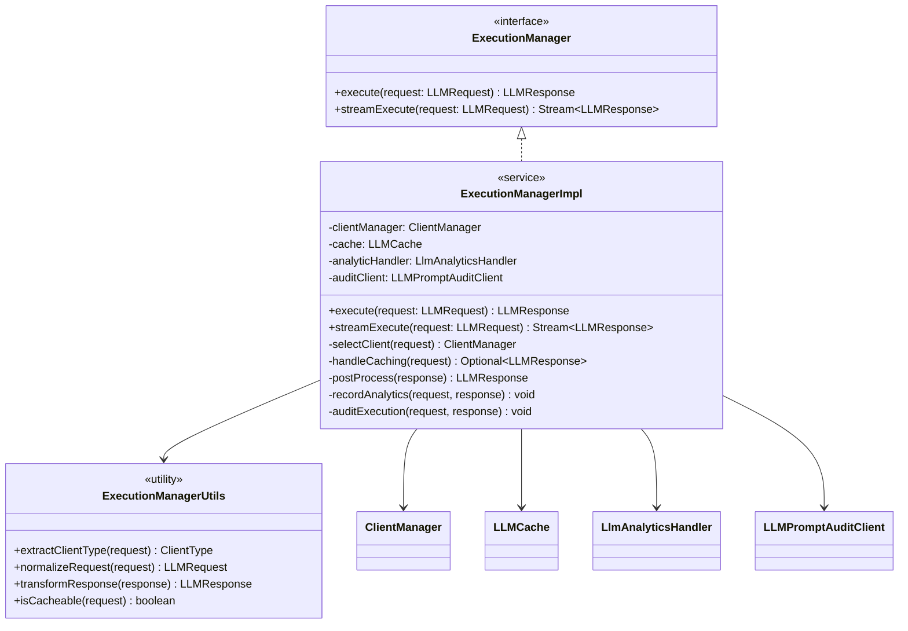
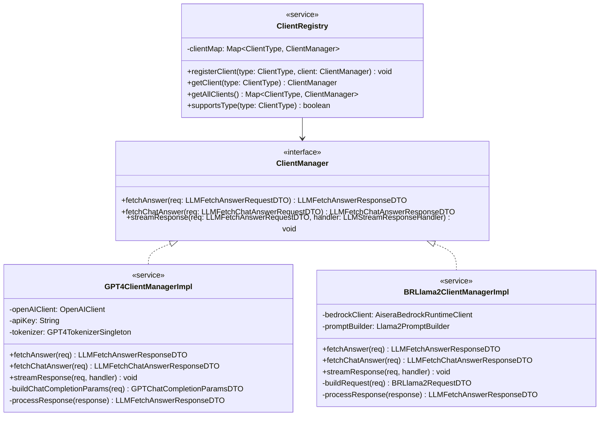
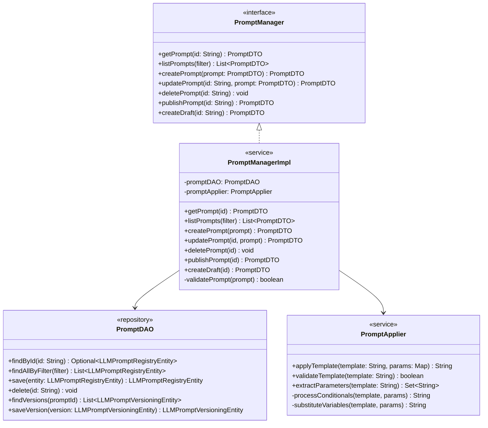
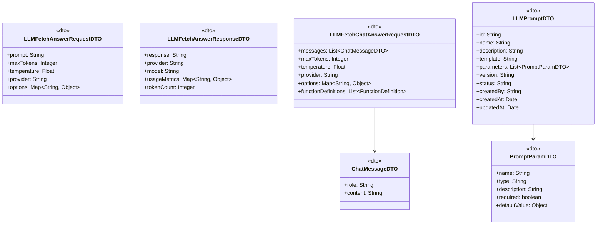
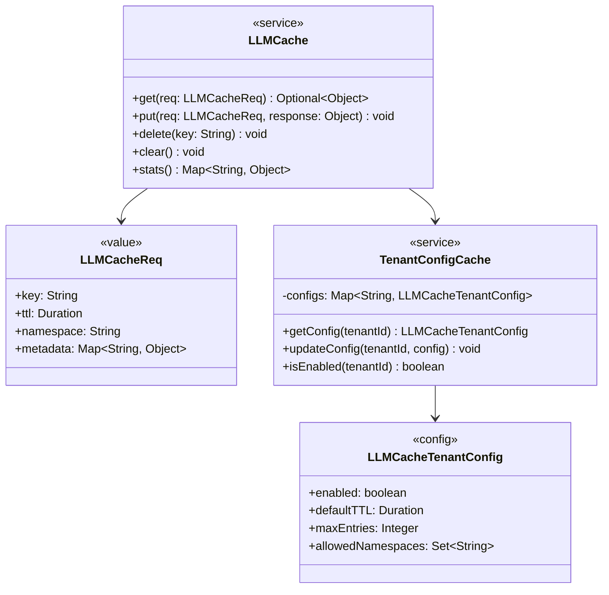
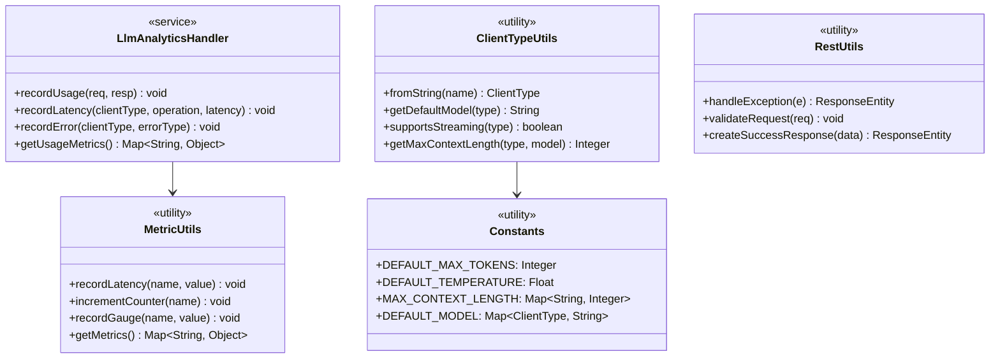
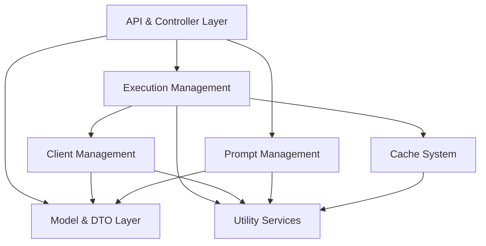

# Module-Level Architecture

## Table of Contents

- [Introduction](#introduction)
- [Package Structure](#package-structure)
- [Core Modules](#core-modules)
  - [API & Controller Layer](#api--controller-layer)
  - [Execution Management](#execution-management)
  - [Client Management](#client-management)
  - [Prompt Management](#prompt-management)
  - [Model & DTO Layer](#model--dto-layer)
  - [Cache System](#cache-system)
  - [Utility Services](#utility-services)
- [Module Dependencies](#module-dependencies)
- [Extension Points](#extension-points)
- [Architectural Patterns](#architectural-patterns)

## Introduction

This document provides a detailed analysis of the LLM Gateway's module-level architecture, examining the responsibilities, interfaces, and internal structure of each major component. The system is designed around a modular architecture with well-defined interfaces to enable extensibility, maintainability, and scalability.

## Package Structure

The LLM Gateway code is organized into a hierarchical package structure within the `com.aisera.service.llm` namespace:

```
com.aisera.service.llm/
├── Config.java                    # Global configuration
├── JavaMicroservice.java          # Main service entry point
├── audit/                         # Audit logging components
├── bootstrap/                     # Service initialization
├── cache/                         # Caching implementation
├── client/                        # LLM client interfaces and implementations
│   ├── ClientManager.java         # Client management interface
│   ├── ClientRegistry.java        # Client registration & factory
│   ├── ClientType.java            # Enumeration of client types
│   ├── aisera/                    # Aisera LLM client implementation
│   ├── aws/                       # AWS client utilities
│   ├── bedrock/                   # AWS Bedrock client implementations
│   └── gpt4/                      # OpenAI GPT client implementations
├── execution/                     # Execution orchestration
├── grpc/                          # gRPC service definitions
├── model/                         # Data models and DTOs
│   ├── common/                    # Shared model classes
│   ├── bedrock/                   # Bedrock-specific models
│   ├── flant5/                    # FlanT5 model DTOs
│   ├── functioncall/              # Function calling models
│   ├── gpt/                       # OpenAI GPT models
│   ├── llama2/                    # Llama 2 models
│   ├── llm/                       # Core LLM models
│   └── oasst/                     # Open Assistant models
├── prompt/                        # Prompt management
│   └── dao/                       # Prompt data access
├── rest/                          # REST API controllers
│   └── service/                   # REST service implementations
├── tenant/                        # Multi-tenancy support
└── utils/                         # Utility classes
    ├── analytics/                 # Analytics collection
    ├── bedrock/                   # Bedrock utilities
    └── gpt/                       # GPT utilities
```

## Core Modules

### API & Controller Layer

The API Layer provides HTTP/REST and gRPC interfaces for external clients to interact with the LLM Gateway.



**Key Components:**

- `GrpcService`: Implements gRPC interfaces for LLM execution
- `PromptExecutionController`: REST controller for executing LLM requests
- `PromptStudioManagementController`: REST controller for prompt management
- `LLMPromptRegistryVersioningAPIs`: REST controller for prompt versioning
- `PrompManagementProcessor`: Service for prompt management operations
- `DirectPromptExecutionProcessor`: Service for direct prompt execution

**Public Interfaces:**

- REST APIs exposed via Spring Web annotations (`@RestController`, `@RequestMapping`)
- gRPC services defined in Protocol Buffer files and implemented in `GrpcService`

**Internal Implementation Details:**

- Controllers validate input and delegate to service implementations
- Authentication and authorization handled via filters and interceptors
- Request/response logging for auditing and debugging
- Exception handling with appropriate HTTP status codes

### Execution Management

The Execution Management module orchestrates the fulfillment of LLM requests, including provider selection, caching, and response processing.



**Key Components:**

- `ExecutionManager`: Core interface for executing LLM requests
- `ExecutionManagerImpl`: Primary implementation of the execution orchestration
- `ExecutionManagerUtils`: Utility methods for request/response handling

**Public Interfaces:**

- `execute()`: Synchronous LLM request execution
- `streamExecute()`: Streaming execution for real-time responses

**Internal Implementation Details:**

- Provider selection based on request parameters and configuration
- Cache management with TTL-based expiration
- Analytics and audit integration
- Error handling with retry logic
- Support for both text completion and chat completion models

### Client Management

The Client Management module provides a unified interface to different LLM providers, abstracting the provider-specific implementation details.



**Key Components:**

- `ClientManager`: Interface defining operations for LLM provider clients
- `ClientRegistry`: Registry and factory for provider clients
- `ClientType`: Enumeration of supported client types
- Provider-specific implementations (`GPT4ClientManagerImpl`, `BRLlama2ClientManagerImpl`, etc.)

**Public Interfaces:**

- Client registration and retrieval via `ClientRegistry`
- Standard methods for text and chat completions
- Streaming support with handler callbacks

**Internal Implementation Details:**

- Provider-specific API clients and authentication
- Request/response transformation
- Token counting and budget management
- Connection pooling and retry strategies
- Error handling and normalization

### Prompt Management

The Prompt Management module handles the storage, retrieval, and application of prompt templates.



**Key Components:**

- `PromptManager`: Interface for prompt management operations
- `PromptManagerImpl`: Implementation of prompt management services
- `PromptApplier`: Service for applying templates with variable substitution
- `PromptDAO`: Data access object for prompt storage and retrieval

**Public Interfaces:**

- CRUD operations for prompt templates
- Versioning operations (publish, draft, rollback)
- Template application with parameter substitution

**Internal Implementation Details:**

- Template syntax with variable substitution using `{{variable}}` syntax
- Conditional logic with `{{#if var}}...{{/if}}` syntax
- Variable type validation
- Version history tracking
- Access control based on tenant and role

### Model & DTO Layer

The Model & DTO Layer defines the data structures used throughout the system for request/response handling and data persistence.



**Key Components:**

- Request/response DTOs for different API endpoints
- Chat message models for conversation interfaces
- Function calling models for tool usage
- Prompt and parameter definitions
- Provider-specific model DTOs

**Public Interfaces:**

- Serialization/deserialization via Jackson annotations
- Validation constraints using Bean Validation API

**Internal Implementation Details:**

- Immutable objects with builders for thread safety
- Conversion utilities between DTOs and domain models
- Type adapters for different serialization formats

### Cache System

The Cache System provides mechanisms for storing and retrieving LLM responses to improve performance and reduce costs.



**Key Components:**

- `LLMCache`: Service for caching LLM responses
- `LLMCacheReq`: Request object for cache operations
- `LLMCacheTenantConfig`: Tenant-specific cache configuration
- `TenantConfigCache`: Service for managing tenant-specific configurations

**Public Interfaces:**

- Get/put operations for cache interactions
- Configuration management per tenant
- Cache statistics and monitoring

**Internal Implementation Details:**

- Redis-based distributed cache implementation
- Hash-based cache keys from normalized requests
- TTL-based expiration strategy
- Tenant isolation for multi-tenant deployments
- Cache invalidation on prompt updates

### Utility Services

The Utility Services module provides cross-cutting functionality used by multiple components.



**Key Components:**

- `LlmAnalyticsHandler`: Service for collecting and processing analytics
- `MetricUtils`: Utilities for metric collection and reporting
- `Constants`: System-wide constants and default values
- `ClientTypeUtils`: Utilities specific to client type operations
- `RestUtils`: Utilities for REST API handling

**Public Interfaces:**

- Analytics recording and retrieval
- Metric collection and reporting
- Constants and default configurations
- Exception handling utilities

**Internal Implementation Details:**

- Integration with metrics collection systems
- Thread-safe implementation of shared utilities
- Tenant-aware analytics collection
- Performance optimization for frequently used operations

## Module Dependencies

The following diagram shows the key dependencies between modules:



## Extension Points

The LLM Gateway architecture provides several extension points for adding new functionality:

1. **New LLM Provider Integration**
   - Implement the `ClientManager` interface
   - Register with `ClientRegistry`
   - Add corresponding `ClientType` enum value
   - Implement provider-specific DTOs and transformations

2. **Custom Prompt Processors**
   - Extend the `PromptApplier` with custom processing logic
   - Register as a Spring component with appropriate priority

3. **Cache Implementations**
   - Provide alternative implementations of `LLMCache`
   - Configure through Spring dependency injection

4. **Custom Analytics Handlers**
   - Extend the analytics pipeline with custom processors
   - Register through dependency injection

## Architectural Patterns

The LLM Gateway employs several architectural patterns:

1. **Interface-based Design**
   - Core components defined through interfaces
   - Implementation classes clearly separated

2. **Factory Pattern**
   - `ClientRegistry` acts as a factory for `ClientManager` implementations
   - Dynamic selection based on request parameters

3. **Strategy Pattern**
   - Different client implementations provide alternative strategies
   - Runtime selection based on configuration and request

4. **Builder Pattern**
   - Used in DTO creation for fluent interfaces
   - Ensures immutability and thread safety

5. **Decorator Pattern**
   - Used in the execution pipeline to add cross-cutting concerns
   - Allows for composable behavior

6. **Repository Pattern**
   - Data access encapsulated in DAO classes
   - Abstracts underlying storage details

7. **Dependency Injection**
   - Spring-based dependency injection throughout
   - Enables flexible component wiring and testing

---

**Previous**: [System Architecture Overview](./system-architecture-overview.md) | **Next**: [Data Flow and Storage Design](./data-flow-storage-design.md)