# Observability and Telemetry

## Table of Contents

- [Introduction](#introduction)
- [Observability Architecture](#observability-architecture)
  - [System Overview](#system-overview)
  - [Component Integration](#component-integration)
- [Logging Framework](#logging-framework)
  - [Log Structure](#log-structure)
  - [Log Levels](#log-levels)
  - [Contextual Logging](#contextual-logging)
  - [Log Storage and Rotation](#log-storage-and-rotation)
- [Metrics Collection](#metrics-collection)
  - [Core Metrics](#core-metrics)
  - [Business Metrics](#business-metrics)
  - [Prometheus Integration](#prometheus-integration)
  - [Custom Metrics](#custom-metrics)
- [Distributed Tracing](#distributed-tracing)
  - [Trace Propagation](#trace-propagation)
  - [Span Instrumentation](#span-instrumentation)
  - [Sampling Strategy](#sampling-strategy)
- [Health Monitoring](#health-monitoring)
  - [Health Checks](#health-checks)
  - [Readiness and Liveness](#readiness-and-liveness)
  - [Dependency Health](#dependency-health)
- [Alerting System](#alerting-system)
  - [Alert Rules](#alert-rules)
  - [Alert Routing](#alert-routing)
  - [Alert Remediation](#alert-remediation)
- [Dashboard and Visualization](#dashboard-and-visualization)
  - [Operational Dashboards](#operational-dashboards)
  - [Business Dashboards](#business-dashboards)
  - [Custom Visualization](#custom-visualization)
- [Usage Analytics](#usage-analytics)
  - [User Behavior Analytics](#user-behavior-analytics)
  - [Cost Tracking](#cost-tracking)
  - [Trend Analysis](#trend-analysis)
- [Auditability](#auditability)
  - [Audit Logging](#audit-logging)
  - [Compliance Reporting](#compliance-reporting)
- [Integration Points](#integration-points)
  - [External Monitoring Systems](#external-monitoring-systems)
  - [SIEM Integration](#siem-integration)

## Introduction

This document describes the observability and telemetry architecture of the LLM Gateway, detailing how the system collects, processes, and exposes operational and business metrics. Comprehensive observability is a core design principle of the LLM Gateway, enabling operators to understand system behavior, diagnose issues, and optimize performance.

## Observability Architecture

### System Overview

The observability architecture is designed to provide a complete view of the system's state and behavior:

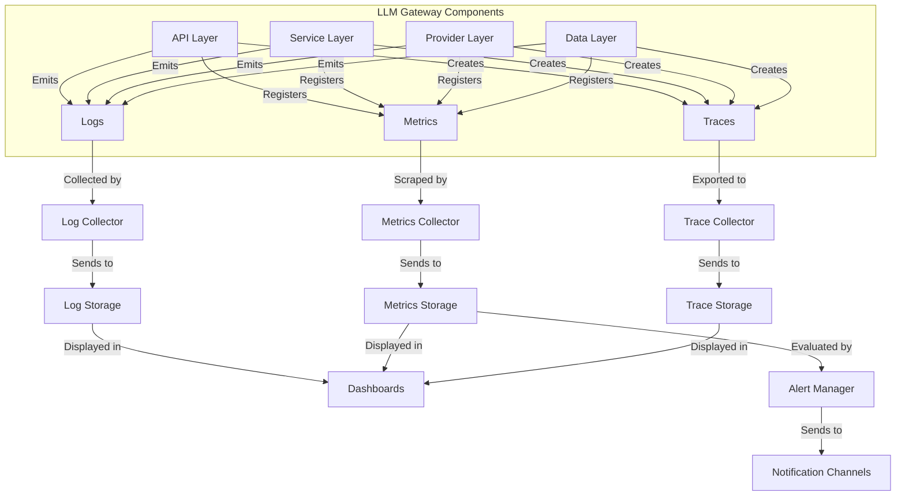

### Component Integration

The observability components are integrated into the application through a combination of frameworks, libraries, and custom code:

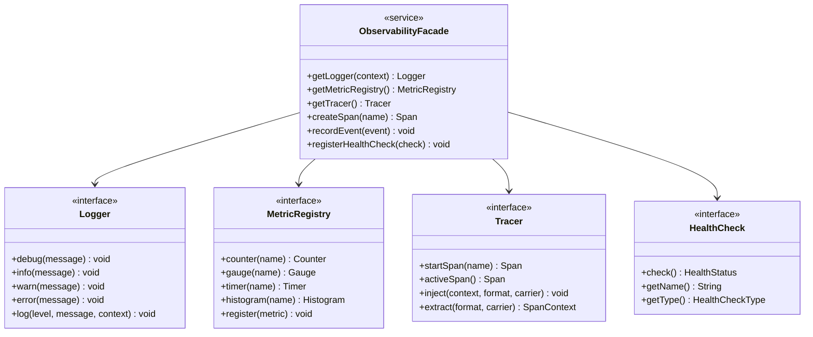

## Logging Framework

### Log Structure

The LLM Gateway uses a structured logging format to ensure logs are machine-parseable and easily searchable:

```json
{
  "timestamp": "2023-05-15T14:22:18.543Z",
  "level": "INFO",
  "thread": "http-nio-8080-exec-3",
  "logger": "com.aisera.service.llm.execution.ExecutionManagerImpl",
  "message": "Request execution completed",
  "context": {
    "requestId": "req-1234-5678-90ab-cdef",
    "tenantId": "tenant-123",
    "userId": "user-456",
    "providerType": "OPENAI",
    "modelId": "gpt-4",
    "executionTimeMs": 1243,
    "tokenCount": 356,
    "cacheHit": false
  },
  "traceId": "trace-1234-5678-90ab-cdef",
  "spanId": "span-1234-5678-90ab-cdef"
}
```

### Log Levels

The system uses the following log levels with clear guidelines for their use:

| Level | Purpose | Examples |
|-------|---------|----------|
| ERROR | System errors requiring immediate attention | Connection failures, API errors, data corruption |
| WARN | Potential issues that don't prevent operation | Slow responses, retries, degraded functionality |
| INFO | Normal operational events | Request processing, configuration changes, system startup |
| DEBUG | Detailed information for troubleshooting | Request/response details, internal state, algorithm steps |
| TRACE | Very detailed diagnostic information | Token-level processing, cache operations, low-level calls |

### Contextual Logging

The LLM Gateway implements Mapped Diagnostic Context (MDC) to correlate log entries across threads and systems:

```java
// Example of contextual logging
try (var context = LogContext.create()
        .put("requestId", request.getId())
        .put("tenantId", request.getTenantId())
        .put("provider", request.getProviderType())) {
    
    logger.info("Processing request");
    
    // Logic that generates more logs with the same context
    executeRequest(request);
    
    logger.info("Request processing completed");
}
```

Key context attributes that are automatically included in all logs:

1. **requestId**: Unique identifier for each request
2. **tenantId**: Tenant identifier for multi-tenant isolation
3. **userId**: User identifier (when available)
4. **traceId**: Distributed tracing identifier
5. **spanId**: Current span identifier within the trace

### Log Storage and Rotation

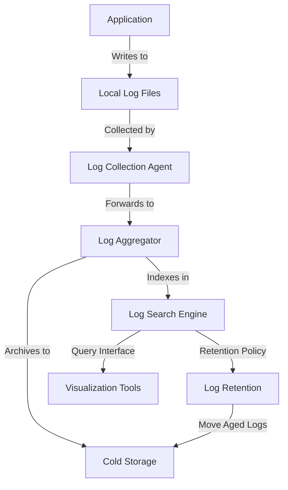

**Log Storage Strategy:**

1. **Local Storage**:
   - File-based logging with time-based rotation
   - Maximum file size: 100MB
   - Retention period: 7 days locally

2. **Centralized Storage**:
   - Elasticsearch for hot storage (30 days)
   - S3/blob storage for cold storage (1+ years)
   - Compression and encryption for archived logs

3. **Rotation Policy**:
   - Hourly rotation for high-volume environments
   - Daily rotation for standard environments
   - Size-based rotation as a safeguard (100MB limit)

## Metrics Collection

### Core Metrics

The LLM Gateway collects the following core system metrics:

**System Metrics:**
- CPU usage (percentage, per core, system/user/io wait)
- Memory usage (heap/non-heap, garbage collection statistics)
- Disk usage (reads/writes, latency, throughput)
- Network usage (bytes in/out, packets, errors)
- Thread pool statistics (active, queued, completed tasks)

**Application Metrics:**
- Request rate (requests per second, per endpoint)
- Response time (average, percentiles, distribution)
- Error rate (by type, endpoint, and provider)
- Cache performance (hit rate, miss rate, eviction rate)
- Queue depth (for asynchronous processing)
- Connection pool status (active, idle, waiting)

### Business Metrics

Business metrics provide insight into usage patterns and service utilization:

**Usage Metrics:**
- Requests by provider (count, percentage)
- Tokens used (input, output, by provider and model)
- Unique tenants and users (daily, weekly, monthly)
- Feature usage (which API endpoints are used)
- Cache efficiency (savings from cache hits)

**Financial Metrics:**
- Cost by provider and model
- Cost by tenant and user
- Savings from optimizations
- Revenue (for commercial deployments)
- Margin analysis (cost vs. revenue)

### Prometheus Integration

The LLM Gateway exposes metrics in Prometheus format:

```
# HELP llm_request_duration_seconds Request execution time in seconds
# TYPE llm_request_duration_seconds histogram
llm_request_duration_seconds_bucket{tenant="tenant1",provider="openai",model="gpt-4",le="0.1"} 12
llm_request_duration_seconds_bucket{tenant="tenant1",provider="openai",model="gpt-4",le="0.5"} 45
llm_request_duration_seconds_bucket{tenant="tenant1",provider="openai",model="gpt-4",le="1.0"} 78
llm_request_duration_seconds_bucket{tenant="tenant1",provider="openai",model="gpt-4",le="2.0"} 96
llm_request_duration_seconds_bucket{tenant="tenant1",provider="openai",model="gpt-4",le="5.0"} 112
llm_request_duration_seconds_bucket{tenant="tenant1",provider="openai",model="gpt-4",le="+Inf"} 120
llm_request_duration_seconds_count{tenant="tenant1",provider="openai",model="gpt-4"} 120
llm_request_duration_seconds_sum{tenant="tenant1",provider="openai",model="gpt-4"} 142.5

# HELP llm_request_total Total number of LLM requests
# TYPE llm_request_total counter
llm_request_total{tenant="tenant1",provider="openai",model="gpt-4",success="true"} 118
llm_request_total{tenant="tenant1",provider="openai",model="gpt-4",success="false"} 2
```

**Key Prometheus Metrics:**

1. **Counters**:
   - `llm_request_total`: Total requests by tenant, provider, model
   - `llm_error_total`: Error count by error type
   - `llm_token_total`: Token usage by tenant, provider, model
   - `llm_cache_operation_total`: Cache operations by operation type

2. **Gauges**:
   - `llm_active_requests`: Currently active requests
   - `llm_queue_size`: Current queue depth
   - `llm_thread_pool_active`: Active threads in thread pools
   - `llm_cache_size`: Current cache size

3. **Histograms**:
   - `llm_request_duration_seconds`: Request execution time
   - `llm_provider_latency_seconds`: Provider API latency
   - `llm_token_count`: Distribution of token counts
   - `llm_queue_wait_seconds`: Time spent in queue

4. **Summaries**:
   - `llm_request_summary_seconds`: Request time summary statistics
   - `llm_provider_summary_seconds`: Provider latency summary

### Custom Metrics

The LLM Gateway supports custom business metrics through the metrics API:

```java
// Example of custom metrics registration
@Component
public class CustomMetricsCollector {
    
    private final Counter customIntegrationRequests;
    private final Timer customProcessingTime;
    
    public CustomMetricsCollector(MetricsRegistry registry) {
        customIntegrationRequests = registry.counter("custom_integration_requests_total");
        customProcessingTime = registry.timer("custom_processing_seconds");
    }
    
    public void recordIntegrationRequest() {
        customIntegrationRequests.increment();
    }
    
    public void recordProcessingTime(Runnable task) {
        customProcessingTime.record(task);
    }
}
```

## Distributed Tracing

### Trace Propagation

The LLM Gateway implements distributed tracing using the OpenTelemetry standard:

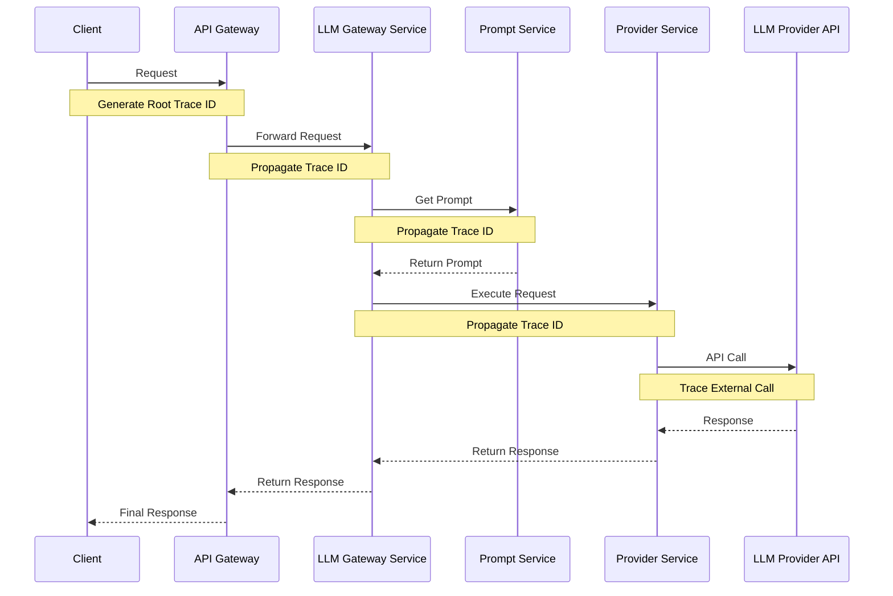

**Trace Context Propagation:**

1. **HTTP Headers**: W3C Trace Context headers (`traceparent`, `tracestate`)
2. **gRPC Metadata**: Trace context in gRPC metadata
3. **Async Operations**: Context propagation across async boundaries
4. **Scheduled Tasks**: Trace context for scheduled operations

### Span Instrumentation

The system creates spans for important operations to provide detailed execution visibility:

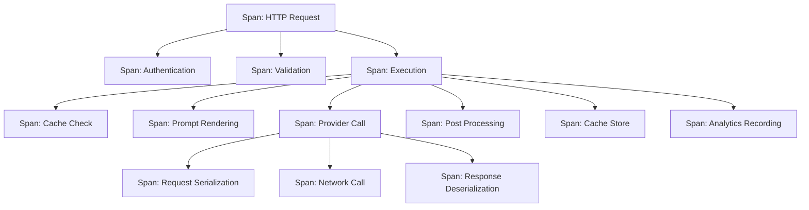

**Span Attributes:**

Each span includes relevant attributes to provide context:

```yaml
# Example HTTP Request Span
name: "/api/v1/prompt/execute"
kind: SERVER
attributes:
  http.method: "POST"
  http.url: "https://llm-gateway.example.com/api/v1/prompt/execute"
  http.status_code: 200
  tenant.id: "tenant-123"
  user.id: "user-456"
  request.id: "req-1234-5678-90ab-cdef"

# Example Provider Call Span
name: "provider.call.openai"
kind: CLIENT
attributes:
  provider.type: "OPENAI"
  provider.model: "gpt-4"
  provider.endpoint: "https://api.openai.com/v1/chat/completions"
  request.prompt_tokens: 156
  request.completion_tokens: 200
  request.total_tokens: 356
  cache.hit: false
  error: null
```

### Sampling Strategy

The LLM Gateway implements an adaptive sampling strategy to balance observability with resource efficiency:

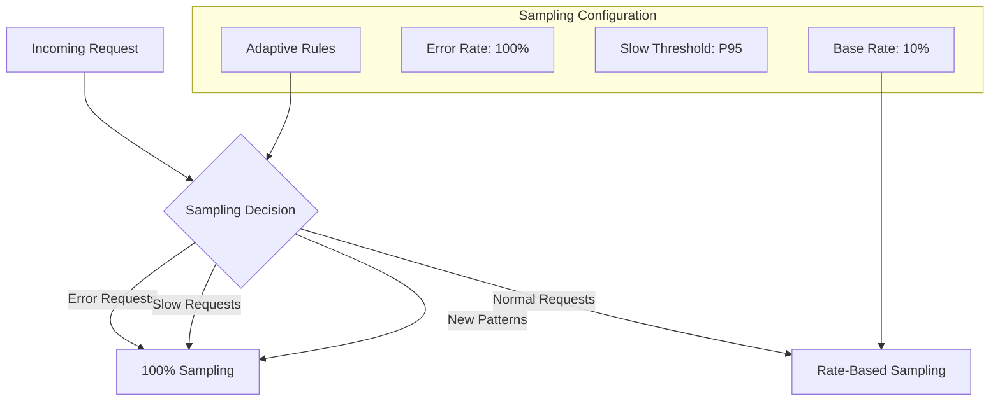

**Sampling Configuration:**

1. **Base Sampling Rate**: 10% of normal requests
2. **Error Sampling**: 100% of requests with errors
3. **Performance Sampling**: 100% of slow requests (>P95)
4. **Tenant Sampling**: Higher rates for new or problematic tenants
5. **Adaptive Sampling**: Dynamically adjusted based on system conditions
6. **Debug Mode**: 100% sampling when enabled for troubleshooting

## Health Monitoring

### Health Checks

The LLM Gateway implements comprehensive health checks for all components:

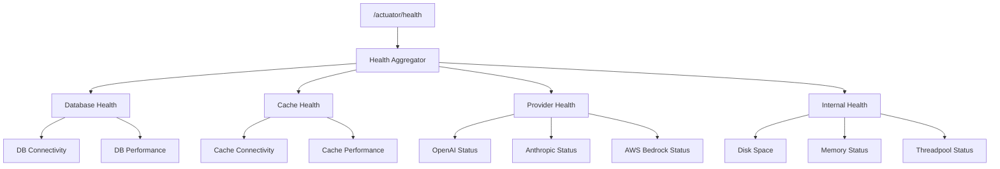

**Health Check Response:**

```json
{
  "status": "UP",
  "components": {
    "db": {
      "status": "UP",
      "details": {
        "database": "PostgreSQL",
        "version": "14.4",
        "responseTime": "12ms"
      }
    },
    "cache": {
      "status": "UP",
      "details": {
        "type": "Redis",
        "version": "6.2.6",
        "responseTime": "2ms"
      }
    },
    "providers": {
      "status": "UP",
      "components": {
        "openai": {
          "status": "UP",
          "details": {
            "latency": "245ms",
            "models": ["gpt-3.5-turbo", "gpt-4"]
          }
        },
        "anthropic": {
          "status": "DEGRADED",
          "details": {
            "latency": "580ms",
            "models": ["claude-2"]
          }
        },
        "bedrock": {
          "status": "UP",
          "details": {
            "latency": "320ms",
            "models": ["llama2-70b", "claude-instant"]
          }
        }
      }
    },
    "disk": {
      "status": "UP",
      "details": {
        "free": "15.2GB",
        "threshold": "10GB"
      }
    }
  }
}
```

### Readiness and Liveness

The system distinguishes between liveness (is the application running?) and readiness (is it able to handle requests?):

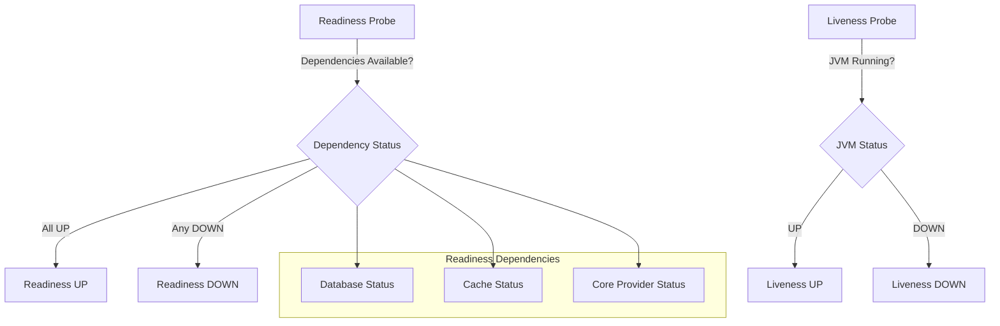

**Probe Configurations:**

1. **Liveness Probe**:
   - Checks: Basic JVM health, deadlock detection
   - Interval: 30 seconds
   - Timeout: 5 seconds
   - Failure threshold: 3 attempts

2. **Readiness Probe**:
   - Checks: Dependencies health, thread pool status
   - Interval: 10 seconds
   - Timeout: 5 seconds
   - Failure threshold: 2 attempts

### Dependency Health

The system continuously monitors the health of dependencies and adapts behavior accordingly:

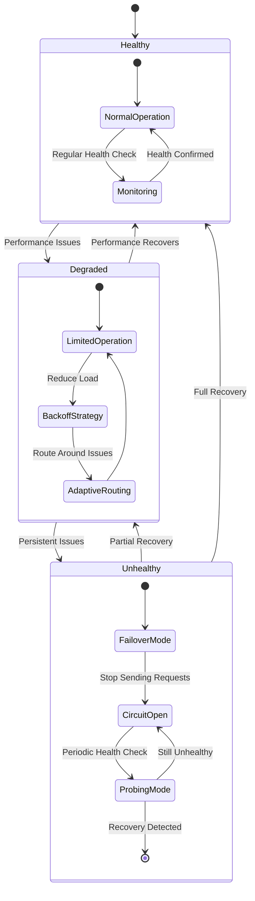

**Health State Management:**

1. **Healthy**: Normal operation, full traffic
2. **Degraded**: 
   - Increased latency or error rates
   - Throttling and backoff strategies applied
   - Traffic reduction if necessary
3. **Unhealthy**:
   - Circuit breaker activation
   - Traffic rerouting to alternative providers
   - Periodic health probing for recovery detection

## Alerting System

### Alert Rules

The LLM Gateway implements a comprehensive set of alerts:

**Infrastructure Alerts:**
- High CPU usage (>80% for 5 minutes)
- High memory usage (>85% for 5 minutes)
- Disk space running low (<15% free)
- Database connection pool saturation (>85% for 3 minutes)
- Cache connection issues (>3 failures in 1 minute)

**Application Alerts:**
- High error rate (>1% of requests for 5 minutes)
- High latency (P95 >2x normal for 5 minutes)
- Circuit breaker tripped (any provider)
- Request queue buildup (>100 queued requests for 2 minutes)
- Cache hit rate drop (>30% decrease from baseline)

**Business Alerts:**
- Unusual traffic patterns (>3σ from baseline)
- Cost spikes (>50% increase from daily average)
- Unusual model usage patterns (anomaly detection)
- Tenant quota approaching (>85% of limit)
- Service level objective violations

### Alert Routing

Alerts are routed to appropriate teams based on alert type, severity, and context:

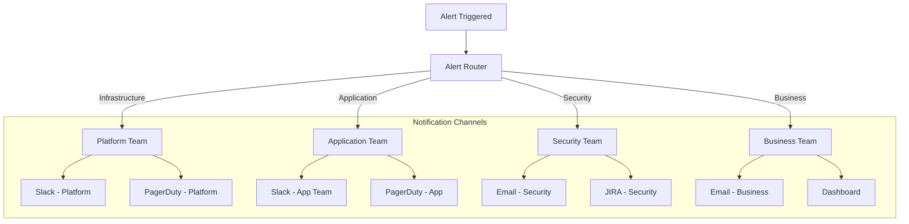

**Alert Severity Levels:**

1. **Critical**: Immediate attention required (24/7)
   - System unavailability
   - Data loss or corruption
   - Security breaches

2. **High**: Urgent attention during business hours
   - Degraded performance
   - Provider failures
   - Approaching resource limits

3. **Medium**: Attention required within 24 hours
   - Minor performance issues
   - Non-critical component failures
   - Business metric anomalies

4. **Low**: Attention required within the week
   - Warning signs
   - Technical debt indicators
   - Optimization opportunities

### Alert Remediation

Alerts include context and recommended remediation steps:

```json
{
  "alertName": "high_error_rate",
  "severity": "high",
  "status": "firing",
  "startTime": "2023-05-15T14:22:18.543Z",
  "description": "High error rate detected for OpenAI GPT-4 provider",
  "value": "5.2%",
  "threshold": "1.0%",
  "context": {
    "provider": "openai",
    "model": "gpt-4",
    "errorTypes": {
      "rate_limit_exceeded": 65,
      "timeout": 12,
      "bad_request": 8
    },
    "affectedTenants": ["tenant-123", "tenant-456"],
    "traceIds": ["trace-1234", "trace-5678"]
  },
  "remediation": [
    "Check OpenAI status page for outages",
    "Review recent changes to request patterns",
    "Consider enabling rate limit protection temporarily",
    "Adjust retry parameters",
    "If persistent, failover to alternative provider"
  ],
  "runbook": "https://docs.example.com/runbooks/high-error-rate"
}
```

## Dashboard and Visualization

### Operational Dashboards

The LLM Gateway provides pre-built operational dashboards for monitoring system health and performance:

**System Health Dashboard:**
- Overall system status
- Component health indicators
- Resource utilization (CPU, memory, disk, network)
- JVM metrics (heap, garbage collection, threads)
- Alert history and status

**Request Processing Dashboard:**
- Request rate and throughput
- Response time (average, percentiles)
- Error rates and types
- Queue depths and processing times
- Circuit breaker status

**Provider Performance Dashboard:**
- Provider availability
- Provider latency
- Error rates by provider
- Cost by provider
- Token usage by provider

**Cache Performance Dashboard:**
- Cache hit/miss rates
- Cache size and memory usage
- Cache operation latency
- Eviction rates
- Cache efficiency metrics

### Business Dashboards

Business dashboards provide insights into usage patterns and business metrics:

**Usage Overview Dashboard:**
- Requests by tenant and user
- Token usage by tenant and model
- Active users and tenants
- Feature usage distribution
- Growth trends

**Cost Management Dashboard:**
- Total cost by tenant and model
- Cost trends and forecasts
- Cost optimization opportunities
- Cost allocation by department/project
- ROI metrics

**SLA Compliance Dashboard:**
- Availability metrics
- Performance against SLAs
- Error budget consumption
- Incident history
- Mean time to recovery

### Custom Visualization

The system supports custom visualization through flexible data export options:

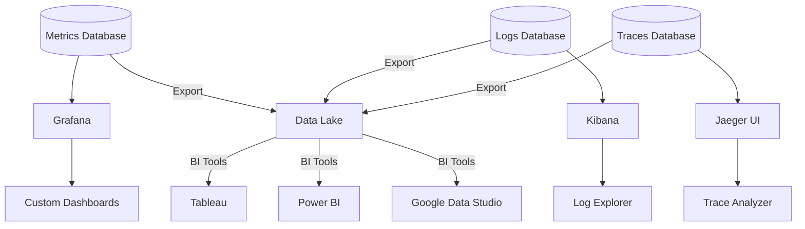

**Data Export Options:**

1. **Real-time Streaming**: Kafka/Kinesis integration for real-time data
2. **Batch Export**: Scheduled exports to data lake or data warehouse
3. **Query API**: Direct query access for custom visualizations
4. **Dashboard Embedding**: Embed standard dashboards in other systems
5. **Alerting Webhooks**: Integration with external alerting systems

## Usage Analytics

### User Behavior Analytics

The system collects anonymized usage data to identify patterns and optimization opportunities:

**Usage Patterns Analyzed:**
- Common prompt patterns
- Model selection patterns
- Parameter configurations
- Response utilization
- Session patterns

**Analysis Techniques:**
- Clustering of similar requests
- Trend analysis over time
- Comparative analysis across tenants
- Anomaly detection
- Usage forecasting

### Cost Tracking

Detailed cost tracking enables optimization and chargeback:

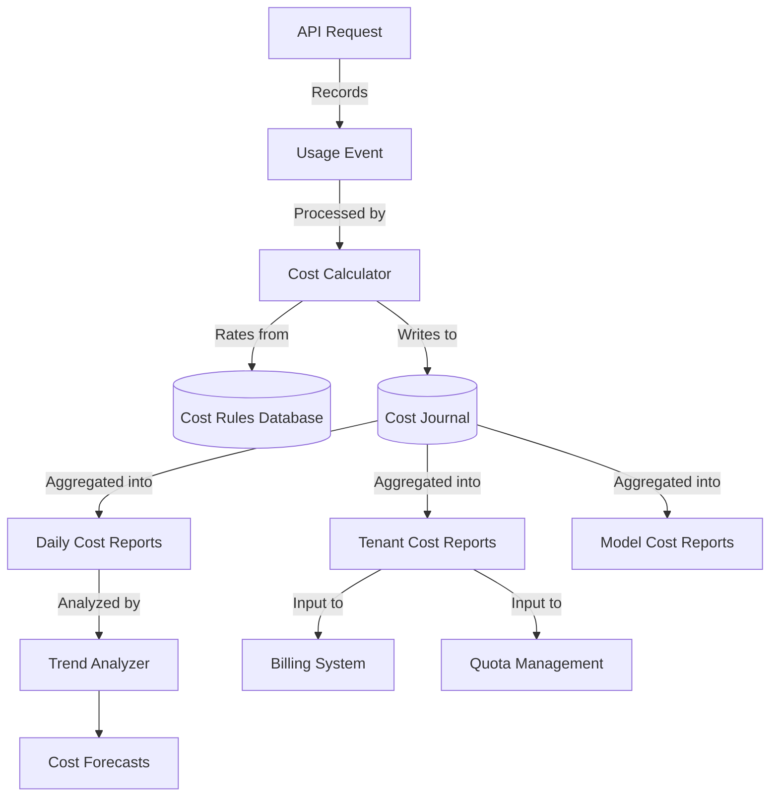

**Cost Tracking Components:**

1. **Usage Metering**: Records detailed usage metrics
2. **Cost Rules**: Configurable pricing rules by provider and model
3. **Cost Journal**: Detailed record of each billable action
4. **Aggregation**: Roll-up by time, tenant, model, etc.
5. **Analysis**: Identify trends and optimization opportunities
6. **Forecasting**: Predict future costs based on trends

### Trend Analysis

Long-term trend analysis provides insights for capacity planning and optimization:

**Trend Dimensions:**
- Overall system growth
- Tenant-specific growth
- Model usage shifts
- Cost efficiency trends
- Error rate patterns

**Analysis Timeframes:**
- Daily patterns (24-hour cycles)
- Weekly patterns (weekday vs. weekend)
- Monthly trends (growth and seasonality)
- Quarterly business cycles
- Annual planning horizons

## Auditability

### Audit Logging

The LLM Gateway maintains comprehensive audit logs for security and compliance:

**Audited Events:**
- Authentication and authorization attempts
- Administrative actions (configuration changes)
- Prompt template changes and versioning
- Provider credential changes
- Usage limit modifications
- Security-relevant operations

**Audit Log Format:**

```json
{
  "timestamp": "2023-05-15T14:22:18.543Z",
  "eventType": "PROMPT_TEMPLATE_MODIFIED",
  "actor": {
    "userId": "user-456",
    "username": "admin@example.com",
    "ipAddress": "192.168.1.100",
    "userAgent": "Mozilla/5.0 ..."
  },
  "resource": {
    "type": "PROMPT_TEMPLATE",
    "id": "prompt-789",
    "name": "Customer Support Assistant"
  },
  "action": "MODIFY",
  "status": "SUCCESS",
  "details": {
    "changes": ["template", "parameters"],
    "version": "2.3",
    "comment": "Updated to improve customer response format"
  },
  "traceId": "trace-1234-5678-90ab-cdef"
}
```

### Compliance Reporting

The system provides compliance reporting capabilities for regulatory requirements:

**Compliance Reports:**
- Usage audit reports (who used what, when)
- Content filtering reports (safety measures)
- Data handling reports (PII detection and handling)
- Access control reports (permission changes)
- Security incident reports

**Regulatory Frameworks Supported:**
- SOC 2 Type II
- GDPR
- HIPAA
- CCPA/CPRA
- Industry-specific regulations

## Integration Points

### External Monitoring Systems

The LLM Gateway integrates with external monitoring systems through standard protocols:

**Integration Methods:**
- Prometheus metrics endpoint
- OpenTelemetry trace export
- Structured log output
- Health check API
- Webhook notifications

**Supported Systems:**
- Prometheus/Grafana
- Datadog
- New Relic
- Dynatrace
- Elastic Stack
- CloudWatch
- Azure Monitor

### SIEM Integration

Security Information and Event Management integration for security monitoring:

**SIEM Data Flows:**
- Security audit logs
- Authentication events
- Authorization events
- Configuration changes
- Suspicious activity detection

**Integration Methods:**
- Syslog forwarding
- Log shipping agents
- API-based integration
- Webhook notifications
- Custom log formats

---

**Previous**: [Deployment and Scaling Architecture](./deployment-scaling.md) | **Next**: [Security Architecture](./security-architecture.md)