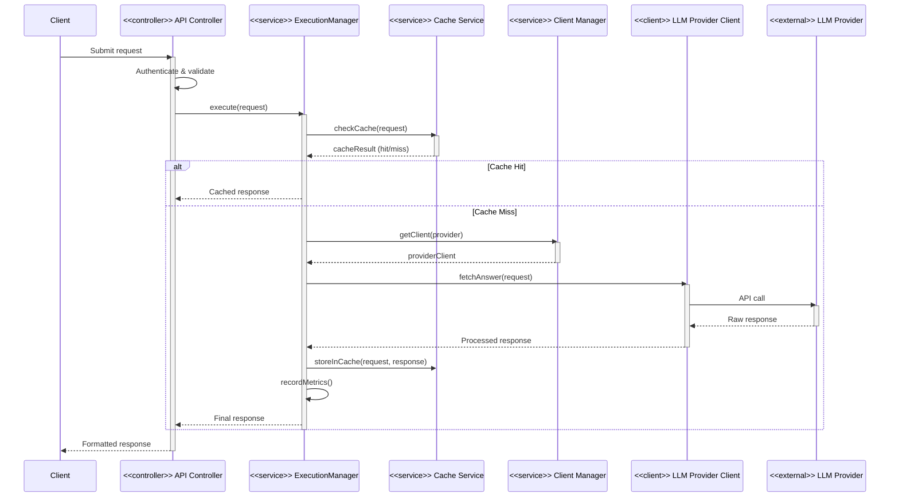
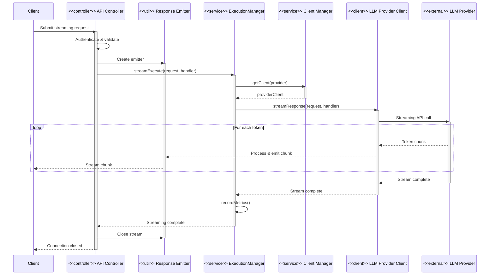
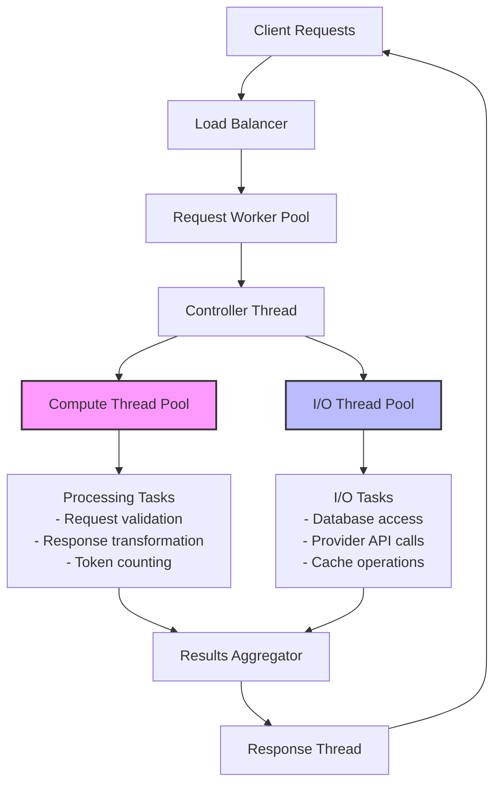
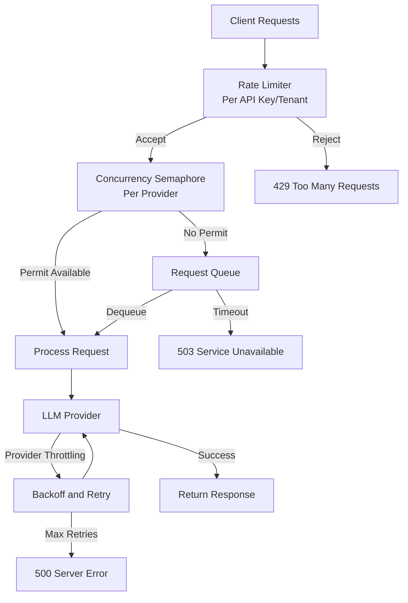
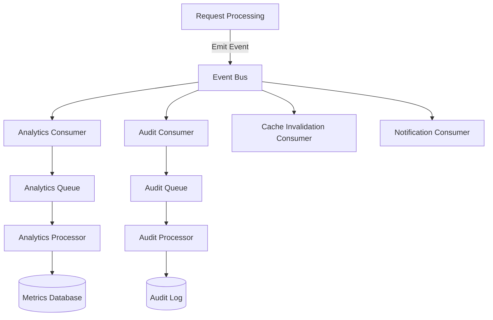
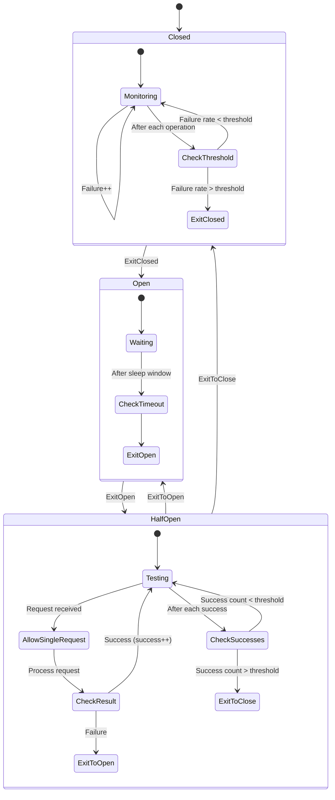

# Runtime Behavior & Concurrency

## Table of Contents

- [Introduction](#introduction)
- [Request Processing Lifecycle](#request-processing-lifecycle)
  - [Synchronous Request Handling](#synchronous-request-handling)
  - [Streaming Request Handling](#streaming-request-handling)
- [Concurrency Model](#concurrency-model)
  - [Thread Pool Architecture](#thread-pool-architecture)
  - [Asynchronous Processing](#asynchronous-processing)
  - [Throttling and Backpressure](#throttling-and-backpressure)
- [Event-Driven Components](#event-driven-components)
- [State Management](#state-management)
- [Transaction Handling](#transaction-handling)
- [Timeouts and Circuit Breaking](#timeouts-and-circuit-breaking)
- [Resource Management](#resource-management)

## Introduction

This document describes the runtime behavior and concurrency model of the LLM Gateway, explaining how requests are processed, how concurrency is managed, and how the system handles high load scenarios. The LLM Gateway processes a mix of synchronous and streaming requests with varying latency requirements, necessitating careful design of its runtime architecture.

## Request Processing Lifecycle

### Synchronous Request Handling

This sequence diagram illustrates the lifecycle of a typical synchronous request through the system:



**Lifecycle Steps:**

1. **Request Reception**: Client submits an HTTP or gRPC request
2. **Authentication & Validation**: Request is authenticated and validated
3. **Execution Delegation**: Request is passed to the execution manager
4. **Cache Check**: System checks if an identical request exists in cache
5. **Provider Selection**: If cache miss, appropriate provider client is selected
6. **LLM Request**: The request is sent to the LLM provider
7. **Response Processing**: Provider response is processed and normalized
8. **Caching**: Response is cached if cacheable
9. **Metric Recording**: Usage metrics are recorded
10. **Response Delivery**: Formatted response is returned to client

### Streaming Request Handling

Streaming requests follow a similar but distinct pattern:



**Streaming Lifecycle Steps:**

1. **Request Reception**: Client submits a streaming request
2. **Stream Initialization**: Response emitter is created for the client connection
3. **Execution Delegation**: Streaming execution is initiated with callback handler
4. **Provider Selection**: Appropriate provider client is selected
5. **Streaming Request**: Streaming connection is established with LLM provider
6. **Token Processing**: Each token is processed and emitted to the client as received
7. **Stream Completion**: Upon completion, metrics are recorded and connection is closed

## Concurrency Model

The LLM Gateway implements a hybrid concurrency model combining thread pools for CPU-bound work and asynchronous processing for I/O-bound operations.

### Thread Pool Architecture



**Thread Pool Components:**

1. **Request Worker Pool**
   - Size: `min(32, num_cores * 2)`
   - Purpose: Initial request handling and routing
   - Configuration: Fixed size with small queue

2. **Compute Thread Pool**
   - Size: `num_cores * 4`
   - Purpose: CPU-intensive operations (validation, transformation)
   - Configuration: Work-stealing pool with bounded queue

3. **I/O Thread Pool**
   - Size: Elastic (16-128 threads)
   - Purpose: I/O-bound operations (network, database)
   - Configuration: Cached thread pool with timeout

4. **Streaming Thread Pool**
   - Size: Elastic (8-64 threads)
   - Purpose: Managing streaming connections
   - Configuration: Virtual threads (Java 19+) or cached thread pool

### Asynchronous Processing

The system uses the CompletableFuture API for asynchronous processing:

```java
// Example of async execution flow in ExecutionManagerImpl
public CompletableFuture<LLMFetchAnswerResponseDTO> executeAsync(LLMFetchAnswerRequestDTO request) {
    return CompletableFuture
        .supplyAsync(() -> validateRequest(request), computeExecutor)
        .thenComposeAsync(this::checkCache, ioExecutor)
        .thenComposeAsync(result -> {
            if (result.isPresent()) {
                return CompletableFuture.completedFuture(result.get());
            } else {
                return executeWithProvider(request);
            }
        }, ioExecutor)
        .thenApplyAsync(this::postProcessResponse, computeExecutor)
        .whenCompleteAsync((response, error) -> {
            if (error == null) {
                recordMetrics(request, response);
            } else {
                recordError(request, error);
            }
        }, computeExecutor);
}
```

**Key Async Patterns:**

- Task submission to appropriate thread pools based on operation type
- Asynchronous composition of dependent operations
- Non-blocking I/O for external service calls
- Parallel execution of independent operations

### Throttling and Backpressure

The system implements several mechanisms for throttling and backpressure:



**Throttling Components:**

1. **API Rate Limiter**
   - Configured per tenant and API key
   - Implements token bucket algorithm
   - Customizable bucket size and refill rate

2. **Concurrency Semaphores**
   - Limit parallel requests to each provider
   - Prevent provider quota exhaustion
   - Dynamically adjustable based on provider health

3. **Request Queuing**
   - Queue for requests that exceed concurrency limits
   - Time-based eviction for queued requests
   - Priority based on client tier

4. **Adaptive Retry**
   - Exponential backoff for rate-limited requests
   - Circuit breaking for failing providers
   - Per-provider retry configuration

## Event-Driven Components

The LLM Gateway includes several event-driven components for non-request processing:



**Event-Driven Components:**

1. **Event Bus**
   - Implementation: In-memory message bus
   - Event types: Request, Response, Error, Config Change
   - Dispatcher: Single-threaded with overflow protection

2. **Analytics Consumer**
   - Purpose: Process usage metrics
   - Processing model: Batched processing
   - Throughput: High-throughput, low latency

3. **Audit Consumer**
   - Purpose: Record audit events
   - Processing model: Reliable delivery
   - Storage: Persistent audit log

4. **Cache Invalidation Consumer**
   - Purpose: Invalidate affected cache entries
   - Processing model: Immediate processing
   - Scope: Targeted invalidation

## State Management

The LLM Gateway uses different state management approaches for different components:

1. **Request State**
   - Stateless request processing
   - No session state between requests
   - Request context passed through execution chain

2. **Configuration State**
   - Cached configuration loaded at startup
   - Dynamic reconfiguration via admin APIs
   - Configuration changes broadcast via events

3. **Connection State**
   - Connection pooling for provider clients
   - Keep-alive for persistent connections
   - Circuit breaking for failed connections

4. **Streaming State**
   - Per-request state for streaming responses
   - Token buffer for efficient streaming
   - Stream timeout monitoring

## Transaction Handling

The system implements transaction handling for data consistency:

1. **Database Transactions**
   - Transaction boundaries defined at service layer
   - Optimistic locking for concurrent updates
   - Read-committed isolation level

2. **Distributed Operations**
   - Eventual consistency for distributed operations
   - Idempotent operations where possible
   - Compensating transactions for failures

3. **Error Handling in Transactions**
   - Automatic rollback on exceptions
   - Detailed transaction logging
   - Recovery mechanisms for partial failures

## Timeouts and Circuit Breaking

The LLM Gateway implements a comprehensive timeout and circuit breaking strategy:



**Timeout Configuration:**

1. **Connection Timeouts**
   - HTTP connection establishment: 5 seconds
   - Socket read timeout: 30-120 seconds (model dependent)
   - Socket write timeout: 5 seconds

2. **Request Timeouts**
   - Default request timeout: 60 seconds
   - Streaming initial response: 10 seconds
   - Streaming token timeout: 5 seconds
   - Configurable per request and provider

3. **Queue Timeouts**
   - Queue wait time: 30 seconds
   - Processing time: Model-dependent
   - Client connection idle timeout: 120 seconds

**Circuit Breaker Configuration:**

1. **Failure Thresholds**
   - Error threshold: 50% of requests in 1-minute window
   - Minimum requests: 5 requests in window
   - Tracked errors: Timeouts, 5xx responses, connection errors

2. **Recovery Strategy**
   - Open circuit duration: 30 seconds
   - Half-open test requests: 5 requests
   - Success threshold: 3 consecutive successes
   - Backoff multiplier: 1.5x (up to 5 minutes)

## Resource Management

The LLM Gateway implements careful resource management to prevent resource exhaustion:

1. **Memory Management**
   - Response size limits based on client tier
   - Streaming buffer size limits
   - Off-heap buffers for large responses
   - Garbage collection tuning for predictable latency

2. **Connection Management**
   - HTTP connection pooling (default: 100 per route)
   - Connection TTL: 5 minutes
   - Idle timeout: 60 seconds
   - DNS cache TTL: 30 seconds

3. **Monitoring and Adaptation**
   - Real-time resource usage monitoring
   - Adaptive concurrency limits based on system load
   - Graceful degradation under high load
   - Health check probes for external dependencies

---

**Previous**: [Data Flow and Storage Design](./data-flow-storage-design.md) | **Next**: [Extension Points and Plug-In Strategy](./extension-points.md)