# Security Architecture

## Table of Contents

- [Introduction](#introduction)
- [Security Principles](#security-principles)
- [Threat Model](#threat-model)
  - [Threat Actors](#threat-actors)
  - [Attack Vectors](#attack-vectors)
  - [Assets to Protect](#assets-to-protect)
- [Authentication and Authorization](#authentication-and-authorization)
  - [Authentication Methods](#authentication-methods)
  - [Multi-Factor Authentication](#multi-factor-authentication)
  - [Role-Based Access Control](#role-based-access-control)
  - [Tenant Isolation](#tenant-isolation)
- [API Security](#api-security)
  - [Input Validation](#input-validation)
  - [Rate Limiting](#rate-limiting)
  - [API Keys and Tokens](#api-keys-and-tokens)
- [Data Protection](#data-protection)
  - [Data Classification](#data-classification)
  - [Encryption Strategy](#encryption-strategy)
  - [Key Management](#key-management)
  - [Secure Data Storage](#secure-data-storage)
- [Network Security](#network-security)
  - [Network Architecture](#network-architecture)
  - [Transport Layer Security](#transport-layer-security)
  - [Network Segmentation](#network-segmentation)
  - [API Gateway](#api-gateway)
- [LLM-Specific Security Concerns](#llm-specific-security-concerns)
  - [Prompt Injection Protection](#prompt-injection-protection)
  - [Data Leakage Prevention](#data-leakage-prevention)
  - [Model Security](#model-security)
  - [Output Filtering](#output-filtering)
- [Secret Management](#secret-management)
  - [Provider Credentials](#provider-credentials)
  - [Rotation Policies](#rotation-policies)
- [Audit and Compliance](#audit-and-compliance)
  - [Audit Logging](#audit-logging)
  - [Compliance Controls](#compliance-controls)
- [Security Monitoring](#security-monitoring)
  - [Detection Mechanisms](#detection-mechanisms)
  - [Incident Response](#incident-response)
- [Secure Development](#secure-development)
  - [Security Testing](#security-testing)
  - [Dependency Management](#dependency-management)
- [Deployment Security](#deployment-security)
  - [Secure Configuration](#secure-configuration)
  - [Container Security](#container-security)
  - [Infrastructure Security](#infrastructure-security)

## Introduction

This document describes the security architecture of the LLM Gateway, detailing the security controls, processes, and technologies implemented to protect the system, its data, and its users. The LLM Gateway is designed with a security-first approach, addressing the unique security challenges of large language model deployments in enterprise environments.

## Security Principles

The LLM Gateway's security architecture is guided by the following core principles:

1. **Defense in Depth**: Multiple layers of security controls to protect against various threats
2. **Least Privilege**: Minimal access rights necessary for users and components to perform their functions
3. **Separation of Duties**: Critical operations require multiple approvals
4. **Zero Trust**: No implicit trust based on network location or asset ownership
5. **Secure by Default**: Security enabled in default configurations
6. **Privacy by Design**: Data protection built into the architecture
7. **Continuous Validation**: Ongoing testing and verification of security controls
8. **Transparent Security**: Clear documentation of security practices and controls

These principles inform all aspects of the security architecture, from authentication to deployment security.

## Threat Model

### Threat Actors

The LLM Gateway's threat model considers the following potential threat actors:

```mermaid
graph TD
    subgraph "External Threats"
        ExternalAttackers[External Attackers]
        CompetitorsAP[Competitors]
        SophisticatedAPT[Sophisticated APT Groups]
    end
    
    subgraph "Internal Threats"
        Malicious[Malicious Insiders]
        Careless[Careless Users]
        Compromised[Compromised Accounts]
    end
    
    subgraph "Supply Chain Threats"
        ThirdParty[Third-Party Providers]
        Dependency[Dependency Vulnerabilities]
    end
    
    ExternalAttackers -->|Target| DataAssets[Data Assets]
    ExternalAttackers -->|Target| APIAccess[API Access]
    
    CompetitorsAP -->|Target| IPAssets[Intellectual Property]
    CompetitorsAP -->|Target| BusinessLogic[Business Logic]
    
    SophisticatedAPT -->|Target| ProviderCreds[Provider Credentials]
    SophisticatedAPT -->|Target| CustomerData[Customer Data]
    
    Malicious -->|Target| SensitiveData[Sensitive Data]
    Malicious -->|Target| ProviderCreds
    
    Careless -->|Expose| Credentials[Credentials]
    Careless -->|Misconfigure| SecurityControls[Security Controls]
    
    Compromised -->|Access| PrivilegedOps[Privileged Operations]
    Compromised -->|Exfiltrate| SensitiveData
    
    ThirdParty -->|Compromise| ServiceSecurity[Service Security]
    Dependency -->|Introduce| Vulnerabilities[Vulnerabilities]
```

### Attack Vectors

The system defends against the following primary attack vectors:

| Attack Vector | Description | Mitigation Strategies |
|---------------|-------------|------------------------|
| API Abuse | Unauthorized API access or abuse | Authentication, rate limiting, input validation |
| Credential Theft | Stealing or compromising authentication credentials | MFA, short-lived tokens, secure credential storage |
| Data Exfiltration | Unauthorized extraction of sensitive data | Encryption, access controls, data loss prevention |
| Prompt Injection | Manipulating prompts to bypass security controls | Input sanitization, prompt validation, output filtering |
| Model Attacks | Attacks targeting the LLM models | Model security controls, output validation, usage monitoring |
| Infrastructure Attacks | Targeting underlying infrastructure | Network security, container hardening, vulnerability management |
| Supply Chain Attacks | Compromising dependencies or third parties | Dependency scanning, vendor assessment, integrity verification |
| Social Engineering | Manipulating users to gain access | Security awareness, strong authentication, least privilege |

### Assets to Protect

The LLM Gateway protects the following critical assets:

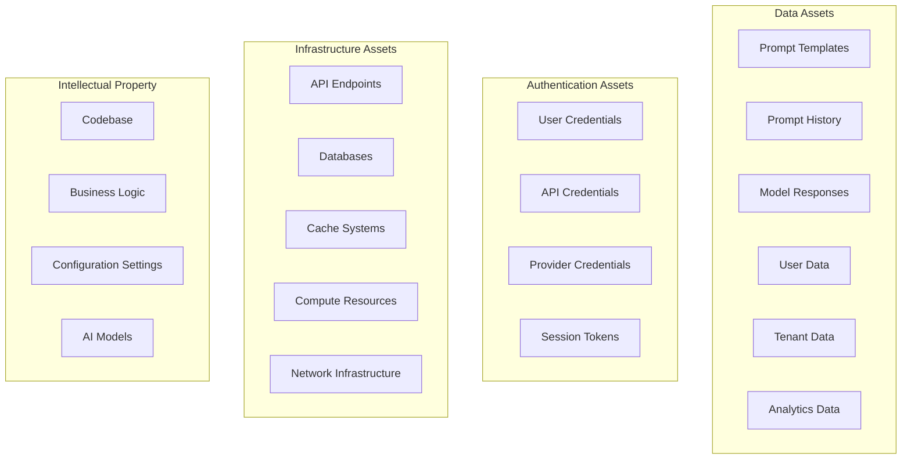
```mermaid
graph TD
    subgraph "Data Assets"
        PromptTemplates[Prompt Templates]
        PromptHistory[Prompt History]
        ModelResponses[Model Responses]
        UserData[User Data]
        TenantData[Tenant Data]
        AnalyticsData[Analytics Data]
    end
    
    subgraph "Authentication Assets"
        UserCreds[User Credentials]
        APICreds[API Credentials]
        ProviderCreds[Provider Credentials]
        SessionTokens[Session Tokens]
    end
    
    subgraph "Infrastructure Assets"
        APIEndpoints[API Endpoints]
        Databases[Databases]
        CacheSystems[Cache Systems]
        ComputeResources[Compute Resources]
        NetworkInfra[Network Infrastructure]
    end
    
    subgraph "Intellectual Property"
        CodeBase[Codebase]
        BusinessLogic[Business Logic]
        ConfigSettings[Configuration Settings]
        AIModels[AI Models]
    end
```

## Authentication and Authorization

### Authentication Methods

The LLM Gateway supports multiple authentication methods to accommodate various integration scenarios:

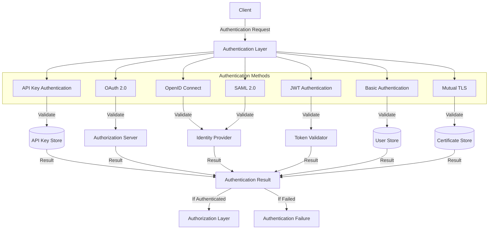
```mermaid
flowchart TD
    Client[Client] --> |Authentication Request| AuthN[Authentication Layer]
    
    subgraph "Authentication Methods"
        APIKey[API Key Authentication]
        OAuth[OAuth 2.0]
        OIDC[OpenID Connect]
        SAML[SAML 2.0]
        JWT[JWT Authentication]
        BasicAuth[Basic Authentication]
        MutualTLS[Mutual TLS]
    end
    
    AuthN --> APIKey
    AuthN --> OAuth
    AuthN --> OIDC
    AuthN --> SAML
    AuthN --> JWT
    AuthN --> BasicAuth
    AuthN --> MutualTLS
    
    APIKey --> |Validate| KeyStore[(API Key Store)]
    OAuth --> |Validate| AuthServer[Authorization Server]
    OIDC --> |Validate| IdP[Identity Provider]
    SAML --> |Validate| IdP
    JWT --> |Validate| TokenValidator[Token Validator]
    BasicAuth --> |Validate| UserStore[(User Store)]
    MutualTLS --> |Validate| CertStore[(Certificate Store)]
    
    KeyStore --> |Result| AuthResult[Authentication Result]
    AuthServer --> |Result| AuthResult
    IdP --> |Result| AuthResult
    TokenValidator --> |Result| AuthResult
    UserStore --> |Result| AuthResult
    CertStore --> |Result| AuthResult
    
    AuthResult --> |If Authenticated| AuthZ[Authorization Layer]
    AuthResult --> |If Failed| AuthFailure[Authentication Failure]
```

**Authentication Implementation Details:**

1. **API Key Authentication**
   - Format: Base64-encoded random string (32+ bytes)
   - Storage: Hashed with bcrypt in database
   - Transmission: HTTPS header (`X-API-Key`)
   - Lifecycle: Configurable expiration with rotation support

2. **OAuth 2.0**
   - Supported flows: Authorization code, client credentials, PKCE
   - Token types: Bearer tokens (JWT format)
   - Integration: Standard OAuth 2.0 providers (Auth0, Okta, etc.)
   - Features: Token introspection, revocation, refresh

3. **OpenID Connect**
   - Profiles: Basic, Implicit, Hybrid
   - Claims: Standard OIDC claims plus custom claims
   - Providers: Compatible with major OIDC providers
   - Features: Discovery, dynamic registration

4. **SAML 2.0**
   - Bindings: HTTP-POST, HTTP-Redirect
   - Profiles: Web Browser SSO
   - Assertions: Encrypted and signed assertions
   - Metadata: Dynamic and static metadata exchange

5. **JWT Authentication**
   - Algorithms: RS256, ES256, HS256
   - Validation: Signature, expiration, issuer, audience
   - Claims: Standard and custom claims
   - Revocation: Token blacklisting for critical scenarios

6. **Mutual TLS**
   - Certificate validation: Full chain validation
   - Client certificates: X.509 certificates
   - Certificate binding: Subject DN or SAN verification
   - Revocation: CRL and OCSP support

### Multi-Factor Authentication

The system supports multi-factor authentication for administrative access and high-security operations:

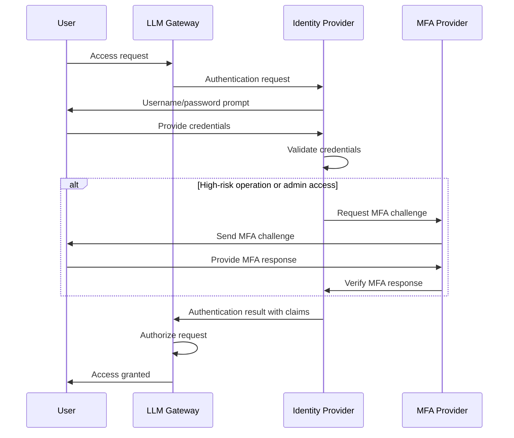
```mermaid
sequenceDiagram
    participant User
    participant LLMGateway as LLM Gateway
    participant IdP as Identity Provider
    participant MFAProvider as MFA Provider
    
    User->>LLMGateway: Access request
    LLMGateway->>IdP: Authentication request
    IdP->>User: Username/password prompt
    User->>IdP: Provide credentials
    IdP->>IdP: Validate credentials
    
    alt High-risk operation or admin access
        IdP->>MFAProvider: Request MFA challenge
        MFAProvider->>User: Send MFA challenge
        User->>MFAProvider: Provide MFA response
        MFAProvider->>IdP: Verify MFA response
    end
    
    IdP->>LLMGateway: Authentication result with claims
    LLMGateway->>LLMGateway: Authorize request
    LLMGateway->>User: Access granted
```

**MFA Implementation:**

1. **Supported Factors**
   - Time-based one-time passwords (TOTP)
   - Push notifications to mobile devices
   - Hardware security keys (FIDO2/WebAuthn)
   - SMS one-time passwords (configurable)
   - Email one-time passwords (configurable)

2. **MFA Policies**
   - Risk-based application (admin access, sensitive operations)
   - User-specific requirements
   - Tenant-configurable policies
   - IP-based triggers (new location/device)
   - Operation-based triggers (high-value actions)

### Role-Based Access Control

The LLM Gateway implements a comprehensive RBAC model:

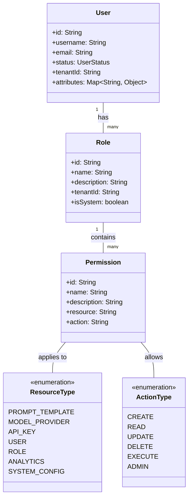
```mermaid
classDiagram
    class User {
        +id: String
        +username: String
        +email: String
        +status: UserStatus
        +tenantId: String
        +attributes: Map~String, Object~
    }
    
    class Role {
        +id: String
        +name: String
        +description: String
        +tenantId: String
        +isSystem: boolean
    }
    
    class Permission {
        +id: String
        +name: String
        +description: String
        +resource: String
        +action: String
    }
    
    class ResourceType {
        <<enumeration>>
        PROMPT_TEMPLATE
        MODEL_PROVIDER
        API_KEY
        USER
        ROLE
        ANALYTICS
        SYSTEM_CONFIG
    }
    
    class ActionType {
        <<enumeration>>
        CREATE
        READ
        UPDATE
        DELETE
        EXECUTE
        ADMIN
    }
    
    User "1" -- "many" Role: has
    Role "1" -- "many" Permission: contains
    Permission -- ResourceType: applies to
    Permission -- ActionType: allows
```

**RBAC Implementation:**

1. **System Roles**
   - `Admin`: Full system access
   - `Operator`: System monitoring and operations
   - `Developer`: API access and prompt development
   - `Analyst`: Analytics and reporting access
   - `User`: Basic prompt execution
   - `ReadOnly`: View-only access to resources

2. **Permission Structure**
   - Format: `resource:action`
   - Examples: `prompt:create`, `provider:read`, `admin:config`
   - Wildcards: `prompt:*` (all actions on prompts)
   - Hierarchy: Resource type permissions inherit to specific resources

3. **Authorization Flow**

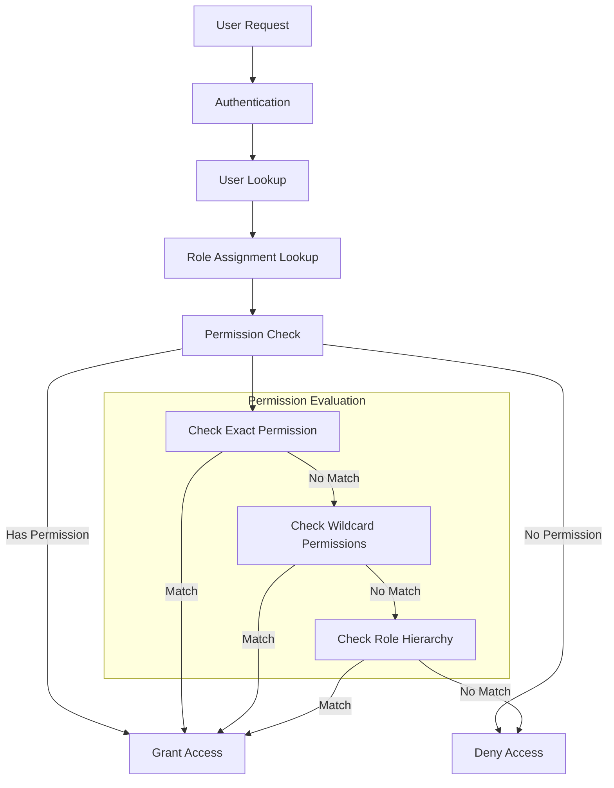
```mermaid
flowchart TD
    Request[User Request] --> AuthN[Authentication]
    AuthN --> UserLookup[User Lookup]
    UserLookup --> RoleLookup[Role Assignment Lookup]
    RoleLookup --> PermCheck[Permission Check]
    
    PermCheck --> |Has Permission| GrantAccess[Grant Access]
    PermCheck --> |No Permission| DenyAccess[Deny Access]
    
    subgraph "Permission Evaluation"
        ExactMatch[Check Exact Permission]
        WildcardMatch[Check Wildcard Permissions]
        RoleHierarchy[Check Role Hierarchy]
    end
    
    PermCheck --> ExactMatch
    ExactMatch --> |No Match| WildcardMatch
    WildcardMatch --> |No Match| RoleHierarchy
    
    ExactMatch --> |Match| GrantAccess
    WildcardMatch --> |Match| GrantAccess
    RoleHierarchy --> |Match| GrantAccess
    RoleHierarchy --> |No Match| DenyAccess
```

### Tenant Isolation

The system implements strict multi-tenant isolation:

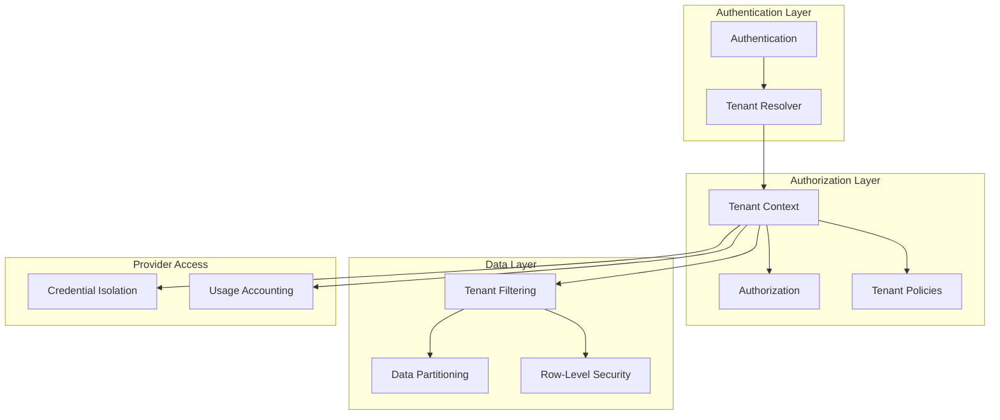
```mermaid
graph TD
    subgraph "Authentication Layer"
        AuthN[Authentication]
        TenantResolver[Tenant Resolver]
    end
    
    subgraph "Authorization Layer"
        AuthZ[Authorization]
        TenantContext[Tenant Context]
        TenantPolicies[Tenant Policies]
    end
    
    subgraph "Data Layer"
        TenantFilter[Tenant Filtering]
        DataPartitioning[Data Partitioning]
        RowLevelSecurity[Row-Level Security]
    end
    
    subgraph "Provider Access"
        CredentialIsolation[Credential Isolation]
        UsageAccounting[Usage Accounting]
    end
    
    AuthN --> TenantResolver
    TenantResolver --> TenantContext
    TenantContext --> AuthZ
    TenantContext --> TenantPolicies
    
    TenantContext --> TenantFilter
    TenantFilter --> DataPartitioning
    TenantFilter --> RowLevelSecurity
    
    TenantContext --> CredentialIsolation
    TenantContext --> UsageAccounting
```

**Tenant Isolation Implementation:**

1. **Authentication Isolation**
   - Per-tenant authentication configurations
   - Tenant-specific identity providers
   - Tenant context in all authentication tokens

2. **Authorization Isolation**
   - Per-tenant role definitions
   - Tenant-specific permission policies
   - Cross-tenant access strictly controlled

3. **Data Isolation**
   - Tenant identifier in all data records
   - Database filtering on all queries
   - Row-level security in database
   - Tenant boundary verification in code

4. **Resource Isolation**
   - Tenant-specific provider credentials
   - Separate connection pools per tenant
   - Resource quota enforcement per tenant
   - Usage tracking and limits per tenant

## API Security

### Input Validation

The LLM Gateway implements comprehensive input validation:

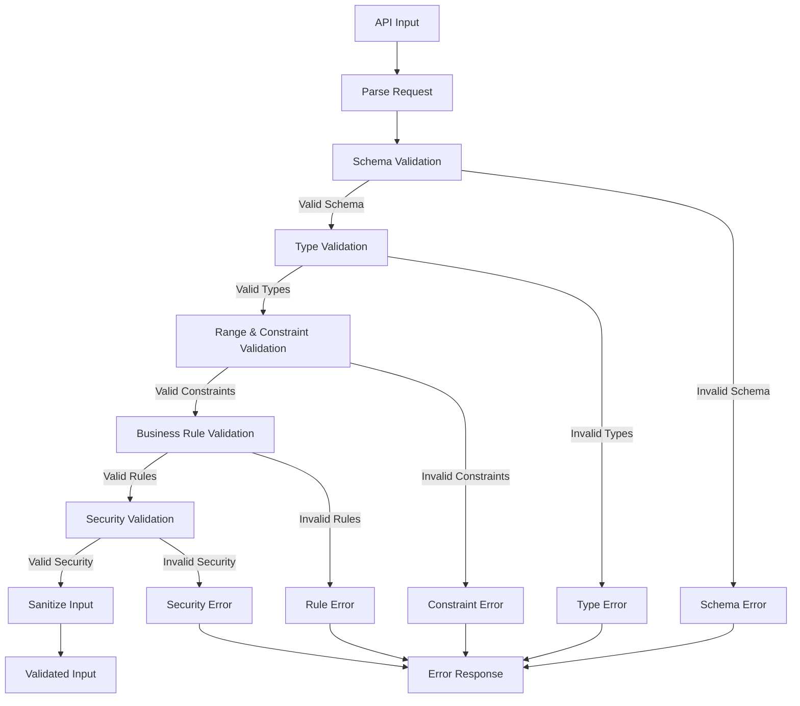
```mermaid
flowchart TD
    Input[API Input] --> Parsing[Parse Request]
    
    Parsing --> SchemaValidation[Schema Validation]
    SchemaValidation --> |Valid Schema| TypeValidation[Type Validation]
    SchemaValidation --> |Invalid Schema| SchemaError[Schema Error]
    
    TypeValidation --> |Valid Types| RangeValidation[Range & Constraint Validation]
    TypeValidation --> |Invalid Types| TypeError[Type Error]
    
    RangeValidation --> |Valid Constraints| BusinessRules[Business Rule Validation]
    RangeValidation --> |Invalid Constraints| ConstraintError[Constraint Error]
    
    BusinessRules --> |Valid Rules| SecurityValidation[Security Validation]
    BusinessRules --> |Invalid Rules| RuleError[Rule Error]
    
    SecurityValidation --> |Valid Security| SanitizeInput[Sanitize Input]
    SecurityValidation --> |Invalid Security| SecurityError[Security Error]
    
    SanitizeInput --> ValidInput[Validated Input]
    
    SchemaError --> ErrorResponse[Error Response]
    TypeError --> ErrorResponse
    ConstraintError --> ErrorResponse
    RuleError --> ErrorResponse
    SecurityError --> ErrorResponse
```

**Validation Approaches:**

1. **Schema Validation**
   - OpenAPI/Swagger schema validation
   - JSON Schema validation for request bodies
   - Required field validation
   - Data type validation

2. **Content Validation**
   - String length limits
   - Numeric range checking
   - Pattern matching (regex)
   - Enum value validation

3. **Security Validation**
   - Input sanitization
   - XSS protection
   - SQL injection protection
   - Special character handling

4. **Business Rule Validation**
   - Referential integrity
   - State transition rules
   - Cross-field validations
   - Tenant-specific rules

### Rate Limiting

The system implements multi-level rate limiting:

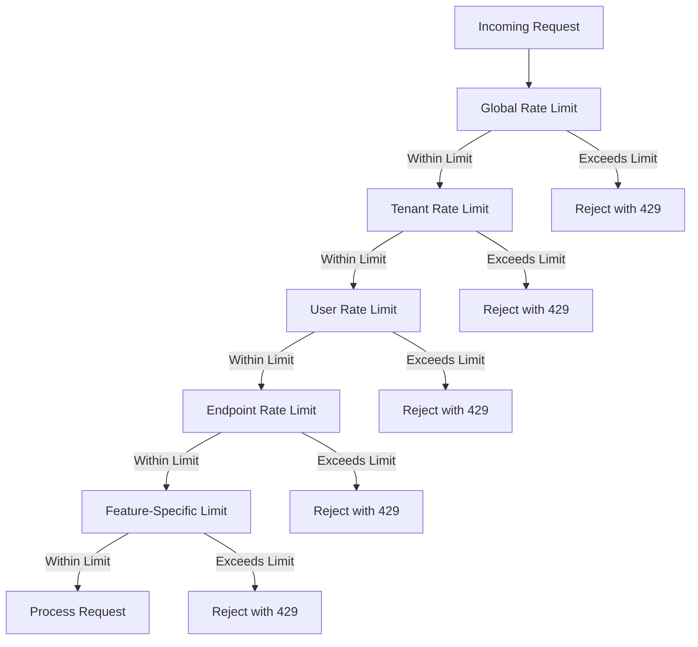
```mermaid
graph TD
    Request[Incoming Request] --> GlobalLimit[Global Rate Limit]
    
    GlobalLimit --> |Within Limit| TenantLimit[Tenant Rate Limit]
    GlobalLimit --> |Exceeds Limit| Reject1[Reject with 429]
    
    TenantLimit --> |Within Limit| UserLimit[User Rate Limit]
    TenantLimit --> |Exceeds Limit| Reject2[Reject with 429]
    
    UserLimit --> |Within Limit| EndpointLimit[Endpoint Rate Limit]
    UserLimit --> |Exceeds Limit| Reject3[Reject with 429]
    
    EndpointLimit --> |Within Limit| FeatureLimit[Feature-Specific Limit]
    EndpointLimit --> |Exceeds Limit| Reject4[Reject with 429]
    
    FeatureLimit --> |Within Limit| ProcessRequest[Process Request]
    FeatureLimit --> |Exceeds Limit| Reject5[Reject with 429]
```

**Rate Limiting Implementation:**

1. **Algorithm**: Token bucket with configurable burst capacity
2. **Scope Levels**:
   - Global (entire API)
   - Per tenant
   - Per user/API key
   - Per endpoint
   - Per feature (e.g., specific model usage)

3. **Configuration**:
   - Default limits with tenant overrides
   - Time window settings (per second, minute, hour, day)
   - Burst allowance configuration
   - Separate limits for read vs. write operations

4. **Response Handling**:
   - 429 Too Many Requests responses
   - Retry-After header
   - Rate limit headers (X-RateLimit-*)
   - Backoff recommendations

### API Keys and Tokens

The LLM Gateway implements a secure API key and token management system:

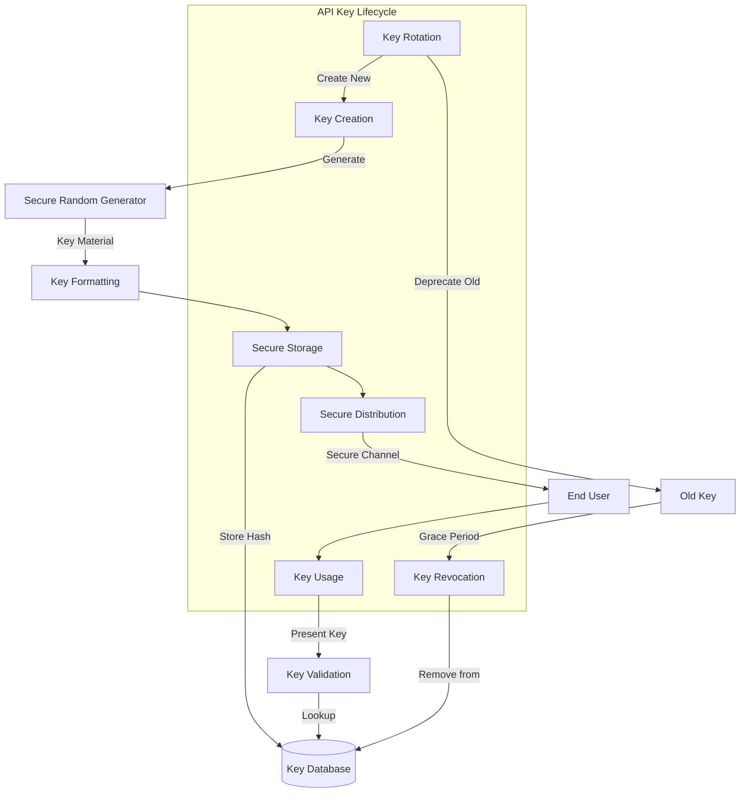
```mermaid
graph TD
    subgraph "API Key Lifecycle"
        Creation[Key Creation]
        Storage[Secure Storage]
        Distribution[Secure Distribution]
        Usage[Key Usage]
        Rotation[Key Rotation]
        Revocation[Key Revocation]
    end
    
    Creation --> |Generate| SecureRandom[Secure Random Generator]
    SecureRandom --> |Key Material| KeyFormat[Key Formatting]
    KeyFormat --> Storage
    
    Storage --> |Store Hash| KeyDB[(Key Database)]
    
    Storage --> Distribution
    Distribution --> |Secure Channel| EndUser[End User]
    
    EndUser --> Usage
    Usage --> |Present Key| Validation[Key Validation]
    Validation --> |Lookup| KeyDB
    
    Rotation --> |Deprecate Old| OldKey[Old Key]
    Rotation --> |Create New| Creation
    OldKey --> |Grace Period| Revocation
    
    Revocation --> |Remove from| KeyDB
```

**API Key Security Features:**

1. **Key Generation**
   - Cryptographically secure random generation
   - Sufficient entropy (minimum 256 bits)
   - Unique prefix for key type identification

2. **Key Storage**
   - One-way hashing with bcrypt or Argon2
   - Salted hashes with per-key salts
   - No plaintext storage of keys

3. **Key Management**
   - Expiration dates for all keys
   - Purpose-limited keys
   - Automated rotation capabilities
   - Immediate revocation option
   - Usage tracking and anomaly detection

4. **Usage Security**
   - TLS transport encryption
   - Key scoping (limiting permissions)
   - IP-based restrictions (optional)
   - Usage pattern monitoring

## Data Protection

### Data Classification

The LLM Gateway implements a data classification system to guide protection measures:

| Classification | Description | Examples | Protection Requirements |
|----------------|-------------|----------|------------------------|
| **Public** | Information approved for public disclosure | Public documentation, Public APIs | Basic integrity controls |
| **Internal** | Information for internal use only | Internal configurations, Analytics data | Access controls, Basic encryption |
| **Confidential** | Sensitive business information | Prompt templates, Business logic | Strong encryption, Strict access controls |
| **Restricted** | Highly sensitive information | User credentials, Provider keys | Strongest encryption, Audit logging, Strict access |
| **User Data** | End-user provided information | Prompts, User inputs | Privacy controls, Encryption, Access limitations |

### Encryption Strategy

The LLM Gateway implements a comprehensive encryption strategy:

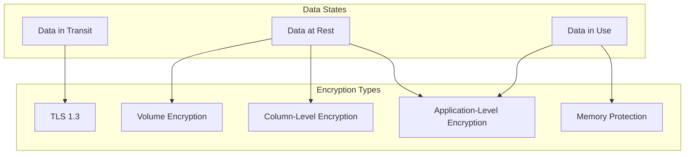
```mermaid
graph TD
    subgraph "Data States"
        Transit[Data in Transit]
        Rest[Data at Rest]
        Use[Data in Use]
    end
    
    subgraph "Encryption Types"
        TransitEnc[TLS 1.3]
        VolumeEnc[Volume Encryption]
        ColumnEnc[Column-Level Encryption]
        AppEnc[Application-Level Encryption]
        MemoryProt[Memory Protection]
    end
    
    Transit --> TransitEnc
    
    Rest --> VolumeEnc
    Rest --> ColumnEnc
    Rest --> AppEnc
    
    Use --> MemoryProt
    Use --> AppEnc
```

**Encryption Implementation:**

1. **Transport Encryption**
   - TLS 1.3 for all communications
   - Strong cipher suites (TLS_AES_256_GCM_SHA384)
   - Perfect forward secrecy
   - Certificate pinning for critical connections

2. **Storage Encryption**
   - Volume-level encryption for all persistent storage
   - Database transparent data encryption
   - Column-level encryption for sensitive fields
   - Application-level encryption for highest sensitivity data

3. **Encryption Algorithms**
   - AES-256-GCM for symmetric encryption
   - RSA-2048 or ECDSA P-256 for asymmetric encryption
   - SHA-256 or SHA-3 for hashing
   - Key rotation schedules for all encryption keys

### Key Management

The system implements a robust key management system:

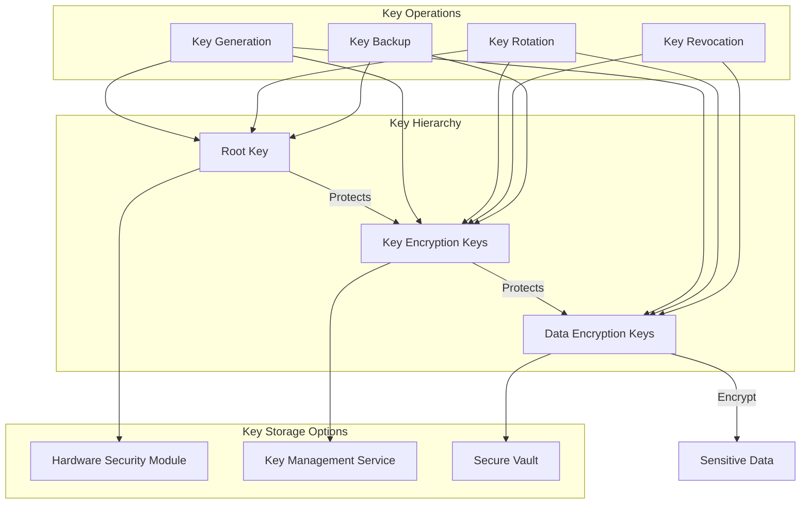
```mermaid
graph TD
    subgraph "Key Hierarchy"
        RootKey[Root Key]
        KEK[Key Encryption Keys]
        DEK[Data Encryption Keys]
    end
    
    RootKey --> |Protects| KEK
    KEK --> |Protects| DEK
    DEK --> |Encrypt| Data[Sensitive Data]
    
    subgraph "Key Storage Options"
        HSM[Hardware Security Module]
        KMS[Key Management Service]
        SecureVault[Secure Vault]
    end
    
    RootKey --> HSM
    KEK --> KMS
    DEK --> SecureVault
    
    subgraph "Key Operations"
        Generation[Key Generation]
        Rotation[Key Rotation]
        Revocation[Key Revocation]
        Backup[Key Backup]
    end
    
    Generation --> RootKey
    Generation --> KEK
    Generation --> DEK
    
    Rotation --> RootKey
    Rotation --> KEK
    Rotation --> DEK
    
    Revocation --> KEK
    Revocation --> DEK
    
    Backup --> RootKey
    Backup --> KEK
```

**Key Management Implementation:**

1. **Key Hierarchy**
   - Root keys stored in HSMs
   - Key encryption keys for specific functional areas
   - Data encryption keys for specific data sets
   - Envelope encryption for key protection

2. **Key Storage**
   - Hardware Security Modules for root keys
   - Cloud KMS services (AWS KMS, Azure Key Vault, etc.)
   - Secure vaults for application keys
   - Memory protection for keys in use

3. **Key Lifecycle**
   - Secure key generation procedures
   - Automated key rotation schedules
   - Emergency revocation capabilities
   - Secure key backup and recovery

### Secure Data Storage

The LLM Gateway implements secure data storage practices:

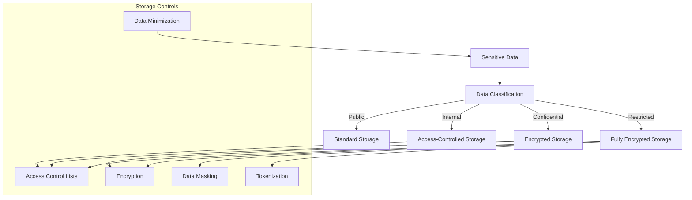
```mermaid
graph TD
    Data[Sensitive Data] --> Classification[Data Classification]
    
    Classification --> |Public| PublicStorage[Standard Storage]
    Classification --> |Internal| InternalStorage[Access-Controlled Storage]
    Classification --> |Confidential| ConfidentialStorage[Encrypted Storage]
    Classification --> |Restricted| RestrictedStorage[Fully Encrypted Storage]
    
    subgraph "Storage Controls"
        AccessControl[Access Control Lists]
        Encryption[Encryption]
        Masking[Data Masking]
        Tokenization[Tokenization]
        Minimization[Data Minimization]
    end
    
    InternalStorage --> AccessControl
    ConfidentialStorage --> AccessControl
    ConfidentialStorage --> Encryption
    RestrictedStorage --> AccessControl
    RestrictedStorage --> Encryption
    RestrictedStorage --> Masking
    RestrictedStorage --> Tokenization
    
    Minimization --> Data
```

**Secure Storage Implementation:**

1. **Database Security**
   - Row-level security for multi-tenant data
   - Column-level encryption for sensitive fields
   - Parameterized queries to prevent injection
   - Minimal privilege database accounts

2. **Data Protection Techniques**
   - Data minimization (collect only what's needed)
   - Tokenization of sensitive identifiers
   - Data masking for analytics and logs
   - Secure deletion procedures

3. **Retention Policies**
   - Clear retention periods for each data type
   - Automated deletion of expired data
   - Secure deletion methods
   - Legal hold mechanisms

## Network Security

### Network Architecture

The LLM Gateway implements a defense-in-depth network architecture:

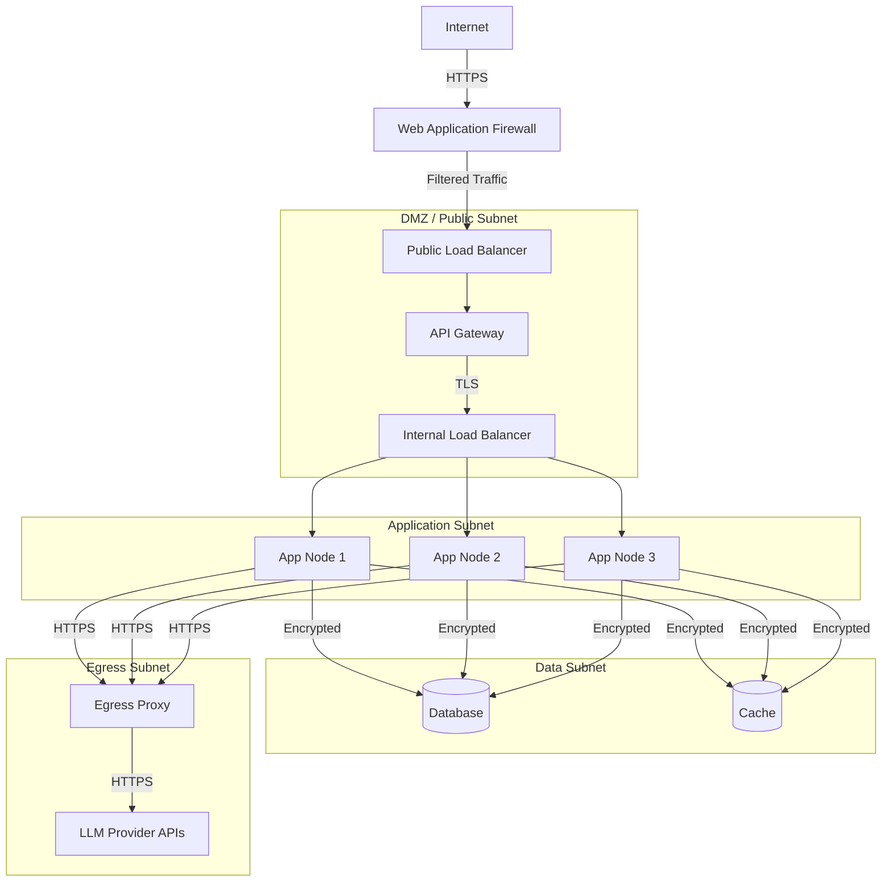
```mermaid
graph TD
    Internet[Internet] --> |HTTPS| WAF[Web Application Firewall]
    WAF --> |Filtered Traffic| PublicLB[Public Load Balancer]
    
    subgraph "DMZ / Public Subnet"
        PublicLB --> ApiGW[API Gateway]
        ApiGW --> |TLS| InternalLB[Internal Load Balancer]
    end
    
    subgraph "Application Subnet"
        InternalLB --> AppNode1[App Node 1]
        InternalLB --> AppNode2[App Node 2]
        InternalLB --> AppNode3[App Node 3]
    end
    
    subgraph "Data Subnet"
        AppNode1 --> |Encrypted| DB[(Database)]
        AppNode2 --> |Encrypted| DB
        AppNode3 --> |Encrypted| DB
        
        AppNode1 --> |Encrypted| Cache[(Cache)]
        AppNode2 --> |Encrypted| Cache
        AppNode3 --> |Encrypted| Cache
    end
    
    subgraph "Egress Subnet"
        AppNode1 --> |HTTPS| EgressProxy[Egress Proxy]
        AppNode2 --> |HTTPS| EgressProxy
        AppNode3 --> |HTTPS| EgressProxy
        
        EgressProxy --> |HTTPS| InternetServices[LLM Provider APIs]
    end
```

**Network Security Implementation:**

1. **Network Segmentation**
   - Clear separation of network zones
   - Micro-segmentation within zones
   - Default-deny network policies
   - Controlled cross-zone communication

2. **Traffic Control**
   - Ingress filtering at network edge
   - Web Application Firewall for API protection
   - Egress filtering for outbound traffic
   - Rate limiting at network level

3. **Monitoring and Control**
   - Network traffic inspection
   - Flow logging for security analysis
   - Intrusion detection/prevention systems
   - DDoS protection mechanisms

### Transport Layer Security

The LLM Gateway implements strong TLS security:

**TLS Configuration:**

1. **Protocol Version**
   - TLS 1.3 preferred
   - TLS 1.2 supported with secure cipher suites
   - Older TLS/SSL versions disabled

2. **Cipher Suites**
   - Strong ciphers only (AES-256-GCM, ChaCha20)
   - Perfect Forward Secrecy required
   - Secure key exchange methods
   - Strong MAC algorithms

3. **Certificate Management**
   - Automated certificate rotation
   - Certificate pinning for critical connections
   - Extended Validation certificates for public endpoints
   - Proper certificate chain validation

4. **Enhanced Features**
   - HTTP Strict Transport Security (HSTS)
   - OCSP Stapling for revocation checking
   - Certificate Transparency monitoring
   - TLS session resumption for performance

### Network Segmentation

The LLM Gateway implements detailed network segmentation:

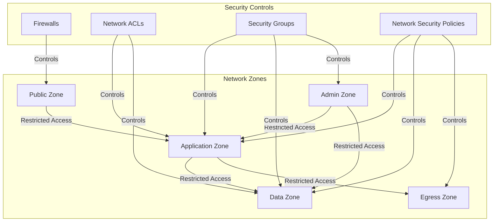
```mermaid
graph TD
    subgraph "Network Zones"
        PublicZone[Public Zone]
        AppZone[Application Zone]
        DataZone[Data Zone]
        AdminZone[Admin Zone]
        EgressZone[Egress Zone]
    end
    
    subgraph "Security Controls"
        Firewall[Firewalls]
        NACL[Network ACLs]
        SecurityGroups[Security Groups]
        NSP[Network Security Policies]
    end
    
    PublicZone --> |Restricted Access| AppZone
    AppZone --> |Restricted Access| DataZone
    AppZone --> |Restricted Access| EgressZone
    AdminZone --> |Restricted Access| AppZone
    AdminZone --> |Restricted Access| DataZone
    
    Firewall --> |Controls| PublicZone
    NACL --> |Controls| AppZone
    NACL --> |Controls| DataZone
    SecurityGroups --> |Controls| AppZone
    SecurityGroups --> |Controls| DataZone
    SecurityGroups --> |Controls| AdminZone
    NSP --> |Controls| AppZone
    NSP --> |Controls| DataZone
    NSP --> |Controls| EgressZone
```

**Segmentation Implementation:**

1. **Network Zones**
   - Public zone for API gateways
   - Application zone for service components
   - Data zone for databases and storage
   - Admin zone for management access
   - Egress zone for external communication

2. **Access Controls**
   - Default-deny policies between zones
   - Explicit permission for necessary traffic
   - Protocol and port restrictions
   - Source/destination verification

3. **Micro-segmentation**
   - Service-to-service restrictions
   - Workload identity for service access
   - Dynamic access policies
   - Just-in-time access for administration

### API Gateway

The API Gateway provides an additional security layer:

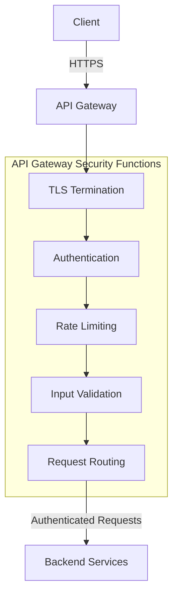
```mermaid
graph TD
    Client[Client] --> |HTTPS| ApiGW[API Gateway]
    
    subgraph "API Gateway Security Functions"
        TLS[TLS Termination]
        Auth[Authentication]
        RateLimit[Rate Limiting]
        InputVal[Input Validation]
        Routing[Request Routing]
    end
    
    ApiGW --> TLS
    TLS --> Auth
    Auth --> RateLimit
    RateLimit --> InputVal
    InputVal --> Routing
    
    Routing --> |Authenticated Requests| BackendSvc[Backend Services]
```

**API Gateway Security Features:**

1. **Traffic Management**
   - TLS termination with strong configuration
   - Request validation and sanitization
   - Rate limiting and throttling
   - Traffic filtering based on patterns

2. **Security Functions**
   - Authentication enforcement
   - API key validation
   - Request/response transformation
   - Schema validation

3. **Operational Security**
   - Request logging for audit
   - Response monitoring
   - Anomaly detection
   - Automated blocking of suspicious patterns

## LLM-Specific Security Concerns

### Prompt Injection Protection

The LLM Gateway implements protections against prompt injection attacks:

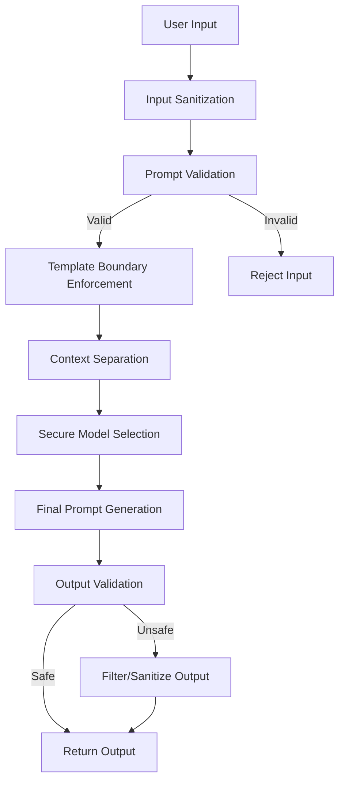
```mermaid
flowchart TD
    Input[User Input] --> SanitizeInput[Input Sanitization]
    
    SanitizeInput --> PromptValidation[Prompt Validation]
    PromptValidation --> |Valid| TemplateBoundary[Template Boundary Enforcement]
    PromptValidation --> |Invalid| RejectInput[Reject Input]
    
    TemplateBoundary --> ContextSeparation[Context Separation]
    ContextSeparation --> ModelSelection[Secure Model Selection]
    
    ModelSelection --> PromptGeneration[Final Prompt Generation]
    PromptGeneration --> OutputValidation[Output Validation]
    
    OutputValidation --> |Safe| ReturnOutput[Return Output]
    OutputValidation --> |Unsafe| FilterOutput[Filter/Sanitize Output]
    
    FilterOutput --> ReturnOutput
```

**Prompt Injection Protections:**

1. **Input Sanitization**
   - Character filtering and encoding
   - Pattern-based detection of injection attempts
   - Removal of control sequences
   - Template parameter validation

2. **Context Separation**
   - Clear separation between system and user content
   - Template structure that enforces boundaries
   - Metadata isolation from content
   - "Guard rails" in system prompts

3. **Detection and Prevention**
   - Model-specific injection pattern detection
   - Behavioral analysis of outputs
   - Response filtering for suspicious content
   - Continuous security updates for new patterns

### Data Leakage Prevention

The system implements controls to prevent data leakage:

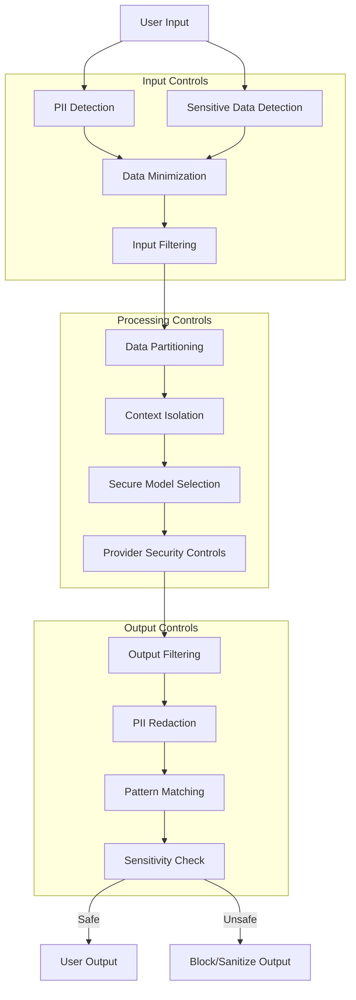
```mermaid
graph TD
    subgraph "Input Controls"
        PIIDetection[PII Detection]
        SensitiveDataDetection[Sensitive Data Detection]
        DataMinimization[Data Minimization]
        InputFiltering[Input Filtering]
    end
    
    subgraph "Processing Controls"
        DataPartitioning[Data Partitioning]
        ContextIsolation[Context Isolation]
        ModelSelection[Secure Model Selection]
        ProviderControls[Provider Security Controls]
    end
    
    subgraph "Output Controls"
        OutputFiltering[Output Filtering]
        PIIRedaction[PII Redaction]
        PatternMatching[Pattern Matching]
        SensitivityCheck[Sensitivity Check]
    end
    
    UserInput[User Input] --> PIIDetection
    UserInput --> SensitiveDataDetection
    PIIDetection --> DataMinimization
    SensitiveDataDetection --> DataMinimization
    DataMinimization --> InputFiltering
    
    InputFiltering --> DataPartitioning
    DataPartitioning --> ContextIsolation
    ContextIsolation --> ModelSelection
    ModelSelection --> ProviderControls
    
    ProviderControls --> OutputFiltering
    OutputFiltering --> PIIRedaction
    PIIRedaction --> PatternMatching
    PatternMatching --> SensitivityCheck
    
    SensitivityCheck --> |Safe| UserOutput[User Output]
    SensitivityCheck --> |Unsafe| BlockOutput[Block/Sanitize Output]
```

**Data Leakage Protections:**

1. **Data Detection**
   - PII identification in inputs
   - Sensitive information detection
   - Classification-based filtering
   - Pattern matching for known sensitive formats

2. **Processing Controls**
   - Tenant data isolation
   - Minimized data passing to providers
   - Provider-specific security settings
   - Secure processing environments

3. **Output Safeguards**
   - PII redaction in responses
   - Pattern-based filtering
   - Content policy enforcement
   - Sensitivity verification before delivery

### Model Security

The LLM Gateway implements model security controls:

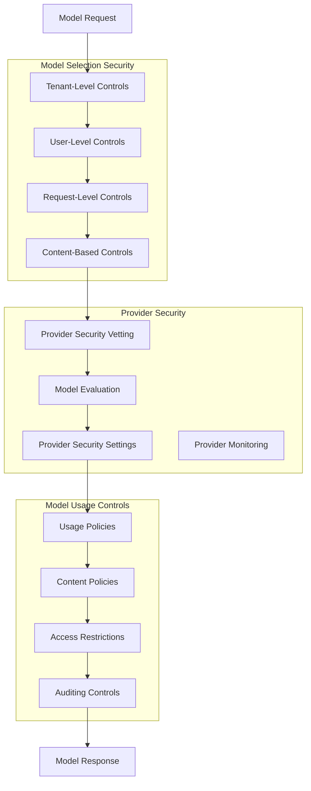
```mermaid
graph TD
    subgraph "Model Selection Security"
        TenantControls[Tenant-Level Controls]
        UserControls[User-Level Controls]
        RequestControls[Request-Level Controls]
        ContentControls[Content-Based Controls]
    end
    
    subgraph "Provider Security"
        ProviderVetting[Provider Security Vetting]
        ModelEvaluation[Model Evaluation]
        SecuritySettings[Provider Security Settings]
        MonitoringControls[Provider Monitoring]
    end
    
    subgraph "Model Usage Controls"
        UsagePolicies[Usage Policies]
        ContentPolicies[Content Policies]
        AccessRestrictions[Access Restrictions]
        AuditingControls[Auditing Controls]
    end
    
    ModelRequest[Model Request] --> TenantControls
    TenantControls --> UserControls
    UserControls --> RequestControls
    RequestControls --> ContentControls
    
    ContentControls --> ProviderVetting
    ProviderVetting --> ModelEvaluation
    ModelEvaluation --> SecuritySettings
    
    SecuritySettings --> UsagePolicies
    UsagePolicies --> ContentPolicies
    ContentPolicies --> AccessRestrictions
    AccessRestrictions --> AuditingControls
    
    AuditingControls --> ModelResponse[Model Response]
```

**Model Security Controls:**

1. **Provider Security**
   - Security assessment of providers
   - Contractual security requirements
   - Regular security reviews
   - Provider security monitoring

2. **Model Selection**
   - Security-based model routing
   - Classification-appropriate model selection
   - Tenant policy enforcement
   - Data sensitivity-based routing

3. **Usage Controls**
   - Purpose-specific model usage
   - Content policy enforcement
   - Usage monitoring and anomaly detection
   - Comprehensive usage auditing

### Output Filtering

The system implements comprehensive output filtering:

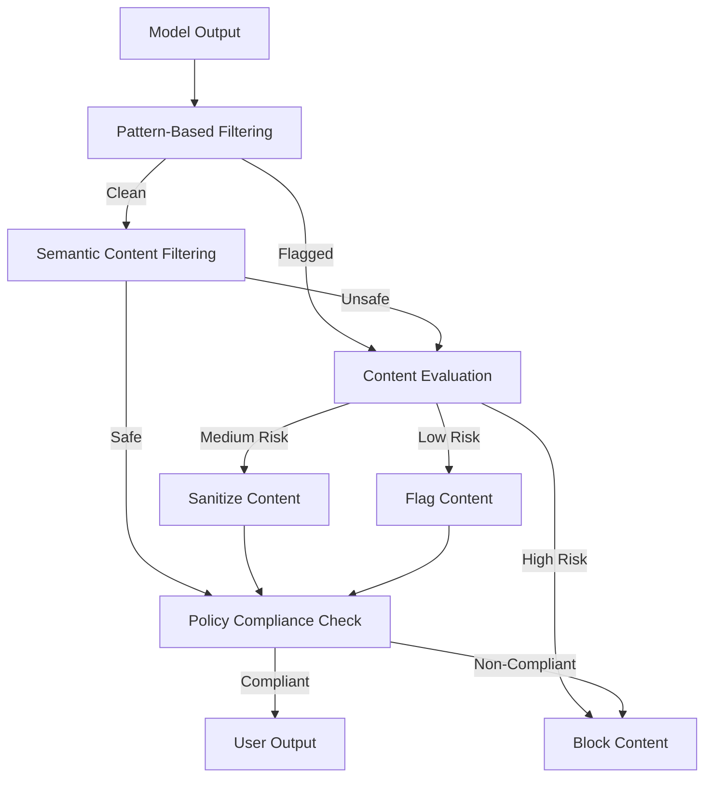
```mermaid
flowchart TD
    ModelOutput[Model Output] --> PatternFiltering[Pattern-Based Filtering]
    
    PatternFiltering --> |Clean| SemanticFiltering[Semantic Content Filtering]
    PatternFiltering --> |Flagged| ContentEvaluation[Content Evaluation]
    
    SemanticFiltering --> |Safe| PolicyCheck[Policy Compliance Check]
    SemanticFiltering --> |Unsafe| ContentEvaluation
    
    ContentEvaluation --> |High Risk| BlockContent[Block Content]
    ContentEvaluation --> |Medium Risk| SanitizeContent[Sanitize Content]
    ContentEvaluation --> |Low Risk| FlagContent[Flag Content]
    
    SanitizeContent --> PolicyCheck
    FlagContent --> PolicyCheck
    
    PolicyCheck --> |Compliant| UserOutput[User Output]
    PolicyCheck --> |Non-Compliant| BlockContent
```

**Output Filtering Implementation:**

1. **Pattern-Based Filtering**
   - Regular expression patterns for sensitive data
   - PII pattern detection and redaction
   - Blacklisted content detection
   - Security exploit pattern detection

2. **Semantic Filtering**
   - Content policy enforcement
   - Harmful content detection
   - Inappropriate content filtering
   - Classification-based restrictions

3. **Policy Enforcement**
   - Tenant-specific content policies
   - User-level filtering preferences
   - Context-aware filtering rules
   - Regulatory compliance verification

## Secret Management

### Provider Credentials

The LLM Gateway implements secure management of provider credentials:

```mermaid
graph TD
    subgraph "Credential Storage Options"
        SecretManager[Secret Manager Service]
        HSM[Hardware Security Module]
        EncryptedDB[Encrypted Database]
    end
    
    subgraph "Access Control"
        AppIdentity[Application Identity]
        JustInTime[Just-In-Time Access]
        LeastPrivilege[Least Privilege Access]
    end
    
    subgraph "Credential Types"
        APIKeys[API Keys]
        OAuthCreds[OAuth Credentials]
        ServiceAccounts[Service Accounts]
        Certificates[TLS Certificates]
    end
    
    APIKeys --> EncryptedDB
    OAuthCreds --> SecretManager
    ServiceAccounts --> SecretManager
    Certificates --> HSM
    
    EncryptedDB --> AppIdentity
    SecretManager --> AppIdentity
    HSM --> AppIdentity
    
    AppIdentity --> JustInTime
    JustInTime --> LeastPrivilege
    
    LeastPrivilege --> ProviderAPIs[Provider APIs]
```

**Provider Credential Management:**

1. **Secure Storage**
   - Dedicated secret management systems
   - Encryption in transit and at rest
   - Access limited to authorized services
   - Secret versioning and history

2. **Access Controls**
   - Just-in-time access to credentials
   - Automatic credential rotation
   - Least privilege credential scope
   - Usage monitoring and alerting

3. **Tenant Isolation**
   - Per-tenant credential isolation
   - Tenant-specific encryption keys
   - No cross-tenant credential access
   - Tenant-based access auditing

### Rotation Policies

The system implements automated rotation of secrets and credentials:

```mermaid
flowchart TD
    Trigger[Rotation Trigger] --> |Initiates| RotationProcess[Rotation Process]
    
    subgraph "Rotation Triggers"
        TimeBased[Time-Based]
        EventBased[Event-Based]
        RiskBased[Risk-Based]
        ManualTrigger[Manual Trigger]
    end
    
    TimeBased --> Trigger
    EventBased --> Trigger
    RiskBased --> Trigger
    ManualTrigger --> Trigger
    
    RotationProcess --> CreateNew[Create New Credential]
    CreateNew --> DeployNew[Deploy New Credential]
    DeployNew --> TestNew[Test New Credential]
    TestNew --> |Success| TransitionPeriod[Transition Period]
    TestNew --> |Failure| RollbackNew[Rollback]
    
    TransitionPeriod --> RetireOld[Retire Old Credential]
    RetireOld --> VerifyComplete[Verify Rotation Complete]
    
    VerifyComplete --> UpdateMetadata[Update Metadata]
    UpdateMetadata --> AuditRotation[Audit Rotation]
```

**Rotation Policy Implementation:**

1. **Frequency Configuration**
   - API keys: 90-day rotation
   - OAuth secrets: 180-day rotation
   - TLS certificates: Based on validity period
   - Database credentials: 30-day rotation

2. **Rotation Process**
   - Zero-downtime rotation procedure
   - Phased deployment of new credentials
   - Overlap period for transition
   - Automated verification after rotation

3. **Emergency Rotation**
   - Immediate revocation capabilities
   - Fast-track credential replacement
   - Break-glass procedures
   - Post-incident verification

## Audit and Compliance

### Audit Logging

The LLM Gateway implements comprehensive audit logging:

```mermaid
graph TD
    subgraph "Audit Events"
        Authentication[Authentication Events]
        Authorization[Authorization Events]
        DataAccess[Data Access Events]
        AdminActions[Admin Actions]
        ConfigChanges[Configuration Changes]
        SystemEvents[System Events]
    end
    
    subgraph "Log Processing"
        Collection[Log Collection]
        Normalization[Log Normalization]
        Enrichment[Context Enrichment]
        Storage[Secure Storage]
    end
    
    subgraph "Security Monitoring"
        RealTime[Real-time Analysis]
        SIEM[SIEM Integration]
        AlertGeneration[Alert Generation]
        Reporting[Compliance Reporting]
    end
    
    Authentication --> Collection
    Authorization --> Collection
    DataAccess --> Collection
    AdminActions --> Collection
    ConfigChanges --> Collection
    SystemEvents --> Collection
    
    Collection --> Normalization
    Normalization --> Enrichment
    Enrichment --> Storage
    
    Storage --> RealTime
    Storage --> SIEM
    Storage --> AlertGeneration
    Storage --> Reporting
```

**Audit Logging Implementation:**

1. **Event Capture**
   - Authentication attempts (success/failure)
   - Authorization decisions
   - Administrative actions
   - Data access operations
   - Configuration changes
   - Security-relevant events

2. **Log Content**
   - Timestamp with millisecond precision
   - Event type and category
   - Actor identity (user, service)
   - Action performed
   - Resource affected
   - Success/failure indication
   - Source information (IP, client)

3. **Security Controls**
   - Tamper-evident logging
   - Secure transmission of logs
   - Immutable storage options
   - Retention policy enforcement
   - Access controls on audit data

### Compliance Controls

The LLM Gateway implements controls for regulatory compliance:

```mermaid
graph TD
    subgraph "Compliance Domains"
        DataPrivacy[Data Privacy]
        InfoSecurity[Information Security]
        AccessControl[Access Control]
        RiskManagement[Risk Management]
        Governance[Governance]
    end
    
    subgraph "Regulatory Frameworks"
        GDPR[GDPR]
        HIPAA[HIPAA]
        SOC2[SOC 2]
        PCI[PCI DSS]
        CCPA[CCPA/CPRA]
    end
    
    subgraph "Control Implementation"
        Policies[Policies & Procedures]
        TechnicalControls[Technical Controls]
        TrainingAwareness[Training & Awareness]
        Monitoring[Monitoring & Measurement]
        Documentation[Documentation]
    end
    
    DataPrivacy --> |Requirements| GDPR
    DataPrivacy --> |Requirements| HIPAA
    DataPrivacy --> |Requirements| CCPA
    
    InfoSecurity --> |Requirements| SOC2
    InfoSecurity --> |Requirements| PCI
    InfoSecurity --> |Requirements| HIPAA
    
    AccessControl --> |Requirements| SOC2
    AccessControl --> |Requirements| PCI
    AccessControl --> |Requirements| HIPAA
    
    RiskManagement --> |Requirements| SOC2
    RiskManagement --> |Requirements| GDPR
    
    Governance --> |Requirements| SOC2
    Governance --> |Requirements| GDPR
    
    GDPR --> |Implementation| Policies
    GDPR --> |Implementation| TechnicalControls
    GDPR --> |Implementation| TrainingAwareness
    GDPR --> |Implementation| Monitoring
    GDPR --> |Implementation| Documentation
    
    HIPAA --> |Implementation| Policies
    HIPAA --> |Implementation| TechnicalControls
    HIPAA --> |Implementation| TrainingAwareness
    HIPAA --> |Implementation| Monitoring
    HIPAA --> |Implementation| Documentation
    
    SOC2 --> |Implementation| Policies
    SOC2 --> |Implementation| TechnicalControls
    SOC2 --> |Implementation| TrainingAwareness
    SOC2 --> |Implementation| Monitoring
    SOC2 --> |Implementation| Documentation
    
    PCI --> |Implementation| Policies
    PCI --> |Implementation| TechnicalControls
    PCI --> |Implementation| TrainingAwareness
    PCI --> |Implementation| Monitoring
    PCI --> |Implementation| Documentation
    
    CCPA --> |Implementation| Policies
    CCPA --> |Implementation| TechnicalControls
    CCPA --> |Implementation| TrainingAwareness
    CCPA --> |Implementation| Monitoring
    CCPA --> |Implementation| Documentation
```

**Compliance Implementation:**

1. **Data Privacy**
   - Data minimization principles
   - Purpose limitation controls
   - Consent management
   - Data subject rights support
   - Cross-border transfer controls

2. **Security Controls**
   - Defense-in-depth security architecture
   - Least privilege access model
   - Encryption for sensitive data
   - Comprehensive auditing and monitoring
   - Incident response procedures

3. **Governance**
   - Policy framework for security and privacy
   - Regular compliance assessments
   - Documentation of controls
   - Training and awareness programs
   - Third-party risk management

## Security Monitoring

### Detection Mechanisms

The LLM Gateway implements comprehensive security monitoring:

```mermaid
graph TD
    subgraph "Data Sources"
        AuditLogs[Audit Logs]
        SystemLogs[System Logs]
        NetworkLogs[Network Logs]
        ApplicationLogs[Application Logs]
        APIGatewayLogs[API Gateway Logs]
    end
    
    subgraph "Detection Mechanisms"
        SignatureDetection[Signature-Based Detection]
        AnomalyDetection[Anomaly Detection]
        BehaviorAnalysis[Behavior Analysis]
        ThreatIntel[Threat Intelligence]
        CorrelationEngine[Correlation Engine]
    end
    
    subgraph "Response Actions"
        Alerting[Alerting]
        AutoRemediation[Automated Remediation]
        BlockingActions[Blocking Actions]
        ForensicCapture[Forensic Data Capture]
        IncidentCreation[Incident Creation]
    end
    
    AuditLogs --> SignatureDetection
    SystemLogs --> SignatureDetection
    NetworkLogs --> SignatureDetection
    ApplicationLogs --> SignatureDetection
    APIGatewayLogs --> SignatureDetection
    
    AuditLogs --> AnomalyDetection
    SystemLogs --> AnomalyDetection
    NetworkLogs --> AnomalyDetection
    ApplicationLogs --> AnomalyDetection
    APIGatewayLogs --> AnomalyDetection
    
    AnomalyDetection --> BehaviorAnalysis
    SignatureDetection --> CorrelationEngine
    BehaviorAnalysis --> CorrelationEngine
    ThreatIntel --> CorrelationEngine
    
    CorrelationEngine --> |High Severity| Alerting
    CorrelationEngine --> |Automated Response| AutoRemediation
    CorrelationEngine --> |Block Attack| BlockingActions
    CorrelationEngine --> |Evidence Collection| ForensicCapture
    CorrelationEngine --> |Security Incident| IncidentCreation
```

**Detection Implementation:**

1. **Signature-Based Detection**
   - Known attack pattern recognition
   - Vulnerability exploitation detection
   - Malicious behavior signatures
   - Compliance violation patterns

2. **Anomaly Detection**
   - Behavioral baselines for users and systems
   - Statistical anomaly detection
   - Machine learning for pattern recognition
   - Threshold-based alerting

3. **Correlation and Analysis**
   - Multi-signal correlation
   - Context enrichment
   - Threat intelligence integration
   - Risk-based prioritization

### Incident Response

The LLM Gateway implements a structured incident response process:

```mermaid
graph TD
    Detection[Security Event Detection] --> Triage[Initial Triage]
    
    Triage --> |Confirmed Incident| Declaration[Incident Declaration]
    Triage --> |False Positive| Closure1[Close Event]
    
    Declaration --> |Initiate Response| IRT[Incident Response Team]
    
    IRT --> Containment[Containment Actions]
    IRT --> Investigation[Investigation]
    IRT --> Communication[Communication Plan]
    
    Containment --> Evidence[Evidence Collection]
    Investigation --> Evidence
    
    Evidence --> RootCause[Root Cause Analysis]
    RootCause --> Remediation[Remediation Plan]
    
    Remediation --> Implementation[Implement Fixes]
    Implementation --> Verification[Verify Effectiveness]
    
    Verification --> |Successful| Recovery[Recovery Actions]
    Verification --> |Unsuccessful| Remediation
    
    Recovery --> Lessons[Lessons Learned]
    Lessons --> Closure2[Incident Closure]
    
    Closure2 --> Updates[Control Updates]
```

**Incident Response Implementation:**

1. **Preparation**
   - Documented response procedures
   - Defined roles and responsibilities
   - Regular incident response training
   - Security monitoring and alerting

2. **Detection and Analysis**
   - Automated detection mechanisms
   - Triage procedures
   - Investigation protocols
   - Evidence collection guidelines

3. **Containment and Eradication**
   - Predefined containment strategies
   - Isolation procedures
   - Root cause analysis methodology
   - Remediation planning

4. **Recovery and Lessons Learned**
   - Recovery procedures
   - Verification of security controls
   - Post-incident review process
   - Control improvement process

## Secure Development

### Security Testing

The LLM Gateway undergoes comprehensive security testing:

```mermaid
graph TD
    subgraph "Development Pipeline"
        Design[Design Phase]
        Implementation[Implementation Phase]
        Testing[Testing Phase]
        Deployment[Deployment Phase]
        Operation[Operation Phase]
    end
    
    subgraph "Security Testing"
        SAST[Static Analysis]
        DAST[Dynamic Analysis]
        SCA[Software Composition Analysis]
        PenTest[Penetration Testing]
        SecReview[Security Review]
    end
    
    Design --> |Threat Modeling| Implementation
    Implementation --> |Code| Testing
    Testing --> |Tested Code| Deployment
    Deployment --> |Deployed System| Operation
    
    Design --> |Review| SecReview
    Implementation --> |Scan| SAST
    Implementation --> |Scan| SCA
    Testing --> |Test| DAST
    Deployment --> |Verify| SecReview
    Operation --> |Test| PenTest
```

**Security Testing Implementation:**

1. **Static Analysis (SAST)**
   - Automated code scanning during development
   - Pre-commit hooks for critical issues
   - Language-specific security analyzers
   - Custom rules for LLM-specific vulnerabilities

2. **Dynamic Analysis (DAST)**
   - API security testing
   - Authenticated and unauthenticated testing
   - Fuzzing for input validation
   - Business logic testing

3. **Additional Testing**
   - Dependency scanning
   - Container security scanning
   - Infrastructure-as-code scanning
   - Manual code reviews for critical components

### Dependency Management

The LLM Gateway implements secure dependency management:

```mermaid
graph TD
    subgraph "Dependency Management"
        Selection[Dependency Selection]
        Scanning[Vulnerability Scanning]
        Patching[Patching Process]
        Monitoring[Continuous Monitoring]
    end
    
    subgraph "Scanning Tools"
        SCA[SCA Tool]
        OWASP[OWASP Dependency Check]
        NpmAudit[npm audit]
        Custom[Custom Scanning]
    end
    
    subgraph "Vulnerability Sources"
        NVD[NVD/CVE Database]
        SecurityAdvisories[Security Advisories]
        BugBounty[Bug Bounty Reports]
        InternalAudits[Internal Audits]
    end
    
    Selection --> |New Dependency| Scanning
    
    Scanning --> SCA
    Scanning --> OWASP
    Scanning --> NpmAudit
    Scanning --> Custom
    
    NVD --> |Feeds| SCA
    SecurityAdvisories --> |Feeds| SCA
    BugBounty --> |Feeds| Custom
    InternalAudits --> |Feeds| Custom
    
    SCA --> |Results| VulnAssessment[Vulnerability Assessment]
    OWASP --> |Results| VulnAssessment
    NpmAudit --> |Results| VulnAssessment
    Custom --> |Results| VulnAssessment
    
    VulnAssessment --> |Critical/High| EmergencyPatching[Emergency Patching]
    VulnAssessment --> |Medium/Low| ScheduledPatching[Scheduled Patching]
    
    EmergencyPatching --> Patching
    ScheduledPatching --> Patching
    
    Patching --> Monitoring
    Monitoring --> |New Vulnerability| Scanning
```

**Dependency Management Implementation:**

1. **Dependency Governance**
   - Approved dependency list
   - Version pinning for stability
   - License compliance checking
   - Security review for major dependencies

2. **Vulnerability Management**
   - Automated scanning in CI/CD pipeline
   - Scheduled vulnerability scanning
   - Dependency update automation
   - CVE monitoring and alerting

3. **Remediation Process**
   - Risk-based prioritization
   - Automated update PRs for non-breaking changes
   - Testing protocol for dependency updates
   - Emergency patching process for critical vulnerabilities

## Deployment Security

### Secure Configuration

The LLM Gateway implements secure deployment configurations:

```mermaid
graph TD
    subgraph "Configuration Sources"
        DefaultConfig[Default Configuration]
        EnvironmentOverrides[Environment Overrides]
        SecretStore[Secret Store]
        TenantConfig[Tenant Configuration]
    end
    
    subgraph "Configuration Validation"
        SchemaValidation[Schema Validation]
        SecurityCheck[Security Check]
        ComplianceCheck[Compliance Check]
        VersionCheck[Version Check]
    end
    
    subgraph "Configuration Management"
        ConfigVersioning[Configuration Versioning]
        ChangeControl[Change Control]
        AuditTrail[Audit Trail]
        RollbackCapability[Rollback Capability]
    end
    
    DefaultConfig --> ConfigMerge[Configuration Merge]
    EnvironmentOverrides --> ConfigMerge
    SecretStore --> ConfigMerge
    TenantConfig --> ConfigMerge
    
    ConfigMerge --> SchemaValidation
    SchemaValidation --> SecurityCheck
    SecurityCheck --> ComplianceCheck
    ComplianceCheck --> VersionCheck
    
    VersionCheck --> |Valid| ApplyConfig[Apply Configuration]
    VersionCheck --> |Invalid| RejectConfig[Reject Configuration]
    
    ApplyConfig --> ConfigVersioning
    ConfigVersioning --> ChangeControl
    ChangeControl --> AuditTrail
    AuditTrail --> RollbackCapability
```

**Secure Configuration Implementation:**

1. **Configuration Management**
   - Infrastructure-as-code for all configurations
   - Version-controlled configuration
   - Configuration validation in CI/CD
   - Automated security checks for configurations

2. **Secure Defaults**
   - Security-focused default configurations
   - Disabled insecure features by default
   - Minimum required privileges
   - Secure communication defaults

3. **Configuration Validation**
   - Schema-based validation
   - Security benchmark comparison
   - Compliance validation
   - Configuration drift detection

### Container Security

The LLM Gateway implements container security best practices:

```mermaid
graph TD
    subgraph "Image Security"
        BaseImage[Minimal Base Image]
        Dependencies[Secure Dependencies]
        CodeScan[Code Scanning]
        ImageScan[Image Scanning]
    end
    
    subgraph "Runtime Security"
        Immutability[Immutable Containers]
        Isolation[Container Isolation]
        ResourceLimits[Resource Limits]
        SecurityContext[Security Context]
    end
    
    subgraph "Orchestration Security"
        RBAC[Kubernetes RBAC]
        NetworkPolicy[Network Policies]
        PodSecurity[Pod Security Standards]
        SecretManagement[Secret Management]
    end
    
    BaseImage --> BuildProcess[Build Process]
    Dependencies --> BuildProcess
    CodeScan --> BuildProcess
    
    BuildProcess --> ContainerImage[Container Image]
    ContainerImage --> ImageScan
    ImageScan --> |Passed| ImageRegistry[Image Registry]
    ImageScan --> |Failed| RebuildImage[Rebuild Image]
    
    ImageRegistry --> Deployment[Deployment]
    
    Deployment --> Immutability
    Deployment --> Isolation
    Deployment --> ResourceLimits
    Deployment --> SecurityContext
    
    Deployment --> RBAC
    Deployment --> NetworkPolicy
    Deployment --> PodSecurity
    Deployment --> SecretManagement
```

**Container Security Implementation:**

1. **Image Security**
   - Minimal base images
   - Regularly updated images
   - No unnecessary packages
   - Non-root container users
   - Read-only file systems where possible

2. **Runtime Security**
   - Container isolation
   - Resource limits and requests
   - Restricted capabilities
   - Pod security policies
   - Host-level protections

3. **Orchestration Security**
   - Kubernetes RBAC
   - Network policies for segmentation
   - Secret management integration
   - Container runtime security monitoring

### Infrastructure Security

The LLM Gateway implements comprehensive infrastructure security:

```mermaid
graph TD
    subgraph "Infrastructure Components"
        Compute[Compute Resources]
        Network[Network Infrastructure]
        Storage[Storage Resources]
        Identity[Identity Management]
        Monitoring[Monitoring Infrastructure]
    end
    
    subgraph "Security Controls"
        ConfigHardening[Configuration Hardening]
        PatchManagement[Patch Management]
        AccessControl[Access Controls]
        Encryption[Encryption]
        Monitoring[Security Monitoring]
    end
    
    subgraph "Management Plane"
        IaC[Infrastructure as Code]
        CMDB[Configuration Management]
        Automation[Security Automation]
        Compliance[Compliance Management]
    end
    
    Compute --> ConfigHardening
    Network --> ConfigHardening
    Storage --> ConfigHardening
    Identity --> ConfigHardening
    
    Compute --> PatchManagement
    Network --> PatchManagement
    
    Compute --> AccessControl
    Network --> AccessControl
    Storage --> AccessControl
    Identity --> AccessControl
    
    Storage --> Encryption
    Network --> Encryption
    
    Compute --> Monitoring
    Network --> Monitoring
    Storage --> Monitoring
    Identity --> Monitoring
    
    IaC --> Compute
    IaC --> Network
    IaC --> Storage
    IaC --> Identity
    
    CMDB --> ConfigHardening
    CMDB --> PatchManagement
    
    Automation --> AccessControl
    Automation --> Monitoring
    
    Compliance --> ConfigHardening
    Compliance --> AccessControl
    Compliance --> Encryption
```

**Infrastructure Security Implementation:**

1. **Compute Security**
   - OS hardening and minimal installations
   - Regular patching and updates
   - Host-based security controls
   - Vulnerability management
   - Endpoint detection and response

2. **Network Security**
   - Defense in depth architecture
   - Micro-segmentation
   - Traffic encryption
   - DDoS protection
   - Advanced threat detection

3. **Storage Security**
   - Encryption at rest
   - Secure deletion procedures
   - Access controls and audit
   - Backup security
   - Data integrity verification

---

**Previous**: [Observability and Telemetry](./observability-telemetry.md) | **Next**: [Error Handling and Resilience](./error-handling-resilience.md)