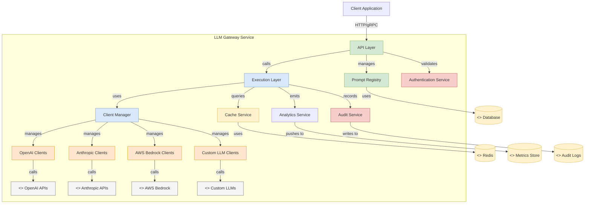
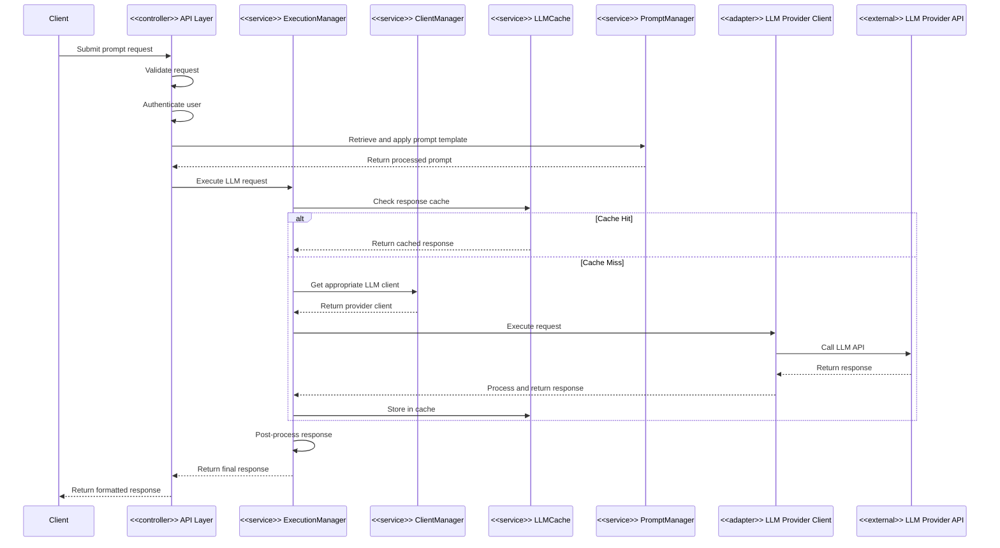

# System Architecture Overview

## Table of Contents

- [Introduction](#introduction)
- [Architectural Principles](#architectural-principles)
- [High-Level Component Diagram](#high-level-component-diagram)
- [Key Subsystems](#key-subsystems)
  - [API Layer](#api-layer)
  - [Execution Layer](#execution-layer)
  - [Provider Integration Layer](#provider-integration-layer)
  - [Cache and Storage Layer](#cache-and-storage-layer)
  - [Observability Layer](#observability-layer)
- [Inter-Module Communication](#inter-module-communication)
- [Control Flow](#control-flow)
- [Key Design Decisions](#key-design-decisions)

## Introduction

The LLM Gateway is designed as a middleware service that provides a unified interface to multiple Large Language Model (LLM) providers while offering enterprise-grade features such as security controls, prompt management, caching, and observability. The system follows a modular architecture with well-defined interface boundaries to enable extensibility and maintainability.

## Architectural Principles

The LLM Gateway architecture adheres to the following core principles:

1. **Provider Agnosticism**: Abstract provider-specific implementations behind unified interfaces
2. **Modular Design**: Clearly separated components with well-defined responsibilities
3. **Extensibility**: Well-defined extension points for adding new providers and features
4. **Observability**: Comprehensive logging, metrics, and tracing throughout the system
5. **Security-First Design**: Security controls integrated at all layers
6. **Enterprise Readiness**: Support for high availability, scalability, and compliance requirements

## High-Level Component Diagram

## Key Subsystems

### API Layer

The API Layer provides HTTP and gRPC endpoints for clients to interact with the LLM Gateway. It's responsible for:

- Request validation and normalization
- Authentication and authorization
- Rate limiting and throttling
- Request routing to appropriate execution components

**Core Components:**
- `GrpcService`: Handles gRPC API requests (`com.aisera.service.llm.grpc.GrpcService`)
- `PromptExecutionController`: Processes REST API requests for executing prompts (`com.aisera.service.llm.rest.PromptExecutionController`)
- `PromptStudioManagementController`: Manages prompt templates and configurations (`com.aisera.service.llm.rest.PromptStudioManagementController`)
- `LLMPromptRegistryVersioningAPIs`: Handles versioning of prompts (`com.aisera.service.llm.rest.LLMPromptRegistryVersioningAPIs`)

### Execution Layer

The Execution Layer orchestrates the fulfillment of LLM requests, including:

- LLM provider selection
- Cache handling
- Request transformation
- Response processing

**Core Components:**
- `ExecutionManager`: Coordinates request execution (`com.aisera.service.llm.execution.ExecutionManager`)
- `ExecutionManagerImpl`: Primary implementation of execution orchestration (`com.aisera.service.llm.execution.ExecutionManagerImpl`)
- `PromptManager`: Manages prompt templates and application (`com.aisera.service.llm.prompt.PromptManager`)
- `PromptApplier`: Applies templates to generate prompts (`com.aisera.service.llm.prompt.PromptApplier`)

### Provider Integration Layer

The Provider Integration Layer abstracts various LLM providers behind a unified interface:

- Provider-specific client implementations
- Authentication handling
- Request/response transformations
- Error handling and retries

**Core Components:**
- `ClientManager`: Interface for client management (`com.aisera.service.llm.client.ClientManager`)
- `ClientRegistry`: Registry of available LLM clients (`com.aisera.service.llm.client.ClientRegistry`)
- `GPT4ClientManagerImpl`: OpenAI GPT-4 client implementation (`com.aisera.service.llm.client.gpt4.GPT4ClientManagerImpl`)
- `BRLlama2ClientManagerImpl`: AWS Bedrock Llama 2 client implementation (`com.aisera.service.llm.client.bedrock.llama2.BRLlama2ClientManagerImpl`)
- `AiseraLLMClientManagerImpl`: Aisera's own LLM client implementation (`com.aisera.service.llm.client.aisera.llm.AiseraLLMClientManagerImpl`)

### Cache and Storage Layer

The Cache and Storage Layer provides mechanisms for data persistence and performance optimization:

- LLM response caching
- Prompt template storage
- Configuration persistence
- Tenant-specific settings

**Core Components:**
- `LLMCache`: Caching service for LLM responses (`com.aisera.service.llm.cache.LLMCache`)
- `LLMCacheReq`: Cache request object (`com.aisera.service.llm.cache.LLMCacheReq`)
- `PromptDAO`: Data access for prompt management (`com.aisera.service.llm.prompt.dao.PromptDAO`)
- `TenantConfigCache`: Tenant-specific configuration cache (`com.aisera.service.llm.tenant.TenantConfigCache`)

### Observability Layer

The Observability Layer handles logging, metrics, and auditing:

- Request/response logging
- Performance metrics
- Usage tracking
- Audit trail generation

**Core Components:**
- `LlmAnalyticsHandler`: Collects and processes analytics (`com.aisera.service.llm.utils.analytics.LlmAnalyticsHandler`)
- `MetricUtils`: Utility for metric collection (`com.aisera.service.llm.utils.MetricUtils`)
- `LLMPromptAuditClient`: Auditing client for prompt usage (`com.aisera.service.llm.audit.LLMPromptAuditClient`)

## Inter-Module Communication

Modules in the LLM Gateway communicate through well-defined interfaces:

## Control Flow

The typical control flow for an LLM request follows these steps:

1. **Request Reception**: The API layer receives a request through HTTP/REST or gRPC endpoints
2. **Authentication**: The request is authenticated against configured providers (OAuth, API key, etc.)
3. **Validation**: Request parameters are validated for correctness
4. **Prompt Retrieval**: If a prompt ID is provided, the template is retrieved from the registry
5. **Prompt Application**: The template is applied with provided parameters
6. **Cache Check**: The system checks if an identical request has been cached
7. **Provider Selection**: If not cached, the appropriate LLM provider is selected based on policy
8. **Request Transformation**: The request is transformed to provider-specific format
9. **Provider Call**: The provider client executes the request against the external API
10. **Response Processing**: The response is processed and normalized
11. **Caching**: If cacheable, the response is stored in cache
12. **Analytics**: Usage metrics are recorded
13. **Auditing**: An audit record is created if enabled
14. **Response Delivery**: The final response is returned to the client

## Key Design Decisions

### 1. Provider Abstraction Architecture

The system uses a combination of interfaces and factory patterns to abstract provider-specific implementations:

- `ClientManager`: Interface defining provider-agnostic operations
- `ClientRegistry`: Factory pattern implementation that returns appropriate client implementations
- Provider-specific implementations for each supported LLM

This approach enables adding new providers with minimal changes to core system logic.

### 2. Caching Strategy

The caching system is designed for high performance and configurability:

- Redis-based distributed cache for scalability
- Tenant-specific cache configurations
- Hash-based cache keys generated from normalized requests
- TTL-based cache expiration with configurable durations
- Partial caching support for streaming responses

### 3. Execution Pipeline Design

The execution pipeline follows a middleware pattern with configurable interceptors:

- `ExecutionManager` coordinates the overall execution flow
- Pluggable middleware components for cross-cutting concerns
- Support for both synchronous and streaming response patterns
- Retry logic with configurable backoff strategies

### 4. Prompt Management

The prompt management system supports versioning and governance:

- Prompt templates with variable substitution
- Version control with draft, publish, and archive states
- Access control based on tenant and user roles
- Inheritance and composition for prompt reuse

---

**Previous**: [README](./README.md) | **Next**: [Module-Level Architecture](./module-level-architecture.md)